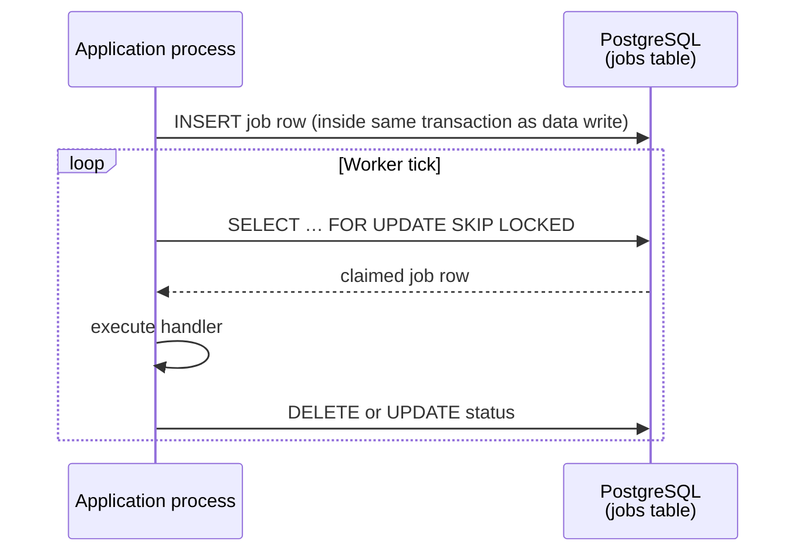

Tầng hạ tầng của Stemolly được chủ ý giữ ở mức tối giản. Một thực thể PostgreSQL duy nhất lưu mọi loại dữ liệu — concept graph (đồ thị khái niệm), các sự kiện bằng chứng, projection (bản chiếu), và hàng đợi job. Một vòng lặp worker trong cùng tiến trình, cũng chạy dựa trên chính cơ sở dữ liệu đó, xử lý phần việc bất đồng bộ. Một migration runner (trình chạy migration) mỏng (`node-pg-migrate`) giữ cho schema luôn đồng bộ. Và một quy ước nghiêm ngặt về biến môi trường nối các bí mật và thiết lập lại với nhau ngay khi khởi động.

Trang này giải thích từng thành phần dùng để làm gì — và cũng quan trọng không kém — vì sao các phương án khác lại bị loại bỏ.

---

## PostgreSQL là Kho Dữ liệu Duy nhất

Mọi đối tượng cần lưu bền vững đều nằm trong một thực thể PostgreSQL: concept graph, các log bằng chứng và dự đoán chỉ ghi thêm, belief projection (bản chiếu niềm tin), hàng đợi job, catalog và dữ liệu metering. Không có kho dữ liệu phụ nào khác.

**Vì sao không dùng graph database (cơ sở dữ liệu đồ thị)?** Concept graph (node, edge, taxonomy) được duyệt bằng [recursive CTEs](https://www.postgresql.org/docs/current/queries-with.html) (biểu thức bảng chung đệ quy) — cơ chế dựng sẵn của PostgreSQL để đi qua cấu trúc phân cấp. Ở đây các lượt duyệt đều nông (bao đóng prerequisite, các node con trong taxonomy). Phần khó của hệ thống — trạng thái của học sinh — lại có hình dạng của một event log (nhật ký sự kiện) với projection, chứ không phải một đồ thị sâu. Thêm Neo4j đồng nghĩa phải sao lưu hai cơ sở dữ liệu, suy luận về hai ranh giới nhất quán, và chấp nhận chi phí xoay trục nếu yêu cầu thay đổi. Recursive CTEs trong PostgreSQL đã đáp ứng được nhu cầu đồ thị mà không kéo theo thêm gánh nặng vận hành nào.

**Vì sao không dùng dedicated event store (kho sự kiện chuyên dụng)?** Các bảng Postgres chỉ ghi thêm, với tính bất biến được trigger cưỡng chế, cho ra đúng ngữ nghĩa của một event store chuyên biệt. Chỉ có một cơ sở dữ liệu nghĩa là chỉ có một cách sao lưu cho evidence log không thể thay thế, và tính toàn vẹn giao dịch giữa thao tác ghi thêm một event và cập nhật projection của nó thì có sẵn.

**JSONB cho các payload hay thay đổi.** Những trường thường xuyên đổi hình dạng — thân sự kiện, payload gọi LLM, thân báo cáo, display name i18n — được đặt trong các cột JSONB thay vì các cột quan hệ cứng nhắc. Nhờ đó không phải tạo migration mỗi khi payload có thêm một trường mới.

```
┌─────────────────────────────────────────────────────┐
│                  PostgreSQL instance                │
│                                                     │
│  engine.*      concept graph (nodes, edges, …)      │
│                append-only evidence & predictions   │
│                belief projections                   │
│                                                     │
│  metering.*    LLM call log, guardrail events       │
│                                                     │
│  <module>.*    jobs, catalogs, ordinary relations   │
└─────────────────────────────────────────────────────┘
```

Logic duyệt đồ thị được đóng gói bên trong graph repository (kho truy xuất đồ thị) của engine. Nếu sau này đến một mốc mở rộng buộc phải có graph store chuyên dụng, chỉ repository đó cần thay đổi.

---

## Job Bất đồng bộ: Dựa trên Postgres, Không có Broker

Công việc bất đồng bộ — các checkpoint của Expert, các đợt judge, pipeline ingest, email mời — chạy trên một **in-process worker loop** (vòng lặp worker trong tiến trình) lấy hàng từ bảng job trong Postgres bằng `SELECT … FOR UPDATE SKIP LOCKED`. Không Redis. Không message broker.



**Vì sao không dùng broker?** Hiện tại độ sâu hàng đợi chỉ ở mức vài chục job mỗi ngày — còn rất xa ngưỡng mà message broker đáng để tự trả chi phí. Bảng job chính là đường nối mà sau này broker có thể thay thế; thêm nó từ bây giờ chỉ mang theo hạ tầng mới, runbook vận hành mới và một kiểu lỗi mới.

**Độ bền có sẵn.** Vì dòng job được chèn ngay trong cùng giao dịch cơ sở dữ liệu với dữ liệu mà nó mô tả, sẽ không có khoảng hở nào mà dữ liệu đã commit nhưng job lại bị mất. Đây là outbox pattern (mẫu outbox) mà không cần thêm mã.

**At-least-once delivery (giao hàng ít nhất một lần).** Worker có thể sập sau khi nhận job nhưng trước khi xóa dòng của nó. Job đó sẽ được nhận lại ở nhịp kế tiếp. Vì vậy, mọi handler ghi evidence đều phải **idempotent** (an toàn khi chạy lặp): một idempotency key xác định cộng với ràng buộc `UNIQUE` sẽ biến job phát lại thành no-op, chứ không bao giờ ghi thêm hai lần.

**Giới hạn trần và đường mở rộng.** Ở quy mô cohort, thông lượng một tiến trình là chấp nhận được. Khi chạm trần, lộ trình tách ra đã được ghi rõ: nâng vòng lặp trong tiến trình thành một worker process riêng chỉ dùng chung bảng job. Ranh giới đó đã tồn tại sẵn.

---

## Migration Schema với node-pg-migrate

### Vì sao dùng node-pg-migrate

Dự án dùng `node-pg-migrate` thay vì migration của Prisma hay Knex. Lý do là tính dễ đọc. Schema của Stemolly cần trigger SQL thuần (để cưỡng chế append-only), recursive CTEs và các ràng buộc không chuẩn. Các DSL migration của ORM nặng thường cản trở khi bạn cần những thứ đó; `node-pg-migrate` chạy đúng đoạn SQL bạn viết, không qua lớp chuyển đổi nào.

### Một Dòng thời gian, Một File cho mỗi Module

Toàn bộ file migration nằm dưới `server/migrations/` trong một dòng thời gian dùng chung theo thứ tự thời gian (đánh số bằng timestamp). Tuy vậy, mỗi file chỉ đụng vào schema của đúng **một module**. File sẽ bắt đầu bằng `CREATE SCHEMA IF NOT EXISTS <module>;` rồi chỉ tạo đối tượng trong schema của module đó. Một file tạo bảng trong schema khác là dấu hiệu đáng bị soi khi review.

```
server/migrations/
  1720000000000_engine-nodes-edges.ts   ← touches engine.* only
  1720000001000_metering-llm-calls.ts   ← touches metering.* only
  1720000002000_jobs-table.ts           ← touches jobs.* only
```

### makeAppendOnly()

Các bảng tuyệt đối không được cập nhật hay xóa (evidence event, prediction, log cuộc gọi LLM, guardrail event, transcript turn) sẽ gọi một helper dùng chung ngay trong migration tạo ra chúng:

```ts
makeAppendOnly(pgm, 'engine', 'evidence_events');
```

Lệnh này cài một trigger `BEFORE UPDATE OR DELETE` lên bảng. Trigger được tạo trong chính file migration tạo bảng đó — không có bước "thêm trigger" tách rời nào có thể bị quên.

### Cơ chế quản trị Schema của Engine

Không phải schema nào cũng như nhau. Một file migration đụng tới `engine.*` phải được **nêu rõ ràng** trong phần mô tả pull request theo **checklist review schema G-4**: không để rò rỉ khái niệm miền nghiệp vụ, không có cột gắn riêng với phương pháp sư phạm, không có tên nhà cung cấp, giữ nguyên danh tính của node. Migration cho các schema khác (`metering`, `jobs`, v.v.) chỉ cần review thông thường.

Lý do của sự bất đối xứng này là: engine được thiết kế để không phụ thuộc miền nghiệp vụ. Chỉ một cột thêm vào một cách bất cẩn mà mã hóa giả định sư phạm cũng có thể âm thầm phá vỡ bảo đảm đó. Cổng review bổ sung tồn tại để chặn điều này trước khi nó được nhập vào.

---

## Các bẫy thường gặp của Migration

### Không đăng ký tsx trong một tiến trình sống lâu

Các file migration được viết bằng TypeScript. Đường chạy CLI cung cấp `--tsx` để xử lý việc đó. API `runner()` trong tiến trình (được test harness dùng) thì gọi `register()` của `tsx/esm` thay vào đó.

Vấn đề là: `register()` cài các hook nạp module ESM/CJS trên **toàn bộ tiến trình và không bao giờ gỡ ra**. Trong một test worker sống ngắn, điều này vô hại — sau khi migration xong sẽ không còn gì đáng kể được nạp nữa. Nhưng trong một tiến trình sống lâu, nó là chí mạng.

Điều này đã được tái hiện cụ thể trong bước thiết lập toàn cục của Playwright. Gọi `startPostgres()` (vốn chạy migration ngay trong tiến trình) thì thành công, nhưng bước kế tiếp — dựng server Fastify — lại ném ra:

```
TypeError: Expected a string, an ArrayBuffer, or a TypedArray to be returned
  for the "source" from the "load" hook but got undefined
```

Hook `load` còn sót lại của tsx đã chặn một lệnh `require()` CommonJS thuần bên trong Fastify và không thể đáp ứng nó.

**Quy tắc:** hãy chạy migration trong một **child process được spawn ra** (CLI `node-pg-migrate` với `--tsx`) từ bên trong mọi tiến trình sống lâu như phần thiết lập toàn cục của Playwright. Giới hạn việc đăng ký của tsx vào tiến trình con sống ngắn đó. Helper `startPostgresForE2e()` trong `server/test/e2e-postgres-boot.ts` làm đúng việc này.

### CLI và Runner trong tiến trình được cấu hình độc lập

Script CLI và API `runner()` trong tiến trình không chia sẻ cấu hình với nhau. Có hai thiết lập phải được áp dụng **cho cả hai bên một cách độc lập**:

| Thiết lập | Vì sao quan trọng |
|---|---|
| `ignorePattern` (ví dụ `tsconfig\.json\|.*\.test\.ts`) | node-pg-migrate coi mọi tệp không bắt đầu bằng dấu chấm trong thư mục migrations là một migration. Nếu thiếu cấu hình này, một `tsconfig.json` trong thư mục đó sẽ làm hỏng cả lượt chạy. |
| TypeScript loader (`--tsx` cho CLI, `register()` cho runner) | Các file migration import một helper `.ts` chưa biên dịch. Nếu không có loader, lệnh import sẽ thất bại. |

Một bên cấu hình sai sẽ không báo động ở bên còn lại. Thiếu `ignorePattern` trong runner trong tiến trình có thể vẫn qua được các lần chạy CLI cục bộ nhưng lại gãy trên CI — hoặc ngược lại. Hãy đặt cả hai thiết lập ở cả hai nơi.

### Ưu tiên bỏ hẳn down() — để Auto-Reverse tự xử lý

Khi không export hàm `down`, node-pg-migrate sẽ tự động đảo ngược migration bằng cách hoàn tác từng thao tác theo thứ tự ngược lại. Nếu export một `down()` tường minh, cơ chế suy luận này bị bỏ qua hoàn toàn — bản viết tay sẽ được chạy nguyên xi.

Điều này từng gây lỗi thật. Một `down()` viết tay cho migration `metering.llm_calls` đã xóa bảng nhưng để sót lại hàm trigger độc lập (được `makeAppendOnly` tạo qua `pgm.createFunction`). Trigger chết cùng bảng; còn một hàm độc lập là đối tượng schema riêng và vẫn tồn tại. Kết quả là chu kỳ down → up tiếp theo thất bại với lỗi "function already exists".

Cách sửa: xóa `down()` tường minh đó đi. Auto-reverse sẽ xóa trigger, hàm, bảng, extension và schema — theo đúng thứ tự ngược. Đồng thời, hãy gộp mọi lệnh `pgm.alterColumn` (vốn không có auto-reverse) vào ngay `createTable` ban đầu, vì chỉ một bước không thể đảo ngược cũng đủ buộc bạn phải viết `down()` tường minh cho cả migration.

> **Tip:** Những migration tạo đối tượng không tầm thường (hàm, trigger, extension) nên ưu tiên auto-reverse và đi kèm một bài test hồi quy down → up.

---

## Cấu hình: Biến môi trường STEMOLLY_

### Quy ước đặt tên

Mọi biến môi trường đều theo mẫu `STEMOLLY_<AREA>_<NAME>` — ví dụ:

- `STEMOLLY_LLM_TIER_FAST_MODEL`
- `STEMOLLY_INVITE_TTL_HOURS`
- `STEMOLLY_DB_URL`

Tất cả biến đều chỉ được đọc ở đúng một chỗ: module tổng hợp `config.ts`. Mã ứng dụng không bao giờ gọi `process.env` trực tiếp. Mỗi module tự kiểm tra phần cấu hình của mình theo schema [Zod](https://zod.dev) riêng bên trong bộ tổng hợp đó.

Các file `.env` chỉ dành cho phát triển cục bộ. Bí mật không bao giờ được commit vào repository.

Quy ước này được đưa vào để lấp một khoảng trống: giai đoạn kiến trúc đã nêu cấu hình và bí mật như một đường nối ("env-injected; secrets out of repo") nhưng để dành quy tắc cụ thể cho sau. Đây chính là bộ quy tắc mà phần "sau" đó tạo ra.

### Giá trị liên quan đến bảo mật: Có giới hạn + Có mặc định

Khi một giá trị có liên quan đến bảo mật — chẳng hạn TTL của invite token — trở thành tham số cấu hình, mẫu áp dụng là:

1. **Biến môi trường có giới hạn và có mặc định.** `STEMOLLY_INVITE_TTL_HOURS`, số nguyên, dương, `max(168)`, `default(168)`. Khởi động sẽ thất bại nếu là 0, âm, không phải số hoặc vượt quá trần.
2. **Kiểm tra bắt buộc chỉ ở production.** Khi `NODE_ENV=production`, biến đó phải được đặt một cách tường minh. Đây là môi trường duy nhất mà việc tuyên bố chính sách thực sự quan trọng.

**Vì sao không bắt buộc biến đó mà không có mặc định?** Mọi trường cấu hình khác đều có giá trị mặc định. Một biến bắt buộc đơn lẻ sẽ buộc môi trường dev, test, CI và Compose đều phải đặt nó — và trên thực tế cùng một giá trị sẽ bị copy-paste vào cả bốn nơi, tạo ra *bề ngoài* như thể mỗi nơi đã có một quyết định có chủ ý, trong khi thật ra chỉ là một hằng số chưa được review bị dàn mỏng khắp nơi. Điều bạn thật sự cần bảo vệ là một giá trị *sai*, và miền giá trị đã được kiểm tra sẽ xử lý thẳng vấn đề đó.

Hai quy tắc hỗ trợ:
- **Đưa đơn vị vào trong tên**, theo đơn vị dễ đọc ở nơi triển khai (giờ thay vì mili giây — để giá trị không biến thành cả một dãy số 0).
- **Truyền giá trị đó vào hàm miền nghiệp vụ dưới dạng tham số**. Đừng đọc cấu hình bên trong tầng miền thuần; yêu cầu "hãy cho nó cấu hình được" không được âm thầm đẩy một lệnh đọc biến môi trường xuống sâu hơn một tầng.

---

## Cấu trúc Docker Compose

Trong repository có hai file Compose. Chúng phục vụ hai mục đích khác nhau và phải được tách riêng.

| File | Mục đích | Cách chạy |
|---|---|---|
| `docker-compose.yml` | Bản **có thể triển khai**. Dựng `web`, `server` và `postgres` với `restart: unless-stopped`. Chỉ cổng web được publish ra máy host. | `docker compose up` |
| `compose.dev.yml` | Chỉ để **tiện cho phát triển**. Khởi động Postgres để bạn có thể chạy `pnpm --filter server dev` cục bộ. | `docker compose -f compose.dev.yml up -d` |

**Vì sao không đặt tên file dev là `docker-compose.override.yml`?** Compose sẽ tự động gộp mọi file có đúng tên đó vào mỗi lần `docker compose up`. Khi đó, `docker compose up` trên một bản checkout sạch sẽ âm thầm kéo theo cấu hình dev, làm hỏng toàn bộ mục tiêu của việc tách riêng.

Hai file dùng tên Docker volume khác nhau (`stemolly-postgres-data` và `stemolly-dev-postgres-data`) để nếu cùng chạy từ một thư mục thì cũng không va chạm.

### Tự bạn phải đóng pool

`compose(config)` — composition root — tạo ra `pg.Pool` dùng chung cho các module persistence và metering. **Không có gì ở downstream sở hữu pool này.** `buildServer()` nhận vào ngữ cảnh đã dựng xong và không chịu trách nhiệm về nó. `app.close()` của Fastify chỉ đóng tầng HTTP, chứ không biết gì về một pool mà nó không tạo ra.

Bất kỳ đoạn mã nào gọi `compose()` — integration test, thiết lập/thu dọn toàn cục của Playwright, hay một harness trong tương lai — **đều phải tự kết thúc pool một cách tường minh**:

```ts
await app.close();
await ctx.modules.persistence.pool.end();  // NOT implied by app.close()
await db.stop();
```

Nếu bỏ dòng ở giữa, các kết nối của pool sẽ còn treo lại sau cả khi container đã `stop()`, hoặc giữ cho tiến trình không thoát, hoặc tạo ra lỗi kết nối tới một cơ sở dữ liệu không còn tồn tại.

Quyền sở hữu này không lộ ra ở chỗ gọi — `app.close()` trông như một thao tác tắt hoàn chỉnh nhưng thực ra không phải vậy. Hãy nói rõ điều này trong mọi harness có gọi `compose()`.
