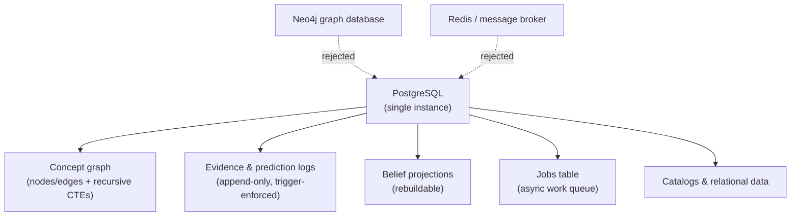
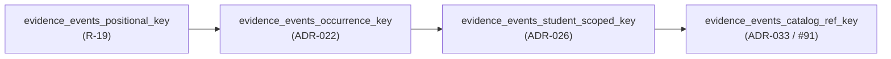
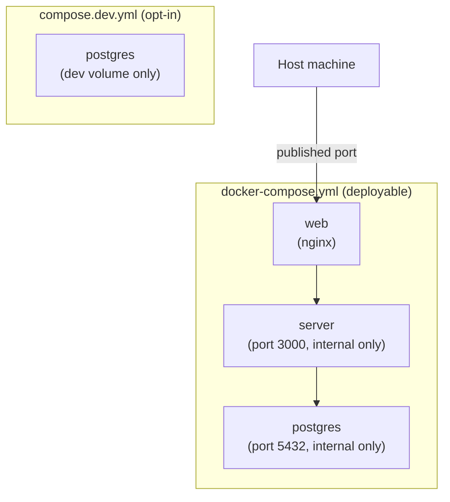

Backend của Stemolly được chủ ý giữ thật đơn giản: một PostgreSQL database duy nhất chứa mọi loại dữ liệu mà ứng dụng cần, và ngay cả phần việc bất đồng bộ cũng chạy qua chính database đó thay vì dùng một queue riêng. Bao quanh quyết định đó là một nhóm quy ước nhỏ — migration được viết ra sao, config được đọc thế nào, local dev stack được nối lại như thế nào — cùng một vài bài học xương máu về những lỗi chỉ lộ ra khi một process chạy lâu. Trang này đi qua toàn bộ những phần đó, từ quyết định cấp cao kiểu "vì sao chỉ một database" cho đến các bẫy mà bạn thật sự sẽ gặp khi chạy stack trên máy của mình.

## Một Postgres instance chứa (gần như) tất cả mọi thứ

Không có graph database riêng và cũng không có dedicated event store. PostgreSQL chứa concept graph (dưới dạng các bảng node/edge, được duyệt bằng recursive CTE), các evidence log và prediction log chỉ ghi thêm, các belief projection được dựng từ chúng, catalog, cùng dữ liệu quan hệ thông thường — với JSONB dùng cho những payload hay đổi hình dạng, như event body, report body và translated display name.



A dedicated graph database (Neo4j) từng được cân nhắc rồi bị loại. Những graph traversal mà ứng dụng này cần đều nông — kiểu như "các prerequisite của concept này là gì" hay "các taxonomy child của nó là gì" — và phần thực sự khó của hệ thống lại là student state, vốn có hình dạng của event và projection chứ không phải graph. Thêm một datastore thứ hai chỉ làm tăng gánh nặng vận hành và khiến việc đổi hướng sau này khó hơn. Dedicated event store cũng bị loại vì lý do đơn giản hơn: các bảng append-only trong Postgres, được chống lưng bằng trigger chặn update và delete, đã cho đúng ngữ nghĩa event cần thiết mà không phải thêm bất kỳ hạ tầng nào.

Việc giữ mọi thứ trong một store cũng có nghĩa là chỉ có một câu chuyện backup cho evidence log — thứ không thể dựng lại nếu mất — và có transactional integrity giữa việc append một event với việc cập nhật projection phụ thuộc vào nó. Phần graph traversal cũng không bị rải khắp codebase; nó được đóng gói trong graph repository riêng của engine, nên nếu một nhu cầu mang tính graph thật sự đủ lớn để biện minh cho một store chuyên dụng thì thay đổi đó cũng chỉ khu trú tại đúng một chỗ.

## Phần việc async chạy ngay trong cùng database, không qua queue riêng

Background job — Expert checkpoint, judge batch, ingestion, invite email — chạy trên một in-process worker loop dựa trên một jobs table bình thường trong Postgres. Về bản chất, worker claim một dòng bằng câu lệnh:

```sql
SELECT ... FROM <jobs table>
FOR UPDATE SKIP LOCKED;
```

`FOR UPDATE SKIP LOCKED` là thứ khiến cách này an toàn khi có nhiều worker: nó khóa dòng mà một worker đã claim và để các worker khác đơn giản bỏ qua những dòng đang bị khóa thay vì chờ nhau. Hãy hình dung jobs table như một danh sách việc cần làm dùng chung — mỗi worker lấy mục chưa ai nhận tiếp theo rồi khóa nó lại, để không ai khác có thể nhặt đúng việc đó khi nó đang được xử lý. Job có cơ chế retry với giới hạn số lần thử, và nếu dùng hết retry thì nó được đưa ra như một reliability metric chứ không lặng lẽ biến mất.

A message broker — Redis/BullMQ, RabbitMQ, SQS — đã được cân nhắc rồi bị loại. Với độ sâu hàng đợi chỉ ở mức vài chục job mỗi ngày, đó sẽ là hạ tầng mà dự án chưa cần; jobs table được cố ý giữ như điểm nối để về sau có thể thay bằng broker thật nếu lưu lượng buộc phải như vậy. Dùng luôn cùng database mà job tác động tới còn có thêm một lợi ích: vì enqueue job và commit thay đổi dữ liệu đã kích hoạt nó xảy ra trong cùng một transaction, jobs table tự nhiên đóng vai trò outbox — không cần cơ chế riêng để tránh tình trạng "dữ liệu đã đổi nhưng job chưa từng được xếp hàng".

Delivery ở đây là at-least-once chứ không phải exactly-once, nên mọi handler nào ghi evidence đều phải idempotent: một idempotency key mang tính xác định cộng với một unique constraint sẽ biến một checkpoint bị phát lại thành no-op an toàn thay vì append trùng. Trần thông lượng của mô hình một process như vậy được chấp nhận ở quy mô cohort hiện tại của dự án; nếu sau này cần, hướng scale-out đã được ghi rõ là tách worker sang process riêng.

## Migration: `node-pg-migrate`, mỗi file cho một schema

Schema migration chạy qua `node-pg-migrate`, một migration runner mỏng và có tính chương trình hóa — không phải Prisma hay Knex. Lựa chọn này biến một nguyên tắc đã được chốt từ trước thành hiện thực cụ thể: ORM nặng bị loại ở đây để nhường chỗ cho một tầng SQL mỏng, viết tay, vì các append-only trigger và recursive CTE mà dự án dựa vào cần phải dễ đọc; một schema DSL chỉ khiến mọi người phải vật lộn khi migration cần trigger thuần hoặc một constraint khác thường.

Trên nền công cụ đó là một quy ước về cách bố trí file. Tất cả migration nằm trong một timeline dùng chung, theo thứ tự thời gian, dưới `server/migrations/`, nhưng mỗi file riêng lẻ chỉ được đụng vào schema của đúng một module — bắt đầu bằng `CREATE SCHEMA IF NOT EXISTS <module>;` rồi đến các bảng của module đó. Một file migration tạo bảng bên ngoài schema của module được nêu trong tên file là một review smell. Với số ít bảng append-only (`evidence_events`, `predictions`, `llm_calls`, `guardrail_events`, `transcript_turns`), cùng migration tạo bảng đó cũng phải gọi helper dùng chung `makeAppendOnly(pgm, schema, table)`, helper này sẽ cài trigger `BEFORE UPDATE OR DELETE` để fitness function append-only (G-5a) có cái cụ thể mà kiểm tra.

:::note
Những migration đụng tới schema `engine.*` mang trọng lượng lớn hơn: chúng phải được nêu rõ trong phần mô tả PR theo checklist schema-review G-4 (không rò rỉ domain, pedagogy hay vendor; node identity phải còn nguyên). Migration cho `metering` hay schema khác thì review bình thường — chỉ engine mới gánh rủi ro của nguyên tắc "bảo vệ phần lõi domain-agnostic của engine", nên chỉ nó mới có ngưỡng kiểm tra chặt hơn.
:::

### Hai entry point, hai config

`node-pg-migrate` được chạy theo hai cách khác nhau trong dự án này: script CLI `migrate:up` (cho local dev và deploy) và API `runner()` trong tiến trình (dùng bởi harness tích hợp testcontainers). Hai entry point này **không chia sẻ config** — bất kỳ thiết lập nào quan trọng đều phải được đặt ở cả hai nơi, tách biệt nhau. Trên thực tế có hai thiết lập quan trọng: một `ignorePattern` (`tsconfig\.json|.*\.test\.ts`), vì nếu không scanner của migration sẽ coi mọi file không phải dotfile trong thư mục migrations — kể cả `tsconfig.json` của chính nó — là migration và fail; và một TypeScript loader, vì migration import một helper `.ts` chưa biên dịch (`--tsx` cho CLI, và một lần gọi `register()` của `tsx/esm` cho runner trong tiến trình). Quên đặt config ở một nhánh chỉ làm hỏng đúng nhánh đó — cũng chính vì vậy mà một lỗi cấu hình có thể qua được cục bộ khi chạy CLI nhưng chỉ phát nổ lúc CI dùng in-process runner (hoặc ngược lại).

### Một `down()` viết tay có thể để lại rác

Khi một migration không export `down()`, `node-pg-migrate` sẽ tự sinh nó bằng cách đảo từng thao tác trong `up` theo thứ tự ngược lại. Nhưng nếu export `down()` tường minh, cơ chế suy luận đó bị bỏ qua hoàn toàn — bản viết tay sẽ được chạy nguyên xi, dù nó có thiếu tới đâu.

:::caution
Điều này đã từng cắn dự án một lần. Một `down()` viết tay chỉ xóa bảng đã để lại hàm trigger đứng riêng mà `makeAppendOnly` tạo ra — trigger sẽ chết cùng bảng, còn function là một schema object độc lập nên không chết theo. Kết quả là chu kỳ down-rồi-up tiếp theo lỗi với thông báo "function already exists". Cách sửa là xóa `down()` tường minh và để auto-reverse xử lý (vì nó xóa đúng trigger, function, table, extension và schema theo thứ tự ngược). Khuyến nghị chung là: migration nào tạo ra đối tượng không tầm thường — function, trigger, extension — nên ưu tiên auto-reverse và đi kèm một bài test hồi quy down-rồi-up, thay vì viết `down()` thủ công.
:::

### Quy ước đặt tên cho uniqueness constraint của `evidence_events`

Có một constraint cụ thể có quy ước đặt tên riêng mà bạn nên biết, vì thoạt nhìn nó hơi lạ. Constraint `UNIQUE NULLS NOT DISTINCT` trên `engine.evidence_events` đã được drop rồi tạo lại dưới tên mới mỗi lần migration thay đổi tập cột mà nó bao phủ hoặc ý nghĩa của một trong các cột đó:



Mỗi tên chỉ mô tả đúng điều mà *migration đó* đã thay đổi — chứ không mô tả đầy đủ identity bảy cột mà constraint thực sự cưỡng chế. Đây là chủ ý: ai đó đọc `\d evidence_events` có thể suy ra migration nào đã tạo ra constraint hiện tại. Đồng thời đây cũng là một cách lách giới hạn — `node-pg-migrate` v8.0.4 không có tùy chọn rename-preserving nào tương thích với `UNIQUE NULLS NOT DISTINCT`, nên mỗi lần đổi tên đều là raw SQL drop rồi add, chứ không phải `ALTER ... RENAME CONSTRAINT`. Điều này an toàn vì không có đoạn mã nào trong codebase đọc constraint theo tên; đường chèn `ON CONFLICT` trong evidence repository suy ra target từ danh sách cột, không từ tên constraint. Nếu sau này đổi tên tiếp, nên tiếp tục theo mẫu fingerprint này thay vì quay lại một cái tên "mô tả đầy đủ" cho cả key — dự án đã nhất quán ưu tiên fingerprint hơn phần mô tả trọn vẹn.

## Cấu hình: một quy ước `STEMOLLY_`, một aggregator

Biến môi trường dùng chung một mẫu đặt tên: `STEMOLLY_<AREA>_<NAME>` (ví dụ `STEMOLLY_LLM_TIER_FAST_MODEL`), và chỉ được đọc ở đúng một nơi — một aggregator `config.ts` — sau đó được validate theo từng module bằng schema zod, thay vì để `process.env` bị đọc tùy tiện rải rác khắp codebase. File `.env` chỉ dành cho môi trường dev, và secret tuyệt đối không được commit vào repo. Quy ước này lấp đúng một khoảng trống mà giai đoạn kiến trúc từng cố ý để mở: config và secret được nêu ra như một seam ngay từ đầu, nhưng mãi đến đây mới có quy tắc cụ thể.

Tuy vậy, mỗi giá trị vẫn còn một câu hỏi: nó nên bắt buộc phải có hay nên có mặc định? Với những gì liên quan đến bảo mật, câu trả lời đã chốt là **có giới hạn và có mặc định, cộng với kiểm tra hiện diện chỉ ở production** — chứ không phải một biến bắt buộc nhưng không có default. Ví dụ điển hình là TTL của invite token, trước đây từng là một constant hardcode nằm sâu trong pure domain layer:

```
STEMOLLY_INVITE_TTL_HOURS=168   # integer, 1-168, defaults to 168; presence checked only when NODE_ENV=production
```

Một biến bắt buộc thuần túy đã được cân nhắc rồi bị loại. Mọi trường khác trong config schema đều có default, nên chỉ riêng một biến bắt buộc là bất nhất — và trên thực tế nó chỉ khiến cùng một giá trị bị copy-paste vào dev, test, CI và compose, tạo cảm giác như mỗi nơi đều có quyết định có chủ đích trong khi thật ra chỉ là một giá trị chưa được review bị rải ra bốn chỗ. Thứ cần được bảo vệ thật sự là một giá trị *sai*, và một miền giá trị có validate xử lý chuyện đó trực tiếp: boot sẽ fail với 0, số âm, dữ liệu không phải số, hoặc bất kỳ thứ gì vượt trần. Kiểm tra hiện diện chỉ ở production sau đó cung cấp đúng lực ép ở nơi việc tuyên bố chính sách một cách minh nhiên thật sự quan trọng, và không ép buộc ở những nơi khác.

Có hai chi tiết nhỏ đáng nhớ cho các trường hợp tương tự: đơn vị nên nằm ngay trong tên biến, và nên là đơn vị dễ đọc ở nơi deploy — giờ, chứ không phải millisecond, để giá trị không biến thành một bức tường số 0. Và giá trị đó phải được truyền vào domain function như một tham số, thay vì đọc config ngay bên trong domain layer, để yêu cầu "cho nó configurable" không âm thầm đẩy một lệnh đọc env vào phần mã vốn cần giữ thuần.

## Chạy stack trên máy cục bộ

Cấu hình Docker Compose được commit trong repo được tách thành hai file với hai nhiệm vụ khác nhau. `docker-compose.yml` là bản có thể deploy: `docker compose up` trên một checkout sạch sẽ dựng toàn bộ stack — web, server và Postgres, tất cả đều `restart: unless-stopped` — mà không cần bước thiết lập thủ công nào, và nó chỉ publish cổng host của web. Server (3000) và Postgres (5432) chỉ truy cập được qua compose network, không bao giờ publish ra host. `compose.dev.yml` là file riêng, chỉ dùng khi chủ động opt-in, để dựng riêng Postgres phục vụ việc chạy server cục bộ bằng `pnpm --filter server dev`; nó được gọi tường minh qua `docker compose -f compose.dev.yml up -d`.



File dev được cố ý không đặt tên là `docker-compose.override.yml` — Compose sẽ tự động merge mọi file có đúng tên đó vào mỗi lần `docker compose up`, như vậy cấu hình dev sẽ bị lặng lẽ kéo vào quy trình bring-up sạch của bản deployable và phá hỏng mục tiêu của việc tách riêng. Hai file cũng dùng tên volume khác nhau (`stemolly-postgres-data` và `stemolly-dev-postgres-data`) để nếu cùng chạy từ một thư mục thì cũng không đụng nhau trên cùng một Docker volume.

:::caution
Nếu bạn chạy một Postgres client (như Adminer) trong container riêng rồi trỏ nó đến `localhost`, kết nối sẽ fail ngay cả khi Postgres đang chạy hoàn toàn bình thường — bên trong container của chính client đó, `localhost` là bản thân container, không phải máy host, nên bạn sẽ nhận lỗi connection refused trông y hệt như database chưa lên. Cách sửa là chạy client với `--network host` (trên Linux), hoặc dùng `host.docker.internal` thay vì `localhost` để trỏ tới host. Tách biệt với chuyện đó, chỉ một dấu cách thừa ở đầu trong giá trị host copy-paste cũng tạo ra lỗi DNS lookup rất dễ bị nhầm với sự cố kết nối thật.
:::

:::tip
Adminer chỉ hiển thị một Postgres schema mỗi lần và mặc định là `public`. Nếu bạn không thấy các bảng mong đợi — và tất cả những gì hiện ra chỉ là một bảng ghi sổ vô thưởng vô phạt như bảng theo dõi của migration tool — thì nhiều khả năng đơn giản là bạn đang xem nhầm schema, chứ không phải gặp vấn đề kết nối. Hãy đổi schema bằng hộp chọn schema của Adminer, hoặc thêm `&ns=<schema>` vào URL đăng nhập. Ví dụ trong engine-poc, các bảng của ứng dụng (`nodes`, `edges`, v.v.) nằm trong schema `engine`; còn `public` chỉ chứa `pgmigrations`.
:::

## Hai mối nguy trong các process chạy lâu

Hai vấn đề dưới đây cùng có chung một gốc: thứ được viết cho một process sống ngắn lại hóa ra làm hỏng một process sống lâu.

**`register()` của `tsx` để lại một cái bẫy ở cấp toàn process.** `register()` (từ `tsx/esm/api`) cài các hook nạp module ESM/CJS cho cả process, và nó không bao giờ gỡ chúng ra. Test harness gọi nó để `node-pg-migrate` chạy `runner()` trong tiến trình có thể nạp các file migration `.ts` — điều này vô hại trong một Vitest worker chạy một lần rồi chết, nơi sau khi test xong hầu như không còn gì quan trọng được nạp nữa, nhưng lại chí mạng trong một process tiếp tục nạp module về sau.

```mermaid
sequenceDiagram
  participant GS as globalSetup
  participant PG as startPostgres
  participant Reg as "tsx register()"
  participant BS as buildServer

  GS->>PG: start container + migrate in-process
  PG->>Reg: register loader hooks
  Reg-->>PG: hooks stay installed process-wide
  GS->>BS: buildServer()
  BS->>BS: fastify requires logger-pino.js
  BS--xGS: TypeError - leftover load hook can't satisfy the require
```



Đó chính xác là điều đã xảy ra khi `globalSetup` của Playwright gọi `startPostgres()`: container khởi động và migration chạy xong ổn thỏa, nhưng ngay bước kế tiếp, lời gọi `fastify()` trong `buildServer()` lại ném `TypeError` từ bên trong một lệnh `require` CJS hoàn toàn bình thường của Fastify đối với module logger — hook nạp còn sót lại của `tsx` đã chặn một `require` mà nó không thể phục vụ. Bỏ lời gọi `startPostgres()` đi và trỏ config vào một database URL thông thường thì `buildServer()` chạy được, xác nhận rằng thủ phạm là phần dư của `tsx`, chứ không phải Playwright hay Fastify.

Cách xử lý là: chạy bước migration trong một **child process** được spawn riêng — dùng chính CLI của `node-pg-migrate` với `--tsx`, giống như script `migrate:up` — thay vì chạy trong tiến trình hiện tại, để việc đăng ký của `tsx` bị giam trong process ngắn ngủi đó. Còn bản thân Postgres container vẫn được start trong process của caller, nên vòng đời của nó vẫn gắn với process sống lâu đang sở hữu nó.

:::caution
Quy tắc chung là: một loader hook ở cấp process là side effect tác động lên *toàn bộ process*, chứ không chỉ lên lời gọi đã cài nó. Mọi helper đăng ký kiểu hook này chỉ an toàn khi sau đó không còn gì quan trọng phải nạp nữa.
:::

**`compose()` dựng một connection pool mà sẽ không ai tự đóng giúp bạn.** `compose(config)` tạo `pg.Pool` làm nền cho các module persistence và metering, nhưng không có gì phía sau nhận quyền sở hữu vòng đời của nó. `buildServer(ctx)` nhận vào một app context đã được dựng sẵn và không hề đụng tới pool; `app.close()` của Fastify chỉ tắt HTTP server và plugin của nó, chứ không biết gì về một pool mà chính nó không tạo ra.

:::caution
Bất kỳ đoạn mã nào gọi `compose()` trực tiếp — integration test, cặp `globalSetup`/`globalTeardown` của Playwright, hay bất kỳ test harness nào trong tương lai — đều phải tự kết thúc pool một cách tường minh:

```ts
await app.close();
await ctx.modules.persistence.pool.end();   // not implied by app.close()
await db.stop();
```

Nếu bỏ qua dòng ở giữa, các kết nối của pool sẽ treo lại sau cả khi database container đã dừng, hoặc giữ cho process không thoát, hoặc ném lỗi kết nối tới một database không còn tồn tại. Đây là hệ quả trực tiếp của cách ứng dụng được ghép lại: ai tạo ra resource thì người đó sở hữu vòng đời của nó, và caller của `compose()` chính là nơi đã tạo pool — `app.close()` chỉ *trông có vẻ* như một thao tác shutdown hoàn chỉnh, nhưng thực ra không phải.
:::
