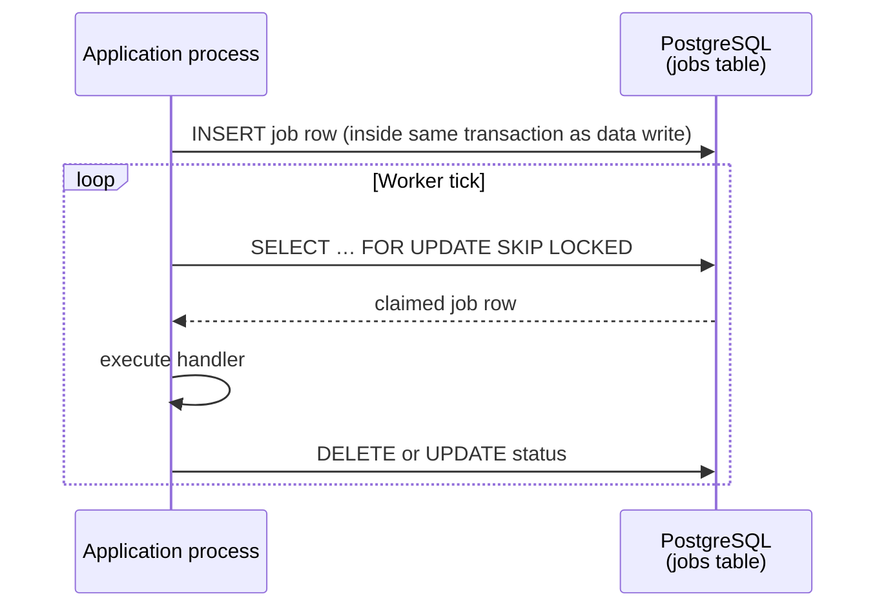

# Backend & Lưu trữ bền vững

Tầng hạ tầng của Stemolly được cố ý giữ ở mức tối giản. Một phiên bản PostgreSQL duy nhất chứa mọi loại dữ liệu — concept graph (đồ thị khái niệm), evidence events (sự kiện bằng chứng), projections (bản chiếu) và job queues (hàng đợi tác vụ). Một vòng lặp worker (tiến trình xử lý) trong cùng tiến trình, cũng được điều khiển bởi chính cơ sở dữ liệu đó, đảm nhiệm phần việc bất đồng bộ. Một bộ chạy migration (di trú lược đồ) mỏng (`node-pg-migrate`) giữ cho schema luôn đồng bộ. Và một quy ước biến môi trường chặt chẽ dùng để nối secrets (bí mật) và settings (thiết lập) với nhau ngay khi khởi động.

Trang này giải thích từng mảnh ghép làm gì — và quan trọng không kém — vì sao các phương án khác đã bị loại bỏ.

---

## PostgreSQL là Datastore Duy nhất

Mọi đối tượng cần lưu bền đều nằm trong một phiên bản PostgreSQL: concept graph, nhật ký evidence và prediction (dự đoán) chỉ-ghi-thêm, belief projections (bản chiếu niềm tin), job queues, catalogs (danh mục) và dữ liệu metering (đo lường). Không có kho dữ liệu phụ.

**Vì sao không dùng graph database (cơ sở dữ liệu đồ thị)?** Concept graph (nodes, edges, taxonomy) được duyệt bằng [recursive CTEs (biểu thức bảng chung đệ quy)](https://www.postgresql.org/docs/current/queries-with.html) — cơ chế có sẵn của PostgreSQL để đi qua cấu trúc phân cấp. Các lượt duyệt ở đây đều nông (bao đóng prerequisite và taxonomy children). Phần khó của hệ thống — trạng thái của học sinh — có hình dạng giống event log (nhật ký sự kiện) kèm projections hơn là một đồ thị sâu. Thêm Neo4j sẽ đồng nghĩa với hai cơ sở dữ liệu phải sao lưu, hai ranh giới nhất quán cần phân tích, và một chi phí đổi hướng nếu yêu cầu thay đổi. Recursive CTEs trong PostgreSQL đã đáp ứng được nhu cầu đồ thị mà không tăng gánh nặng vận hành.

**Vì sao không dùng dedicated event store (kho sự kiện chuyên dụng)?** Các bảng Postgres chỉ-ghi-thêm với tính bất biến được trigger (bộ kích hoạt) cưỡng chế mang lại đúng những ngữ nghĩa đó như một event store chuyên biệt. Một cơ sở dữ liệu duy nhất đồng nghĩa với một cách sao lưu duy nhất cho evidence log không thể thay thế, và tính toàn vẹn giao dịch giữa việc ghi thêm một event và cập nhật projection của nó có sẵn miễn phí.

**JSONB cho các payload (dữ liệu tải) hay thay đổi.** Những trường thường xuyên đổi hình dạng — thân event, payload cuộc gọi LLM, thân báo cáo, tên hiển thị i18n — được đặt trong các cột JSONB thay vì các cột quan hệ cứng nhắc. Cách này tránh phải tạo migration mỗi khi payload có thêm một trường mới.

```
┌─────────────────────────────────────────────────────┐
│                  PostgreSQL instance                │
│                                                     │
│  engine.*      concept graph (nodes, edges, …)      │
│                append-only evidence & predictions   │
│                belief projections                   │
│                                                     │
│  metering.*    LLM call log, guardrail events       │
│                                                     │
│  <module>.*    jobs, catalogs, ordinary relations   │
└─────────────────────────────────────────────────────┘
```

Logic duyệt đồ thị được đóng gói bên trong graph repository (kho truy cập đồ thị) của engine. Nếu một mốc mở rộng trong tương lai buộc phải dùng một graph store chuyên dụng, chỉ repository đó cần thay đổi.

---

## Job Bất đồng bộ: Dựa trên Postgres, Không Có Broker

Công việc bất đồng bộ — các checkpoint của Expert, các lô judge, pipeline nhập liệu, email mời — chạy trên một **vòng lặp worker trong tiến trình** lấy các hàng từ bảng jobs của Postgres bằng `SELECT … FOR UPDATE SKIP LOCKED`. Không Redis. Không message broker.



**Vì sao không dùng broker?** Độ sâu hàng đợi hiện tại chỉ ở mức vài chục job mỗi ngày — chưa hề chạm ngưỡng mà một message broker đáng để đầu tư. Bảng jobs thực chất chính là đường nối mà sau này broker có thể thay thế; thêm nó ngay bây giờ đồng nghĩa với hạ tầng mới, runbook vận hành mới và thêm một kiểu lỗi mới.

**Độ bền có sẵn miễn phí.** Vì hàng job được chèn trong cùng một giao dịch cơ sở dữ liệu với dữ liệu mà nó mô tả, sẽ không có khoảng trống nào mà dữ liệu đã được commit nhưng job lại bị mất. Đây là outbox pattern (mẫu hộp thư ra) mà không cần thêm mã.

**Phân phối at-least-once (ít nhất một lần).** Worker có thể bị crash giữa lúc đã nhận một job và lúc chưa xóa hàng của nó. Job đó sẽ được nhận lại ở nhịp kế tiếp. Vì vậy mọi handler ghi evidence đều phải **idempotent (lặp lại vẫn cho cùng kết quả)**: một idempotency key (khóa chống lặp) xác định cùng với ràng buộc `UNIQUE` sẽ khiến một job phát lại trở thành no-op (không làm gì), chứ không bao giờ ghi thêm hai lần.

**Trần năng lực và đường mở rộng.** Thông lượng của một tiến trình duy nhất được chấp nhận ở quy mô cohort. Khi chạm trần, đường tách ra đã được xác định rõ: nâng vòng lặp trong tiến trình thành một worker process riêng, chỉ dùng chung bảng jobs. Đường nối đó đã sẵn có.

---

## Schema Migrations với node-pg-migrate

### Vì sao là node-pg-migrate

Dự án dùng `node-pg-migrate` thay vì Prisma migrations hay Knex. Lý do là tính dễ đọc. Schema của Stemolly cần raw SQL triggers (trigger SQL thuần), recursive CTEs và các ràng buộc không theo chuẩn thông dụng. Những DSL migration nặng của ORM thường cản trở khi bạn cần các thứ đó; `node-pg-migrate` chạy chính xác câu SQL bạn viết mà không có lớp biên dịch trung gian.

### Một Dòng thời gian, Một File cho Mỗi Module

Tất cả các file migration đều nằm dưới `server/migrations/` trong một dòng thời gian dùng chung theo thứ tự thời gian (đánh số bằng timestamp). Tuy nhiên, mỗi file chỉ được chạm vào schema của đúng **một module**. Mỗi file bắt đầu bằng `CREATE SCHEMA IF NOT EXISTS <module>;` rồi chỉ tạo các đối tượng bên trong schema của module đó. Một file tạo bảng trong schema khác là dấu hiệu cần xem xét khi review.

```
server/migrations/
  1720000000000_engine-nodes-edges.ts   ← touches engine.* only
  1720000001000_metering-llm-calls.ts   ← touches metering.* only
  1720000002000_jobs-table.ts           ← touches jobs.* only
```

### `makeAppendOnly()`

Các bảng tuyệt đối không được cập nhật hay xóa (evidence events, predictions, nhật ký cuộc gọi LLM, guardrail events, transcript turns) sẽ gọi một helper dùng chung ngay trong migration đã tạo ra chúng:

```ts
makeAppendOnly(pgm, 'engine', 'evidence_events');
```

Lệnh này cài một trigger `BEFORE UPDATE OR DELETE` trên bảng. Trigger được tạo trong chính file migration đã tạo bảng đó — không có bước "thêm trigger" riêng nào có thể bị quên.

### Quy chuẩn quản trị Engine Schema

Không phải schema nào cũng như nhau. Một file migration chạm vào `engine.*` phải được **nêu rõ ràng** trong phần mô tả pull request theo **checklist review schema G-4**: không để rò rỉ khái niệm miền nghiệp vụ, không có cột đặc thù sư phạm, không có tên nhà cung cấp, định danh node phải được giữ nguyên. Migration cho các schema khác (`metering`, `jobs`, v.v.) chỉ cần review thông thường.

Lý do của sự bất đối xứng này là: engine được thiết kế để không phụ thuộc miền. Chỉ cần một cột được thêm bất cẩn mà mã hóa một giả định về sư phạm là có thể âm thầm phá vỡ cam kết đó. Cửa kiểm tra bổ sung này tồn tại để chặn điều đó trước khi hợp nhất.

---

## Những bẫy thường gặp với Migration

### Không Đăng ký tsx trong Một Tiến trình Sống Lâu

Các file migration được viết bằng TypeScript. Đường chạy CLI truyền `--tsx` để xử lý việc này. Còn API `runner()` trong tiến trình (được test harness sử dụng) thì gọi `register()` của `tsx/esm`.

Vấn đề là: `register()` cài các hook nạp mô-đun ESM/CJS trên **toàn bộ tiến trình và không bao giờ gỡ ra**. Trong một test worker sống ngắn, điều này vô hại — sau khi migration chạy xong gần như không còn gì quan trọng được nạp nữa. Nhưng trong một tiến trình sống lâu thì nó là chí mạng.

Điều này đã được tái hiện cụ thể trong bước thiết lập toàn cục của Playwright. Gọi `startPostgres()` (chạy migration trong tiến trình) thành công, nhưng ngay bước kế tiếp — dựng máy chủ Fastify — lại ném ra lỗi:

```
TypeError: Expected a string, an ArrayBuffer, or a TypedArray to be returned
  for the "source" from the "load" hook but got undefined
```

Hook `load` còn sót lại của tsx đã chặn một lệnh `require()` CommonJS thuần bên trong Fastify và không thể đáp ứng nó.

**Quy tắc:** hãy chạy migration trong một **child process được spawn ra** (CLI của `node-pg-migrate` với `--tsx`) từ bên trong bất kỳ tiến trình sống lâu nào như thiết lập toàn cục của Playwright. Hãy giới hạn phần đăng ký của tsx trong child process sống ngắn đó. Helper `startPostgresForE2e()` trong `server/test/e2e-postgres-boot.ts` làm đúng như vậy.

### CLI và In-Process Runner Có Cấu hình Tách biệt

Script CLI và API `runner()` trong tiến trình không chia sẻ cấu hình với nhau. Có hai thiết lập phải được áp dụng **cho cả hai phía một cách độc lập**:

| Setting | Vì sao quan trọng |
|---|---|
| `ignorePattern` (ví dụ `tsconfig\.json\|.*\.test\.ts`) | node-pg-migrate coi mọi tệp không bắt đầu bằng dấu chấm trong thư mục migrations là một migration. Nếu thiếu cấu hình này, một `tsconfig.json` trong thư mục đó sẽ làm hỏng cả lượt chạy. |
| TypeScript loader (`--tsx` cho CLI, `register()` cho runner) | Các file migration import một helper `.ts` chưa biên dịch. Nếu không có loader, lệnh import sẽ thất bại. |

Lỗi cấu hình ở một đường chạy có thể âm thầm không lộ ra ở đường còn lại. Thiếu `ignorePattern` trong runner chạy trong tiến trình có thể vẫn qua được các lần chạy CLI cục bộ nhưng hỏng ở CI — hoặc ngược lại. Hãy đặt cả hai thiết lập ở cả hai nơi.

### Ưu tiên Bỏ qua `down()` — Hãy để Auto-Reverse Xử lý

Khi không export hàm `down`, node-pg-migrate sẽ tự động đảo ngược migration bằng cách hoàn tác từng thao tác theo thứ tự ngược lại. Nếu export một `down()` tường minh, cơ chế suy luận này sẽ bị bỏ qua hoàn toàn — phiên bản viết tay sẽ được chạy nguyên văn.

Điều này từng gây ra lỗi thật. Một `down()` viết tay cho migration `metering.llm_calls` đã xóa bảng nhưng để sót lại hàm trigger độc lập (được `makeAppendOnly` tạo qua `pgm.createFunction`). Trigger sẽ chết cùng bảng của nó; còn một hàm độc lập là một đối tượng schema riêng nên vẫn tồn tại. Sau đó, một chu kỳ down → up tiếp theo thất bại với lỗi "function already exists".

Cách sửa là: xóa `down()` tường minh đó đi. Auto-reverse sẽ xóa trigger, hàm, bảng, extension và schema — theo đúng thứ tự ngược. Đồng thời, hãy gộp mọi lệnh `pgm.alterColumn` (vốn không có auto-reverse) vào ngay trong `createTable` ban đầu, vì chỉ một bước không thể đảo ngược cũng đủ buộc bạn phải viết `down()` tường minh cho toàn bộ migration.

> **Tip:** Những migration tạo ra các đối tượng không tầm thường (function, trigger, extension) nên ưu tiên auto-reverse và đi kèm một bài kiểm tra hồi quy down → up.

---

## Cấu hình: các biến môi trường `STEMOLLY_`

### Quy ước đặt tên

Mọi biến môi trường đều theo mẫu `STEMOLLY_<AREA>_<NAME>` — ví dụ:

- `STEMOLLY_LLM_TIER_FAST_MODEL`
- `STEMOLLY_INVITE_TTL_HOURS`
- `STEMOLLY_DB_URL`

Tất cả biến đều chỉ được đọc ở đúng một nơi: module tổng hợp `config.ts`. Mã ứng dụng không bao giờ gọi `process.env` trực tiếp. Mỗi module tự kiểm tra phần cấu hình của mình bằng schema [Zod](https://zod.dev) ngay trong bộ tổng hợp đó.

Các file `.env` chỉ dành cho phát triển cục bộ. Secrets không bao giờ được commit vào kho mã.

Quy ước này được đưa ra để lấp một khoảng trống: ở giai đoạn kiến trúc, cấu hình và bí mật được xác định là một đường nối ("được bơm qua env; secrets nằm ngoài repo"), nhưng các quy tắc cụ thể lại để dành cho sau. Đây chính là phần "sau" đó đã tạo ra.

### Các giá trị liên quan đến bảo mật: Có giới hạn + Có mặc định

Khi một giá trị liên quan đến bảo mật — chẳng hạn TTL của invite token — trở nên có thể cấu hình, mẫu áp dụng là:

1. **Biến môi trường có giới hạn và có mặc định.** `STEMOLLY_INVITE_TTL_HOURS`, kiểu số nguyên, dương, `max(168)`, `default(168)`. Quá trình khởi động sẽ thất bại nếu giá trị là 0, âm, không phải số hoặc vượt quá trần.
2. **Kiểm tra sự hiện diện chỉ ở production.** Khi `NODE_ENV=production`, biến này bắt buộc phải được đặt tường minh. Đây là môi trường duy nhất mà việc tuyên bố chính sách đó thực sự quan trọng.

**Vì sao không bắt buộc biến này mà không có mặc định?** Mọi trường cấu hình khác đều có mặc định. Một biến bắt buộc đứng riêng lẻ sẽ buộc môi trường dev, test, CI và Compose đều phải tự đặt nó — và trên thực tế cùng một giá trị sẽ bị sao chép vào cả bốn nơi, tạo ra *cảm giác* như có một quyết định có chủ ý ở từng nơi, trong khi thực chất chỉ là một hằng số chưa được review bị rải mỏng khắp nơi. Điều bạn thật sự cần bảo vệ là một giá trị *sai*, và khoảng giá trị đã được kiểm tra ở trên giải quyết trực tiếp việc đó.

Hai quy tắc hỗ trợ:
- **Đặt đơn vị ngay trong tên**, bằng đơn vị dễ đọc ở nơi triển khai (giờ thay vì mili giây — để giá trị không biến thành cả một dãy số 0).
- **Truyền giá trị đó vào hàm domain dưới dạng tham số**. Đừng đọc cấu hình bên trong tầng domain thuần; việc "làm cho nó có thể cấu hình" không được âm thầm kéo theo một lần đọc biến môi trường xuống sâu hơn một tầng.

---

## Topo Docker Compose

Trong kho mã có hai tệp Compose. Chúng phục vụ hai mục đích khác nhau và phải được tách riêng.

| File | Mục đích | Cách chạy |
|---|---|---|
| `docker-compose.yml` | Bản **có thể triển khai**. Khởi động `web`, `server` và `postgres` với `restart: unless-stopped`. Chỉ cổng web được publish ra máy host. | `docker compose up` |
| `compose.dev.yml` | Chỉ để **thuận tiện cho phát triển**. Khởi động Postgres để bạn có thể chạy `pnpm --filter server dev` cục bộ. | `docker compose -f compose.dev.yml up -d` |

**Vì sao không đặt tên tệp dev là `docker-compose.override.yml`?** Compose sẽ tự động gộp bất kỳ tệp nào có đúng tên đó vào mọi lệnh `docker compose up`. Một lần `docker compose up` trên bản checkout sạch sẽ âm thầm kéo cả cấu hình dev vào, phá hỏng hoàn toàn mục tiêu của việc tách riêng hai tệp.

Hai tệp dùng các tên Docker volume khác nhau (`stemolly-postgres-data` và `stemolly-dev-postgres-data`) để khi chạy cả hai từ cùng một thư mục sẽ không đụng nhau.

### Tự bạn phải đóng Pool

`compose(config)` — composition root (điểm lắp ráp gốc) — tạo `pg.Pool` làm nền cho các module persistence và metering. **Không có gì ở phía dưới sở hữu pool này.** `buildServer()` nhận vào context đã được dựng sẵn và không chịu trách nhiệm cho nó. `app.close()` của Fastify chỉ tắt tầng HTTP, hoàn toàn không biết gì về một pool mà nó không tự tạo.

Bất kỳ đoạn mã nào gọi `compose()` — integration test, thiết lập/kết thúc toàn cục của Playwright, hay một harness trong tương lai — **đều phải tự kết thúc pool một cách tường minh**:

```ts
await app.close();
await ctx.modules.persistence.pool.end();  // NOT implied by app.close()
await db.stop();
```

Nếu bỏ qua dòng ở giữa, các kết nối của pool sẽ tiếp tục treo sau cả khi container đã `stop()`, hoặc giữ tiến trình không thoát, hoặc tạo ra lỗi kết nối tới một cơ sở dữ liệu không còn tồn tại.

Quyền sở hữu này không lộ rõ ở nơi gọi — `app.close()` trông giống như đã tắt hoàn toàn, nhưng thực ra không phải. Hãy nói thật rõ điều này trong bất kỳ harness nào gọi `compose()`.
