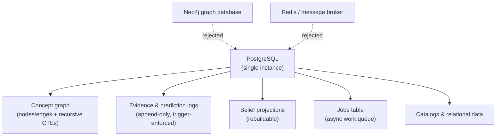
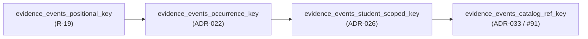
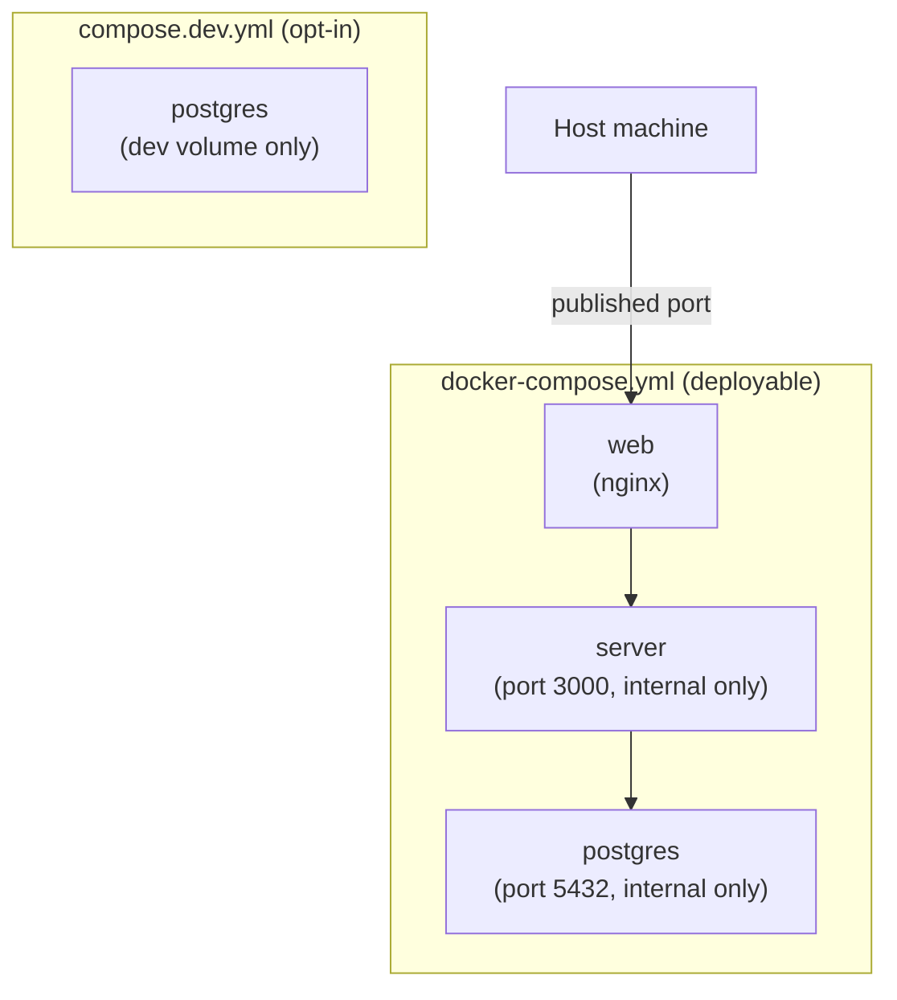
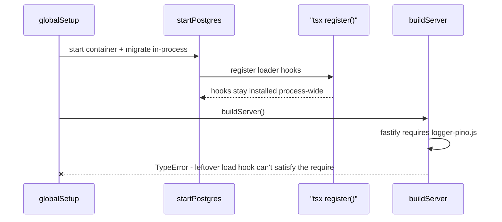

Backend (phần phụ trợ) của Stemolly được chủ ý giữ thật đơn giản: một cơ sở dữ liệu PostgreSQL duy nhất chứa mọi loại dữ liệu mà ứng dụng cần, và ngay cả phần việc bất đồng bộ cũng chạy qua chính cơ sở dữ liệu đó thay vì dùng một queue riêng. Bao quanh quyết định đó là một số quy ước gọn gàng — cách viết migration, cách đọc config, cách dựng local dev stack — cùng vài bài học thực tế về những lỗi hay xuất hiện khi một process chạy quá lâu. Trang này đi từ quyết định ở tầng cao nhất là “vì sao chỉ dùng một cơ sở dữ liệu” cho tới những chỗ vấp bạn thực sự sẽ gặp khi chạy stack trên máy của mình.

## Một instance Postgres giữ (gần như) mọi thứ

Không có graph database (cơ sở dữ liệu đồ thị) riêng, cũng không có event store (kho lưu trữ sự kiện) chuyên biệt. PostgreSQL chứa concept graph (đồ thị khái niệm) dưới dạng các bảng nodes/edges và được duyệt bằng recursive CTEs (CTE đệ quy), các evidence và prediction logs dạng append-only (chỉ ghi thêm), các belief projections được dựng từ những log đó, các catalog, cùng dữ liệu quan hệ thông thường — với JSONB dùng cho những payload hay đổi cấu trúc như thân event, thân report và tên hiển thị đã dịch.



Phương án dùng graph database chuyên dụng như Neo4j từng được cân nhắc rồi loại bỏ: các phép duyệt đồ thị mà ứng dụng này cần đều nông — kiểu như “khái niệm này có prerequisite nào” hoặc “nó có taxonomy children nào” — còn phần thực sự khó của hệ thống lại là trạng thái của học viên, vốn mang hình dạng event và projection chứ không phải đồ thị. Thêm một datastore nữa chỉ làm tăng gánh vận hành và khiến việc đổi hướng sau này khó hơn. Event store chuyên dụng cũng bị loại vì một lý do còn đơn giản hơn: các bảng Postgres append-only thông thường, kết hợp với trigger chặn update và delete, đã cho đúng ngữ nghĩa event mà hệ thống cần mà không phải thêm hạ tầng nào.

Đặt mọi thứ trong cùng một kho lưu trữ còn đồng nghĩa với một câu chuyện backup duy nhất cho evidence log — thứ không thể tái tạo nếu đã mất — và giữ được tính toàn vẹn giao dịch giữa việc append một event và cập nhật projection phụ thuộc vào nó. Bản thân phần graph traversal cũng không bị rải khắp codebase; nó được đóng gói trong graph repository riêng của engine, nên nếu sau này một nhu cầu thật sự mang tính đồ thị đủ để biện minh cho kho lưu trữ chuyên biệt, việc thay thế cũng sẽ chỉ khu trú ở đúng chỗ đó.

## Công việc bất đồng bộ chạy trong cùng cơ sở dữ liệu, không dùng queue riêng

Các background job — Expert checkpoints, judge batches, ingestion, email mời — chạy trên một vòng lặp worker (tiến trình xử lý) trong cùng process, dựa vào một jobs table đơn giản trong Postgres. Về bản chất, worker sẽ giành một dòng bằng câu lệnh:

```sql
SELECT ... FROM <jobs table>
FOR UPDATE SKIP LOCKED;
```

`FOR UPDATE SKIP LOCKED` chính là thứ làm cơ chế này an toàn khi có nhiều worker: nó khóa dòng mà một worker đã giành được và để các worker khác đơn giản bỏ qua những dòng đang bị khóa thay vì bị chặn lại. Hãy hình dung jobs table như một danh sách việc cần làm dùng chung — mỗi worker lấy mục kế tiếp chưa ai nhận rồi khóa nó, để không ai khác có thể nhặt đúng công việc đó trong lúc nó đang chạy. Job có cơ chế retry với giới hạn số lần thử; nếu đã dùng hết số lần retry, job đó sẽ được đưa ra như một reliability metric thay vì bị rơi mất trong im lặng.

Một message broker (trình môi giới thông điệp) như Redis/BullMQ, RabbitMQ hay SQS đã được cân nhắc rồi loại bỏ. Với độ sâu hàng đợi chỉ ở mức vài chục job mỗi ngày, đó sẽ là hạ tầng mà dự án chưa cần; jobs table được cố ý xem như đường ranh để sau này có thể thay bằng broker thật nếu lưu lượng buộc phải làm vậy. Dùng cùng cơ sở dữ liệu mà job sẽ tác động tới còn có thêm một lợi ích: vì việc enqueue một job và commit thay đổi dữ liệu đã kích hoạt nó diễn ra trong cùng transaction, jobs table nghiễm nhiên đóng vai outbox mà không cần thêm cơ chế riêng để tránh tình huống “dữ liệu đã đổi nhưng job chưa bao giờ được đưa vào hàng đợi”.

Kiểu bảo đảm giao nhận ở đây là at-least-once, không phải exactly-once, nên mọi handler nào ghi evidence đều phải idempotent (an toàn khi chạy lặp lại): một idempotency key xác định cùng unique constraint sẽ biến một checkpoint bị phát lại thành no-op an toàn thay vì append trùng. Giới hạn throughput của mô hình một process hiện tại được chấp nhận ở quy mô cohort của dự án; nếu sau này cần, hướng scale-out bằng cách tách worker sang process riêng đã được ghi nhận sẵn.

## Migrations: node-pg-migrate, mỗi file cho một schema

Schema migrations chạy qua `node-pg-migrate`, một migration runner mỏng và có thể lập trình — không dùng Prisma hay Knex. Lựa chọn đó cụ thể hóa một nguyên tắc đã được chốt từ trước: ở đây dự án từ chối các ORM nặng để ưu tiên một lớp SQL mỏng, viết tay, vì những append-only trigger và recursive CTEs mà hệ thống dựa vào cần phải còn dễ đọc; một schema DSL sẽ chỉ trở thành thứ phải vật lộn mỗi khi migration cần một trigger thuần hay một ràng buộc bất thường.

Trên lựa chọn công cụ đó là một quy ước bố trí file. Mọi migration đều nằm trong một timeline dùng chung, theo thứ tự thời gian, dưới `server/migrations/`, nhưng mỗi file chỉ được đụng vào schema của đúng một module — bắt đầu bằng `CREATE SCHEMA IF NOT EXISTS <module>;` rồi đến các bảng của module đó. Một file migration tạo bảng bên ngoài schema của module được đặt tên cho nó là dấu hiệu đáng phải soi trong review. Với một nhóm nhỏ bảng append-only (`evidence_events`, `predictions`, `llm_calls`, `guardrail_events`, `transcript_turns`), chính migration tạo bảng đó cũng phải gọi helper dùng chung `makeAppendOnly(pgm, schema, table)`, helper này cài trigger `BEFORE UPDATE OR DELETE` để fitness function append-only (G-5a) có thứ cụ thể mà kiểm tra.

:::note
Những migration đụng tới schema `engine.*` có trọng lượng lớn hơn: chúng phải được nêu rõ trong mô tả PR đối chiếu với checklist review schema G-4 (không rò rỉ domain, pedagogy hay vendor; danh tính node vẫn nguyên vẹn). Migration cho `metering` hoặc bất kỳ schema nào khác chỉ cần review theo mức thông thường — riêng engine mới mang đầy đủ hệ quả của nguyên tắc “bảo vệ lõi engine phi phụ thuộc domain”, nên chỉ nó mới bị áp ngưỡng chặt hơn.
:::

### Hai điểm vào, hai cấu hình

`node-pg-migrate` được chạy theo hai cách khác nhau trong dự án này: script CLI `migrate:up` (cho local dev và deploy) và API `runner()` chạy trong process (được harness testcontainers integration dùng tới). Hai điểm vào này **không chia sẻ cấu hình** — mọi thứ quan trọng đều phải được đặt ở cả hai bên, riêng rẽ. Trên thực tế có hai cấu hình đáng kể: `ignorePattern` (`tsconfig\.json|.*\.test\.ts`), vì nếu không thì bộ quét migration sẽ coi mọi file không bắt đầu bằng dấu chấm trong thư mục migrations — kể cả `tsconfig.json` của chính nó — là migration rồi thất bại; và một TypeScript loader, vì có migration import một helper `.ts` chưa biên dịch (`--tsx` với CLI, còn với runner trong process là một lệnh `register()` `tsx/esm` gọi đúng một lần). Quên đặt một cấu hình ở một đường chạy nào thì chỉ đường đó hỏng — đó cũng chính là kiểu sai cấu hình có thể vẫn qua được trên máy bạn với CLI nhưng chỉ vỡ khi CI chạy runner trong process (hoặc ngược lại).

### Một `down()` viết tay có thể để lại object mồ côi

Khi migration không export `down()`, `node-pg-migrate` sẽ tự sinh một bản bằng cách đảo ngược lần lượt từng thao tác trong `up`. Nhưng một khi bạn export `down()` tường minh, suy diễn tự động đó bị bỏ qua hoàn toàn — phiên bản viết tay sẽ chạy nguyên xi, dù có thiếu tới đâu đi nữa.

:::caution
Điều này đã từng làm dự án dính lỗi. Một `down()` viết tay chỉ drop mỗi bảng đã để lại trigger function độc lập mà `makeAppendOnly` tạo ra — trigger thì chết cùng bảng, còn function là object độc lập trong schema nên không tự biến mất. Kết quả là ở vòng down-rồi-up tiếp theo, hệ thống lỗi với thông báo “function already exists”. Cách sửa là xóa `down()` viết tay đó để cơ chế auto-reverse xử lý (vốn drop trigger, function, table, extension và schema theo đúng thứ tự ngược lại). Hướng dẫn chung ở đây: migration nào tạo ra object không tầm thường — function, trigger, extension — thì nên ưu tiên auto-reverse và đi kèm một bài test hồi quy down-rồi-up, thay vì tự viết `down()`.
:::

Chính nhóm vấn đề này về sau còn tái xuất ở quy mô lớn hơn. Một lỗi trong integration test của chu trình down/up cuối cùng được truy ra là dính tới năm file migration chứ không phải một: bốn file thiếu export `down()` vì đã dùng lời gọi `pgm.sql(...)` thuần, cộng thêm một lỗi khác liên quan đến việc drop extension hai lần. Cách sửa cho cả năm trường hợp đều là viết `down()` thật sự — chứ không phải thu hẹp bài test để bỏ qua những migration đã biết là “không thể đảo ngược”. Nếu thu hẹp bài test, dự án sẽ tự biến một bất biến hiện đang đúng (“mọi migration trong thư mục này đều round-trip được”) thành một danh sách ngoại lệ cứ dài mãi, đồng thời đánh mất khả năng rollback schema của engine trong môi trường production.

### Postgres extensions: một nơi sở hữu, không khai báo lặp lại

Một Postgres extension — như `pgcrypto` — chỉ được cài một lần cho mỗi cơ sở dữ liệu. `CREATE EXTENSION IF NOT EXISTS` là cách an toàn khi đi lên: nếu extension đã tồn tại thì nó đơn giản là no-op. Nhưng khi đi xuống, phần auto-reverse mà `node-pg-migrate` tạo cho `createExtension` luôn phát ra `DROP EXTENSION` thuần, không có lá chắn `IF EXISTS`.

Nếu hai migration cùng khai báo một extension và bạn chạy down-migration cho cả thư mục, bản auto-reverse của migration ở phía sau sẽ drop extension trước. Đến khi chuỗi chạy ngược chạm lại migration ở phía trước vốn ban đầu “sở hữu” extension, câu `DROP` tự sinh của nó sẽ thất bại vì extension đó đã không còn nữa.

Quy tắc là: mỗi extension chỉ nên xuất hiện trong đúng một file migration. Nếu bạn buộc phải tham chiếu tới một extension trong migration vốn không tạo ra nó, đừng khai báo lại bằng `createExtension`. Nếu một migration đã lỡ có `createExtension` dư thừa, hãy viết `down()` tường minh chỉ để bỏ qua bước drop extension — để migration thực sự sở hữu extension tự lo phần tháo dỡ của nó.

### Quy ước đặt tên cho uniqueness constraint của `evidence_events`

Có một constraint cụ thể dùng quy ước đặt tên riêng mà bạn nên biết, vì nhìn qua thì nó khá lạ. Constraint `UNIQUE NULLS NOT DISTINCT` trên `engine.evidence_events` đã nhiều lần bị drop rồi tạo lại dưới tên mới, mỗi lần một migration thay đổi tập cột mà nó bao phủ hoặc thay đổi ý nghĩa của một trong các cột đó:



Mỗi cái tên chỉ mô tả đúng điều mà *migration đó* vừa thay đổi — không bao giờ mô tả đầy đủ danh tính bảy cột mà constraint thực sự đang ép buộc. Đây là chủ ý: nó giúp ai đang đọc `\d evidence_events` suy ra migration nào đã tạo ra constraint hiện tại. Đây cũng là một cách lách tình thế — `node-pg-migrate` v8.0.4 không có tùy chọn giữ nguyên tinh thần đổi tên nào tương thích với `UNIQUE NULLS NOT DISTINCT`, nên mỗi lần đổi tên đều phải làm bằng raw SQL: drop rồi add lại, thay vì `ALTER ... RENAME CONSTRAINT`. Điều này an toàn vì không có chỗ nào trong codebase truy cập constraint qua tên của nó; đường insert `ON CONFLICT` trong evidence repository suy ra mục tiêu từ danh sách cột, không từ tên constraint. Nếu sau này còn đổi tên nữa, hãy tiếp tục dùng cùng kiểu “dấu vân tay” này thay vì quay lại một tên “mô tả đầy đủ” cho cả khóa — dự án đã nhất quán chọn dấu vân tay thay cho mô tả toàn phần.

### Mệnh đề trong ADR phải được kiểm chứng lúc review, không được mặc định là tự đi theo vào code

Những mệnh đề đã được chấp nhận trong ADR không tự động ép buộc implementation tuân theo — hiện tại, review vẫn là chốt kiểm duyệt duy nhất phát hiện độ lệch. Ví dụ cụ thể: khi `match_nodes` được dựng lần đầu, lập trình viên đã thêm một GIN trigram index trên `engine.nodes` (`pg_trgm`). Nhưng điều khoản 3 của ADR-035 trước đó đã nói rất rõ là bác bỏ index này — ở quy mô PoC, riêng extension đó đã đủ cho một phép similarity scan trên toàn bảng, còn thêm GIN index chỉ mang thêm overhead mà không có lợi ích nào được đo đạc. Index này bị chặn ở vòng review rồi bị hoàn tác. Khi triển khai theo một ADR, hãy đọc các điều khoản của nó để xem *những gì đã bị bác bỏ*, chứ không chỉ nhìn vào phần đã được chấp nhận.

## Cấu hình: một quy ước STEMOLLY_, một nơi tổng hợp

Các biến môi trường dùng chung một kiểu đặt tên là `STEMOLLY_<AREA>_<NAME>` (ví dụ `STEMOLLY_LLM_TIER_FAST_MODEL`) và chỉ được đọc ở đúng một nơi — bộ tổng hợp `config.ts` — rồi được kiểm tra hợp lệ theo từng module bằng schema zod, thay vì bị đọc tùy tiện qua `process.env` rải rác khắp codebase. Các file `.env` chỉ dành cho môi trường dev, và secret tuyệt đối không được commit vào repo. Quy ước này đã khép lại một khoảng trống mà giai đoạn kiến trúc chủ động để mở: config và secret đã sớm được gọi tên như một đường ranh, nhưng mãi tới quy ước này mới có luật cụ thể.

Tuy vậy, với mỗi giá trị vẫn còn một câu hỏi: nên bắt buộc phải khai báo, hay nên có giá trị mặc định? Với bất cứ thứ gì liên quan đến bảo mật, câu trả lời mà dự án chốt là **bị chặn trong một khoảng hợp lệ và có giá trị mặc định, cộng thêm kiểm tra sự hiện diện chỉ ở production** — chứ không phải một biến bắt buộc nhưng không có mặc định. Ví dụ cụ thể là TTL của invite token, trước đây từng là một hằng số hardcode nằm sâu trong lớp domain thuần:

```
STEMOLLY_INVITE_TTL_HOURS=168   # integer, 1-168, defaults to 168; presence checked only when NODE_ENV=production
```

Một biến bắt buộc theo kiểu thuần túy đã được cân nhắc rồi loại bỏ. Mọi trường khác trong schema config đều có mặc định, nên chỉ chừa ra một trường bắt buộc là không nhất quán — và trên thực tế nó chỉ khiến cùng một giá trị bị copy-paste vào dev, test, CI và compose, trông như thể ở mỗi nơi đều có chủ đích riêng trong khi thực chất lại là một giá trị không qua review bị rải ở bốn chỗ. Điều thật sự cần phòng ngừa là một giá trị *sai*, và một khoảng giá trị đã được validate xử lý chuyện đó trực diện hơn: khởi động sẽ thất bại nếu là zero, âm, không phải số hoặc vượt quá trần. Kiểm tra sự hiện diện chỉ ở production khi đó mới tạo ra lực ép đúng tại nơi việc tuyên bố chính sách một cách tường minh là cần thiết, và không ở đâu khác.

Có thêm hai chi tiết nhỏ nên nhớ cho mọi trường hợp tương tự: đơn vị phải nằm ngay trong tên biến, và đó nên là đơn vị dễ đọc ở nơi deploy — dùng giờ, không dùng mili giây, để giá trị không biến thành cả một dãy số 0. Và giá trị này phải được truyền vào hàm domain dưới dạng tham số, thay vì để lớp domain tự đọc config ở bên trong, để việc “cho phép cấu hình” không âm thầm kéo một lệnh đọc môi trường vào phần code lẽ ra phải giữ thuần.

## Chạy stack trên máy cục bộ

Cấu hình Docker Compose được theo dõi trong repo được tách thành hai file với hai nhiệm vụ khác nhau. `docker-compose.yml` là bản có thể deploy: trên một checkout sạch, `docker compose up` sẽ dựng toàn bộ stack — web, server và Postgres, tất cả đều `restart: unless-stopped` — mà không cần thiết lập thủ công, và chỉ publish cổng host cho web. Server (3000) và Postgres (5432) chỉ truy cập được qua compose network, tuyệt đối không publish ra host. `compose.dev.yml` là một file riêng, chỉ dùng khi chủ động chọn, để dựng riêng Postgres phục vụ việc chạy server cục bộ bằng `pnpm --filter server dev`; nó được gọi tường minh bằng `docker compose -f compose.dev.yml up -d`.



File dev cố ý không được đặt tên là `docker-compose.override.yml` — Compose sẽ tự động gộp bất kỳ file nào mang đúng tên đó vào mọi lệnh `docker compose up`, như vậy cấu hình dev sẽ bị kéo lặng lẽ vào quy trình bring-up từ checkout sạch của bản deployable và làm mất ý nghĩa của việc tách file. Hai file này cũng dùng tên volume khác nhau (`stemolly-postgres-data` và `stemolly-dev-postgres-data`) để khi chạy cả hai từ cùng một thư mục, chúng không đâm vào cùng một Docker volume.

### Chạy migration cho production — service migrator

Bản deployable `docker-compose.yml` **không publish cổng nào** cho Postgres — kể cả trên loopback. Đây là một bất biến đã được kiểm thử và có tính ràng buộc, được ép bằng integration test. Vì thế, bạn không thể chạy migration vào cơ sở dữ liệu production bằng cách đi qua một cổng đã publish hay một SSH tunnel trỏ vào cổng loopback đó.

Cơ chế đúng là một compose service riêng tên `migrator` nằm trên compose network nội bộ, truy cập `postgres:5432` theo đúng cách mà `server` và các service MCP dùng. Nó mang `profiles: ["migrate"]` nên sẽ không bao giờ tự khởi động trong một lệnh `docker compose up` thông thường. Để chạy migration:

```bash
docker compose run --rm migrator
```

Service `migrator` dùng một image riêng có `node-pg-migrate` và `tsx` trong dev dependencies, không giống image `server` runtime đã được gọt gọn — image runtime đó không có công cụ migration cũng không chứa file migration. Nếu không có service migrator, thực ra sẽ chẳng có cách nào hoạt động được để chạy migration vào bản deployable cả.

:::caution
Nếu bạn chạy một Postgres client (như Adminer) trong container riêng của nó rồi trỏ tới `localhost`, kết nối sẽ thất bại ngay cả khi Postgres đang chạy hoàn toàn bình thường — bên trong container của chính client đó, `localhost` nghĩa là bản thân container ấy chứ không phải host, nên bạn sẽ nhận lỗi connection refused trông y hệt như thể cơ sở dữ liệu chưa lên. Cách sửa là chạy client với `--network host` (trên Linux), hoặc dùng `host.docker.internal` thay cho `localhost`. Ngoài ra, chỉ một khoảng trắng thừa ở đầu giá trị host khi copy-paste cũng đủ tạo ra lỗi tra DNS rất dễ bị hiểu nhầm thành lỗi kết nối thật, trong khi nguyên nhân chỉ là một chuỗi bị nhập sai.
:::

:::tip
Adminer chỉ hiển thị một Postgres schema tại một thời điểm và mặc định là `public`. Nếu bạn không thấy các bảng mình mong đợi — và chỉ thấy một bảng sổ sách không liên quan như bảng theo dõi riêng của công cụ migration — thì rất có thể bạn chỉ đang nhìn nhầm schema chứ không hề gặp vấn đề kết nối. Hãy đổi schema bằng menu chọn schema của Adminer, hoặc thêm `&ns=<schema>` vào URL đăng nhập của nó. Chẳng hạn, trong engine-poc, các bảng của ứng dụng (`nodes`, `edges`, v.v.) nằm trong schema `engine`; còn `public` chỉ chứa `pgmigrations`.
:::

## Hai mối nguy trong các process sống lâu

Hai vấn đề dưới đây cùng có một gốc rễ: thứ được viết cho process sống ngắn hóa ra lại phá hỏng process sống lâu.

**`tsx`'s `register()` để lại một cái bẫy cho toàn process.** `register()` (từ `tsx/esm/api`) cài các module-loader hook cho ESM/CJS trên phạm vi toàn process, và nó không bao giờ tự gỡ ra. Test harness gọi nó để `runner()` chạy trong process của `node-pg-migrate` có thể nạp các file migration `.ts` — điều này vô hại trong một Vitest worker chạy một lần rồi thôi, nơi sau khi test xong sẽ không còn gì quan trọng được nạp thêm, nhưng lại là thảm họa với một process vẫn tiếp tục nạp module về sau.



Đó chính xác là điều đã xảy ra khi một `globalSetup` của Playwright gọi `startPostgres()`: container khởi động và migration đều xong xuôi, nhưng ngay bước kế tiếp, lời gọi `fastify()` trong `buildServer()` ném ra một `TypeError` từ bên trong lệnh `require` CJS thông thường mà Fastify dùng để nạp module logger của nó — phần load hook còn sót lại của `tsx` đã chặn đúng một lệnh `require` mà nó không đáp ứng được. Chỉ cần bỏ lời gọi `startPostgres()` đi và trỏ config tới một database URL thông thường là `buildServer()` lại chạy được, qua đó xác nhận thủ phạm là “di chứng” của `tsx`, chứ không phải Playwright hay Fastify.

Cách giải quyết là: chạy bước migration trong một **child process** được spawn ra — dùng chính CLI của `node-pg-migrate` với `--tsx`, giống script `migrate:up` — thay vì chạy trong process hiện tại, để việc `tsx` đăng ký hook bị nhốt trong tiến trình con sống ngắn đó. Bản thân container Postgres vẫn được khởi động trong process của bên gọi, nên vòng đời của nó vẫn gắn với process sống lâu đang sở hữu nó.

:::caution
Nguyên tắc chung là: một loader hook phạm vi toàn process là tác dụng phụ lên *toàn bộ process*, chứ không chỉ lên đúng lời gọi đã cài nó. Bất kỳ helper nào đăng ký kiểu hook này chỉ an toàn ở nơi mà sau đó sẽ không còn thứ gì quan trọng được nạp thêm.
:::

**`compose()` dựng một connection pool mà sẽ không ai tự đóng hộ bạn.** `compose(config)` tạo ra `pg.Pool` dùng chung cho các module persistence và metering, nhưng không có thành phần downstream nào nhận trách nhiệm sở hữu nó. `buildServer(ctx)` nhận vào một app context đã dựng sẵn và không đụng gì tới pool; còn `app.close()` của Fastify chỉ tắt HTTP server cùng các plugin của nó, hoàn toàn không biết gì về một pool mà nó không tạo ra.

:::caution
Bất kỳ đoạn code nào gọi `compose()` trực tiếp — integration test, cặp `globalSetup`/`globalTeardown` của Playwright hay một test harness nào đó trong tương lai — đều phải tự kết thúc pool một cách tường minh:

```ts
await app.close();
await ctx.modules.persistence.pool.end();   // not implied by app.close()
await db.stop();
```

Nếu bỏ qua dòng ở giữa, các kết nối trong pool sẽ tiếp tục treo sau cả lúc container cơ sở dữ liệu đã tắt, hoặc giữ process không cho thoát, hoặc ném lỗi kết nối tới một cơ sở dữ liệu đã không còn tồn tại. Đây là hệ quả trực tiếp từ cách ứng dụng được ghép lại với nhau: ai tạo ra resource thì người đó sở hữu vòng đời của nó, và bên gọi `compose()` chính là bên đã tạo pool — `app.close()` chỉ *trông như* một thao tác tắt hoàn chỉnh, nhưng thực ra không phải.
:::
