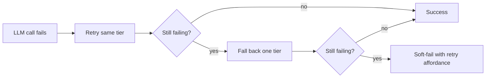
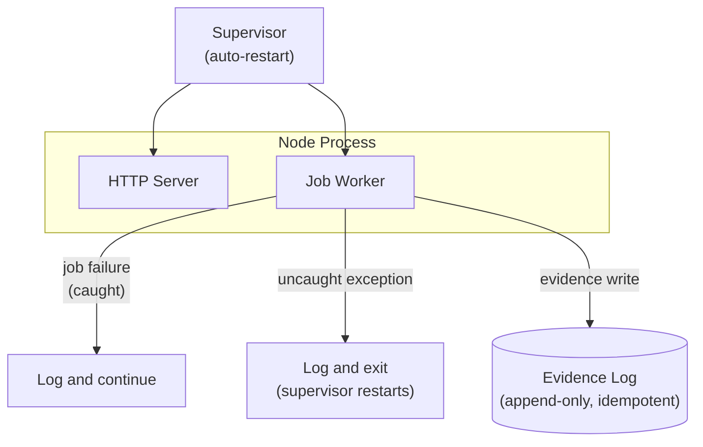
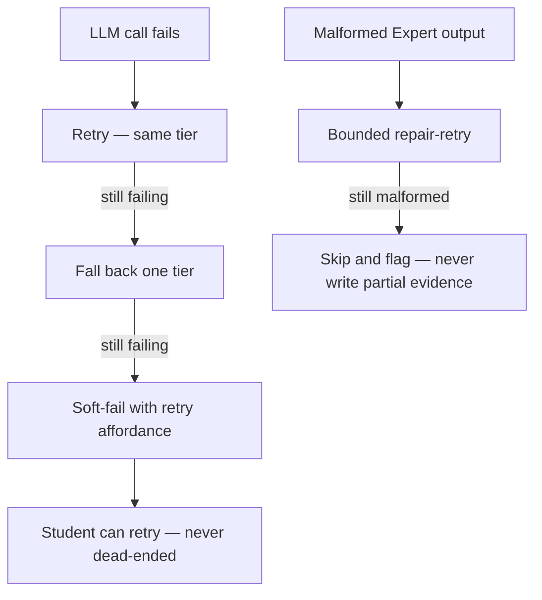
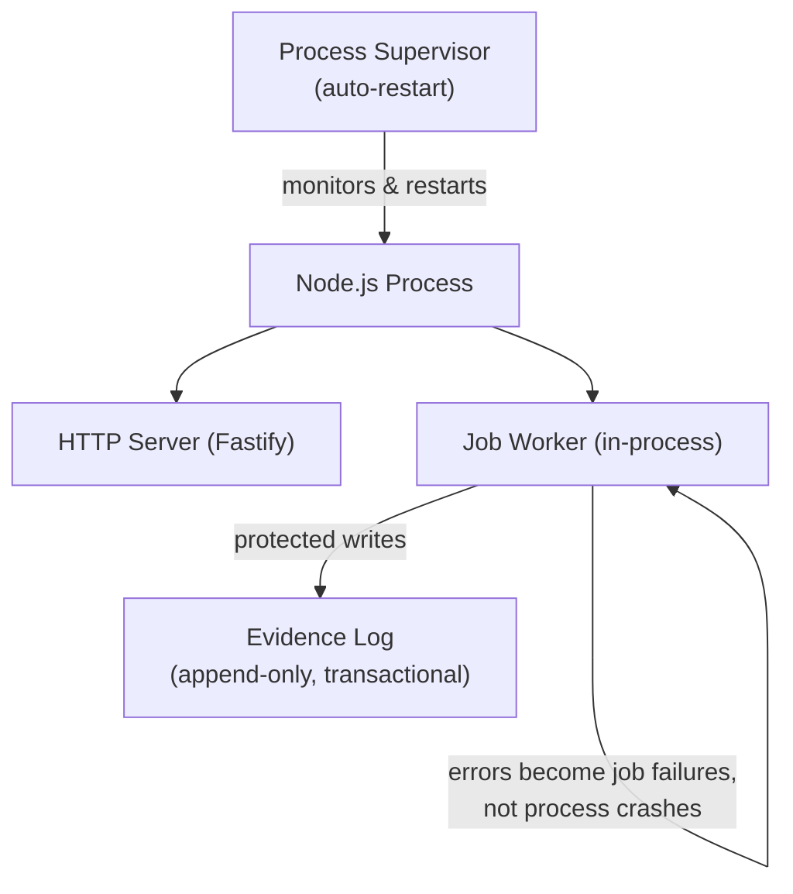

Cách Stemolly xây dựng observability và resilience dựa trên bốn mảnh ghép gắn chặt với nhau: một logging pipeline (luồng ghi log) có hình dạng được ràng buộc nghiêm ngặt, một trace context (ngữ cảnh lần vết) được truyền tường minh, một error envelope (bao lỗi) duy nhất với cơ chế fallback (dự phòng) theo tầng cho LLM, và một chiến lược chịu lỗi có giới hạn cho background jobs (tác vụ nền). Trang này giải thích từng mảnh ghép và cách chúng kết nối với nhau.

## Structured logging (ghi log có cấu trúc) với bộ trường được kiểm tra bằng schema

Mọi đầu ra log đều đi qua một module dùng chung duy nhất: `server/src/logger/index.ts`. Module này bọc Pino thông qua cơ chế tích hợp logger có sẵn của Fastify. Mỗi dòng log **phải** mang năm trường bắt buộc:

| Trường | Mục đích |
|---|---|
| `timestamp` | Chuỗi ISO-8601 |
| `level` | Nhãn chuỗi (`info`, `warn`, …) |
| `module` | Tên module nguồn |
| `event` | Slug sự kiện để máy đọc được |
| `traceId` | Liên kết dòng này với một request hoặc job |

Sáu trường tùy chọn — `sessionId`, `jobId`, `durationMs`, `errorCode`, `statusCode`, và `reqId` — được phép xuất hiện, ngoài ra không có trường nào khác. `reqId` được Fastify tự động gắn vào mọi dòng `request.log`; `statusCode` được error handler trộn thêm vào. Nội dung transcript, nội dung prompt và tên học sinh đều **bị cấm**; điều này được ép buộc bằng một unit test của schema, test này sẽ từ chối các khóa có hình dạng nội dung đã biết (`message`, `transcript`, `prompt`, `content`).

`console.*` bị cấm ở mọi nơi ngoài `logger/**` thông qua một rule ESLint. Sự kết hợp giữa schema ràng buộc bộ trường và lệnh cấm ở tầng lint bảo đảm rằng mọi câu lệnh log trong codebase đều có cùng một hình dạng.

### Vì sao logger cần cấu hình tường minh

Thiết lập mặc định của Pino không đáp ứng schema này. Theo mặc định, Pino xuất `level` dưới dạng số (`30`), ghi timestamp dưới dạng số nguyên epoch trong khóa `time`, và thêm `pid` cùng `hostname` vào mọi dòng. Một schema Zod `.strict()` mong đợi `level` là chuỗi, có khóa `timestamp`, và không chấp nhận trường thừa sẽ từ chối mọi dòng mà logger mặc định tạo ra.

Vì vậy `createLogger()` phải đặt ba tùy chọn mang tính nền tảng:

```ts
{
  base: null,                          // drops pid and hostname
  timestamp: () => `,"timestamp":"${new Date().toISOString()}"`,
  formatters: { level: label => ({ level: label }) },
}
```

Chỉ cần bỏ một trong ba tùy chọn này là mọi dòng log trong hệ thống sẽ không còn đúng schema.

Bộ test ban đầu đã không phát hiện ra sự lệch nhau này vì các test đó đưa vào schema những object mẫu dựng tay, chứ không phải đầu ra thật của logger. Lý do là Pino ghi trực tiếp vào file descriptor thông qua transport `sonic-boom`, nên nó bỏ qua hoàn toàn `process.stdout.write`. Monkey-patch stdout sẽ không bắt được gì. Cách duy nhất để quan sát đầu ra thật của logger là **spawn một child process (tiến trình con)** — chạy một script nhỏ qua `tsx` rồi phân tích stdout của nó. Lớp chặn hồi quy hiện có trong `server/src/logger/schema.test.ts` làm đúng việc đó, và nếu cố tình bỏ `base: null` thì test sẽ thất bại với lỗi `Unrecognized keys: "pid", "hostname"`.

## Trace context: truyền tường minh thay vì AsyncLocalStorage

Mỗi request hoặc job gói trace identifier và logger của nó vào cùng một object:

```ts
interface RequestContext {
  traceId: string;
  logger: Logger;
}
```

`RequestContext` này được luồn tường minh như một đối số hàm qua mọi lời gọi cần dùng đến nó — kể cả khi đi qua ranh giới sync-turn → async-checkpoint. Nó **không** được lưu trong `AsyncLocalStorage` của Node để rồi đọc ra một cách ngầm định.

Lý do là tính minh bạch. AsyncLocalStorage có thể âm thầm làm rơi context qua một số ranh giới bất đồng bộ, và việc lan truyền của nó không hiện ra trong call graph. Truyền tường minh khiến mỗi chuỗi lời gọi phải nhận thêm một tham số, nhưng bù lại đường đi của context luôn nhìn thấy được và không thể vô tình đánh rơi. `traceId` xuất hiện trong mọi dòng log và mọi bao phản hồi lỗi đều đến từ cùng `RequestContext` này.

## Một error envelope, một error handler

Mọi phản hồi lỗi từ server đều tuân theo một bao duy nhất được định nghĩa trong gói contracts:

```json
{
  "error": {
    "code": "RESOURCE_NOT_FOUND",
    "message": "Resource not found",
    "traceId": "abc-123",
    "details": {}
  }
}
```

- **HTTP status** mang nhóm phân loại rộng (4xx so với 5xx).
- **`code`** là chuỗi ổn định, máy đọc được, để frontend ánh xạ sang văn bản dành cho người dùng. Server không bao giờ gửi văn xuôi đã bản địa hóa — điều này giữ đúng ranh giới hai ngôn ngữ.
- **`traceId`** đến từ `RequestContext` đã mô tả ở trên.

Các module miền nghiệp vụ ném typed error và không đụng vào HTTP. Một `setErrorHandler` duy nhất của Fastify là nơi duy nhất tạo ra body lỗi — kể cả các lỗi validate của chính Fastify (`FST_ERR_VALIDATION`), vốn được ánh xạ sang `ValidationError` để đi theo đúng bao lỗi chung như các lỗi do ứng dụng ném ra.

### Lỗi LLM và provider là trường hợp hạng nhất

Lỗi LLM không phải là ngoại lệ bất ngờ ở mép hệ thống — chúng được phân loại và xử lý theo một thứ tự leo thang cố định:



Fallback chéo provider được bật mặc định cho tier Interface và tắt mặc định cho tier Expert. Đầu ra Expert bị lỗi định dạng sẽ được repair-retry có giới hạn; sau đó nó bị bỏ qua và gắn cờ — tuyệt đối không bao giờ được ghi thành bằng chứng dở dang. Mọi lỗi provider đều được loại bỏ PII trong gateway trước khi chạm tới bất kỳ dòng log hay phản hồi lỗi nào.

## Fire-and-forget telemetry (telemetry gửi đi không chờ): bắt lỗi nếu không sẽ sập

Module `llm` không tự ghi các dòng metering. Một composed observer lắng nghe sự kiện `'llm.response'`, tính chi phí token từ mức giá của tier, rồi gọi `metering.recordLlmCall(...)` **mà không `await`**. Đây là chủ ý: một lần ghi billing chậm hoặc lỗi không bao giờ được phép chặn hay phá vỡ lượt tương tác của học sinh.

Một promise bị từ chối mà không `await` không đồng nghĩa với việc nó đã được xử lý. Nếu không có `.catch()` tường minh, lần ghi metering bị lỗi sẽ nổi lên ở cấp tiến trình như một unhandled rejection và làm sập tiến trình. Đây không phải chuyện giả định — trong các lượt chạy unit test không có cơ sở dữ liệu thật, lần ghi metering đã bị reject và làm sập toàn bộ script test dù mọi assertion đều đã qua.

Cách sửa là đặt `.catch()` ngay tại đúng call site. Phần xử lý catch **phải** log ở mức `warn`:

```ts
metering.recordLlmCall(...)
  .catch(err => logger?.warn({ module: 'llm', event: 'metering.record_failed', purpose, agentRole }));
```

Nguyên tắc ở đây là: *fire-and-forget là một lựa chọn chịu lỗi hợp lệ cho telemetry, nhưng tuyệt đối không được biến thành "gửi đi rồi chẳng bao giờ biết kết quả"*. Nếu bạn nuốt một lỗi, hãy log nó.

## In-process worker fault-tolerance

Các job nền chạy trong cùng tiến trình Node với HTTP server. Một job làm sập tiến trình cũng sẽ kéo HTTP server đi cùng. Chiến lược chịu lỗi ở đây chấp nhận trần giới hạn của mô hình dùng chung tiến trình ở quy mô cohort, và làm cho bán kính ảnh hưởng trở nên tường minh, có giới hạn, thay vì tách worker ra ngay.

Triết lý này có ba phần:

- **Bảo vệ thứ không thể thay thế.** Evidence log là append-only, idempotent, có transaction, và có sao lưu. Không bao giờ có bản ghi dở dang lọt xuống đĩa.
- **Suy giảm với thứ có thể phục hồi.** Đường đi nhanh sẽ trả về một Report cũ nhưng vẫn hợp lệ, hoặc soft-fail kèm khả năng thử lại. Học sinh không bao giờ bị chặn ở ngõ cụt.
- **Để lỗi dừng ở mức lỗi đã bắt, không để thành crash.** Mọi job handler đều được bọc để lỗi của chúng trở thành job failure, chứ không thành kẻ giết tiến trình. Jobs và các lời gọi LLM đều có giới hạn thời gian. Các handler cho `uncaughtException` và `unhandledRejection` sẽ log rồi thoát gọn gàng.

Tiến trình chạy dưới một supervisor có chính sách tự khởi động lại. Khi có crash, các job bền vững sẽ tiếp tục chạy lại. Tính sẵn sàng vẫn có trần của mô hình một tiến trình; nếu quy mô đòi hỏi, việc tách worker sang tiến trình riêng là bước kích hoạt đã được ghi nhận từ trước.



:::caution
Thiết kế trong cùng tiến trình có nghĩa là một job lỗi nặng, trong kịch bản xấu nhất, vẫn có thể ảnh hưởng đến tính sẵn sàng của HTTP. Chính sách tự khởi động lại của supervisor và evidence log có tính idempotent là thứ giới hạn thiệt hại — không phải khả năng cô lập.
:::

Chiến lược observability và resilience của Stemolly được xây trên một vài nguyên tắc nhất quán: mọi dòng log, mọi phản hồi lỗi, và mọi đường xử lý lỗi đều tuân theo một hợp đồng đã biết và được ép buộc. Trang này giải thích các hợp đồng đó vận hành ra sao và vì sao chúng được thiết kế như vậy.

## Structured Logging

Mọi dòng log trong backend đều đi qua một module logger dùng chung duy nhất tại `server/src/logger/index.ts`, được xây trên [Pino](https://getpino.io/) thông qua cơ chế tích hợp logger có sẵn của Fastify. Tất cả các dòng log đều phải mang năm trường bắt buộc:

| Trường | Mục đích |
|---|---|
| `timestamp` | Chuỗi ISO-8601 |
| `level` | Nhãn chuỗi (`"info"`, `"warn"`, `"error"`) |
| `module` | Module nào phát ra dòng này |
| `event` | Tên sự kiện ổn định, máy đọc được |
| `traceId` | Gắn mọi dòng của cùng một request lại với nhau |

Sáu trường bổ sung là tùy chọn: `sessionId`, `jobId`, `durationMs`, `errorCode`, `statusCode`, và `reqId`. `statusCode` được error handler trộn thêm vào. `reqId` được Fastify tự động gắn vào mọi dòng `request.log` — code ứng dụng không thể chọn bỏ nó ở từng lần gọi.

**Quyền riêng tư được ép ở cấp schema.** Những trường có hình dạng nội dung — `message`, `transcript`, `prompt`, `content` — sẽ bị một unit test từ chối; test này kiểm tra các khóa nội dung đã biết. Văn bản transcript, tên học sinh và địa chỉ email tuyệt đối không được xuất hiện trong log; việc này được kiểm tra tự động, không để từng lập trình viên phải tự nhớ.

`console.*` bị cấm ở mọi nơi ngoài `logger/**` bởi rule ESLint `no-console`. Đây là nửa kỷ luật ở tầng lint; bài test schema là nửa ở tầng runtime.

### Vì sao Pino cần cấu hình tường minh

Thiết lập mặc định của Pino không khớp với schema. Theo mặc định, Pino xuất `level` dưới dạng **số** (`30` cho info, không phải `"info"`), timestamp dưới dạng **số nguyên epoch** trong một khóa tên là `time` (không phải `timestamp`), và chèn thêm `pid` cùng `hostname` — hai khóa mà schema `.strict()` sẽ từ chối vì không có trong danh sách.

Nếu để mặc định, `createLogger()` sẽ không thể tạo ra nổi một dòng log nào vượt qua được schema. Sự lệch nhau này đã bị che khuất vì các bài test schema dùng object dựng tay và một test logger trong bộ nhớ, chứ không bao giờ dùng đầu ra thật của logger. Nó được phát hiện nhờ một lượt review độc lập, không phải nhờ test suite.

Vì vậy `createLogger()` bắt buộc phải đặt **ba tùy chọn cụ thể**. Chỉ cần bỏ đi một trong số đó là mọi dòng log trong hệ thống sẽ không còn đúng schema:

```ts
pino({
  base: null,                                                    // drops pid and hostname
  timestamp: () => `,"timestamp":"${new Date().toISOString()}"`, // ISO string, right key
  formatters: { level: (label) => ({ level: label }) }          // string, not number
})
```

Một lớp chặn hồi quy thường trực trong `server/src/logger/schema.test.ts` xác minh điều này. Nếu cố tình bỏ `base: null`, test sẽ thất bại với lỗi `Unrecognized keys: "pid", "hostname"`.

:::note[Vì sao phải dùng subprocess?]
Pino ghi trực tiếp vào file descriptor thông qua [sonic-boom](https://github.com/mcollina/sonic-boom), nên nó bỏ qua `process.stdout.write`. Monkey-patch stdout sẽ không bắt được gì. Bất kỳ bài test nào cần khẳng định đầu ra **thật** của logger đều phải spawn một child process (`execFileSync` chạy `tsx`), chạy `createLogger()`, rồi phân tích stdout của nó. Một bài test trong cùng tiến trình mà tự dựng instance pino riêng chỉ đang kiểm tra một logger *khác* — và chính điều đó đã khiến schema với logger thật có thể âm thầm trôi lệch khỏi nhau.
:::

## Request Context và lan truyền TraceId

Một `traceId` nhận diện từng request trong toàn bộ vòng đời của nó — qua code đồng bộ, các bước bất đồng bộ và cả ranh giới job. Thay vì dùng `AsyncLocalStorage` của Node để làm cho `traceId` có thể được đọc ngầm ở bất kỳ đâu, Stemolly truyền nó theo cách tường minh.

Mỗi request tạo ra một object `RequestContext`:

```ts
interface RequestContext {
  traceId: string;
  logger: Logger;
}
```

Object này được truyền làm tham số qua mọi hàm cần đến nó. `traceId` cũng chính là giá trị xuất hiện trong bao phản hồi lỗi, nhờ đó gắn các dòng log với phản hồi lỗi của cùng một request.

**Vì sao không dùng `AsyncLocalStorage`?** Truyền tường minh giữ cho đường đi của context luôn hiện rõ — bạn luôn thấy nó chảy qua đâu. `AsyncLocalStorage` có một footgun đã biết: nó có thể âm thầm làm rơi context ở một số ranh giới bất đồng bộ, từ đó tạo ra những dòng log không có `traceId` theo cách rất khó gỡ lỗi. Cái giá là thêm một tham số; lợi ích là thiếu `traceId` sẽ lộ ra thành lỗi kiểu nhìn thấy được, chứ không thành điều bí ẩn lúc runtime.

## Phản hồi lỗi

Mọi phản hồi lỗi trên toàn bộ API đều dùng chung một hình dạng bao, được định nghĩa trong gói contracts dùng chung:

```json
{
  "error": {
    "code": "SESSION_NOT_FOUND",
    "message": "Human-readable fallback",
    "traceId": "abc-123",
    "details": {}
  }
}
```

- **HTTP status** mang nhóm phân loại rộng (4xx so với 5xx). `code` mới là nơi chứa lý do cụ thể, ổn định và máy đọc được.
- **Văn bản hướng tới người dùng** không bao giờ được gửi như văn xuôi từ server. Frontend sẽ bản địa hóa từ `code`, nhờ đó ranh giới ngôn ngữ luôn sạch.
- **Các module miền nghiệp vụ ném typed error** và không đụng vào HTTP. Chỉ có **một** `setErrorHandler` của Fastify được phép chuyển lỗi thành phản hồi HTTP. Ngay cả lỗi validate của chính Fastify (`FST_ERR_VALIDATION`) cũng đi qua handler này và được ánh xạ sang `ValidationError` — không có đường code thứ hai cho lỗi validate.

### Xử lý lỗi LLM và provider

Lỗi từ LLM và provider được xem là điều kiện dự kiến có thể xảy ra, không phải crash bất thường. Gateway sẽ phân loại từng lỗi và loại bỏ PII trước khi nó lộ ra ngoài. Khi một lời gọi LLM thất bại, hệ thống sẽ đi qua một chuỗi leo thang đã định:



Fallback chéo provider được **bật mặc định cho Interface** (lượt hội thoại) và **tắt mặc định cho Expert** (bước ghi bằng chứng, nơi tính đúng đắn quan trọng hơn tính sẵn sàng).

## Fire-and-Forget Metering

Module LLM phát ra sự kiện `'llm.response'` khi một lời gọi model hoàn tất. Một observer được ghép thành phần sẽ lắng nghe sự kiện này, cộng tổng số token, tính chi phí theo mức giá của tier, rồi gọi `metering.recordLlmCall(...)` **mà không `await`** — chủ ý chọn kiểu fire-and-forget để một lần ghi billing chậm hoặc lỗi không bao giờ chặn lượt tương tác của học sinh.

Chỉ đặt `void` trước một promise sẽ reject vẫn khiến lỗi nổi lên ở **cấp tiến trình** dưới dạng unhandled rejection. Đây không phải chuyện lý thuyết: khi phần nối dây thật giữa provider và metering được ghép với môi trường unit test không có cơ sở dữ liệu thật, lần ghi metering đã bị reject bất đồng bộ và **làm sập toàn bộ script `test:unit`** — mọi assertion đều qua, nhưng tiến trình thì chết.

Quy tắc được rút ra từ đó — **fire-and-forget tuyệt đối không được có nghĩa là gửi đi rồi chẳng bao giờ biết chuyện gì xảy ra** — đòi hỏi hai bước ngay tại call site:

```ts
// Step 1: always .catch() — a rejecting void is a process-level crash
metering.recordLlmCall(...).catch((err) => {
  // Step 2: always log what you swallow — silence means billing data disappears with no signal
  logger?.warn({ module: 'llm', event: 'metering.record_failed', purpose, agentRole });
});
```

Nuốt lỗi mà không log đồng nghĩa với việc dữ liệu billing biến mất trong im lặng. Dòng warn log là nửa còn lại, bắt buộc tương đương, của bản sửa này.

## In-Process Worker Fault Tolerance

Job worker chạy các tác vụ bất đồng bộ (chấm điểm, ghi bằng chứng) bên trong **cùng tiến trình Node.js** với HTTP server. Một job lỗi nặng, trong tình huống xấu nhất, có thể kéo sập cả hai. Thay vì tách worker ra thành tiến trình riêng, chiến lược ở đây làm cho bán kính ảnh hưởng trở nên **tường minh và có giới hạn**.

Triết lý chi phối gồm ba phần:

1. **Bảo vệ thứ không thể thay thế** — evidence log là append-only, idempotent, có transaction, và có sao lưu. Bằng chứng dở dang tuyệt đối không bao giờ được ghi.
2. **Suy giảm với thứ có thể phục hồi** — đường đi nhanh sẽ trả về một báo cáo cũ nhưng vẫn hợp lệ, hoặc một soft-fail kèm khả năng thử lại. Học sinh không bao giờ bị chặn ở ngõ cụt.
3. **Để lỗi dừng ở mức lỗi đã bắt, không thành crash** — mọi job handler đều được bọc để lỗi trở thành job failure, chứ không thành uncaught exception.



**Các thanh chắn an toàn hiện có:**

- Mọi job handler đều tự bắt lỗi của chính nó; lỗi được ghi nhận là job failure, không bị rò lên event loop.
- Jobs và các lời gọi LLM đều có giới hạn thời gian để tránh chặn event loop.
- Các handler ở cấp tiến trình cho `uncaughtException` và `unhandledRejection` sẽ log rồi thoát gọn gàng.
- Tiến trình chạy dưới một supervisor có tự khởi động lại; vì jobs là durable nên khi có crash, phần việc đang dở sẽ được tiếp tục.

Độ an toàn dữ liệu khi có crash là cao. Tính sẵn sàng vẫn bị giới hạn bởi trần của mô hình một tiến trình, và điều đó được chấp nhận ở quy mô cohort; khi đội ngũ vượt qua ngưỡng này, bước tiếp theo đã được ghi rõ là tách worker sang tiến trình riêng.
