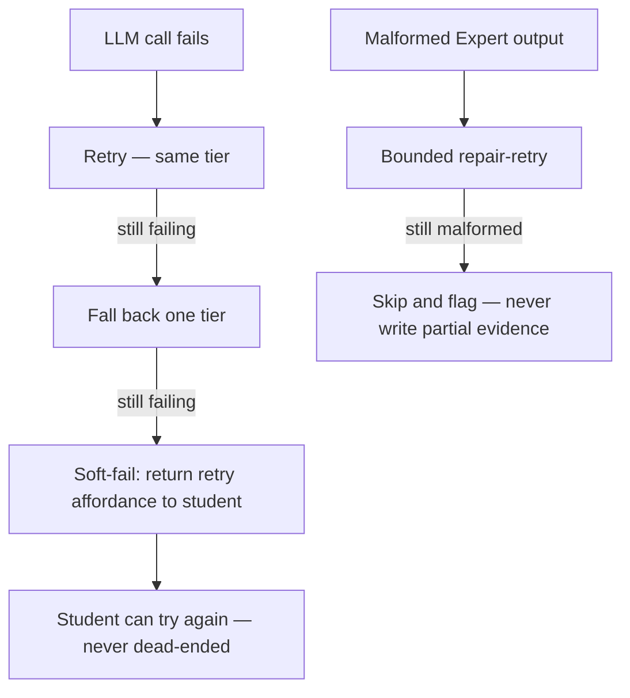

Cách Stemolly tiếp cận observability (khả năng quan sát) và resilience (khả năng chống chịu) dựa trên hai trụ cột bổ trợ lẫn nhau. Thứ nhất là structured, schema-enforced logging (ghi log có cấu trúc, được schema ràng buộc), giúp mọi request đều truy vết được — từ byte HTTP đầu tiên đến token LLM cuối cùng — bằng một bộ trường cố định đi cùng một đối tượng context tường minh. Thứ hai là chiến lược fault-tolerance (khả năng chịu lỗi) theo nhiều lớp, tách rõ những gì tuyệt đối không được mất (evidence log) khỏi những gì có thể suy giảm an toàn, và biến ranh giới đó thành điều được ép buộc bằng code thay vì chỉ là quy ước.

---

## Ghi log có cấu trúc: hợp đồng trường dữ liệu

Mọi dòng log trong hệ thống đều đi qua một logger dùng chung — `server/src/logger/index.ts`, chạy trên [Pino](https://getpino.io/) và tích hợp với logger có sẵn của Fastify. Điểm vào duy nhất này buộc toàn bộ hệ thống phải dùng cùng một bộ trường cố định.

**Bắt buộc trên mọi dòng:**

| Field | Mục đích |
|---|---|
| `timestamp` | Chuỗi ISO-8601 — thời điểm sự việc xảy ra |
| `level` | Nhãn chuỗi (`"info"`, `"warn"`, `"error"`) |
| `module` | Module nào phát ra dòng này |
| `event` | Tên sự kiện ổn định, máy đọc được |
| `traceId` | Gắn tất cả các dòng của một request lại với nhau |

**Trường tùy chọn:** `sessionId`, `jobId`, `durationMs`, `errorCode`, `statusCode`, `reqId`.
`statusCode` được error handler trộn vào. `reqId` được Fastify tự động gắn vào mọi dòng `request.log` — code ứng dụng không thể bỏ nó đi ở từng lần gọi.

**Trường bị cấm:** mọi trường mang PII (thông tin nhận dạng cá nhân) hoặc nội dung — `message`, `transcript`, `prompt`, `content`, cùng các khóa có hình dạng tương tự. Schema chủ động từ chối các khóa nội dung đã biết thay vì trông chờ từng call site phải nhớ một danh sách cho phép.

Bộ trường này được ép bằng một schema [Zod](https://zod.dev/) `.strict()` (`LogFieldsSchema`) và có unit test để kiểm tra theo đúng schema đó. Đi kèm là một rule ESLint (`no-console`) cấm `console.*` ở mọi nơi ngoài module `logger/`. Rule này là nửa kiểm soát ở tầng lint; bài test schema là nửa còn lại ở tầng runtime.

---

## Cấu hình `createLogger()` cho đúng

Thiết lập mặc định của Pino **không** đáp ứng `LogFieldsSchema`. Ở trạng thái mặc định, Pino:

- xuất `level` dưới dạng **số** (`30` cho info, không phải `"info"`)
- ghi timestamp dưới dạng **số nguyên epoch** ở khóa `time` (không phải `timestamp`)
- tự động chèn `pid` và `hostname` — hai khóa mà `.strict()` sẽ từ chối vì không nằm trong danh sách

Nếu giữ nguyên mặc định, `createLogger()` sẽ không thể tạo ra dù chỉ một dòng log hợp lệ theo schema. Lỗ hổng này đã âm thầm tồn tại một thời gian vì các bài test schema lại đưa vào những object dựng tay và một logger trong bộ nhớ được cấu hình riêng — chứ không phải đầu ra thật của logger đang chạy ngoài thực tế. Nó được phát hiện nhờ một lượt review độc lập, không phải nhờ test suite.

Vì vậy, `createLogger()` bắt buộc phải đặt **ba tùy chọn cụ thể**. Chỉ cần bỏ đi một trong ba là mọi dòng log trong hệ thống đều sẽ sai schema:

```ts
pino({
  base: null,                           // drops pid and hostname
  timestamp: () => `,"timestamp":"${new Date().toISOString()}"`,  // ISO string under the right key
  formatters: {
    level: (label) => ({ level: label }) // string label, not numeric level
  },
  // ...
})
```

Đây là các tùy chọn **mang tính sống còn**, không phải lựa chọn phong cách. Một lớp chặn hồi quy thường trực trong `server/src/logger/schema.test.ts` kiểm tra chính xác điều đó — phần tiếp theo giải thích guard này hoạt động ra sao.

---

## Kiểm thử logger thật: vì sao phải dùng subprocess

Pino ghi log ra file descriptor thông qua thư viện [sonic-boom](https://github.com/mcollina/sonic-boom), nên nó đi vòng qua `process.stdout.write` hoàn toàn. Monkey-patch hoặc spy vào `process.stdout` sẽ không bắt được gì. `createLogger()` cũng không cho phép tiêm một destination stream tùy ý.

Điều này có nghĩa là bất kỳ bài test nào muốn khẳng định **đầu ra thật của logger đang chạy thật** đều không thể chọn đường tắt trong cùng tiến trình. Bài test bắt buộc phải:

1. Viết một script nhỏ gọi `createLogger()` rồi phát ra một dòng log.
2. Chạy script đó như một child process (ví dụ `execFileSync` chạy `tsx`).
3. Phân tích stdout của nó và kiểm tra lại bằng `LogFieldsSchema`.

Đây chính là cách lớp chặn hồi quy được thêm vào sau vụ lệch nhau giữa schema và logger vận hành. Nếu cố tình bỏ `base: null` khỏi `createLogger()`, guard sẽ hỏng với lỗi `Unrecognized keys: "pid", "hostname"` — khoảng hở nay đã được khép lại và bảo vệ.

Bài học sâu hơn ở đây là: một bài test trong cùng tiến trình, tự dựng instance pino riêng và trỏ nó vào memory stream, thực chất đang kiểm tra một logger *khác*, chứ không phải logger production. Hai thứ đó hoàn toàn có thể trôi lệch khỏi nhau mà không ai nhận ra. Muốn kiểm tra đúng cái đang chạy thật, bạn cần một cơ chế khác.

---

## Truyền `traceId`: `RequestContext`

`traceId` của một request (cùng logger theo request, vốn đã có sẵn `traceId`) được mang đi trong một object duy nhất:

```ts
interface RequestContext {
  traceId: string;
  logger: Logger;
}
```

`RequestContext` này được luồn **tường minh** qua các tham số hàm — từ HTTP handler, qua sync-turn, rồi vào mọi checkpoint bất đồng bộ. Nó **không** được cất trong `AsyncLocalStorage` (ALS) của Node.

Đây là một quyết định có chủ ý. Luồn tham số tường minh khiến đường đi của context lộ rõ trong code; hàm nào cần `traceId` thì phải khai báo nó trong tham số. ALS che khuất luồng dữ liệu này, và còn có một kiểu lỗi đã biết: context có thể âm thầm rơi mất khi đi qua một số ranh giới bất đồng bộ nhất định (một số API dựa trên callback, listener của `EventEmitter`, và các mẫu tương tự có trước hợp đồng ALS). Cái giá phải trả là phải chuyền thêm một tham số dọc theo chuỗi lời gọi; đổi lại, việc thiếu `traceId` sẽ lộ ra thành lỗi kiểu ở thời điểm biên dịch, thay vì một bí ẩn khi chạy.

Error envelope được mô tả bên dưới cũng tự điền trường `traceId` từ chính context đã được truyền theo cách này.

---

## Một error envelope duy nhất

Mọi phản hồi lỗi từ server đều dùng chung một shape được định nghĩa trong gói contracts:

```json
{
  "error": {
    "code": "SESSION_NOT_FOUND",
    "message": "Human-readable fallback",
    "traceId": "abc-123",
    "details": { }
  }
}
```

Một vài quy tắc chi phối cấu trúc này:

- **HTTP status** mang nhóm phân loại rộng (4xx hay 5xx). Trường `code` mới là nơi chứa lý do cụ thể, ổn định và máy đọc được.
- **Văn bản hướng tới người dùng** không bao giờ được server gửi như văn xuôi tự do. Frontend sẽ bản địa hóa dựa trên `code`. Nhờ vậy server và UI luôn đồng bộ trên cả hai ngôn ngữ được hỗ trợ.
- **Các module miền nghiệp vụ ném typed error** và không đụng trực tiếp vào HTTP. Chỉ có **một** `setErrorHandler` của Fastify được phép chuyển lỗi thành phản hồi HTTP. Ngay cả lỗi kiểm tra dữ liệu riêng của Fastify (`FST_ERR_VALIDATION`) cũng đi qua đúng handler này và được ánh xạ sang `ValidationError` — không có nơi thứ hai nào tạo ra body lỗi.

### Lỗi LLM và provider

Lỗi của LLM và provider được xem là điều kiện dự kiến có thể xảy ra, không phải những cú sập bất ngờ. Gateway sẽ phân loại từng lỗi và loại bỏ PII trước khi truyền tiếp. Khi một lời gọi LLM thất bại, hệ thống sẽ leo thang theo trình tự đã định:



Khả năng fallback chéo giữa các provider được **bật mặc định cho Interface** (lượt hội thoại với người dùng) và **tắt mặc định cho Expert** (bước chấm điểm và ghi evidence, nơi tính nhất quán quan trọng hơn tính sẵn sàng).

---

## Khả năng chịu lỗi: bảo vệ, suy giảm, không bao giờ đẩy học sinh vào ngõ cụt

Job worker chạy các tác vụ bất đồng bộ (chấm điểm, ghi evidence) nằm **trong cùng tiến trình Node** với HTTP server. Đây là một lựa chọn kiến trúc có chủ đích ở quy mô cohort hiện tại — tách worker thành một tiến trình riêng được quản lý độc lập sẽ làm tăng độ phức tạp vận hành trước khi đội ngũ thực sự cần đến nó. Nhưng nếu một job hỏng nặng, trong tình huống xấu nhất nó vẫn có thể kéo sập cả tiến trình dùng chung. Chiến lược fault-tolerance ở đây không phớt lờ thực tế đó, mà biến bán kính ảnh hưởng thành thứ được nêu rõ và khống chế được.

Triết lý điều phối gồm ba phần:

1. **Bảo vệ thứ không thể thay thế.** Evidence log là append-only, idempotent, có transaction và có bản sao lưu. Không điều gì trên fast path được phép ghi evidence dở dang hoặc làm hỏng một bản ghi hoàn chỉnh.

2. **Cho phép suy giảm với thứ có thể phục hồi.** Fast path — phần học sinh trực tiếp nhìn thấy — có thể an toàn trả về một báo cáo cũ nhưng hợp lệ, hoặc soft-fail kèm khả năng thử lại. Học sinh không bao giờ bị chặn ở ngõ cụt.

3. **Để lỗi dừng ở mức lỗi đã bắt, không biến thành crash.** Mọi job handler đều được bọc lại để nếu handler ném exception, kết quả sẽ là một job failure chứ không phải cả tiến trình bị giết.

**Các thanh chắn an toàn hiện có:**

- Mọi job handler đều được bọc trong try/catch; lỗi không được xử lý sẽ được ghi nhận là job failure, không bị đẩy thẳng lên event loop.
- Các lời gọi LLM và từng job riêng lẻ đều có giới hạn thời gian; công việc bị treo sẽ bị hủy, không bị để mặc tiếp tục chặn.
- Các handler ở mức tiến trình cho `uncaughtException` và `unhandledRejection` sẽ ghi log sự kiện rồi thoát có kiểm soát để supervisor có thể khởi động lại.
- Tiến trình chạy dưới sự giám sát của một supervisor có chính sách tự khởi động lại; vì job là durable (được lưu trong cơ sở dữ liệu), khi tiến trình khởi động lại, phần việc đang dở cũng sẽ được tiếp tục.

Độ an toàn dữ liệu khi có crash là cao. Tính sẵn sàng hiện vẫn bị chặn bởi trần của mô hình một tiến trình, và điều đó được chấp nhận ở quy mô cohort hiện tại; khi đội ngũ vượt qua ngưỡng này, bước tiếp theo đã được ghi nhận rõ là tách worker ra thành tiến trình riêng.

---

## Đo đạc kiểu fire-and-forget: quy tắc `.catch()`

Module LLM phát ra sự kiện `'llm.response'` khi một lời gọi model hoàn tất. Một observer kết hợp sẽ lắng nghe sự kiện này, cộng tổng token, tính chi phí theo mức giá của tier, rồi gọi `metering.recordLlmCall(...)` — **cố ý không `await`**. Một lần ghi billing chậm hoặc lỗi không bao giờ được phép chặn hay làm hỏng lượt tương tác của học sinh.

Vấn đề là: chỉ thêm `void` vào một promise sẽ reject vẫn khiến lỗi nổi lên ở **cấp tiến trình** dưới dạng unhandled rejection. Đây không phải rủi ro lý thuyết. Khi wiring thật giữa provider và metering được ghép lại rồi chạy trong môi trường unit test không có cơ sở dữ liệu thật, lần ghi metering bị reject bất đồng bộ và **làm sập toàn bộ script `test:unit`** — mọi assertion đều pass, nhưng chính lượt chạy thì chết.

Cách sửa có hai phần:

```ts
// 1. Always .catch() at the source — a rejecting void is a process-level crash
metering.recordLlmCall(...).catch((err) => {
  // 2. Always log what you swallowed — silence means billing data disappears with no signal
  logger?.warn({ module: 'llm', event: 'metering.record_failed', purpose, agentRole }, err.message);
});
```

Quy tắc tổng quát là: **fire-and-forget là một lựa chọn hợp lệ về khả năng chống chịu cho telemetry, nhưng tuyệt đối không được biến thành “bắn đi rồi chẳng bao giờ biết chuyện gì xảy ra”.** Hãy `.catch()` ngay tại nguồn. Và hãy log thứ bạn đã nuốt.

> **Lưu ý:** Các dòng metering được tạo ra từ lần ghi này cũng chính là tín hiệu observability ở tầng vận hành cho mức dùng token và chi phí. Nếu lỗi bị nuốt mà không có dòng log nào, dữ liệu billing sẽ âm thầm biến mất — và đó chính là lý do vì sao dòng warn log là nửa còn lại, bắt buộc tương đương, của bản sửa này.
