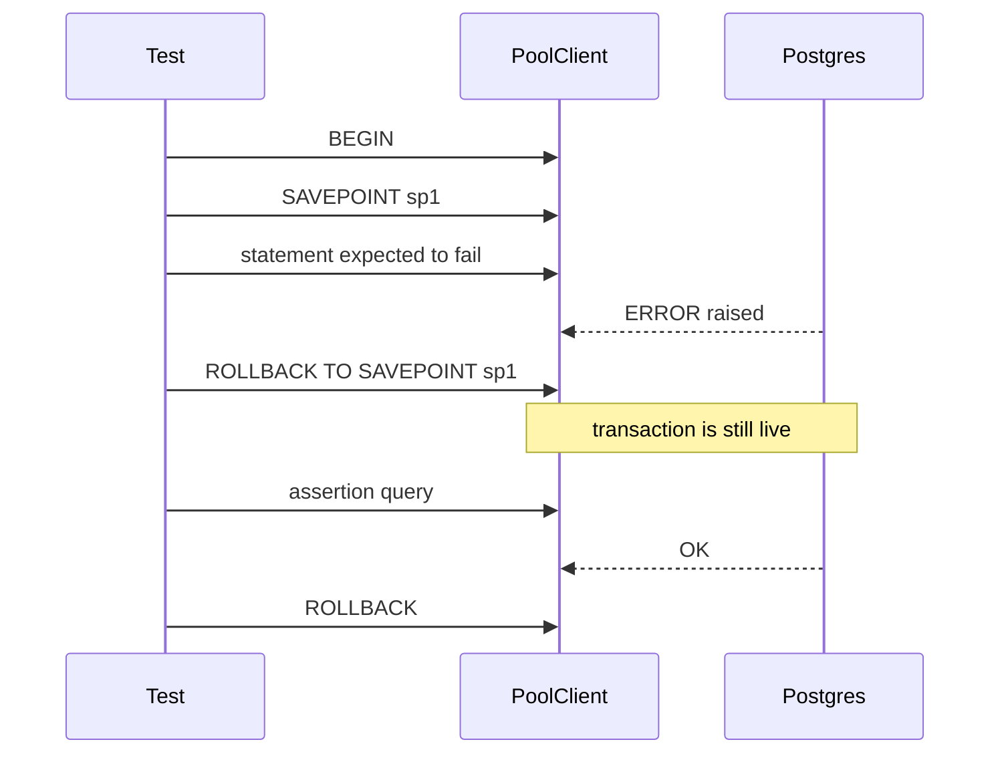
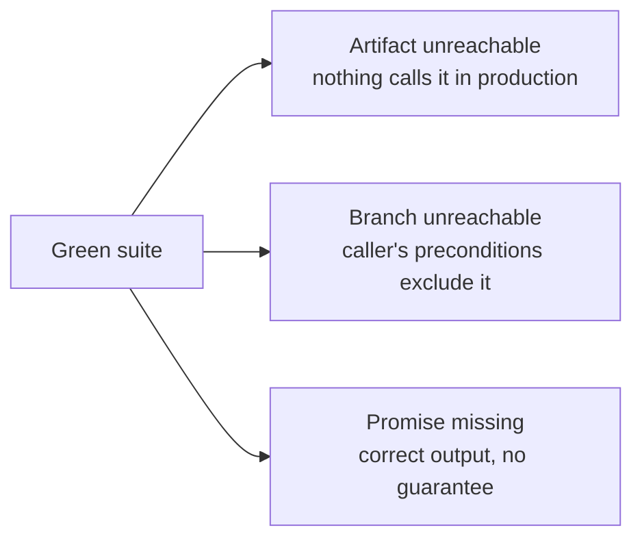

Chiến lược kiểm thử ở đây vận hành trên hai mặt trận. Fitness functions (các kiểm tra tự động cho quy tắc kiến trúc) chạy trong CI cùng với các bài test thông thường và được phát hành cùng chính phần mã mà chúng quản lý. Integration tests dùng cơ sở dữ liệu thật qua testcontainers, với các mẫu tổ chức giúp mỗi test vừa tách biệt vừa chạy nhanh. Cả hai lớp này đều có bẫy riêng. Trang này giải thích hạ tầng được dựng như thế nào, những gì có thể âm thầm xảy ra sai, và ba kiểu hỏng hóc mà dù toàn bộ suite vẫn xanh thì lỗi thật vẫn lọt qua.

## Fitness Functions: Được thực thi ngay lúc build

Một **fitness function** là bài test cho một quy tắc kiến trúc, thay vì cho một tính năng. Ví dụ: "không module nào được gọi nhà cung cấp LLM thật dưới `NODE_ENV=test`". Quy tắc nằm trong tài liệu governance; fitness function là phần mã sẽ làm build fail nếu quy tắc đó bị phá vỡ.

### Chúng đi cùng chính phần mã mà chúng quản lý

Nguyên tắc cốt lõi là: fitness function phải được giao trong cùng task với phần mã mà nó thực thi. Viết sau thì dễ dẫn đến việc chẳng bao giờ viết nữa. Viết trước thì không thể — bạn không thể kiểm tra một quy tắc áp lên phần mã còn chưa tồn tại. Ở Sprint 1, điều này ảnh hưởng trực tiếp đến thứ tự triển khai: kiểm tra dependency boundary xuất hiện cùng task dựng scaffold (vì boundary chính là scaffold), và mọi rail khác cũng đi cùng đối tượng của nó — kiểm tra error envelope đi với gói contracts, kiểm tra append-only trigger đi với Postgres, kiểm tra vendor confinement đi với module LLM.

Có những fitness functions được cố ý để ở trạng thái "nửa chừng" khi đối tượng của chúng mới chỉ được xây xong một phần. Kiểm tra process-failure handler ban đầu chỉ bao phủ phần HTTP, và sẽ bao phủ nốt phần job-handler khi job runner tồn tại. Như vậy là đúng — một nửa bài kiểm tra vẫn tốt hơn không có gì, và phần còn thiếu được nêu ra minh bạch.

### Cơ chế ép buộc mock-LLM

CI đặt `STEMOLLY_LLM_PROVIDER=mock` một cách tường minh — tuyệt đối không dựa vào giá trị mặc định. Sau đó, một bài test fitness function sẽ resolve adapter provider đã cấu hình dưới `NODE_ENV=test` và khẳng định đó không phải `anthropic`, `openai`, hay `google`. Mục đích của kiểm tra này là rất rõ ràng: nếu một biến môi trường cấu hình sai có thể âm thầm bật vendor thật trong CI, bài test này sẽ làm build fail thay vì để chuyện đó xảy ra.

```bash
# .env.test (or CI environment)
STEMOLLY_LLM_PROVIDER=mock   # explicit, not a default
```

### Những gì fitness function không nhìn thấy được

Fitness function kiểm tra một *cơ chế*, chứ không kiểm tra toàn bộ ý đồ mà nó được viết ra để thực thi. Khi cơ chế đó hẹp hơn bản thân quy tắc, những vi phạm không đụng vào cơ chế ấy vẫn sẽ qua cửa an toàn.

Hai ví dụ đã được ghi nhận, và cả hai đều do con người phát hiện qua review chứ không phải CI:

- **G-18 (config discipline).** Quy tắc nói rằng: chỉ đọc cấu hình ở một chỗ rồi inject đi mọi nơi khác. Kiểm tra lint gắn cờ `process.env` ở ngoài `config.ts` và `composition.ts`. Nó bắt được các lần đọc env trực tiếp. Nhưng nó không nhìn ra một giá trị policy bị viết cứng thành hằng số trong domain layer — vì ở đó không có `process.env` nào để gắn cờ.

- **`domain-no-adapters-import`** (hexagonal boundary). Điều kiện trong dependency-cruiser chỉ khớp các file nằm dưới `domain/`. Một file ở root của module mà import chính adapters của nó thì nằm ngoài mẫu `from`, nên vẫn qua được.

Khi ghép một quy tắc với một rail, điều cần làm là: **gọi tên rõ những gì rail đó không thể nhìn thấy, và ghi lại khoảng trống ấy cạnh quy tắc.** Một kiểm tra quá hẹp có thể khiến reviewer ít để ý hơn tới những hình thái lỗi mà nó bỏ sót; khi đó nó tiêu tốn sự chú ý thay vì mua thêm sự an tâm.

---

## Hạ tầng Integration Test

Mỗi file test có một Postgres testcontainers riêng. Migrations chạy một lần trong `beforeAll`; mỗi test chạy bên trong `BEGIN` (beforeEach) / `ROLLBACK` (afterEach). Nhờ vậy, cơ sở dữ liệu được reset rẻ sau từng test mà không phải chạy lại migrations.

### Mẫu SAVEPOINT cho các lỗi được mong đợi

Postgres sẽ hủy bỏ toàn bộ transaction bao quanh khi bất kỳ câu lệnh nào ném lỗi — `RAISE` từ trigger, lỗi unique constraint, hay bất cứ gì tương tự. Một test cố ý gây lỗi rồi chạy thêm một assertion phía sau (ví dụ để kiểm tra dòng dữ liệu vẫn không đổi) sẽ không fail theo kết quả assertion thật, mà fail với lỗi *"current transaction is aborted"*.

Cách sửa là dùng helper dùng chung `expectRejected(client, fn)`, bọc phần lỗi được mong đợi bằng `SAVEPOINT` / `ROLLBACK TO SAVEPOINT`:



Có hai điểm quan trọng trong chữ ký của helper này:

1. **Nó nhận `PoolClient`, không phải `Pool`.** Một transaction của Postgres gắn với đúng một kết nối vật lý. `Pool` có thể cấp ra kết nối khác nhau cho từng lần gọi `.query()`, vì vậy `SAVEPOINT` và `ROLLBACK TO SAVEPOINT` có thể rơi vào hai kết nối khác nhau rồi hỏng. Mọi câu lệnh mang tính transaction trong một test — `BEGIN`, cặp SAVEPOINT, assertions và `ROLLBACK` cuối cùng — đều phải chạy trên cùng một client đã được checkout.

2. **Một test tuần tự vẫn có thể âm thầm pass nhờ may mắn.** Khi các test dùng chung một kết nối, pool sẽ không bao giờ phải phát sang kết nối thứ hai nên lỗi này bị che mất. Phân biệt kiểu `Pool` với `PoolClient`, cùng code review, sẽ bắt được nó; một lần chạy test xanh thì không.

### Metering tests: không transaction, không cleanup

Phần ghi metering là fire-and-forget trên kết nối pooled riêng của nó. Nó được ghi *ra ngoài* mọi transaction theo từng test. Việc rollback transaction của test sẽ không xóa dòng dữ liệu đó. Cách lùi dễ nghĩ ra nhất — `DELETE FROM metering.llm_calls WHERE ...` trong `afterEach` — cũng bị chặn, vì append-only trigger từ chối `DELETE` y như nó từ chối `UPDATE`.

Lời giải là khoanh phạm vi bằng chính đồng hồ của cơ sở dữ liệu.

```ts
// capture a timestamp before the request
const { rows } = await client.query("SELECT NOW() AS since");
const since = rows[0].since;

// after the request, count only rows in this test's window
await poll(() =>
  client.query(
    "SELECT COUNT(*) FROM metering.llm_calls WHERE created_at >= $1",
    [since]
  )
);
```

Vì các test chạy tuần tự trên một container, sẽ không có ghi nào khác rơi vào cửa sổ này, nên không bao giờ cần cleanup. Và vì đây là kiểu fire-and-forget, hãy poll với một deadline ngắn thay vì chỉ đọc một lần — dòng dữ liệu có thể đến sau khi HTTP response đã trả về. Đừng chuyển sang chiến lược giữ transaction mở hoặc dùng `DELETE`; ở đây không có lựa chọn nào trong hai cách đó khả dụng.

### Playwright e2e harness: ghi nhận handle ngay lập tức

`globalSetup` của Playwright khởi động một Postgres testcontainers, dựng `AppContext`, rồi bật server. Nó phải ghi từng resource handle vào singleton teardown dùng chung **ngay tại thời điểm resource đó được tạo ra**, chứ không phải đợi đến cuối setup. Nếu setup ném lỗi ở giữa chừng, bất kỳ thứ gì chưa được ghi nhận sẽ vô hình với teardown và bị rò rỉ.

:::note
`globalTeardown` của Playwright vẫn chạy ngay cả khi `globalSetup` ném lỗi. Runner đăng ký teardown của từng task trước khi gọi setup của task đó, nên một setup thất bại không thể khiến teardown của chính nó bị bỏ qua. Điều này đã được kiểm chứng với `playwright@1.61.1`. Nếu một bản nâng cấp sau này đổi thứ tự đó — hoặc nếu harness chuyển sang kiểu `globalSetup` trả về teardown function — thì mẫu gán-ngay-lập-tức này sẽ âm thầm biến thành thứ chỉ để trang trí.
:::

Ryuk reaper của testcontainers cuối cùng sẽ thu dọn các container bị rò rỉ, nhưng đó là cơ chế không tất định. Nó chỉ giới hạn mức độ rò rỉ ở mức "rồi cũng sẽ bị dọn", chứ không bảo đảm "không có rò rỉ" — nó không thể thay thế cho một đường `stop()` tường minh.

---

## Những cái bẫy về tính cô lập

Ba mẫu lỗi khiến tính cô lập của test bị phá vỡ một cách âm thầm, và kết quả là test hoặc fail vì sai lý do, hoặc pass vì sai lý do.

### Cái bẫy composition root

Một test tự dựng Fastify instance tối giản của riêng nó để mount route trong trạng thái cô lập sẽ nhận các giá trị mặc định của framework, chứ không phải cấu hình production. Route ấy vì thế chạy trong một môi trường khác với production — dù từ góc nhìn của test, trông vẫn giống hệt.

Có hai thiết lập được chứng minh là then chốt khi route được remount theo cách này:

- Decoration `traceId` và hook `onRequest` của nó phải được thêm lại, vì error handler đọc `request.traceId`. Thiếu chúng, response lỗi sẽ hỏng.
- `ajv: { customOptions: { coerceTypes: false } }` phải được áp lại. Nếu không, Fastify sẽ ép số `123` thành chuỗi `"123"` trước khi schema validation chạy. Một test vốn định khẳng định body sai định dạng phải trả về 400, rốt cuộc lại quan sát thấy 200 — test **pass vì sai lý do** và không còn bảo vệ được điều gì nữa.

Harness cô lập chỉ thừa hưởng những gì nó tự viết lại một cách tường minh. Khi dựng kiểu harness này, hãy đọc composition root và sao chép các tùy chọn khởi tạo của nó một cách có chủ đích. Mọi assertion về input sai định dạng cũng nên được xác nhận lại rằng nó vẫn fail khi mã production thực sự bị phá.

### Bán kính ảnh hưởng của guard ở plugin scope

Một guard được hook ở plugin scope sẽ áp lên mọi request đi tới namespace đó, bao gồm cả request do test phát ra. Khi ấy, mọi test hiện có mà dựng ứng dụng thật rồi inject request vào route trong namespace đó sẽ không còn nhận response của chính route nữa, mà nhận denial của guard. Test suite báo có regression ở route trong khi route không hề bị đụng tới và vẫn đúng.

Cách sửa là tách mối quan tâm ra: test route trên một Fastify instance trần không có guard, và viết một test riêng cho guard. Nếu chỉ đổi expected status code của test sang mã denial, bạn sẽ âm thầm đánh mất toàn bộ phần coverage ban đầu dành cho route đó.

:::caution
Bán kính ảnh hưởng này rất dễ bị đánh giá thấp. Trên thực tế, cùng một va chạm như vậy đã xuất hiện trong unit test, integration test và e2e spec cùng chạy một path. Chỉ unit test được phát hiện trong lúc lập kế hoạch — các file integration bị loại khỏi lệnh kiểm tra cục bộ, còn harness e2e là một lần chạy riêng. Kiểm tra cục bộ đều xanh; CI sẽ chỉ fail khi merge.

Khi thêm guard vào một namespace, hãy tìm mọi test đang lái bất kỳ route nào trong namespace đó — không chỉ những test mà lệnh kiểm tra hiện tại chạm tới.
:::

### Việc thay thế rule trong ESLint flat-config

Trong định dạng flat config của ESLint, khi hai object cấu hình cùng đặt một rule id và cùng khớp một file, giá trị của cấu hình đến sau sẽ **thay thế** cấu hình đến trước — các mảng selector không được merge.

Điều này đã làm hỏng rule barrel-only G-17: nó tái sử dụng `no-restricted-syntax`, và `files: ['**/index.ts']` của nó chồng lên block config-discipline sẵn có với `files: ['server/src/**/*.ts']`. Việc thêm G-17 đã âm thầm vô hiệu hóa ràng buộc `process.env` với mọi `index.ts` trong `server/src/**`. Từng rule riêng lẻ đều hợp lệ; ESLint không báo lỗi gì. Regression chỉ bị phát hiện khi có người đọc lại diff theo hướng phản biện.

Cách sửa là: khi hai ràng buộc cần cùng áp lên một tập file dưới cùng một rule id, hãy gộp chúng thành nhiều object selector trong một mảng duy nhất, nằm trong một block config duy nhất — tuyệt đối không tách thành các block riêng.

---

## Ba kiểu hỏng hóc mà một suite xanh không nhìn ra được

Một suite xanh có nghĩa là hành vi được test là đúng — chứ không có nghĩa cả hệ thống là đúng. Có ba cách sai khác nhau về mặt cấu trúc khiến hai điều đó tách rời nhau.



### 1. Artifact xanh nhưng chẳng có gì gọi tới nó

Unit test xác minh một artifact theo đúng contract của riêng nó. Về mặt cấu trúc, nó không thể nhận ra rằng trong hệ thống production chẳng có gì gọi artifact đó, hoặc bên sinh dữ liệu thật lại đưa cho nó input khác với fixture trong test. Test và artifact thống nhất với nhau, rồi có thể cùng nhau trôi xa khỏi hệ thống mà chúng phục vụ — trong khi suite vẫn xanh.

Hai trường hợp ở Sprint 1 đã được giao trong đúng hình thái này:

- Một bộ phân giải chọn model (`resolveTier()`) đã được triển khai, có test, nhưng không có caller nào trong production. Tier và purpose trên thực tế không hề tham gia chọn model. (Sau đó việc này đã được nối vào call path production.)
- Một bộ kiểm định schema log (`LogFieldsSchema`) không thể kiểm định nổi dù chỉ một dòng log thật. Test của nó chỉ đưa vào các object tự dựng; logger pino thật lại phát ra shape khác.

Mỗi cổng kiểm tra tự động đều bỏ sót chuyện này theo cách riêng: unit tests chỉ chứng minh artifact hoạt động, chứ không chứng minh nó được dùng; dependency-cruiser chỉ kiểm tra các cạnh phụ thuộc đang tồn tại có hợp lệ hay không, chứ không kiểm tra các cạnh bắt buộc có tồn tại hay không; typechecking vẫn hài lòng với một symbol được export mà chẳng ai import; còn diff review thì nhìn thấy một module cộng với test đang pass và dễ đọc nó như thể đã hoàn chỉnh.

Một kiểm tra CI rẻ — fail khi một symbol export mà chỉ có `*.test.ts` import — sẽ bắt được trường hợp module không thể với tới. Nhưng nó không bắt được trường hợp sai fixture, khi artifact có được import và dùng thật nhưng không bao giờ được cho thấy output của producer thật. Cả hai trường hợp ban đầu đều do con người phát hiện khi chạy mã thật trong một vòng review bên ngoài.

**Khoảng trống coverage của MCP adapter là một biến thể rất cụ thể của mẫu này.** Shared result wrapper trong `mcp/src/mcp-server.ts` nằm trên đường trả về của mọi tool đã đăng ký. Một test suite lái một SDK transport thật nhưng với engine giả; suite còn lại thì chạm được Postgres thật nhưng gọi trực tiếp các factory của tool-handler, bỏ qua wrapper. Tại thời điểm lỗi được tìm ra, có 8 tool đã được đăng ký và chỉ 1 tool từng được gọi qua transport thật. Line coverage vẫn hiện như "đã bao phủ đầy đủ" vì wrapper xử lý cả N tool trong một biểu thức.

Bài học còn nguyên giá trị sau khi đã sửa xong là: **hãy đếm coverage trên bề mặt tool đã khai báo** — có bao nhiêu tool đã đăng ký thực sự từng được gọi qua transport thật — chứ không phải đếm theo số dòng.

### 2. Hàm có được gọi nhưng các nhánh của nó là bất khả đạt

Lần theo một acceptance criterion tới call path production chỉ xác nhận rằng một symbol có được gọi. Nó không xác nhận rằng các tiền điều kiện của caller có cho phép mọi nhánh trong hàm đó thực thi hay không.

Trường hợp cụ thể ở đây: một helper trong domain phân loại lý do vì sao redeem token thất bại. Đến lúc nó được gọi, record chắc chắn đã là already-redeemed hoặc expired — bởi record được fetch bằng cách match đúng cái hash đó, nên nhánh token-mismatch là bất khả thi. `return record.role` là bất khả đạt. Trong hệ thống đang chạy, helper này luôn luôn throw. Happy path của nó chỉ được chạy bởi chính unit test của nó — xanh, nhưng bất khả đạt, nằm bên trong một hàm mà trace acceptance criterion của nó trước đó đã được xác minh và đánh dấu xong.

Kiểm tra rẻ ở đây là: khi một đường trace kết thúc ở một hàm trả về giá trị, hãy đọc các guard của nó đối chiếu với tiền điều kiện của caller. Nếu mọi đường đi đều bảo đảm sẽ throw, hoặc nếu một guard đang kiểm tra lại điều mà caller đã thiết lập sẵn, thì contract được khai báo và hành vi runtime thực tế đang khác nhau. Một helper chỉ được dùng để ném exception thì nên nói rõ điều đó — không cần return type, cũng không cần những tham số mà nó thực ra không dùng tới.

### 3. Output đúng nhưng lời hứa thì chưa từng được đưa ra

Một test assert trên output. Vì vậy, về mặt cấu trúc nó sẽ mù trước một lỗi mà output hiện tại tình cờ đang đúng, còn output tương lai thì đơn giản là *chưa từng được hứa*. Một truy vấn SQL không có `ORDER BY` vẫn trả các dòng theo thứ tự chèn trên một bảng nhỏ, gần như là mọi lần. Mọi test về tính tất định đều pass một cách hoàn toàn trung thực. Nhưng bảo đảm mà các test đó tưởng như đang kiểm tra thì thực ra không tồn tại. Nó chỉ lộ ra sau này — ở quy mô lớn, khi có parallel scan hoặc query plan đổi khác — trong production.

Điều này khác với hai mẫu trước. Artifact có được gọi, trên đúng call path production, và trả về đáp án đúng. Không có assertion output bổ sung nào có thể lấp được khoảng trống đó, vì bản chất của lỗi là *thiếu một ràng buộc*, chứ không phải có mặt một giá trị sai.

Từ đó kéo theo hai hệ quả cho cách engine này được kiểm chứng. Thứ nhất, những lỗi mang hình dạng này được tìm ra bằng cách đọc mã và hỏi hệ thống *hứa điều gì*, chứ không phải bằng cách chạy nó. Thứ hai, regression test tự nhiên cho kiểu này lại đảo ngược lời khuyên thông thường: **hãy assert vào cơ chế**, không phải hành vi. Hãy chụp chính câu SQL được gửi đi và assert rằng mệnh đề sắp xếp có mặt. Cách này cố ý mong manh — nó sẽ gãy với bất kỳ lần viết lại nào, kể cả viết lại đúng — và điều đó được chấp nhận như cái giá phải trả để ghim chặt một lời hứa vốn không có triệu chứng quan sát được.

---

## Review lấp phần khoảng trống còn lại

Code reviewer tự động ở đây chủ ý loại trừ các đánh giá về coupling, encapsulation và vị trí cấu trúc — những thứ này thuộc về designer. Rubric phản biện của designer chấm các mục như độ bao phủ yêu cầu, độ rõ ràng của interface, tính soundness, các phương án thay thế và độ đơn giản — nhưng lại không có tiêu chí nào cho coupling hay độ đầy đủ về cấu trúc.

Vì vậy trong vòng lặp tồn tại một điểm bàn giao rõ ràng, nhưng rubric ở phía nhận lại không có tiêu chí cho chính thứ đã được bàn giao. Cả hai tác nhân đều đang hành xử đúng theo contract riêng của mình; chỉ là phát hiện đó không thuộc sở hữu của ai. Điều khoản loại trừ này chỉ còn hợp lý chừng nào phía nhận được nêu tên thực sự có kiểm tra. Đó là điều kiện tiên quyết để tiếp tục giữ điều khoản ấy.

:::tip
Ba mẫu "xanh nhưng sai" cùng với khoảng trống trong review đều dẫn về cùng một thói quen phòng thủ: khi kiểm chứng, hãy hỏi **"acceptance criterion này có lần ra được tới một call path production không?"** thay vì **"nó có test chống lưng không?"**. Một dấu tick xanh cho acceptance criterion là một khẳng định yếu hơn hẳn so với "hệ thống đang chạy thực sự làm điều này". Muốn có khẳng định mạnh hơn, phải lần theo đường đi, đọc các tiền điều kiện và hỏi đoạn mã thực sự hứa điều gì — chứ không chỉ chạy suite.
:::
