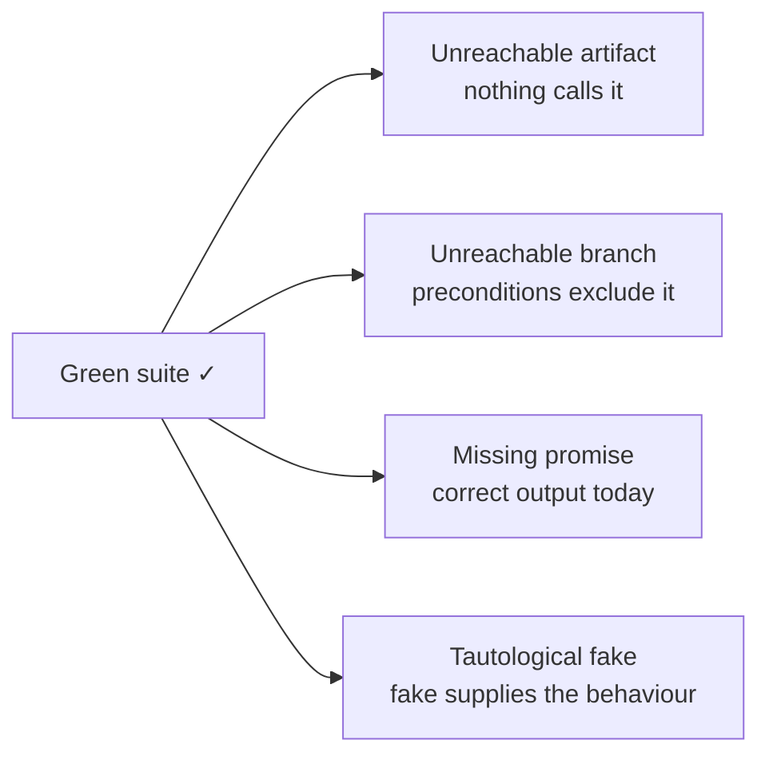
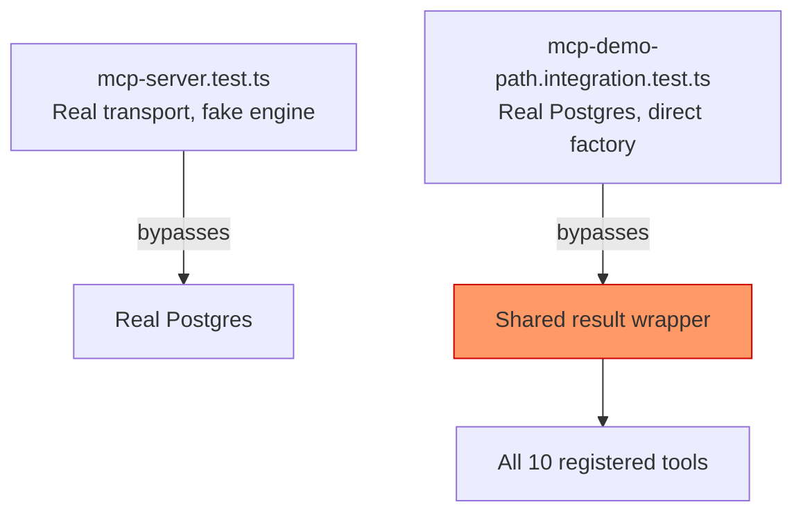
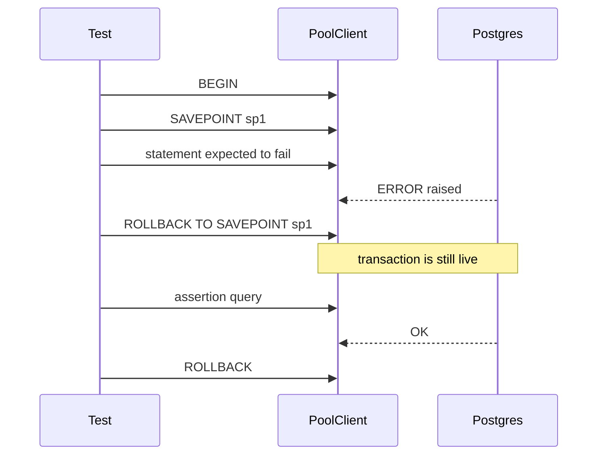

Trong Stemolly, kiểm thử không chỉ là làm cho một bộ test chạy xanh. Dự án coi **fitness functions** (các quy tắc thực thi dùng để kiểm tra những thuộc tính kiến trúc) là một phần bàn giao hạng nhất, và có một quy tắc rất cụ thể về thời điểm chúng được viết. Trang này giải thích triết lý đó, các ràng buộc CI phụ thuộc vào nó, những kiểu hỏng hóc đã biết vẫn qua được một lần chạy xanh, và các mẫu thực hành giúp những bài test dựa trên testcontainers vận hành ổn định.

## Fitness Functions được giao cùng với chính đối tượng của chúng

Một fitness function chỉ có ý nghĩa khi phần mã mà nó quản đã tồn tại. Vì vậy, mỗi fitness function được viết ngay trong cùng task tạo ra phần mã mà nó bao phủ — chứ không nằm trong một "giai đoạn governance" tách rời được làm trước.

Trong thực tế, điều này có nghĩa là kiểm tra **dependency-boundary check** (kiểm tra ranh giới phụ thuộc) G-1 được giao đầu tiên cùng task scaffold — bởi scaffold *chính là* cấu trúc. Mọi rào chắn khác cũng đi cùng đối tượng của nó: kiểm tra hình dạng error-envelope với package `contracts`, kiểm tra append-only trigger với phần thiết lập Postgres, kỷ luật ghi log với logger, vendor confinement và gateway assertions với module `llm`, và phạm vi bao phủ fail-safe handler với echo-turn handler.

Một số fitness functions được cố ý để ở trạng thái "nửa chừng" khi đối tượng đầy đủ của chúng vẫn chưa tồn tại. Phần kiểm tra dành cho job-handler của quy tắc fail-safe sẽ chờ job runner. Đó là chủ ý — một nửa bài kiểm tra vẫn tốt hơn không có gì, và khoảng trống được nêu ra tường minh thay vì âm thầm bị bỏ sót.

## CI tuyệt đối không được gọi LLM thật

Không một bài test tự động nào được phép gọi một nhà cung cấp LLM thật. Điều này được hiện thực hóa bằng một kiểm tra CI cụ thể, chứ không phải một quy ước ngầm hiểu.

Một bài test đặt cùng package `llm` sẽ resolve provider adapter đã cấu hình dưới `NODE_ENV=test` và khẳng định kết quả phải là `mock` hoặc `ollama`. Nếu là `anthropic`, `openai`, hoặc `google`, CI sẽ fail ngay. `STEMOLLY_LLM_PROVIDER=mock` là biến môi trường được khai báo tường minh cho CI — tuyệt đối không phải một giá trị mặc định âm thầm.

:::caution
Nếu biến môi trường bị cấu hình sai, quy tắc chỉ-dùng-mock có thể bị vô hiệu hóa một cách lặng lẽ. Fitness-function test này tồn tại chính để làm cho lỗi đó lộ ra ồn ào, chứ không vô hình.
:::

## Nhóm lỗi "xanh nhưng sai"

Nhận định quan trọng nhất về kiểm thử trong codebase này là: một bộ test xanh hoàn toàn là một bảo đảm yếu hơn nhiều so với vẻ bề ngoài của nó. Đã có bốn kiểu hỏng hóc khác nhau cùng sống sót qua một lần chạy xanh, và chỉ bị phát hiện khi có người thực sự đọc mã.



Cả bốn đều có chung một đặc điểm: assertion của bài test được thỏa mãn một cách hoàn toàn trung thực, nhưng thứ mà nó *có vẻ như* đang xác minh thì trên thực tế lại không hề được xác minh.

### Kiểu 1 — Artifact không thể với tới

Một artifact được triển khai, được test, và chạy xanh, trong khi không có gì trong hệ thống gọi đến nó. Hai ví dụ ở Sprint 1:

- `resolveTier()` được unit-test rất đầy đủ nhưng không có caller nào trong production, nên tier/purpose thực tế không hề chọn model. Về sau nó mới được nối vào.
- `LogFieldsSchema` có test, nhưng test của nó chỉ đưa vào các object tự dựng — logger `pino` thật không bao giờ tạo ra output theo hình dạng đó.

**Vì sao từng cổng kiểm tra đều bỏ sót:** unit test chỉ chứng minh artifact hoạt động, chứ không chứng minh nó được dùng; dependency-cruiser chỉ kiểm tra rằng các cạnh phụ thuộc hiện có là hợp lệ, chứ không kiểm tra rằng các cạnh bắt buộc đã tồn tại; typecheck vẫn thỏa mãn với một symbol được export mà chẳng ai import; còn review theo diff thì thấy một module cộng với test đang pass và dễ đọc nó như thể đã hoàn chỉnh.

Một kiểm tra CI rẻ tiền — fail khi một symbol export mà kẻ import duy nhất của nó là `*.test.ts` — sẽ bắt được trường hợp module không thể với tới. Nó không bắt được trường hợp sai fixture, tức là artifact có được import nhưng chưa bao giờ được cho thấy output của producer thật.

### Kiểu 2 — Nhánh không thể tới bên trong một hàm có thể tới

Lần theo một **acceptance criterion** (tiêu chí chấp nhận) tới một call path trong production chỉ xác nhận rằng một hàm có được gọi. Nó không xác nhận rằng các tiền điều kiện của caller có cho phép mọi nhánh bên trong hàm đó thực thi hay không.

Trường hợp cụ thể ở đây: một helper trong domain phân loại lý do vì sao việc redeem token thất bại. Đến lúc nó chạy, record nhất định đã là already-redeemed hoặc expired — hàng dữ liệu được truy ra bằng cách match đúng cái hash đó, nên nhánh token-mismatch là bất khả thi. Đường `return record.role` là không thể với tới. Trong hệ thống đang chạy, helper này luôn luôn throw. Nhánh thành công của nó chỉ được chạy bởi chính unit test của nó — xanh, nhưng không thể tới, nằm bên trong một hàm mà đường trace từ acceptance criterion tới đó đã được đánh dấu xong từ trước.

**Kiểm tra rẻ:** khi một đường trace kết thúc ở một hàm có trả về giá trị, hãy đọc các guard của nó đối chiếu với tiền điều kiện của caller. Nếu mọi đường đi thực tế đều bảo đảm sẽ throw, thì contract được khai báo và hành vi runtime thật đang khác nhau.

### Kiểu 3 — Output đúng, nhưng thiếu cam kết

Một bài test assert trên output. Về mặt cấu trúc, nó mù trước một lỗi mà output hiện tại là đúng, nhưng output tương lai chỉ đơn giản là *chưa từng được bảo đảm*.

Trường hợp điển hình: một truy vấn SQL không có `ORDER BY`. Trên một bảng nhỏ, database gần như lần nào cũng trả hàng theo thứ tự chèn, nên mọi bài test về tính tất định đều pass một cách trung thực — trong khi cam kết mà các bài test đó tưởng như đang kiểm tra lại không hề tồn tại. Nó chỉ hỏng về sau, ở quy mô lớn, khi có parallel scan hoặc query plan thay đổi, trong production.

Kiểu này khác với hai kiểu trước. Artifact có được gọi trên đúng đường đi production, trả về đáp án đúng, và không có thêm assertion output nào có thể lấp được khoảng trống — bởi lỗi ở đây là *sự vắng mặt của một ràng buộc*, chứ không phải sự hiện diện của một giá trị sai.

Bài regression test tự nhiên cho trường hợp này cố ý **assert vào chính cơ chế**: bắt lấy câu SQL thực sự được gửi đi rồi khẳng định rằng mệnh đề sắp xếp có mặt. Kiểu test này mong manh một cách có chủ đích — nó sẽ gãy với bất kỳ lần viết lại nào, kể cả lần viết lại đúng. Điều đó được chấp nhận như cái giá phải trả để ghim chặt một lời hứa vốn không có triệu chứng đầu ra nào quan sát được.

### Kiểu 4 — Fake tự chứng minh chính nó

Khi một unit test thay thế một dependency bằng một fake viết tay, và hành vi đang được kiểm thử *chính là tính đúng đắn của dependency đó*, bài test trở thành một phép lặp lại đồng nghĩa.

Trường hợp điển hình trong danh mục: bản sửa lỗi cần kiểm chứng là việc tra slug phải được giới hạn theo kind. Fake repository trong unit test đã trả lời theo kind — đúng, nhưng là đúng bằng tay. Vì vậy, mệnh đề "một misconception bị rejected không chặn một pattern có cùng slug" vẫn đúng dù cho tra cứu trong production có thực sự được giới hạn hay không. Assertion pass là nhờ fake, không phải nhờ mã.

Mệnh đề thật mà kiểu test này có thể chứng minh hẹp hơn nhiều: nó chỉ chứng minh caller *chuyển tiếp đối số đi*, và không hơn. Mệnh đề về hành vi phải được kiểm chứng trên implementation thật — ở đây là Postgres thật đi qua điểm vào của module, với mã trước khi sửa tạo ra một lần đỏ thực sự.

:::tip
Dấu hiệu của một fake tự chứng minh chính nó là: fake và production adapter sẽ phải **bất đồng** thì bài test mới chuyển đỏ. Nếu chúng không bao giờ có thể bất đồng, bài test đang kiểm tra plumbing chứ không phải hành vi.
:::

## Acceptance Criteria như một điểm mù

Mọi cổng kiểm tra nằm sau một work item đều lấy acceptance criteria làm chân lý nền. Đó chính là điều khiến chúng trở thành các "gate" — và cũng có nghĩa là một tiêu chí bị đặc tả thiếu sẽ tạo ra một lần chạy sạch sẽ.

Trường hợp được ghi nhận: một tiêu chí viết rằng "throws when the slug resolves to a rejected entry" nhưng không bao giờ chốt xem slug có được giới hạn theo kind hay không. Implementation chọn một cách hiểu, test mã hóa cách hiểu đó, và cả hai vòng review đều xác nhận mã có thể với tới và được đặt đúng chỗ. Sự lệch pha về phạm vi nằm ngoài mọi câu hỏi đang được đặt ra. Nó chỉ bị phát hiện khi có người đọc phần mã đã giao đối chiếu với schema.

Một hồ sơ gate sạch sẽ đo xem công việc đó khó đến đâu, chứ không đo nó có khả năng sai đến mức nào. Một task sai một cách đầy tự tin sẽ tạo ra một danh sách cờ rỗng. Đến lúc review, acceptance criterion đáng được đọc lại bằng câu hỏi: *caller kế tiếp cần gì, và cách diễn đạt này có để lại cho họ một con đường an toàn để đạt được điều đó hay không?*

## Những khoảng trống của Fitness Function

Một fitness function có thể trông như đang bao phủ một quy tắc, trong khi thực ra vẫn để một phần của quy tắc đó không được canh giữ. Đã quan sát thấy ba mẫu như vậy.

### Một kiểm tra quá hẹp so với chính quy tắc của nó

Một quy tắc nêu ra một ý định; fitness function của nó kiểm tra một cơ chế cụ thể. Khi cơ chế đó hẹp hơn ý định, mọi vi phạm không đụng tới cơ chế ấy đều vẫn chạy xanh — và một reviewer nhìn thấy huy hiệu xanh lại *ít* có khả năng đi tìm những hình dạng lỗi mà nó không thể phát hiện hơn.

Hai ví dụ:

- **G-18 (config discipline)** gắn cờ `process.env` ở ngoài `config.ts` và `composition.ts`. Một giá trị policy bị viết cứng thành hằng số — như TTL của invite-token trong lớp pure domain — không chứa `process.env` nào, nên hoàn toàn vô hình.
- **`domain-no-adapters-import`** có mệnh đề `from` chỉ áp cho các thư mục con dưới `domain/`. Một file ứng dụng nằm ở gốc module mà import chính adapters của nó thì nằm ngoài mệnh đề đó và vẫn qua được.

Kiểm tra có thể khái quát được ở đây là: hãy gọi tên những gì cái rail đó *không thể nhìn thấy*, rồi ghi lại khoảng trống đó cạnh quy tắc.

### Việc thực thi một ADR bị để lại thành "việc tương lai"

ADR-023 đã nêu rõ việc `metering/module.ts` import `PgMeteringRepository` của chính nó, và yêu cầu bỏ import đó. Mười hai ngày sau, import ấy vẫn còn đó và chỉ bị phát hiện trong một vòng review không liên quan.

Lý do nó sống sót được: ADR-023 mô tả lõi module như một danh sách tên file, khiến việc thực thi trở thành nghĩa vụ theo từng file. Quy tắc `domain-no-adapters-import` đã bao phủ `domain/`; còn quy tắc bổ sung cho `module.ts` thì được nhắc ngay trong phần "Enforcement blind spot" của chính ADR-023 như một thứ "có thể" viết, và rồi không bao giờ được viết. Repo engine PoC có nó; repo `app` thì không, và chẳng có gì làm lộ ra sự bất đối xứng đó.

Mục "future work" của một ADR không phải là một cam kết được theo dõi. Không có gì fail khi nó không được thực hiện, nên ADR trông như đã được thực thi trong khi thực ra không phải.

### Việc thay thế rule trong flat config của ESLint

Trong flat config của ESLint, hai object config cùng đặt một rule id trên những mẫu `files` chồng lấn nhau sẽ không được merge — giá trị của object đến sau sẽ **thay thế** hoàn toàn giá trị của object đến trước. (Ngoại lệ: nếu giá trị ở block sau không mang option nào, mà chỉ có severity, `config-array` sẽ merge lại các option của block trước vào.)

Điều này đã vô hiệu hóa một kiểm tra thật khi quy tắc chỉ-barrel G-17 được thêm vào: nó tái sử dụng `no-restricted-syntax`, và `files: ['**/index.ts']` của nó chồng lấn với block config-discipline sẵn có có `files: ['server/src/**/*.ts']`. Việc thêm G-17 đã âm thầm tắt ràng buộc `process.env` cho mọi `index.ts` bên dưới `server/src`. Cả hai rule riêng lẻ đều được viết đúng; ESLint không báo lỗi gì. Regression chỉ bị bắt lại khi có người đọc lại diff theo hướng phản biện.

**Cách sửa:** khi hai ràng buộc cần áp lên cùng một tập file dưới cùng một rule id, hãy gộp chúng thành nhiều object selector trong cùng một mảng của một block config duy nhất — tuyệt đối không tách thành các block riêng.

## Sự suy giảm coverage của MCP transport

Shared result wrapper của MCP adapter trong `mcp/src/mcp-server.ts` xử lý đường trả về của mọi tool đã đăng ký. Điều đó biến nó thành một điểm lỗi đơn lẻ. Trong một thời gian dài, không suite test nào trong hai suite của adapter thực sự đi qua nó trong điều kiện thật:



Một lỗi marshalling trong wrapper đã được giao ra mà không ai thấy. Sau khi sửa, một tool trả về `void` và một tool dựa trên Postgres giờ đã đi qua wrapper trên một transport thật. Nhưng vấn đề cấu trúc vẫn còn nguyên: **coverage đang được mua từng tool một, mà lại không có gate nào canh trên bề mặt đã khai báo.** Mỗi tool mới đều mặc định đi vào trong trạng thái chưa được bao phủ, nên khoảng trống cứ tự nhiên rộng thêm theo công việc tính năng thông thường.

Line coverage của một wrapper xử lý N tool trong một biểu thức trông như đã được bao phủ hoàn toàn chỉ sau một bài test, trong khi hành vi trả về của mọi tool còn lại vẫn chưa hề được chứng minh. Cách sửa đúng là một fitness function đếm xem có bao nhiêu tool đã đăng ký từng được gọi qua transport thật — chứ không phải một phần trăm line coverage.

:::caution
Trong tổng số mười tool đã đăng ký trên hai role, mới có ba tool từng được lái qua một transport thật. Con số này là ảnh chụp của mức độ chú ý trong quá khứ, chứ không phải một thuộc tính cố hữu của suite.
:::

## Các mẫu dùng Testcontainers

Integration test dùng một Postgres testcontainers cho mỗi file. Migrations chạy một lần trong `beforeAll`; mỗi test bọc phần việc của nó trong `BEGIN` / `ROLLBACK` để có các lần reset rẻ và tách biệt.

### SAVEPOINT cho các lỗi được mong đợi

Postgres sẽ hủy cả transaction bao quanh ngay khi bất kỳ câu lệnh nào phát sinh lỗi — một `RAISE` từ trigger, lỗi unique constraint, hay bất cứ thứ gì tương tự. Nếu một test cố ý gây ra lỗi như vậy rồi chạy một assertion tiếp theo ngay trong cùng test, assertion sau đó sẽ fail với "current transaction is aborted."

Cách sửa là helper dùng chung `expectRejected`, bọc lỗi được mong đợi trong `SAVEPOINT` / `ROLLBACK TO SAVEPOINT`:



**Helper này nhận vào `PoolClient`, không phải `Pool`.** Một transaction của Postgres chỉ gắn với đúng một kết nối vật lý. `Pool` có thể phát ra một kết nối khác nhau cho từng lần gọi `.query()`, vì vậy `SAVEPOINT` và `ROLLBACK TO SAVEPOINT` có thể rơi vào hai kết nối khác nhau rồi fail với lỗi "ROLLBACK TO SAVEPOINT can only be used in transaction blocks." Mọi câu lệnh thuộc cùng transaction — `BEGIN`, cặp SAVEPOINT, các truy vấn assertion và `ROLLBACK` cuối cùng — đều phải chạy trên một client duy nhất được lấy ra qua `pool.connect()`.

Bug này phụ thuộc vào cách scheduler sắp kết nối: một test chạy tuần tự có thể tái sử dụng cùng một kết nối và pass chỉ nhờ may mắn. Sự khác nhau về kiểu giữa `Pool` và `PoolClient`, cùng với code review, sẽ bắt được nó; một lần chạy test xanh thì không.

### Các dòng metering không thể dùng rollback hay DELETE

Phần ghi metering (`recordLlmCall`) là fire-and-forget trên kết nối pooled riêng của nó — nó không chạy bên trong transaction của từng test. Rollback transaction của test sẽ không xóa dòng đó. Append-only trigger cũng từ chối `DELETE` vô điều kiện, nên không thể dọn bằng `afterEach`.

Lời giải là: **khoanh phạm vi số dòng bằng chính đồng hồ của database.**

```typescript
// capture a timestamp before the request
const { rows } = await client.query("SELECT NOW() AS since");
const since = rows[0].since;

// poll — the row may land after the HTTP response returns
await poll(() =>
  client.query(
    "SELECT COUNT(*) FROM metering.llm_calls WHERE created_at >= $1",
    [since]
  )
);
```

Các bài test chạy tuần tự trên một container, nên sẽ không có lần ghi nào khác rơi vào cửa sổ của một test cụ thể — hoàn toàn không cần cleanup. Dòng dữ liệu cũng phải được poll thay vì chỉ đọc một lần, vì lần ghi fire-and-forget có thể tới sau khi HTTP response đã trả về.

### Build xuyên package trong CI

Mỗi job của GitHub Actions đều bắt đầu từ một checkout sạch. Một bước build ở job này **không** được mang sang một job anh em khác trong cùng workflow.

Integration test của `mcp` import `composition-root.ts`, mà file này lại runtime import `@engine-poc/server`. Vì `server/package.json` không có `exports` map, specifier đó được resolve qua `main: dist/engine/index.js` — thư mục bị gitignore và chỉ tồn tại sau một lần build. Một job chạy `pnpm test:integration` mà không có bước `pnpm build` đứng trước sẽ fail vì lỗi resolve module trên một checkout CI sạch, trong khi vẫn pass cục bộ nhờ một thư mục `dist/` cũ còn sót lại.

Mọi job CI chạy mã có phụ thuộc vào runtime import xuyên package đều cần bước `pnpm build` của riêng nó.

### Global setup của Playwright: ghi nhận handle ngay lập tức

Harness e2e khởi động một Postgres testcontainers trong `globalSetup` của Playwright. Một tính chất quan trọng của Playwright là: `globalTeardown` **vẫn** chạy ngay cả khi `globalSetup` throw. Điều đó có nghĩa là cleanup luôn chạy — nhưng chỉ khi từng handle tài nguyên được công bố cho singleton teardown ngay tại thời điểm nó được tạo ra, chứ không dồn lại tới cuối.

```typescript
// CORRECT — record each handle immediately after acquisition
state.pgContainer = await new PostgreSqlContainer().start();
state.appContext = await buildAppContext(state.pgContainer);
state.server = await buildServer(state.appContext);
```

Nếu setup throw ở giữa chừng (`buildServer()` fail, xung đột cổng, v.v.), mọi thứ chưa được ghi nhận sẽ vô hình với teardown và bị rò rỉ. Ryuk reaper của testcontainers cuối cùng có thể thu dọn các container bị rò, nhưng đó là hành vi không tất định — nó không thể thay thế cho một đường `stop()` tường minh.

:::note
Hành vi teardown-vẫn-chạy-khi-throw này đã được kiểm chứng trên `playwright@1.61.1`. Hãy kiểm tra lại trước khi nâng cấp Playwright hoặc refactor harness sang kiểu `globalSetup` trả về một teardown function thay vì dùng file riêng — nếu thứ tự đó có đổi, mẫu gán-ngay-lập-tức sẽ âm thầm trở thành thứ chỉ để trang trí.
:::

## Phạm vi của guard và bán kính ảnh hưởng

Một guard được hook ở cấp plugin sẽ áp dụng cho mọi request trong namespace đó — kể cả request đến từ các bài test đang lái route qua ứng dụng thật. Điều này làm hỏng các bài test sẵn có vì những lý do không liên quan tới hành vi mà chúng vốn được viết ra để bảo vệ.

Cách tách đúng là: kiểm tra logic riêng của route trên một instance Fastify trần, không có guard nào trong chain; còn guard thì có bài test chuyên biệt riêng để khẳng định việc từ chối. Một bài test chỉ đơn giản đổi expected status code sang mã bị từ chối sẽ âm thầm đánh mất toàn bộ coverage ban đầu của route.

:::caution
Bán kính ảnh hưởng này rất dễ bị đánh giá thấp. Trong một trường hợp đã quan sát thấy, cùng một va chạm như vậy xuất hiện đồng thời trong unit test, integration test và một e2e spec. Chỉ unit test được nhận ra trong lúc lập kế hoạch; các file integration bị loại khỏi lệnh kiểm tra cục bộ, còn lần chạy e2e nằm ở một harness riêng. Kiểm tra cục bộ vẫn xanh; CI mới là thứ sẽ fail khi merge.
:::

Khi dựng một harness test trần để cô lập một route, cũng hãy **sao chép tường minh các tùy chọn khởi tạo `fastify()` của composition root**. Hai thiết lập đã được chứng minh là chịu tải khi một route được remount trong trạng thái cô lập:

- Decoration `traceId` và hook `onRequest` của nó phải được thêm lại — shared error handler đọc `request.traceId`, và phản hồi lỗi sẽ hỏng nếu thiếu chúng.
- `ajv: { customOptions: { coerceTypes: false } }` phải được áp lại. Nếu không, compiler mặc định của Fastify sẽ ép số `123` thành chuỗi `"123"` trước khi schema validation chạy. Một bài test muốn khẳng định rằng body sai định dạng phải trả về `400` lại sẽ quan sát thấy `200` — bài test pass vì sai lý do và không còn canh được gì nữa.

Các harness cô lập chỉ thừa hưởng những gì chúng tự khai báo lại một cách tường minh. Những thiết lập được cấu hình ở composition site là vô hình nếu chỉ đọc riêng file của route.
