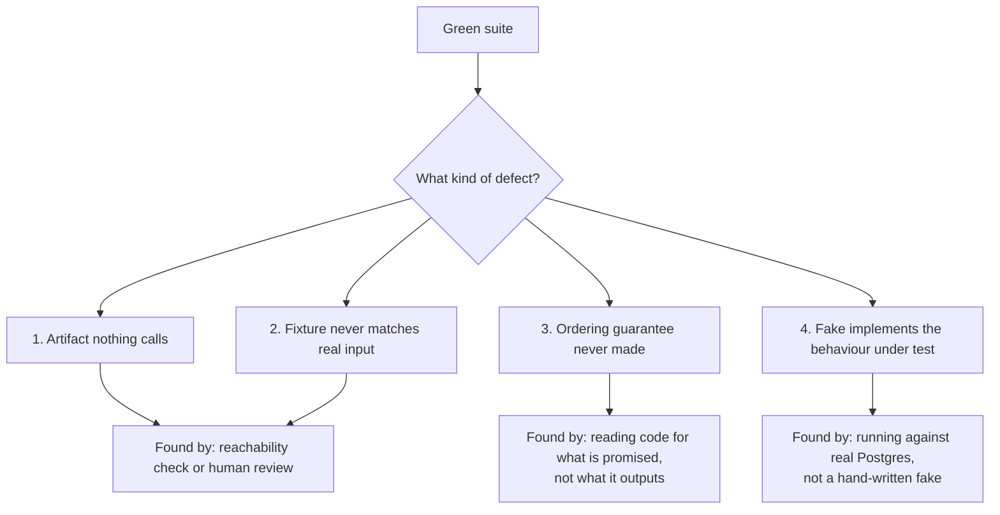
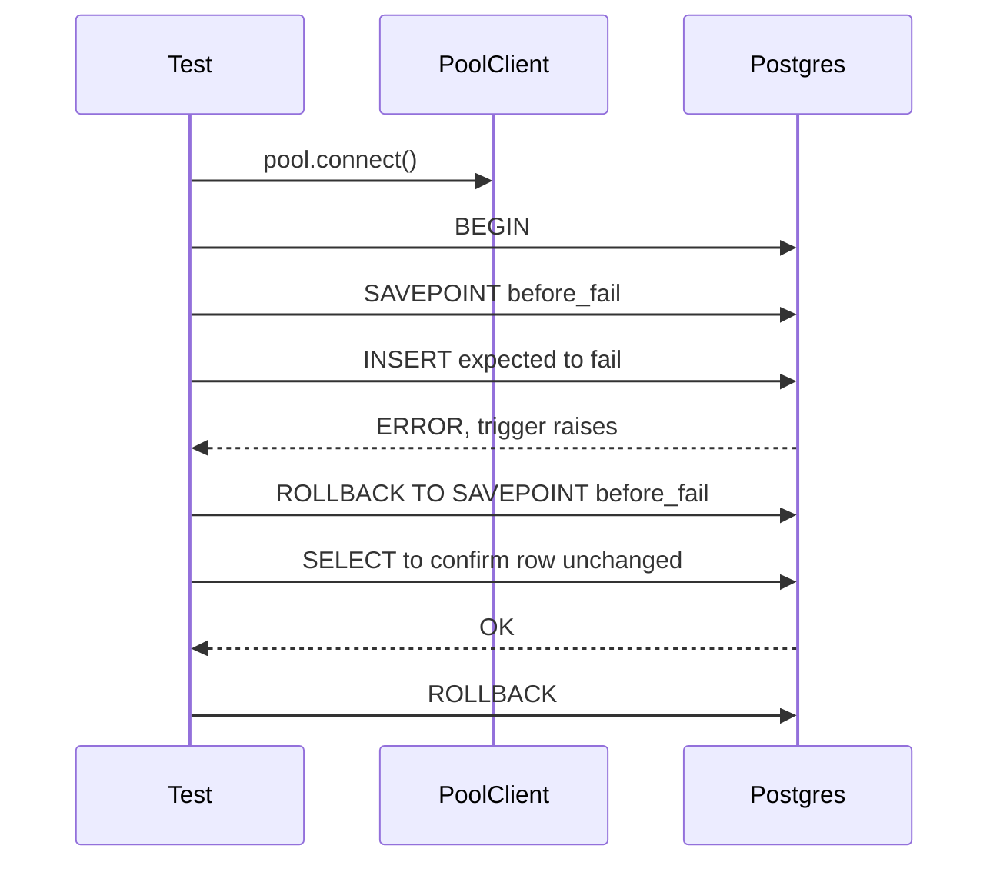
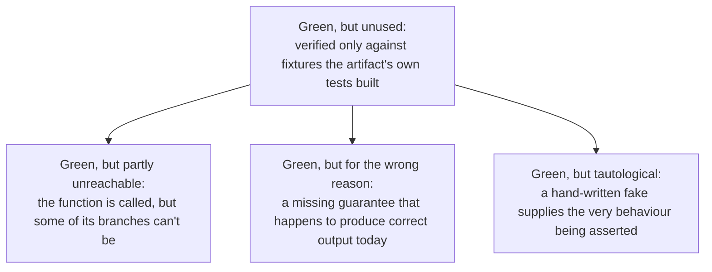
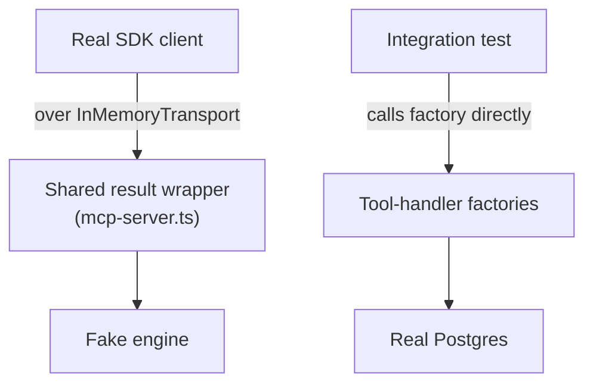

Kiểm thử trong Stemolly không chỉ là viết test — mà là bảo đảm những test đó thực sự chứng minh được điều chúng nói rằng mình đang chứng minh. Trang này giải thích kiến trúc kiểm thử của dự án, các mô thức giúp CI (tích hợp liên tục) luôn đáng tin, và một danh mục những kiểu lỗi có thật từng khiến bộ kiểm thử vẫn xanh trong khi bug ngoài thực tế lại lọt ra.

## Fitness function: cơ chế quản trị được cài ngay trong mã

*Fitness function* (bài kiểm tra cưỡng chế kiến trúc) là một kiểm tra tự động dùng để ép buộc một quy tắc kiến trúc — không phải kiểm thử logic nghiệp vụ, mà là kiểm thử các thuộc tính cấu trúc như “không được import thư viện nhà cung cấp bên ngoài gateway” hoặc “không được dùng `process.env` bên ngoài `config.ts`”.

Nguyên tắc cốt lõi là **co-shipping** (đi cùng một đợt thay đổi): một fitness function phải được đưa vào ngay trong chính task tạo ra phần mã mà nó quản lý, không trước và cũng không sau. Một kiểm tra là vô nghĩa nếu đối tượng của nó còn chưa tồn tại. Ở Sprint 1 điều này diễn ra rất cụ thể — `G-1` (kiểm tra ranh giới phụ thuộc) được đưa vào cùng task scaffold đã *tạo ra* cấu trúc; mọi “rail” khác cũng đi cùng chính phần mà chúng bảo vệ: error envelope, trigger chỉ-append, kỷ luật logging, cô lập vendor, assertion ở gateway, và fail-safe handler đều xuất hiện cùng lúc với tính năng của mình. Một số fitness function được cố ý triển khai ở trạng thái “nửa chừng” khi đối tượng đầy đủ của chúng chưa được xây xong — phần còn lại sẽ chờ tới sprint sau, thay vì phát hành một kiểm tra mà chưa có gì để cưỡng chế.

### Khi một fitness function quá hẹp

Fitness function kiểm tra một *cơ chế*, chứ không phải một ý định. Khi cơ chế đó hẹp hơn chính quy tắc, thì một vi phạm không đi qua cơ chế ấy vẫn sẽ qua cửa trong trạng thái xanh — và người ta sẽ nhầm rằng quy tắc đã được bao phủ đầy đủ, dù thực ra không phải vậy.

Hai trường hợp có thật, đều do người xem mã phát hiện chứ không phải CI:

- **Kỷ luật cấu hình (G-18)** yêu cầu việc đọc cấu hình chỉ diễn ra ở một nơi, rồi được inject đi khắp nơi khác. Luật lint chỉ gắn cờ `process.env` bên ngoài `config.ts` và `composition.ts`. Nó bắt được đúng hình thức `process.env`, nhưng lại mù với một hằng số hardcode nằm trong mã miền thuần túy — một giá trị chính sách mà không hề có `process.env` nào để gắn cờ.

- **Luật import theo kiến trúc lục giác** (`domain-no-adapters-import`) có mệnh đề `from` chỉ áp dụng cho các file trong `domain/`. Một file ứng dụng nằm ở gốc module mà import adapter của chính nó nằm ngoài phạm vi đó nên lọt qua im lặng.

Thói quen đúng khi ghép một quy tắc với một kiểm tra là: nêu rõ điều mà kiểm tra đó *không thể* nhìn thấy, và ghi lỗ hổng đó ngay cạnh quy tắc. Một kiểm tra hẹp chỉ bắn trúng một dạng vi phạm lại có thể khiến người review *ít* để ý hơn tới những dạng còn lại.

### Lỗ hổng trong cưỡng chế ADR

Một ADR đã được chấp nhận không tự nó cưỡng chế được gì. ADR-023 đã nêu rõ việc `metering/module.ts` import adapter của chính nó và yêu cầu gỡ bỏ. Mười hai ngày sau, dòng import đó vẫn còn đó, chỉ bị phát hiện khi một người đọc lại cây thư mục trong một vòng review không liên quan.

Lý do mang tính cấu trúc là: ADR-023 định nghĩa lõi module bằng một danh sách tên file, nên việc cưỡng chế trở thành nghĩa vụ theo từng file. Luật đi kèm để bao phủ `module.ts` được chính ADR-023 nhắc ở mục “Enforcement blind spot” như một việc để làm về sau — mà mục “việc tương lai” trong ADR không phải là một cam kết đang được theo dõi. Không có gì fail khi nó không được làm, nên ADR trông như đã được cưỡng chế trong khi thực tế thì chưa.

## Các ràng buộc CI

### Chỉ dùng mock LLM trong CI

Không một test tự động nào được phép gọi nhà cung cấp LLM thật. Quy tắc này được hiện thực hóa thành một fitness-function test cụ thể trong chính bộ test của package `llm`: nó resolve adapter nhà cung cấp đang được cấu hình dưới `NODE_ENV=test` và khẳng định kết quả không bao giờ là `anthropic`, `openai`, hay `google` — chỉ được phép là `mock` hoặc `ollama`.

`STEMOLLY_LLM_PROVIDER=mock` là biến môi trường CI được đặt tường minh, không bao giờ là một mặc định ngầm. Nhà cung cấp nào đang hoạt động luôn hiện rõ trong môi trường, chứ không phải suy ra. Nếu env var bị cấu hình sai mà lẽ ra sẽ âm thầm phá vỡ quy tắc “chỉ mock”, thì CI sẽ fail thay vì lặng lẽ cho qua.

### Build liên package trong CI

Mỗi job GitHub Actions đều bắt đầu từ một checkout sạch, hoàn toàn độc lập với các job cùng cấp khác. Nếu một job chạy test có `runtime` import (import lúc chạy) xuyên package, nó phải có bước `pnpm build` **của riêng nó** — bản build ở job bên cạnh không để lại gì cho nó.

Integration test của package `mcp` import `composition-root.ts`, và file này thực hiện một import thực sự lúc chạy tới `@engine-poc/server`, được resolve qua `main: dist/engine/index.js`. File đó bị gitignore và chỉ tồn tại sau khi build. Trên một checkout CI thật sự sạch, test sẽ fail với lỗi phân giải module. Bug này bị phát hiện ở vòng review thứ hai khi lần theo chuỗi import, chứ không phải từ lần chạy local của reviewer đầu tiên — máy local vẫn còn `dist/` cũ từ công việc trước nên không nhìn thấy lỗi.

### Lỗ hổng bao phủ của bộ integration test MCP

Trong một thời gian dài, lệnh integration test trong `devloop-profile.md` của `app` là `pnpm --filter server test:integration` — chỉ nhắm vào workspace `server`. Khi `mcp` trở thành một thành viên hạng nhất của workspace, các integration test của nó (bao gồm cả bằng chứng tự động cho chính acceptance criteria của nó) không còn chạy tự động nữa. Chúng chỉ chạy khi một lập trình viên chủ động gọi tay.

Điều này đã để lọt một hồi quy có thật: task 1 của đợt di trú `mcp` đổi tên package nhưng lại để `mcp/Dockerfile` vẫn tham chiếu tên filter pnpm cũ, làm hỏng bản build Docker — chỉ bị phát hiện vì một lập trình viên chạy tay bộ integration test của `mcp` khi xác minh một acceptance criterion.

Cách sửa là mở rộng script gốc `test:integration` để chạy cả test deploy ở mức root lẫn bộ test riêng của từng package trong workspace:

```bash
vitest run --config vitest.integration.config.ts && pnpm -r test:integration
```

`devloop-profile.md` giờ trỏ tới lệnh ở root này thay vì lệnh chỉ dành cho `server`.

## Các mô thức Testcontainers

### Cô lập giao dịch theo từng test với Postgres

Mô thức chuẩn là bọc mỗi test trong `BEGIN` (ở `beforeEach`) và `ROLLBACK` (ở `afterEach`) trên một Postgres testcontainers dùng riêng cho từng file. Migration chỉ chạy một lần; test vẫn nhanh.

Điểm dễ mắc là: Postgres hủy bỏ *toàn bộ giao dịch bao quanh* ngay khi có lỗi ở bất kỳ câu lệnh nào — một `RAISE` từ trigger, hay vi phạm unique constraint. Một test cố ý gây ra lỗi như vậy rồi chạy assertion tiếp theo trong cùng test sẽ thấy assertion đó fail với “current transaction is aborted”, chứ không phải cho ra kết quả nó mong đợi.

Cách sửa là dùng helper dùng chung `expectRejected(client, fn)` để bọc câu lệnh dự kiến sẽ fail trong cặp `SAVEPOINT` / `ROLLBACK TO SAVEPOINT` riêng của nó.

**Chi tiết quan trọng:** helper này nhận một `PoolClient` đã được checkout ra, chứ không phải `Pool`. Một cặp `SAVEPOINT` / `ROLLBACK TO SAVEPOINT` chỉ có hiệu lực trên một kết nối vật lý duy nhất. `Pool` có thể phát ra một kết nối khác nhau cho mỗi lần gọi `.query()`, nên nếu thực hiện cặp đó qua `pool.query()` thì hai lệnh có thể rơi vào hai kết nối khác nhau và fail với “ROLLBACK TO SAVEPOINT can only be used in transaction blocks”. Mọi câu lệnh thuộc giao dịch trong một test — `BEGIN`, lời gọi helper, các assertion, rồi `ROLLBACK` cuối cùng — đều phải chạy trên đúng một client được lấy qua `pool.connect()`.

Loại bug này phụ thuộc vào lịch cấp phát kết nối: một test chạy tuần tự có thể tình cờ tái sử dụng cùng một kết nối và qua được nhờ may mắn. Cách bắt đáng tin cậy duy nhất là phân biệt kiểu `Pool` với `PoolClient` và review mã, chứ không phải nhìn vào một lần chạy test màu xanh.

### Khẳng định các hàng metering

Các hàng metering không thể dùng bất kỳ chiến lược cô lập thông thường nào:

1. Việc ghi metering là **fire-and-forget trên kết nối pooled riêng của nó** — nó không tham gia vào giao dịch `BEGIN`/`ROLLBACK` mà test đang giữ, nên rollback không xóa được hàng đó.
2. **Trigger chỉ-append chặn `DELETE`** đúng như cách nó chặn `UPDATE`, nên dọn tay trong `afterEach` sẽ ném lỗi.

Giải pháp dùng trong các integration test echo-turn là: **giới hạn số hàng theo chính đồng hồ của cơ sở dữ liệu.** Chụp `SELECT NOW()` ngay trước mỗi request, rồi chỉ đếm những hàng có `created_at >= since`. Vì các test trong file chạy tuần tự, không có lần ghi lạc nào có thể rơi vào cửa sổ thời gian của một test cụ thể.

Vì việc ghi là fire-and-forget, hàng đó có thể chưa xuất hiện khi HTTP response trả về. Hãy poll tới một deadline ngắn thay vì chỉ đọc một lần. Nếu dưới tải CI mà nó thành flaky, hãy nới deadline ra — đừng chuyển sang chiến lược giao dịch hay `DELETE`, vì cả hai đều không dùng được ở đây.

### Nối dây env var trong Docker Compose

Một test testcontainers khởi động ảnh dịch vụ theo kiểu độc lập (qua `GenericContainer` + `.withEnvironment(...)`) và truyền env var trực tiếp sẽ **bỏ qua hoàn toàn `docker-compose.yml`**. Cách nối `environment:` / `env_file:` trong file compose không hề được thực thi dù bộ test có xanh đến đâu.

Điều này từng để lọt một bug có thật: dịch vụ `edge` (Caddy) trong `docker-compose.yml` không có khối `environment:`, nên trong deploy thật Caddy sẽ không bao giờ nhận được bốn biến bắt buộc của nó. Test testcontainers độc lập lại tự inject trực tiếp các biến đó nên cứ xanh từ đầu đến cuối.

Hàng rào phòng thủ là một test chuyên dụng parse `docker-compose.yml` thật và khẳng định rằng mọi biến mà file cấu hình phía dưới tham chiếu tới đều thực sự được khai báo trong `environment:` hoặc `env_file:` của chính dịch vụ đó.

Một kiểu trôi lệch liên quan: `mcp/Dockerfile.integration.test.ts` build và khởi động ảnh container `mcp` thật, rồi sập ngay với `Error: DISPLAY_LANG must be set, got: unset`. Khối `.withEnvironment({...})` của test được viết trước quy tắc bắt buộc `DISPLAY_LANG` vài commit và không bao giờ được cập nhật. Sự cố chỉ bị phát hiện khi một blocker CI khác được sửa và CI cuối cùng mới tiến đủ xa để chạm tới test này. Cách sửa: thêm `DISPLAY_LANG: 'en'` vào khối môi trường của test, khớp với quy ước đã dùng trong `config.test.ts`.

### Bảo đảm teardown của `globalSetup` trong Playwright

Playwright **luôn chạy `globalTeardown`, kể cả khi `globalSetup` ném lỗi.** Bộ chạy teardown chèn từng teardown vào trước khi setup tương ứng chạy, và chạy teardown theo thứ tự ngược lại — nên một setup bị ném lỗi không thể bỏ qua cleanup.

Điều đó có nghĩa là một `globalSetup` lấy nhiều tài nguyên theo chuỗi phải **công bố từng handle cho singleton teardown dùng chung ngay tại thời điểm nó được tạo ra**, chứ không gom lại đến cuối. Nếu setup ném lỗi giữa chừng, bất kỳ tài nguyên nào đã lấy nhưng chưa kịp ghi nhận sẽ vô hình với teardown và bị rò rỉ.

Hành vi này của Playwright là tiền đề chịu lực cho thiết kế quản lý tài nguyên của harness e2e. Nó đã được xác minh với `playwright@1.61.1`. Nếu một lần nâng cấp Playwright, hoặc việc chuyển từ file teardown riêng sang trả về một hàm teardown, làm thay đổi thứ tự này, thì mô thức gán-ngay-lập-tức sẽ âm thầm trở thành vật trang trí và các lỗi giữa chừng trong setup sẽ lại làm rò container.

Ryuk reaper của Testcontainers cuối cùng cũng sẽ dọn các container bị rò, nhưng nó không có tính quyết định và xảy ra trễ — đó là lưới an toàn cuối cùng, không phải sự thay thế cho một đường `stop()` tường minh.

## Bốn kiểu lỗi “xanh nhưng sai”

Đây là phần quan trọng nhất với người mới đóng góp: bốn kiểu lỗi kiểm thử khác nhau mà trong đó cả bộ test đều xanh nhưng vẫn tồn tại lỗi thật. Cả bốn đều đã từng xuất hiện trong codebase này.



### Dạng 1 — Artifact mà không ai gọi

Một unit test xác minh một artifact theo đúng hợp đồng của chính nó. Nó không thể nhận ra rằng trong hệ thống chẳng có gì gọi tới artifact đó, hoặc bên sinh dữ liệu thật lại đưa vào cho nó một kiểu đầu vào khác hẳn.

Hai lỗi ở Sprint 1 đã lọt ra theo đúng dạng này: một resolver (`resolveTier()`) được triển khai, được test, nhưng không có caller nào trong production, nên tier/purpose không bao giờ thực sự chọn model; và một schema cho trường log (`LogFieldsSchema`) mà test chỉ đưa cho nó các object tự dựng bằng tay, nên nó chưa từng xác thực lấy một dòng nào mà logger thật phát ra.

Vì sao mọi cổng kiểm tra đều bỏ sót chuyện này: unit test chỉ chứng minh artifact hoạt động, chứ không phải nó có được dùng hay không; dependency-cruiser chỉ kiểm tra các cạnh phụ thuộc *đã tồn tại* có hợp lệ hay không, chứ không biết cạnh nào *đáng lẽ phải có* mà lại không có; typecheck và lint hoàn toàn hài lòng với một symbol export ra mà chẳng ai import; còn review diff nhìn thấy một module kèm theo test xanh của nó thì dễ đọc như một phần đã hoàn chỉnh.

Một kiểm tra reachability ở CI (kiểu `ts-prune` / `knip`: fail nếu một symbol export ra mà chỉ có `*.test.ts` import) bắt được trường hợp module không thể với tới với chi phí thấp. Nhưng nó *không* bắt được trường hợp fixture sai, khi artifact thực sự có được import nhưng chưa bao giờ được đưa đầu ra thật của producer cho nó. Cả hai lỗi này đều chỉ được phát hiện khi con người chạy mã thật.

### Dạng 2 — Nhánh mà không đường production nào chạm tới được

Việc lần từ một acceptance criterion tới đường gọi trong production chỉ xác nhận rằng một symbol có được gọi. Nó không xác nhận rằng mọi nhánh trong symbol đó đều có thể đạt tới từ các tiền điều kiện thật của caller.

Ví dụ cụ thể: luồng redeem của `identity` gọi một atomic claim trước, rồi nếu thất bại mới gọi một helper trong domain để phân loại lý do. Đến lúc helper chạy, record tất yếu đã ở trạng thái already-redeemed hoặc expired — nên nhánh token-mismatch của nó là bất khả thi (hàng đã được truy xuất *theo chính* hash đó) và câu `return record.role` là không thể đạt tới. Chữ ký hàm nói rằng nó trả về một role; trong hệ thống đang chạy, nó luôn ném lỗi. Đường “hạnh phúc” của nó chỉ được đi qua trong unit test của riêng nó — xanh, và không thể chạm tới, nằm bên trong một hàm mà đường truy vết acceptance criterion của nó vốn đã được xác minh rồi.

Kiểm tra rẻ tiền ở đây là: khi một đường truy vết kết thúc ở một hàm trả về giá trị, hãy đọc các guard của hàm đó đối chiếu với tiền điều kiện của caller. Nếu mọi đường đi vào đều dẫn chắc chắn tới một lệnh throw, thì hợp đồng khai báo và vai trò thực tế đã lệch nhau.

### Dạng 3 — Cam kết thứ tự chưa từng được tạo ra

Một truy vấn SQL không có `ORDER BY` trên một bảng nhỏ gần như lúc nào cũng trả kết quả theo thứ tự insert — vì thế mọi test về tính quyết định đều qua một cách “trung thực”, trong khi bảo đảm mà các test đó dường như đang kiểm tra thật ra không hề tồn tại. Nó chỉ vỡ về sau, ở quy mô lớn, khi có parallel scan hoặc query plan thay đổi.

Loại lỗi này được tìm ra bằng cách đọc mã và tự hỏi hệ thống *đang hứa điều gì*, chứ không phải bằng cách chạy nó. Test tự nhiên cho tình huống này phải khẳng định vào *cơ chế* thay vì đầu ra: bắt lấy đúng câu SQL đã được gửi đi và khẳng định rằng mệnh đề sắp thứ tự có mặt. Sự mong manh ở đây là có chủ đích — nó gãy với bất kỳ lần viết lại nào, kể cả viết lại đúng — và chính sự mong manh đó mới là điểm mấu chốt. Nó ghim chặt một lời hứa vốn không có triệu chứng đầu ra nào để quan sát.

### Dạng 4 — Fake mang tính đồng nghĩa luận

Khi một unit test thay một dependency bằng một fake viết tay, mà điều test thật sự cần xác minh lại là *tính đúng đắn của chính dependency đó*, thì test sẽ trở thành một vòng lặp đồng nghĩa luận.

Ca trong danh mục này là: một bản sửa yêu cầu việc tra cứu slug phải được giới hạn theo kind. Fake repository trong unit test lại trả lời theo từng kind — đúng, nhưng là đúng bằng tay. Vì thế mệnh đề “một misconception đã bị reject không chặn một pattern cùng slug” vẫn luôn đúng trong test, bất kể production lookup có thật sự được giới hạn theo kind hay không. Chính fake, chứ không phải mã production, đã làm assertion này đi qua.

Loại test như vậy không phải vô dụng, nhưng điều nó thật sự chứng minh hẹp hơn rất nhiều: nó chỉ chứng minh caller *truyền tham số đó đi qua*, và không hơn. Mệnh đề về hành vi phải được xác minh với Postgres thật qua chính entry point của module, với phiên bản mã trước khi sửa phải cho ra một lần đỏ thật sự.

Cách “sửa” sai là dạy fake mô phỏng bug. Làm vậy chỉ ghim một hình dạng lỗi lịch sử cụ thể, chứ không ghim quy tắc, và nó sẽ trở nên lỗi thời ngay khi bug biến mất.

## Sự suy giảm bao phủ ở tầng vận chuyển MCP

Shared result wrapper của adapter MCP trong `mcp/src/mcp-server.ts` được mọi tool đã đăng ký dùng chung. Thế nhưng cả hai bộ test ban đầu của adapter này đều không đụng vào nó trong điều kiện thật:

- Bộ unit test điều khiển một `Client` SDK thật qua `InMemoryTransport` (đi qua wire) nhưng lại dùng engine giả, và ban đầu chỉ gọi một trong mười tool đã đăng ký.
- Bộ integration test thì chạm tới Postgres thật, nhưng lại gọi thẳng các factory tạo tool-handler, bỏ qua hoàn toàn shared wrapper.

Thế là đúng phần mà mọi tool đều phụ thuộc vào lại không nằm trên đường đi của bất kỳ test nào. Một lỗi marshalling trong đó hoàn toàn vô hình trước một bộ test xanh lè cộng với một lần truy vết reachability theo từng tiêu chí.

Vấn đề về cấu trúc không chỉ là lỗ hổng ban đầu — mà là **bao phủ tự động bị hao hụt khi thêm tool mới**. Mỗi tool mới mặc định sinh ra trong trạng thái chưa được bao phủ. Nếu không có một cổng kiểm tra khẳng định rằng mọi tool đã đăng ký đều từng được gọi qua một transport thật, thì con số bao phủ chỉ là ảnh chụp của mức độ chú ý trong quá khứ, chứ không phải một thuộc tính của bộ test.

Issue #73 đã thêm một unit test ở mức wire và đổi hướng integration test của demo path để nó gọi qua wrapper production `createMcpServer` trên nền Postgres thật. Nhưng cách sửa bền vững phải là một fitness function trên **bề mặt tool đã khai báo** — đếm xem có bao nhiêu tool đã đăng ký từng được gọi qua transport thật — chứ không phải thêm từng ca bằng tay. Các bản vá theo từng tool chỉ làm cho khoảng trống trông như nhỏ hơn sau mỗi lần sửa, trong khi thuộc tính thật sự quan trọng thì vẫn chưa được đo.

## Kỷ luật ra quyết định với ADR

Hai lần đọc sai cùng một ADR (ADR-027) trong cùng một phiên cho thấy hồ sơ quyết định dễ hỏng như thế nào khi bị nén lại.

**Đọc sai 1 — làm rơi mệnh đề xếp hạng.** Ghi chú của dự án cho ADR-027 ghi rằng tool `list_nodes` “bị bác bỏ: nó vá được lỗ hổng bootstrap nhưng vẫn giữ uuid trong ngữ cảnh của model đồng thời đẩy cả đồ thị vào prompt.” Còn chính ADR kết thúc câu đó bằng việc nói rằng phản đối chuyện “cả đồ thị” là “điều đối lập với closed list mà quyết định này phụ thuộc vào”. Ghi chú trình bày hai cái giá có vẻ ngang nhau; ADR thì nói rõ vế thứ hai mới là điều mà toàn bộ quyết định dựa vào. Một vòng review đọc ghi chú, kết luận rằng biến thể chỉ-dùng-slug tránh được vấn đề uuid, rồi đề xuất tool đó — sau đó phải rút lại khi đọc trực tiếp mục Rejected options của ADR.

**Đọc sai 2 — chỉ áp dụng một phần của bất biến.** ADR-027 nói rằng uuid của node không bao giờ được đặt vào prompt, đối số mà model có thể gọi, *hay kết quả mà model nhìn thấy*. Một vòng review đề xuất chỉ sửa phần đối số, với lý lẽ rằng kết quả chỉ cho model *đọc* uuid còn đối số thì khiến nó *ghi* uuid. Đó đúng là một khác biệt về mức độ rủi ro — nhưng không phải là sự phân biệt mà ADR đã vẽ ra. Chỉ sửa đối số sẽ vẫn để uuid nằm trong ngữ cảnh của model, sẵn sàng bị dán vào một lần gọi, payload hoặc log sau đó.

Cả hai lần đọc sai đều đến từ việc nén thông tin — người đọc tự tái dựng quy tắc từ phần có vẻ quan trọng nhất — và cả hai đều tạo ra những đề xuất phải rút lại sau khi đã gửi đi.

:::tip Quy tắc làm việc
- Ghi chú chỉ là con trỏ để tra cứu, không bao giờ thay thế được bản ghi gốc. Trước khi đề xuất bất kỳ điều gì mà ADR liệt kê trong Rejected options, hãy mở ADR ra và đọc trực tiếp mục đó.
- Khi một đề xuất đụng tới một ADR đã được chấp nhận, hãy đọc chính câu mô tả bất biến và tôn trọng mọi mệnh đề trong đó. Nếu có mệnh đề nào có vẻ không đáng phải giữ, thì đó là một lập luận để thay thế quyết định cũ, chứ không phải chi tiết có thể âm thầm bỏ qua.
:::

## Một bản ghi test xanh không phải chứng chỉ đúng đắn

Một hồ sơ cổng kiểm tra sạch — không cờ đỏ, mọi test đều xanh — đo xem công việc *khó đến đâu*, chứ không đo khả năng nó sai cao hay thấp. Một task sai một cách đầy tự tin vẫn tạo ra một danh sách cờ trống rỗng. Đây là trường hợp bình thường, không phải ngoại lệ hiếm.

Bước review acceptance criteria đáng để được đọc như một hiện vật đáng nghi: hãy hỏi lại caller kế tiếp cần gì từ interface này và liệu câu chữ hiện tại có để lại cho họ một cách an toàn để lấy được điều đó hay không, vì đó là câu hỏi duy nhất mà không cổng thực thi nào hỏi lại. Tương tự, một lỗi nằm ở *cách diễn đạt* của acceptance criterion là vô hình với mọi cổng ở phía sau nó — mỗi cổng đều lấy criterion đó làm định nghĩa của “đúng”, nên một criterion thiếu chặt chẽ sẽ tạo ra một lần chạy sạch sẽ, nhưng chỉ chứng minh rằng mã đáp ứng đúng điều đã được viết ra.

Cuối cùng, một kết quả `isError: false` từ một lệnh MCP `tools/call` chỉ chứng minh handler không ném lỗi. Với bất kỳ adapter nào đứng trước một kho lưu trữ bền vững, phản hồi của adapter không phải bằng chứng về tính bền vững — chính store mới là nhân chứng độc lập. Muốn xác nhận một lần ghi, phải truy vấn trực tiếp store đó.

Chiến lược kiểm thử của Stemolly dựa trên một ý rất đơn giản: một quy tắc mà không được cưỡng chế tự động thì chỉ là lời khuyên. Mọi ràng buộc kiến trúc đều có một test tương ứng — gọi là **fitness function** — để làm CI fail khi ràng buộc bị phá vỡ. Quan trọng không kém là phải biết *một bộ test xanh không nhìn thấy được điều gì*. Trang này nói về cả hai: cách các kiểm tra quản trị được xây và đi cùng phần mã mà chúng quản lý, và các dạng lỗi lặp đi lặp lại vẫn qua được mọi cổng trong khi hệ thống thật đang sai.

## Fitness function đi cùng phần mã mà chúng kiểm tra

Fitness function được viết trong chính task tạo ra phần mà nó quản lý, chứ không phải gom lại thành một “giai đoạn quản trị” làm từ trước. Lý do rất đơn giản: nếu đối tượng của kiểm tra chưa tồn tại thì kiểm tra đó không có ý nghĩa. Khi sprint nền tảng của dự án được lên kế hoạch, chỉ riêng task đầu tiên — dựng scaffold thư mục — nhận fitness function trước, vì toàn bộ công việc của task đó *chính là* cấu trúc mà kiểm tra cần xác minh. Mọi quy tắc khác đều đi cùng đối tượng của nó: kiểm tra error-envelope đi với package contracts, kiểm tra cơ sở dữ liệu chỉ-append đi với Postgres, kiểm tra kỷ luật logging đi với logger, v.v.

Một số kiểm tra được cố ý phát hành ở trạng thái “nửa hoàn chỉnh”, chỉ bao phủ phần của quy tắc mà đối tượng của nó đã tồn tại, còn nửa kia được ghi rõ là sẽ đưa vào sau khi đối tượng còn lại cũng được xây xong. Điều này là bình thường, không phải một lỗ hổng — miễn là nửa còn thiếu được theo dõi và không bị quên lặng lẽ (xem [Những điểm mù của người review](#where-reviewers-have-blind-spots) để thấy điều gì xảy ra nếu không làm vậy).

## Không một test tự động nào được gọi LLM thật

:::caution
CI tuyệt đối không được resolve sang một nhà cung cấp LLM thật. Điều này được cưỡng chế bằng test, không chỉ bằng quy ước.
:::

Một test nằm cạnh chính bộ test của module LLM sẽ resolve bất kỳ provider nào được cấu hình dưới `NODE_ENV=test` và khẳng định rằng nó không bao giờ là `anthropic`, `openai`, hay `google` — chỉ `mock` hoặc `ollama` mới được phép. CI đặt `STEMOLLY_LLM_PROVIDER=mock` một cách tường minh, không dựa vào mặc định ngầm, nên provider đang hoạt động luôn hiện rõ trong môi trường thay vì phải suy đoán. Mấu chốt của việc biến điều này thành test, thay vì thành một quy tắc viết ra rồi tin rằng ai cũng làm theo, là: một biến môi trường bị cấu hình sai giờ sẽ làm build fail, chứ không âm thầm đốt tiền gọi API thật trong CI.

## Các mô thức Testcontainers, và cơ chế CI xoay quanh chúng

Phần lớn integration test chạy trên một Postgres thật được khởi động bằng [testcontainers](https://testcontainers.com/), chứ không phải một cơ sở dữ liệu giả. Điều đó cho ta tính thực tế, nhưng Postgres thật cũng kéo theo các quy tắc giao dịch thật, và vài quy tắc trong số đó đã từng “đánh” dự án này theo những cách không hề hiển nhiên.

### Một test kỳ vọng thất bại cần `SAVEPOINT` của riêng nó

Mô thức cô lập thông thường là bọc mỗi test bằng `BEGIN` trước khi chạy và `ROLLBACK` sau khi chạy, để migration chỉ cần chạy một lần mà test vẫn nhanh. Vấn đề là: Postgres hủy *toàn bộ* giao dịch bao quanh ngay khi có bất kỳ câu lệnh nào trong đó gặp lỗi — một trigger reject, một vi phạm unique constraint — nên nếu test cố ý gây ra lỗi đó rồi chạy một truy vấn tiếp theo (ví dụ để kiểm tra hàng vẫn không đổi), thì chính truy vấn tiếp theo ấy sẽ fail với “current transaction is aborted”.

Cách sửa là dùng helper chung `expectRejected(client, fn)` để bọc lỗi dự kiến trong cặp `SAVEPOINT` / `ROLLBACK TO SAVEPOINT` riêng, nhờ đó giao dịch ngoài của test vẫn sống sót. Ở đây còn thêm một quy tắc nữa: `SAVEPOINT` chỉ có phạm vi trong đúng một kết nối vật lý tới cơ sở dữ liệu, trong khi pool kết nối có thể phát ra *một kết nối pooled khác* cho từng query. Vì vậy `expectRejected` phải nhận một `PoolClient` đã checkout ra, chứ không bao giờ nhận `Pool` — nếu không thì `SAVEPOINT` và `ROLLBACK TO SAVEPOINT` của nó có thể rơi vào hai kết nối khác nhau và fail thẳng. Loại bug này phụ thuộc vào thời điểm: một test có thể gặp may, tình cờ dùng cùng một kết nối và qua được — nên thứ bắt nó đáng tin cậy là phân biệt kiểu `Pool` với `PoolClient`, cùng với review mã, chứ không phải một lần chạy xanh.



### Một hàng metering không thể rollback hay delete, nên phải giới hạn bằng đồng hồ

Các lần ghi metering là fire-and-forget: đoạn mã ghi lại một lần gọi LLM không đợi nó hoàn tất, và lần ghi đó rơi vào bất kỳ kết nối pooled nào đang rảnh — chứ không nằm trong giao dịch theo từng test mà test đang giữ. Vì thế rollback giao dịch của test không xóa được nó. Tệ hơn nữa, bảng metering là append-only, nên ngay cả phương án dự phòng là `DELETE` trong phần cleanup cũng bị cơ sở dữ liệu từ chối.

Mô thức đang dùng là chụp `SELECT NOW()` ngay trước mỗi request, rồi về sau chỉ đếm những hàng được tạo sau dấu thời gian đó. Vì các test trong file đó chạy tuần tự, không có lần ghi nào khác có thể rơi vào cửa sổ thời gian của một test nhất định. Việc đếm cũng phải được *poll*, chứ không chỉ đọc một lần, vì hàng dữ liệu có thể xuất hiện muộn hơn HTTP response một chút.

### `globalTeardown` vẫn chạy ngay cả khi `globalSetup` ném lỗi

Harness end-to-end khởi động nhiều tài nguyên trong `globalSetup` — một Postgres testcontainers, một kết nối pooled, một server đang lắng nghe. Nếu setup ném lỗi giữa chừng (cấu hình sai, cổng đã bị chiếm dụng), thì bất kỳ thứ gì đã được cấp phát nhưng chưa được ghi lại như một handle đều vô hình với teardown và sẽ bị rò. Cách sửa là công bố từng handle vào đối tượng teardown dùng chung ngay tại thời điểm nó được tạo ra, chứ không gom lại tới cuối setup.

Mô thức này hoạt động nhờ một hành vi của Playwright đáng để nói thẳng ra, vì trong mã harness không tự nói lên điều đó: Playwright thực sự chạy `globalTeardown` kể cả khi `globalSetup` ném lỗi, và nó làm vậy *sau* setup bị fail — điều này đã được xác minh trực tiếp từ chính mã nguồn của Playwright. Reaper riêng của Testcontainers (Ryuk) đúng là một lưới an toàn có thật, cuối cùng sẽ dọn các container mồ côi, nhưng nó chậm và không có tính quyết định, nên không thể thay thế đường teardown tường minh.

### Env var trong `docker-compose.yml` không tự động xuất hiện

Một service trong docker-compose chỉ nhận được biến môi trường lúc chạy nếu chính khóa `environment:` hoặc `env_file:` của service đó có nêu tên biến ấy — phép nội suy `${VAR}` chỉ thay thế văn bản *bên trong* file compose, chứ không tự bơm gì vào tiến trình trong container. Một test testcontainers khởi động ảnh của service ở chế độ độc lập rồi truyền env var trực tiếp cho nó sẽ bỏ qua toàn bộ cách nối dây thật trong file compose, nên tính đúng đắn của file compose ngoài đời thực hoàn toàn không được kiểm tra, bất kể bộ test xanh tới đâu.

Điều này từng để lọt một bug thật: service edge (Caddy) trên một đợt deploy VPS hoàn toàn không có khối `environment:`, nên ở deploy thật Caddy sẽ không bao giờ nhận được biến hostname hay bearer-token của nó — nhưng integration test của chính service đó lại cấp thẳng các biến này cho một container độc lập, nên nó cứ xanh như thường. Một reviewer đọc trực tiếp file compose mới bắt ra, chứ không phải test nào. Cách sửa là thêm một regression test chuyên biệt parse file compose thật và khẳng định rằng mọi biến mà cấu hình phía dưới tham chiếu tới đều thực sự được khai báo trong `environment`/`env_file` của chính service đó.

### Một job CI có import xuyên package thì phải có bước build riêng

Mỗi job trong một workflow CI đều khởi động từ checkout sạch, bất kể job cùng workflow ở nhánh bên cạnh đã làm gì trước đó. Một integration test import package khác bằng tên module trần, và việc resolve đi xuyên qua output đã được biên dịch của package đó — một thư mục `dist/` bị gitignore, chỉ tồn tại local sau khi ai đó đã build. Chạy test này ngay sau `pnpm install`, không có bước build, sẽ vô tình chạy được trên máy lập trình viên (vì `dist/` cũ vẫn còn nằm đó) nhưng sẽ fail trên checkout CI thật sự sạch với một lỗi phân giải module chẳng giống một lỗi test bình thường chút nào. Mọi job chạy mã có phụ thuộc vào import lúc chạy xuyên package đều phải có bước build của riêng nó — bản build ở job khác không được mang theo.

## Những harness test âm thầm lệch khỏi production

Hai cái bẫy riêng của Fastify có chung một gốc rễ: một test tách riêng một route khỏi toàn bộ ứng dụng có thể vô tình cũng tách nó luôn khỏi các thiết lập mà route đó cần để hoạt động đúng.

**Một app test dựng tay kế thừa mặc định của framework, không phải thiết lập production.** Các thiết lập được cấu hình một lần ở nơi dựng ứng dụng thật — quy tắc ép kiểu request body, các decoration theo request mà shared error handler dựa vào — là thuộc tính của *chính instance đó*, chứ không phải của các route gắn trên nó. Một test tự dựng Fastify trần để kiểm thử một route độc lập sẽ nhận mặc định của framework thay thế. Phiên bản nguy hiểm của chuyện này là: nếu không áp dụng lại thiết lập production vốn tắt việc ép kiểu tự động, thì một request body sai kiểu như số `123` sẽ âm thầm bị ép thành chuỗi `"123"` trước khi validation chạy — khiến test khẳng định “body lỗi phải trả 400” lại quan sát thấy 200, và xanh vì một lý do hoàn toàn sai. Nó không fail ầm ĩ; nó chỉ ngừng bảo vệ bất cứ điều gì. Quy tắc rút ra ở đây là: khi dựng một harness test cô lập, hãy đọc mã khởi tạo ứng dụng thật và chủ động chép lại các thiết lập mà nó áp dụng, rồi xác nhận rằng mọi assertion kiểu “cái này phải fail validation” vẫn thực sự fail khi mã production bị làm hỏng.

**Một guard được thêm ở phạm vi plugin có thể âm thầm phá vỡ mọi test đang đi qua đường đó.** Nếu một fail-closed guard được móc ở cấp namespace, thì mọi request đi vào namespace ấy đều phải qua nó — bao gồm cả các request từ test dựng ứng dụng thật và inject vào một route nằm trong namespace đó. Các test này sẽ thôi không còn nhận phản hồi thật của route nữa, mà bắt đầu nhận phản hồi từ chối của guard, rồi báo cáo một hồi quy ở route vốn thực ra không hề bị chạm tới. Cách sửa không phải là đổi kỳ vọng của test sang mã từ chối — làm vậy chỉ âm thầm xóa sạch độ bao phủ ban đầu — mà là tách mối quan tâm ra: test route riêng trên một instance trần không có guard trong chuỗi, và test guard trong test riêng của guard. Kiểu va chạm này rất dễ bị đánh giá thấp mức ảnh hưởng vì các test bị tác động nằm rải rác ở unit, integration và end-to-end, và một lệnh kiểm tra local chỉ chạy một vài tầng trong số đó vẫn có thể xanh trong khi CI sẽ fail ở những tầng còn lại.

## Bốn cách mà một bộ test xanh đánh lừa bạn

Unit test chỉ chứng minh rằng một artifact tôn trọng *hợp đồng của chính nó*. Nó không thể nhận ra rằng trong hệ thống đang chạy chẳng có gì gọi tới artifact đó, hoặc caller thật lại đưa cho nó thứ khác với dữ liệu mà test tự dựng bằng tay. Bốn dạng riêng biệt của chuyện này đều đã từng lọt ra trong codebase này; mỗi dạng đều vô hình trước một bộ test xanh hoàn toàn và chỉ bị bắt bởi con người đọc mã thật:



**Xanh nhưng không ai dùng.** Một resolver được triển khai, được test, và xanh — nhưng không có mã production nào gọi tới nó, nên trong hệ thống thật nó chưa từng chọn cái gì cả. Tương tự, một schema chỉ xác thực các object mà chính test của nó dựng bằng tay, nên không thể nào đã xác thực được lấy một dòng log thật nào mà logger production tạo ra. Không một lỗ hổng nào trong số này lộ ra qua unit test (chúng chỉ chứng minh artifact hoạt động, chứ không chứng minh có ai dùng nó), qua kiểm tra phụ thuộc (nó chỉ kiểm tra những cạnh đang tồn tại, không phải những cạnh đáng lẽ phải tồn tại mà lại thiếu), hay qua diff review (một module kèm test xanh của chính nó rất dễ trông như đã xong). Hàng rào phòng thủ ở đây là hỏi xem acceptance criterion có lần được tới một đường gọi production thật hay không, chứ không chỉ hỏi nó có test chống lưng hay không — và một kiểm tra tự động rẻ tiền có thể bắt được nửa “không ai import thứ này” của câu chuyện (một symbol export mà chỉ file test import), dù nó không bắt được nửa “fixture sai”.

**Xanh nhưng có nhánh không thể chạm tới.** Ngay cả một hàm *thực sự* nằm trên một đường gọi production đã được xác minh vẫn có thể chứa những nhánh mà trong production không thứ gì chạm tới được. Một luồng redeem gọi atomic claim trước, rồi chỉ khi thất bại mới rơi về helper phân loại lý do — đến lúc đó thì một trong bốn nhánh của helper đã trở thành bất khả thi về logic, cùng với luôn cả giá trị trả về mà nó khai báo. Chữ ký của hàm hứa hẹn một giá trị trả về; trong hệ thống đang chạy nó luôn ném lỗi. Kiểm tra rẻ tiền ở đây là: khi một đường gọi đã truy được kết thúc ở một hàm trả về thứ gì đó, hãy đọc các guard của hàm đó đối chiếu với những gì caller đã bảo đảm trước rồi. Nếu mọi đường đi vào đều dẫn tới throw, thì hợp đồng khai báo và hành vi thật đã âm thầm tách nhau ra.

**Xanh nhưng vì sai lý do.** Một test chỉ khẳng định trên đầu ra thì về cấu trúc sẽ mù với một lời hứa chưa từng thực sự được tạo ra. Ví dụ kinh điển là truy vấn SQL không có `ORDER BY`: trên một bảng nhỏ, Postgres gần như lúc nào cũng trả hàng theo thứ tự insert, nên mọi test kiểu “thứ tự có đúng không” đều qua rất thành thật — cho đến ngày bảng lớn hơn, có parallel scan, hoặc query plan đổi đi và production vỡ một lần. Loại lỗi này được tìm ra bằng cách đọc mã và hỏi hệ thống *đang hứa điều gì*, chứ không phải bằng cách chạy nó. Test cho trường hợp này cố tình đảo ngược lời khuyên thường thấy: nó khẳng định vào cơ chế (câu SQL thật sự gửi đi phải có mệnh đề sắp thứ tự) chứ không phải vào hành vi — điều đó mong manh có chủ đích, vì đó là cách duy nhất để ghim một bảo đảm vốn không có triệu chứng hữu hình nào cho tới lúc nó vỡ.

**Xanh nhưng đồng nghĩa luận.** Khi một unit test thay dependency thật bằng một fake viết tay, mà thứ đang được kiểm tra thực ra lại là *tính đúng đắn của chính dependency đó*, thì test trở thành một vòng tròn. Trong một trường hợp, bản sửa yêu cầu một phép tra cứu phải được giới hạn đúng theo category — nhưng fake repository trong test đã trả lời đúng theo category bằng tay rồi, nên test sẽ qua dù production lookup có được giới hạn hay không. Loại test này không phải là vô giá trị; nó chứng minh caller truyền đúng tham số đi tiếp, và không hơn gì nữa. Nó không thể fail vì đúng lý do mà tên test gợi ra, bởi muốn vậy thì fake và triển khai thật phải chủ động bất đồng với nhau. Mệnh đề hành vi thật chỉ có thể được xác minh trên triển khai thật — Postgres thật, đi vào bằng chính entry point của module — và trước tiên phải xác nhận rằng mã trước khi sửa thật sự cho ra một lần fail đỏ. Còn cách “sửa” sai là dạy fake lặp lại bug: như vậy chỉ ghim lại hình dạng của một lỗi lịch sử thay vì quy tắc thật, và nó lỗi thời ngay khi bug được sửa.

## MCP: bao phủ mặc định sẽ tự suy giảm

Shared result wrapper của adapter MCP nằm bên dưới mọi tool đã đăng ký, khiến nó trở thành một single point of failure — và trong một thời gian, nó hoàn toàn không nằm trên đường đi thật của test nào cả. Một bộ test điều khiển client thật qua wire transport thật, nhưng lại chạy trên engine giả. Bộ còn lại chạm tới Postgres thật, nhưng bằng cách gọi thẳng các hàm tool-handler, bỏ qua wrapper hoàn toàn. Vậy là đúng phần mà mọi tool cùng phụ thuộc vào lại chưa bao giờ được đi qua trong cùng lúc bởi cả transport thật *và* cơ sở dữ liệu thật, và một lỗi ở đó vẫn vô hình trước bộ test xanh hoàn toàn cũng như trước một lần truy vết theo từng criterion, bởi truy vết kiểu đó chỉ xác nhận có đường gọi tồn tại — nó không nói gì về việc phản hồi trả ra có bị méo dạng hay không.



Vấn đề sâu hơn ở đây là mang tính cấu trúc, chứ không phải một lỗ hổng nhất thời: độ bao phủ của wrapper đó từ trước tới giờ luôn chỉ được thêm từng tool một, bởi ai tình cờ đang nhìn vào lúc lỗi lộ ra. Không có cổng nào chặn theo số lượng, nên mỗi tool mới đăng ký đều mặc định xuất hiện trong trạng thái chưa được bao phủ — khoảng trống không chỉ tồn tại, mà còn tự rộng ra theo công việc tính năng hằng ngày. Sau mỗi lần vá lẻ, wrapper lại trông như “đã được bao phủ”, vì đúng là nó nằm trên đường đi của *một* test nào đó; còn thuộc tính thật sự quan trọng — mọi tool đã khai báo đều từng được điều khiển ít nhất một lần qua transport thật trên nền cơ sở dữ liệu thật — thì vẫn không hề được đo. Muốn khép chuyện này đúng cách thì phải có một fitness function trên *bề mặt tool đã khai báo*, đếm theo số tool chứ không theo dòng mã: một wrapper xử lý mười tool trên cùng một code path có thể trông như line coverage 100% chỉ sau một test, trong khi chín dạng dữ liệu trả về khác vẫn chưa hề được chứng minh.

Thêm một tầng cảnh giác nữa vẫn áp dụng ngay cả sau khi một tool đã được đi qua transport thật: phản hồi `tools/call` thành công với `isError: false` chỉ chứng minh handler không ném lỗi. Nó không nói gì về việc lần ghi mà phản hồi đó tuyên bố đã thực hiện có thật sự chạm tới cơ sở dữ liệu hay không. Bằng chứng độc lập phải đến từ việc truy vấn trực tiếp store và kiểm tra xem hàng dữ liệu có đó hay không — với mọi adapter đứng trước trạng thái bền vững, store mới là nhân chứng thật sự duy nhất.

## Những điểm mù của người review

Các cổng tự động và các vòng review của con người mỗi bên chỉ kiểm tra một điều cụ thể — và mỗi bên đều có thể được đáp ứng hoàn toàn trong khi một lỗi thật cứ thế đi thẳng qua khoảng hở giữa điều nó kiểm tra và ý nghĩa thật của quy tắc.

**Một kiểm tra chỉ nhìn vào một cơ chế sẽ bỏ sót mọi vi phạm đi vòng qua cơ chế đó.** Một quy tắc có thể nêu một ý định rộng, trong khi kiểm tra cưỡng chế của nó chỉ nhìn một dạng vi phạm rất hẹp. Có quy tắc về kỷ luật cấu hình chỉ gắn cờ các lần đọc biến môi trường lạc chỗ bên ngoài hai file được chỉ định — nhưng không nói gì về một giá trị chính sách bị hardcode thẳng vào một tầng lẽ ra không bao giờ được chứa chính sách, bởi hằng số hardcode đó không có lần đọc biến môi trường nào để gắn cờ. Một quy tắc phụ thuộc khác chỉ xem các file nằm dưới thư mục `domain/`, nên vi phạm nằm ở file top-level của chính module, ngoài thư mục đó, sẽ lọt qua sạch sẽ. Bài học tổng quát là: khi ghép một quy tắc với một kiểm tra tự động, hãy ghi rõ điều mà kiểm tra đó *không* nhìn thấy và chép lỗ hổng đó ngay cạnh quy tắc — một kiểm tra bắn trúng một dạng vi phạm có thể khiến reviewer ít có xu hướng đi tìm những dạng còn lại hơn.

**Một acceptance criterion sai sẽ vô hình với mọi cổng nằm sau nó.** Mọi cổng sau khi task đã được viết ra — test, review pass, truy vết từ criterion tới mã — đều lấy criterion đã viết làm chân lý gốc. Đó chính là lý do chúng là “cổng”. Và điều đó cũng có nghĩa là một criterion mơ hồ hoặc đơn giản là sai sẽ vẫn tạo ra một lần chạy sạch hoàn hảo: mã đáp ứng điều đã viết, test ghim điều đã viết, truy vết xác nhận điều đã viết có thể đạt tới, và không khâu nào trong chuỗi ấy được đặt vào vị trí để hỏi xem criterion đó có mô tả *đúng* điều cần thiết hay không. Đã từng có một criterion không chốt rõ việc lookup có phải được giới hạn theo category hay không; triển khai chọn một cách hiểu, test mã hóa cùng cách hiểu đó, và cả hai vòng review đều xác minh đúng những câu hỏi mà rubric của mình yêu cầu — trong khi sai lệch về phạm vi hoàn toàn nằm ngoài các câu hỏi ấy. Hệ quả thực tế là: một bản ghi cổng sạch đo độ khó của task, không đo xác suất nó sai; và criterion đáng được đọc lại như một thứ khả nghi tại thời điểm review, chứ không đáng mặc định tin là đã ngã ngũ.

**Số sprint không an toàn để đưa vào ADR hoặc hồ sơ quản trị.** Một số sprint chỉ xác định vị trí trong lịch, không phải một sự kiện gắn bền với hệ thống. Khi một sprint mới được chèn vào roadmap, số của mọi sprint về sau đều dịch đi trong im lặng, và mọi tài liệu từng nói “Sprint N” bỗng nhiên trỏ sang việc khác mà bản thân tài liệu không thay đổi một chữ nào. Quy tắc là: ADR và ghi chú quản trị phải tham chiếu tới năng lực và cổng kiểm tra — “cho tới khi Console Author tồn tại”, “khi đã có nhiều loại plugin thật” — chứ không dùng số sprint. Các file sprint và master plan có thể được đánh lại số như một khối; mọi thứ còn lại phải đứng vững trước việc đánh lại số đó.

**Mục “future work” của chính ADR không phải là cam kết đang được theo dõi.** Một quyết định đã được chấp nhận từng nêu tên một file có import sai ranh giới và yêu cầu gỡ bỏ. Mười hai ngày sau, dòng import đó vẫn còn nguyên — chỉ bị phát hiện khi một người đọc cây mã trong một lần review không liên quan. Quyết định đó mô tả ranh giới nó bảo vệ như một danh sách từng file riêng lẻ, khiến việc cưỡng chế trở thành nghĩa vụ theo từng file; và luật cho một trong các file đó được nhắc ngay trong chính nội dung quyết định như điều mà một luật trong tương lai “có thể” làm — và nó đơn giản là chưa bao giờ được viết. Một codebase cùng họ thì có kiểm tra tương đương; codebase này thì không, và chẳng có gì làm lộ sự bất đối xứng đó. Không có gì fail khi future work trong ADR không được thực hiện, nên bản ghi trông như đã được cưỡng chế trong khi thực tế thì chưa.

**Một phát hiện ở bước review có thể rơi đúng vào khe hở giữa hợp đồng của hai agent.** Một reviewer thiết kế tự động loại trừ rõ ràng các phán đoán về coupling và vị trí cấu trúc, với lập luận rằng chúng thuộc về con người ở giai đoạn thiết kế — trong khi checklist critique của chính người thiết kế, dù bao phủ bảy tiêu chí khác nhau, cũng không có dòng nào dành cho coupling hay placement. Cả hai reviewer đều làm đúng theo luật của riêng mình; phát hiện đó đơn giản là rơi vào khoảng không ở giữa, và trước đó nó đã từng lặp lại mà không được sửa. Việc loại trừ này chỉ hợp lý chừng nào vẫn còn ai đó thực sự bắt lấy phần đã được “bàn giao” — đó là một rủi ro thường trực, không phải chuyện đã khép lại.

**Một quy tắc cấu hình ESLint có thể âm thầm tắt một kiểm tra bao phủ mà nó chưa từng định động tới.** Trong định dạng flat-config của ESLint, khi hai khối cấu hình riêng biệt cùng đặt cùng một rule cho các file có phạm vi chồng lấn, thì thiết lập của khối đăng ký sau sẽ *thay thế* thiết lập trước chứ không được hợp nhất. Việc thêm một rule mới tái sử dụng id của một rule cũ, trên một mẫu file tình cờ chồng lấn với một khối kỷ luật cấu hình hiện có, đã âm thầm tắt lớp bảo vệ kia cho mọi file mà mẫu mới chạm tới — và không có kiểm tra tự động nào phát hiện ra, bởi tự thân từng khối rule đều hợp lệ. Phải tới một vòng review thứ hai, có chủ đích soi lỗi đối kháng, chuyện đó mới lộ ra. Cách sửa là: khi hai hạn chế phải cùng áp dụng lên cùng tập file dưới cùng một rule id, hãy gộp chúng vào một khối cấu hình duy nhất với nhiều selector, đừng bao giờ viết thành hai khối riêng cùng đòi áp cùng một rule lên cùng tập file.

**Đọc đúng chữ của ADR quan trọng hơn tin vào bản tóm tắt của nó — và chuyện đó xảy ra hai lần trong cùng một buổi review.** Một ghi chú tra cứu diễn giải lại một phương án thiết kế bị bác đã làm rơi mất đúng mệnh đề khiến sự bác bỏ trở thành quyết định dứt khoát, khiến bản tóm tắt nghe như có hai cái giá khá ngang nhau trong khi ADR gốc nêu một trong hai là lý do mà toàn bộ quyết định đặt nền lên đó. Một reviewer chỉ đọc ghi chú nên lại đề xuất đúng thiết kế đã bị bác, rồi phải rút lại sau khi đọc trực tiếp ADR.

:::caution
Ghi chú chỉ là con trỏ để tra cứu, không thay thế được bản ghi gốc. Trước khi đề xuất bất cứ điều gì mà ADR liệt kê là phương án bị bác, hãy mở ADR và đọc trực tiếp mục đó.
:::

Ngay sau khi sửa sai lần đầu, cùng buổi review đó lại lặp lại cùng một lỗi dưới hình thức khác. Bất biến trong ADR nói rằng uuid bị cấm xuất hiện trong prompt, trong đối số, *và* trong kết quả model nhìn thấy. Một đề xuất tiếp theo chỉ sửa trường hợp đối số, với lý lẽ rằng đối số cho model *ghi* uuid còn kết quả chỉ cho nó *đọc* uuid — đó là khác biệt thật về rủi ro, nhưng không phải sự phân biệt mà chính ADR vạch ra, và thực tế kết quả mới là nơi uuid đi vào ngữ cảnh của model ngay từ đầu. Cả hai lần đọc sai không đến từ cẩu thả; chúng đều là cùng một kiểu nén thông tin — tái dựng quy tắc từ phần có vẻ quan trọng nhất rồi lặng lẽ đánh rơi phần còn lại. Quy tắc làm việc rút ra từ cả hai là: khi một đề xuất đụng tới một ADR đã được chấp nhận, hãy đọc câu mô tả bất biến của nó và tôn trọng mọi mệnh đề đúng như đã viết. Nếu có mệnh đề nào thật sự không đáng giữ, thì đó phải là một lập luận đưa vào quyết định mới thay thế quyết định cũ — chứ không phải một chi tiết có thể âm thầm bỏ qua.
