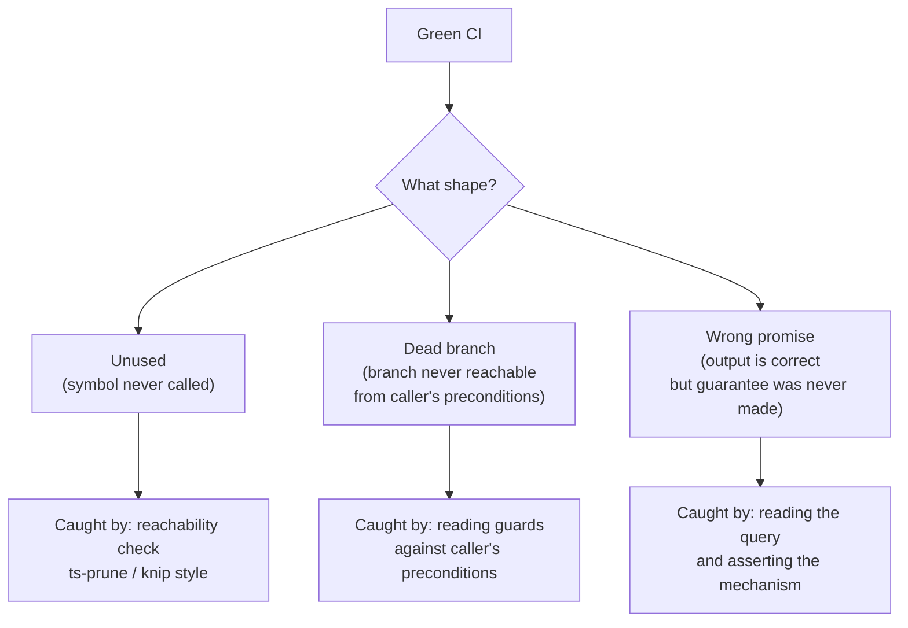

# Kiểm thử & fitness function

Chiến lược kiểm thử của Stemolly dựa trên hai ý tưởng đi cùng nhau. Thứ nhất, mọi quy tắc kiến trúc đều có một bài kiểm tra chạy được — một *fitness function* (bài kiểm tra cưỡng chế quy tắc kiến trúc) — được giao trong cùng pull request (yêu cầu hợp nhất mã) với phần mã mà nó quản lý. Thứ hai, một lần chạy CI (tích hợp liên tục) xanh là điều kiện bắt buộc để được merge, nhưng chưa đủ. Có nhiều lớp lỗi về bản chất là vô hình với kiểm thử tự động; chúng chỉ lộ ra khi con người đọc call path đang chạy của hệ thống thay vì nhìn đầu ra test. Trang này giải thích cả phần tự động hóa lẫn kỷ luật review — mỗi phần bao phủ điều gì và, quan trọng không kém, điều gì mỗi phần không thể nhìn thấy.

---

## Fitness function đi cùng phần mã của nó

Fitness function là bài kiểm tra dùng để cưỡng chế một quy tắc kiến trúc. Ở Stemolly, quy tắc là: bài kiểm tra phải được giao trong **cùng task** với phần mã mà nó quản lý, chứ không nằm ở một "giai đoạn kiểm thử" tách riêng và cũng không được viết sẵn trước khi đối tượng của nó tồn tại.

Đây không chỉ là sở thích về quy trình. Một bài kiểm tra vô nghĩa nếu đối tượng của nó chưa tồn tại, còn một bài kiểm tra viết sau thì rất dễ bị quên. Ở giai đoạn phát triển ban đầu, mỗi hàng rào kiểm soát đều được giao cùng đối tượng của nó: bài kiểm tra ràng buộc nhà cung cấp LLM đi cùng module `llm`; bài kiểm tra trigger chỉ-append đi cùng phần thiết lập Postgres; bài kiểm tra bao lỗi đi cùng gói contracts. Fitness function duy nhất được đưa vào trước là bài kiểm tra ranh giới phụ thuộc — vì nó quản lý *cấu trúc dự án*, và task về cấu trúc chính là đối tượng đó.

Một số fitness function được chủ ý để ở trạng thái "làm dở một nửa" khi đối tượng đầy đủ của chúng chưa sẵn sàng. Bài kiểm tra cho hành vi fail-safe của job handler phải chờ tới khi job runner tồn tại. Kiểm tra mới được một nửa thì chấp nhận được; tài liệu chỉ mới làm nửa vời thì không.

### Điểm mù về phạm vi: một hàng rào chỉ thấy được những gì nó chạm tới

Fitness function kiểm tra một *cơ chế cụ thể* cho một quy tắc vốn phát biểu một *ý định*. Khi cơ chế đó hẹp hơn ý định, những vi phạm không bao giờ đi qua cơ chế ấy vẫn xanh — và cả đội sẽ tin rằng mình có độ bao phủ mà thực ra không có.

Hai trường hợp đã được đo đếm, và cả hai đều do con người review phát hiện chứ không phải CI:

- **Kỷ luật config (G-18).** Quy tắc nói rằng: chỉ đọc cấu hình ở một nơi rồi inject ra mọi nơi khác. Fitness function sẽ đánh dấu `process.env` ở ngoài `config.ts` và `composition.ts`. Nó chỉ cưỡng chế được nửa đầu của quy tắc. Nếu một giá trị chính sách được viết thành hằng số hardcoded — ví dụ một TTL ở lớp domain thuần — thì sẽ không hề có lệnh gọi `process.env`, nên hàng rào này không thể nhìn thấy.
- **Ranh giới hexagonal (`domain-no-adapters-import`).** Quy tắc dependency-cruiser có mệnh đề `from` chỉ khớp với các tệp nằm dưới thư mục `domain/` của module. Một tệp application ở gốc module mà import adapter của chính nó thì nằm ngoài mệnh đề đó và vẫn qua được.

Điều cần kiểm tra có thể khái quát là: khi ghép một quy tắc với một fitness function, hãy gọi tên rõ những gì function đó **không nhìn thấy** và ghi lại khoảng trống ấy ngay bên cạnh quy tắc. Một bài kiểm tra quá hẹp đôi khi còn tốn sự chú ý hơn giá trị nó mang lại — vì nó khiến reviewer ít để ý hơn tới các vi phạm mà bản thân bài kiểm tra không thể bắt.

---

## Chỉ dùng mock LLM trong CI

Không kiểm thử tự động nào được phép gọi tới nhà cung cấp LLM thật. Điều này được cưỡng chế bằng một kiểm tra CI cụ thể, chứ không chỉ là một quy ước không ai xác minh.

Một test được đặt cùng suite của module `llm` sẽ resolve provider adapter đã cấu hình dưới `NODE_ENV=test` và khẳng định kết quả không bao giờ là `anthropic`, `openai`, hay `google` — chỉ có thể là `mock` (bản giả lập) hoặc `ollama`. Môi trường CI đặt `STEMOLLY_LLM_PROVIDER=mock` một cách tường minh; nó không bao giờ là mặc định ngầm. Nhờ vậy, provider nào đang hoạt động luôn hiện rõ trong môi trường. Nếu biến môi trường bị cấu hình sai và lẽ ra sẽ âm thầm phá vỡ quy tắc chỉ dùng mock, CI sẽ fail thay vì lặng lẽ cho qua.

---

## Các mẫu cô lập bằng testcontainers

Integration test dùng testcontainers (trình chạy container cho test) với một Postgres instance. Migration chạy một lần trên instance đó, và mỗi test bọc phần việc của mình trong `BEGIN`/`ROLLBACK` để cơ sở dữ liệu sạch cho test kế tiếp. Có ba tình huống cụ thể cần cẩn thận hơn.

### SAVEPOINT: bọc các lỗi được mong đợi

Postgres sẽ hủy toàn bộ transaction bao quanh khi bất kỳ câu lệnh nào phát sinh lỗi — kể cả `RAISE` trong trigger hay lỗi unique constraint. Nếu một test cố tình gây ra loại lỗi như vậy rồi chạy một truy vấn tiếp theo (ví dụ để khẳng định rằng hàng dữ liệu không đổi), thì truy vấn tiếp theo ấy sẽ lỗi với "current transaction is aborted" thay vì kiểm tra được điều gì có ích.

Cách sửa là dùng helper dùng chung `expectRejected(client, fn)`. Nó bọc câu lệnh bị lỗi trong cặp `SAVEPOINT`/`ROLLBACK TO SAVEPOINT` để Postgres có thể phục hồi bên trong transaction ngoài.

Có một ràng buộc quan trọng: `SAVEPOINT`, câu lệnh bị lỗi và `ROLLBACK TO SAVEPOINT` đều phải chạy trên **cùng một kết nối vật lý**. Một Postgres `Pool` sẽ phát ra một kết nối gộp có thể khác nhau cho mỗi lần gọi `.query()`. Nếu phát cặp SAVEPOINT qua `Pool`, hai câu lệnh có thể rơi vào hai kết nối khác nhau và lỗi với "ROLLBACK TO SAVEPOINT can only be used in transaction blocks".

Mọi câu lệnh trong transaction theo từng test — từ `BEGIN` mở đầu, lời gọi `expectRejected`, các truy vấn khẳng định, cho tới `ROLLBACK` cuối cùng — đều phải chạy trên một `PoolClient` (kết nối lấy riêng từ pool) được lấy ra qua `pool.connect()`. Đây là một lỗi lập lịch kết nối: một test chạy tuần tự có thể tình cờ tái sử dụng cùng một kết nối rồi pass, khiến lần chạy xanh không phát hiện ra gì. Khác biệt kiểu dữ liệu giữa `Pool` và `PoolClient`, cùng với code review, là hai cách bắt lỗi đáng tin cậy duy nhất.

```
// correct
const client = await pool.connect();
await client.query('BEGIN');
await expectRejected(client, () => client.query('INSERT INTO …'));
// assert row count here using client
await client.query('ROLLBACK');
client.release();

// wrong — pool may dispatch on different connections
await pool.query('BEGIN');
await expectRejected(pool, …);   // <-- type error: Pool, not PoolClient
```

### Hàng metering: giới hạn phạm vi theo đồng hồ của cơ sở dữ liệu

Bảng `metering.llm_calls` là append-only. Trigger của nó từ chối cả `UPDATE` lẫn `DELETE`, nên các cách dọn dẹp thông thường đều không dùng được:

- **`BEGIN`/`ROLLBACK` theo từng test không giúp gì** — bản ghi metering được ghi theo kiểu fire-and-forget (gửi đi rồi thôi) trên kết nối gộp riêng của nó, nên rollback transaction của test không đụng tới hàng đó.
- **`DELETE` thủ công trong `afterEach` sẽ ném lỗi** — trigger append-only sẽ kích hoạt.

Mẫu đang dùng trên thực tế là: lấy `SELECT NOW()` ngay trước mỗi request, rồi chỉ đếm những hàng có `created_at >= since`. Các test trong tệp chạy tuần tự trên một container dùng chung, nên sẽ không có ghi nào khác lọt vào cửa sổ thời gian của một test cụ thể. Không cần dọn dẹp.

Vì thao tác ghi là fire-and-forget, hàng dữ liệu có thể vẫn chưa tới nơi khi HTTP response trả về. Hãy đọc số lượng bằng một vòng poll ngắn thay vì chỉ query một lần. Nếu CI có dấu hiệu flaky (chập chờn), hãy nới deadline của poll — đừng chuyển sang chiến lược transaction hay DELETE.

### Teardown E2E: ghi lại handle ngay tại thời điểm tạo ra

Một `globalSetup` của Playwright khi lấy tài nguyên theo chuỗi — một Postgres container, một `AppContext`, một server đang lắng nghe — phải công bố **từng handle cho singleton teardown ngay tại thời điểm nó được tạo**, chứ không gom tất cả phép gán lại vào cuối.

Nếu setup ném lỗi giữa chừng (config sai, `buildServer()` thất bại, cổng đã bị chiếm), bất kỳ tài nguyên nào đã lấy được nhưng chưa kịp ghi lại sẽ vô hình với teardown và làm rò rỉ container còn sống.

Mẫu này là phần chịu tải quan trọng vì một hành vi rất cụ thể của Playwright: **`globalTeardown` vẫn chạy ngay cả khi `globalSetup` ném lỗi**. Vòng lặp task đăng ký teardown của từng task trước khi gọi setup của nó, nên một setup ném lỗi không thể bỏ qua teardown. Ryuk reaper của testcontainers là tuyến phòng thủ cuối cho các container bị rò rỉ, nhưng nó chạy chậm và không tất định — không thể thay cho đường `stop()` tường minh.

> **Lưu ý khi nâng cấp Playwright:** Nếu bạn chuyển từ tệp `globalTeardown` riêng sang mẫu hàm trả về, hãy kiểm tra lại rằng teardown vẫn chạy khi setup thất bại. Nếu thứ tự đó thay đổi, mẫu gán-ngay-lập-tức sẽ âm thầm trở thành thứ chỉ để trang trí.

---

## Họ lỗi "xanh nhưng sai"

Có ba kiểu lỗi mà một bộ test pass không thể nhìn thấy. Chúng có chung một nguyên nhân gốc: kiểm thử tự động xác thực một artifact (đối tượng mã được kiểm thử) đối chiếu với một contract (cam kết giao diện), chứ không xác thực nó với phần còn lại của hệ thống đang chạy.



### Xanh nhưng không được dùng

Một unit test chứng minh artifact hoạt động đúng. Nó không thể chứng minh rằng có gì đó thực sự gọi tới artifact ấy. Khi artifact và test của nó được viết cùng nhau, chúng có thể khớp hoàn hảo với nhau rồi cùng trôi xa — trong trạng thái vẫn đồng thuận — khỏi hệ thống mà lẽ ra chúng phải phục vụ. Cả suite vẫn xanh suốt quá trình đó.

Hai lỗi ở Sprint 1 đã được giao ra đúng theo kiểu này:

- Một resolver (`resolveTier()`) đã được cài đặt, đã có test, nhưng không hề có caller nào trong môi trường production. Tier và purpose chưa bao giờ được dùng để chọn model. Về sau nó đã được nối vào call path production và không còn là vấn đề nữa — nhưng mẫu lỗi tổng quát vẫn còn.
- Một schema xác thực log (`LogFieldsSchema`) được test trên các object dựng tay. Nó không thể xác thực nổi dù chỉ một dòng mà logger thật phát ra, vì định dạng đầu ra của logger thật không khớp với các object trong fixture.

Vì sao mọi cổng kiểm tra tự động đều bỏ lỡ: unit test chứng minh tính đúng đắn chứ không chứng minh khả năng được gọi tới; dependency-cruiser chỉ kiểm tra các cạnh phụ thuộc đang tồn tại có hợp lệ hay không, chứ không kiểm tra xem các cạnh cần thiết có tồn tại không; typecheck vẫn thỏa mãn với một symbol được export mà chẳng ai import; khi review diff, người ta thấy một module cùng các test đều pass và dễ đọc nó như thể đã hoàn tất.

Một kiểm tra CI rẻ tiền có thể giúp: fail nếu một symbol được export mà chỉ có các tệp `*.test.ts` import nó. Điều này bắt được trường hợp module không thể chạm tới. Nó **không** bắt được trường hợp fixture sai, nơi artifact có được import và sử dụng — chỉ là không bao giờ được đưa đầu ra thật của producer cho nó xem. Cả hai lỗi đầu tiên đều chỉ được phát hiện khi một con người chạy mã thật.

### Xanh nhưng chết ở cấp nhánh

Lần theo một acceptance criterion tới call path production có thể bắt được một symbol mà không ai gọi. Nhưng nó không bắt được một symbol *có* được gọi, song các nhánh nội bộ của nó lại không caller nào thực sự đi tới được.

Ví dụ đã làm việc thực tế là: luồng redeem của module `identity` trước tiên gọi một thao tác claim nguyên tử, rồi nếu thất bại mới gọi một helper ở domain để phân loại vì sao thất bại. Tới thời điểm helper đó chạy, nguyên nhân thất bại thực ra đã được biết rồi — bản ghi được truy xuất bằng token hash của nó, nên nhánh token-mismatch là bất khả thi. Trong bốn nhánh của helper, có một guard kiểm tra lại điều mà caller đã xác lập từ trước, còn đường `return record.role` thì không thể tới được. Unit test của hàm này có chạy happy path, vẫn xanh, và happy path lại chính là đường mà hệ thống đang chạy không bao giờ đi qua.

Kiểm tra rẻ tiền là: khi một đường đi đã lần theo kết thúc ở một hàm trả về giá trị, hãy đọc các guard của hàm đó đối chiếu với các tiền điều kiện của caller. Nếu mọi đường đều đảm bảo sẽ `throw`, hoặc một guard kiểm tra lại điều đã được xác lập ở phía trên, thì contract được khai báo và vai trò thực tế của hàm đang khác nhau. Một helper chỉ được dùng vì các exception của nó thì nên nói rõ điều đó — không kiểu trả về, không tham số nó không cần.

### Xanh nhưng thiếu cam kết về thứ tự

Một test khẳng định lên một đầu ra. Vì thế, về mặt cấu trúc nó mù trước một lỗi mà đầu ra hiện tại vẫn đúng nhưng sự đúng đó lại *không hề được hứa hẹn*.

Một truy vấn SQL không có `ORDER BY` là ví dụ kinh điển. Trên một bảng nhỏ, cơ sở dữ liệu gần như lúc nào cũng trả các hàng theo thứ tự chèn. Mọi test về tính tất định đều pass một cách trung thực. Nhưng cái cam kết mà các test đó tưởng như đang kiểm tra thì thực ra không hề tồn tại. Về sau, khi dữ liệu lớn hơn, có quét song song hoặc kế hoạch truy vấn thay đổi, nó mới hỏng — ở production.

Điều này khác với họ lỗi artifact-không-được-dùng. Artifact ở đây có được gọi, nằm trên đúng đường production thật, và trả về đáp án đúng — nhưng đúng vì lý do sai. Không có thêm khẳng định nào về đầu ra có thể bịt kín lỗ hổng này, vì lỗi nằm ở chỗ thiếu một ràng buộc chứ không phải có mặt một giá trị sai.

Hai hệ quả:

1. Những lỗi theo kiểu này được tìm ra bằng cách đọc mã và hỏi hệ thống *đang cam kết điều gì*, chứ không phải bằng cách chạy nó. Lỗi này đã sống sót qua nhiều vòng review và chỉ bị bắt khi một người đọc chính câu truy vấn.
2. Regression test đúng phải khẳng định vào *cơ chế*, chứ không phải hành vi: ghi lại câu SQL đã được gửi đi và khẳng định rằng có mặt mệnh đề `ORDER BY`. Cách này được chủ ý làm cho giòn — nó sẽ vỡ mỗi khi truy vấn bị viết lại, kể cả khi viết lại đúng. Cái giá đó được chấp nhận vì đây là cách neo một cam kết vốn không có triệu chứng quan sát được.

---

## Cô lập test: guard và harness tối giản

### Bán kính ảnh hưởng từ guard ở phạm vi plugin

Một guard (lớp chặn) được móc ở phạm vi plugin sẽ áp dụng lên mọi request trong namespace đó — kể cả request đến từ test. Khi bạn thêm một guard xác thực hoặc phân quyền ở cấp namespace, mọi test hiện có đang lái một route (tuyến xử lý) bên trong namespace ấy thông qua ứng dụng thật sẽ thôi không còn nhận response của route nữa mà bắt đầu nhận phản hồi từ chối của guard.

Các khẳng định sẽ fail, nhưng vì sai lý do. Route không hề bị chạm tới và vẫn đúng. Test lại báo có hồi quy ở route.

Cách sửa là tách mối quan tâm ra thay vì sửa kỳ vọng:

- Test route bằng cách mount **chỉ chính route đó** lên một Fastify instance trần, không có guard nào trong chuỗi xử lý.
- Test guard riêng, và khẳng định việc từ chối trong test chuyên biệt của chính nó.

Một test chỉ đơn giản đổi status kỳ vọng sang mã từ chối sẽ âm thầm mất toàn bộ độ bao phủ ban đầu cho logic riêng của route.

Bán kính ảnh hưởng này rất dễ bị đánh giá thấp vì các test bị ảnh hưởng trải dài qua nhiều tầng. Một thay đổi ở guard có thể đồng thời làm vỡ một unit test, một integration test và một E2E spec cùng chạm vào một đường đi. Các lệnh kiểm tra cục bộ thường chỉ chạy một tầng, nên vấn đề có thể vô hình ở máy local và chỉ lộ ra trong CI khi merge.

### Ứng dụng test dựng tay phải tái tạo composition root

Khi một route được mount lại trên một Fastify instance trần để né guard ở cấp namespace, test sẽ nhận các giá trị mặc định của framework thay vì các thiết lập mà ứng dụng production đã áp dụng lúc tạo `fastify()`. Route trông có vẻ là cùng một route, nhưng nó chạy theo cách khác.

Hai thiết lập đã chứng tỏ là then chốt trong trường hợp thực tế này:

- **Trang trí `traceId`.** Error handler dùng chung đọc `request.traceId`. Nếu thiếu `onRequest` hook ghi giá trị đó, response lỗi sẽ vỡ.
- **`ajv: { customOptions: { coerceTypes: false } }`.** Nếu thiếu, bộ biên dịch AJV mặc định của Fastify sẽ ép kiểu số `123` thành chuỗi `"123"` trước khi xác thực schema. Một test vốn khẳng định rằng body sai định dạng phải trả 400 sẽ lại thấy 200 — nếu sau đó nới kỳ vọng thì test sẽ pass vì sai lý do, và không còn bảo vệ được điều gì nữa.

Dạng tổng quát ở đây là: harness (khung dựng test) cô lập chỉ thừa hưởng những gì nó được viết lại một cách tường minh. Mọi hành vi được cấu hình tại composition root đều vô hình trong chính tệp của route. Khi dựng một harness tối giản, hãy đọc composition root và chủ động tái tạo lại các tùy chọn khởi tạo của nó.

---

## Bẫy chồng lấn trong ESLint flat config

Trong định dạng flat config của ESLint, nếu hai đối tượng cấu hình cùng đặt **cùng một rule id** và `files` glob (mẫu khớp tệp) của chúng chồng lấn nhau, chúng sẽ không được gộp — block xuất hiện sau sẽ thay thế hoàn toàn giá trị của block trước cho rule id đó.

Điều này đã gây ra một hồi quy âm thầm khi một fitness function mới tái sử dụng `no-restricted-syntax` cho một quy tắc áp dụng lên các tệp `**/index.ts`. Glob đó chồng lấn với block kỷ luật config sẵn có vốn nhắm tới `server/src/**/*.ts`. Việc thêm quy tắc mới đã âm thầm vô hiệu hóa ràng buộc `process.env` cho mọi `index.ts` bên trong `server/src/`.

Hồi quy này không bị reviewer đầu tiên, typecheck, lint tự thân nó (cả hai quy tắc riêng lẻ đều hợp lệ), hay bất kỳ cổng tự động nào bắt được. Nó chỉ bị phát hiện khi có một lần đọc diff thứ hai, theo kiểu đối kháng hơn.

**Cách sửa:** khi hai ràng buộc cùng phải áp dụng lên một tập tệp dưới cùng một rule id, hãy gộp chúng thành nhiều đối tượng selector trong cùng một mảng thuộc một block cấu hình duy nhất. Đừng bao giờ tách chúng thành các block riêng mà cả hai đều khai báo cùng một rule id trên các tệp bị chồng lấn.

---

## Lỗ hổng trong quy trình review

### Điểm mù về coupling và vị trí đặt mã

Rubric về vị trí đặt mã của bộ review tự động chủ ý loại trừ các phán đoán về coupling (độ phụ thuộc lẫn nhau), nguyên tắc "encapsulate what varies", và mọi tái cấu trúc dựa trên việc dự đoán hệ thống sẽ thay đổi ra sao. Những phần đó được chủ đích chuyển cho chế độ phê bình của người thiết kế. Nhưng phần phê bình thiết kế lại chấm theo bảy tiêu chí có tên rõ ràng — độ bao phủ yêu cầu, tính đúng đắn, độ rõ của giao diện, phương án thay thế, độ đơn giản, khả năng kiểm thử, tính nhất quán — và không tiêu chí nào bao trùm coupling, vị trí đặt mã hay tính đầy đủ của cấu trúc.

Trong vòng lặp này có một bước bàn giao tường minh từ agent nọ sang agent kia, nhưng rubric của bên nhận lại không có tiêu chí cho chính thứ đã được bàn giao. Cả hai agent đều hành xử đúng theo hợp đồng của mình. Phát hiện đó đã rơi đúng vào khe hở giữa hai bên.

Có hai yếu tố làm vấn đề nặng hơn: "độ rõ của giao diện" chỉ chấm xem một giao diện có đủ cụ thể để triển khai hay không, chứ không xem nó có *đầy đủ* hay không — một thiết kế chỉ đặc tả một trong hai bề mặt của port và im lặng về bề mặt còn lại vẫn qua được. Và khi cổng kiểm tra thiết kế chạy mà không có con người đọc, sự im lặng của thiết kế về một bề mặt còn thiếu sẽ lan sang mọi issue phía sau vốn chỉ đo mức độ tuân thủ với thiết kế đó.

Khoảng trống này cần reviewer là con người cho tới khi rubric của bên nhận có thêm một tiêu chí về tính đầy đủ của cấu trúc.

### Số Sprint không phải định danh bền vững

Số Sprint chỉ xác định một vị trí trong lịch, chứ không xác định một sự thật về hệ thống. Chèn thêm một sprint sẽ âm thầm dịch mọi số phía sau.

Điều này đã từng xảy ra ở Stemolly: một sprint được chèn vào roadmap đã đẩy mọi thứ phía sau xuống một bậc, làm thay đổi ý nghĩa của mọi câu "Sprint N" đã được viết trước đó — mà không đụng gì tới các tài liệu có nhắc tới chúng. Một tệp pointer và ít nhất một ghi chú đã gán công việc cho sai sprint, và nếu lập phạm vi một sprint dựa vào chúng thì kích thước của sprint đó sẽ bị đội lên gần gấp đôi.

**Quy tắc:** số sprint chỉ thuộc về master plan và các tệp sprint, là những thứ được đánh số lại cùng nhau như một khối. ADR, quy tắc, ghi chú quản trị và các trang wiki phải tham chiếu tới **năng lực và cổng chặn** — "cho tới khi Console Author tồn tại", "khi đã có nhiều loại plugin", "khi minor thật xuất hiện". Những cách gọi này sống sót qua mọi lần đánh số lại vì chúng gọi tên sự thật của hệ thống, chứ không phải vị trí trong kế hoạch. Một decision record tuyệt đối không nên mang số sprint, kể cả chỉ vô tình nhắc qua, vì bản ghi đó sống lâu hơn lịch trình đã sinh ra nó.

---

## Tham khảo nhanh

| Pattern | Cái bẫy | Cách sửa |
|---|---|---|
| Rollback theo từng test với lỗi được mong đợi | Lỗi câu lệnh làm hủy transaction ngoài | Bọc bằng `expectRejected(client, fn)` dùng cặp SAVEPOINT trên một `PoolClient` duy nhất |
| Khẳng định hàng metering | Hàng là append-only, fire-and-forget | Giới hạn theo `SELECT NOW()` trước request; poll chờ hàng xuất hiện |
| Teardown của global setup E2E | Rò rỉ khi setup ném lỗi giữa chừng | Ghi lại từng handle tài nguyên ngay tại lúc tạo ra |
| Guard ở phạm vi plugin | Làm vỡ mọi test route trong namespace | Mount riêng route lên một instance trần; test guard tách riêng |
| Ứng dụng test tối giản | Âm thầm làm mất các thiết lập ở composition root | Tái tạo các tùy chọn `fastify()`, đặc biệt là `coerceTypes: false` |
| ESLint flat config | Block sau thay thế block trước, không gộp | Gộp các selector vào một block cấu hình duy nhất |
| Số sprint trong tài liệu | Sai âm thầm sau bất kỳ lần đánh số lại nào | Tham chiếu tới năng lực và cổng chặn, không tham chiếu vị trí sprint |
