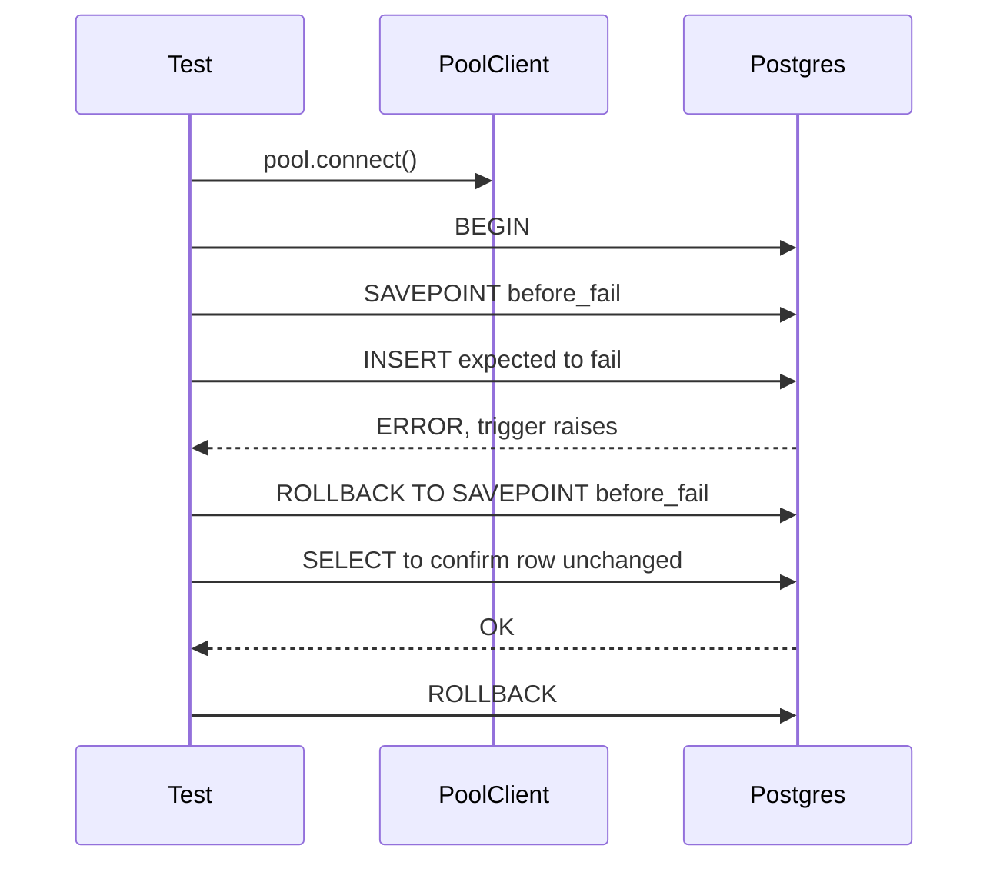
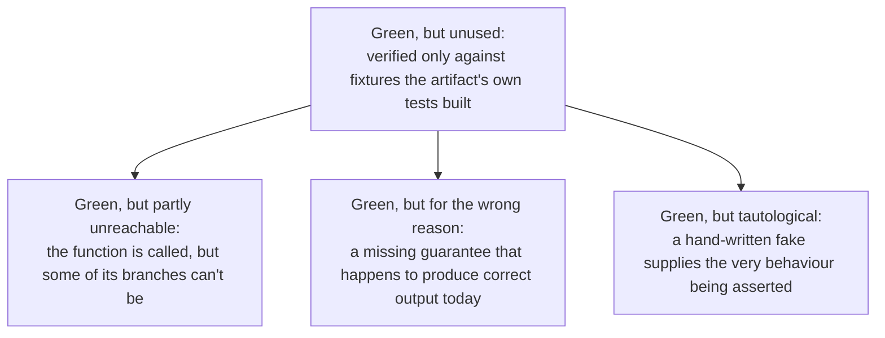
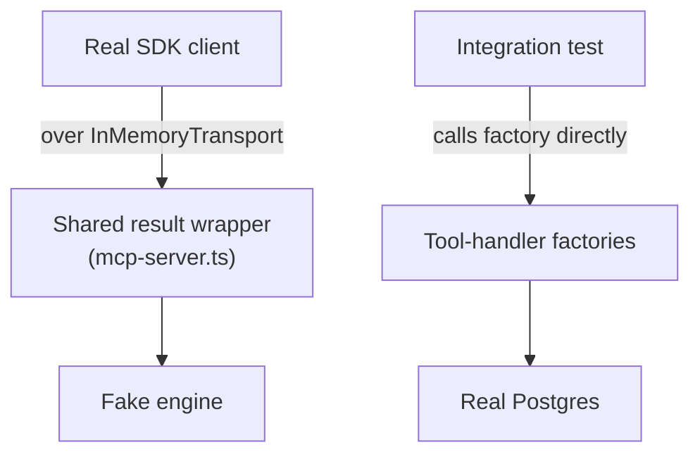

Ở đây, test làm hai việc. Test thông thường kiểm tra xem mã có làm đúng điều nó phải làm hay không. **Fitness function** là một loại test thứ hai — mã dùng để kiểm tra xem *kiến trúc* tự thân của hệ thống còn giữ đúng hay không, chẳng hạn như “không module nào được import một nhà cung cấp LLM thật” hoặc “không có mã adapter nào nằm trong thư mục domain.” Phần lớn trang này không phải lời khuyên kiểm thử chung chung; nó là một danh mục những cách rất cụ thể mà một bộ test xanh hoàn toàn vẫn để lọt một lỗi thật, và trong mọi trường hợp, lỗi đều do con người đọc mã mà phát hiện chứ không phải CI. Mẫu lặp này xảy ra đủ nhiều để trở thành đúng bản chất của chủ đề này: xanh là điều cần có, nhưng ở đây chưa bao giờ tự nó là đủ.

## Fitness function được phát hành cùng phần mã mà chúng kiểm tra

Một fitness function được viết trong chính task xây ra thứ mà nó quản trị, chứ không bao giờ là một “giai đoạn governance” riêng làm trước từ đầu. Lý do rất đơn giản: một phép kiểm tra là vô nghĩa nếu chủ thể của nó còn chưa tồn tại. Khi sprint nền tảng của dự án được lên kế hoạch, chỉ duy nhất task đầu tiên — bộ khung thư mục — có fitness function đi trước, vì toàn bộ nhiệm vụ của task đó *chính là* cấu trúc mà phép kiểm này xác minh. Mọi quy tắc khác đều được phát hành cùng chủ thể của chúng: kiểm tra error envelope đi cùng gói contracts, kiểm tra cơ sở dữ liệu append-only đi cùng Postgres, kiểm tra kỷ luật logging đi cùng logger, v.v.

Một số phép kiểm được cố ý phát hành ở trạng thái “làm dở một nửa”, chỉ bao phủ phần quy tắc mà chủ thể đã tồn tại, còn nửa kia được ghi rõ là sẽ bổ sung sau khi phần chủ thể tương ứng cũng được xây xong. Đây là chuyện bình thường, không phải lỗ hổng — miễn là nửa còn thiếu được theo dõi và không bị lặng lẽ quên đi (xem [Nơi người review có điểm mù](#nơi-người-review-có-điểm-mù) để thấy điều gì xảy ra khi nó bị quên).

## Không có test tự động nào được gọi tới LLM thật

:::caution
CI tuyệt đối không được resolve tới một nhà cung cấp LLM thật. Điều này được cưỡng chế bằng test, không chỉ bằng quy ước.
:::

Một test sống cùng suite của chính module LLM sẽ resolve nhà cung cấp nào đang được cấu hình dưới `NODE_ENV=test` và khẳng định rằng nó không bao giờ là `anthropic`, `openai`, hay `google` — chỉ `mock` hoặc `ollama` mới được phép. CI đặt `STEMOLLY_LLM_PROVIDER=mock` một cách tường minh, không dùng như một giá trị mặc định ngầm, để nhà cung cấp đang hoạt động luôn hiện rõ trong môi trường thay vì phải suy ra. Mục tiêu của việc biến đây thành một test, thay vì một quy tắc viết ra rồi tin ai đó sẽ làm theo, là để một biến môi trường cấu hình sai sẽ làm build thất bại thay vì âm thầm tiêu tốn API call thật trong CI.

## Các mẫu Testcontainers, và cơ chế CI xoay quanh chúng

Phần lớn integration test chạy trên một Postgres thật được khởi động bởi [testcontainers](https://testcontainers.com/), chứ không phải cơ sở dữ liệu giả. Cách đó đem lại tính chân thực, nhưng Postgres thật cũng đi kèm các quy tắc transaction thật, và nhiều quy tắc trong số đó đã khiến dự án này vấp ngã theo những cách không hề hiển nhiên.

### Một test mong đợi thất bại cần `SAVEPOINT` riêng của nó

Mẫu cô lập thông thường sẽ bọc mỗi test trong `BEGIN` trước khi chạy và `ROLLBACK` sau khi xong, để migration chỉ cần chạy một lần và test vẫn nhanh. Vấn đề là: Postgres sẽ hủy *toàn bộ* transaction bao quanh ngay khi bất kỳ câu lệnh nào thất bại — ví dụ trigger từ chối hay vi phạm unique constraint — nên nếu một test cố ý gây ra lỗi đó rồi chạy tiếp một truy vấn kế tiếp (chẳng hạn để kiểm tra hàng dữ liệu vẫn không đổi), chính truy vấn kế tiếp ấy sẽ lại lỗi với thông báo “current transaction is aborted.”

Giải pháp là một helper dùng chung `expectRejected(client, fn)` bọc phần thất bại được mong đợi trong cặp `SAVEPOINT` / `ROLLBACK TO SAVEPOINT` riêng, để transaction bên ngoài của test vẫn sống sót. Có thêm một quy tắc nữa ở đây: một `SAVEPOINT` chỉ có hiệu lực trong đúng một kết nối vật lý tới cơ sở dữ liệu, còn connection pool có thể phát ra một kết nối pooled *khác* cho mỗi truy vấn. Vì thế `expectRejected` phải nhận một `PoolClient` đã được lấy ra, chứ không phải chính `Pool` — nếu không thì `SAVEPOINT` và `ROLLBACK TO SAVEPOINT` có thể rơi vào hai kết nối khác nhau và hỏng hoàn toàn. Loại lỗi này phụ thuộc vào timing: một test có thể tình cờ may mắn, rơi đúng vào cùng kết nối và pass — nên nó được chặn bởi sự phân biệt kiểu giữa `Pool` và `PoolClient`, và bởi code review, chứ không thể trông cậy vào một lần chạy xanh để bắt ra.

### Một hàng metering không thể rollback hay delete, nên nó được khoanh theo đồng hồ

Các bản ghi metering được ghi theo kiểu fire-and-forget: đoạn mã ghi nhận một lần gọi LLM không chờ nó hoàn tất, và bản ghi sẽ rơi vào bất kỳ kết nối pooled nào đang rảnh — chứ không phải transaction riêng của test đang được giữ. Vì vậy, việc rollback transaction của test sẽ không xóa nó đi. Tệ hơn nữa, bảng metering là append-only, nên ngay cả phương án dự phòng là `DELETE` trong bước cleanup cũng bị cơ sở dữ liệu từ chối.

Mẫu đang dùng là chụp `SELECT NOW()` ngay trước mỗi request rồi về sau chỉ đếm những hàng được tạo sau mốc thời gian đó. Vì các test trong file đó chạy tuần tự, sẽ không có ghi nào khác rơi vào cửa sổ thời gian của từng test. Việc đếm này cũng phải được *poll* thay vì đọc đúng một lần, vì hàng dữ liệu có thể xuất hiện muộn hơn một chút sau khi HTTP response đã trả về.

### `globalTeardown` vẫn chạy ngay cả khi `globalSetup` ném lỗi

Bộ harness end-to-end khởi động nhiều tài nguyên trong `globalSetup` — một Postgres từ testcontainers, một pooled connection, một server đang lắng nghe. Nếu setup ném lỗi giữa chừng (cấu hình sai, cổng đã bị dùng), bất kỳ thứ gì đã được tạo ra nhưng chưa kịp ghi lại thành handle sẽ vô hình với teardown và bị rò rỉ. Cách sửa là công bố từng handle vào đối tượng teardown dùng chung ngay khi nó được tạo, thay vì dồn cả lô tới cuối setup.

Điều này hoạt động nhờ một hành vi của Playwright đáng nói rõ, vì bản thân mã harness không hề nói ra: Playwright thật sự có chạy `globalTeardown` ngay cả khi `globalSetup` ném lỗi, và nó chạy *sau* phần setup thất bại — điều này được xác minh trực tiếp từ chính source của Playwright. Reaper (Ryuk) của riêng Testcontainers đúng là một lớp dự phòng có thật, cuối cùng sẽ dọn các container bị bỏ mồ côi, nhưng nó chậm và không quyết định trước được, nên không thể thay cho đường teardown tường minh.

### Biến môi trường trong `docker-compose.yml` không tự động xuất hiện

Một service trong docker-compose chỉ nhận được một biến môi trường khi chạy nếu chính service đó, trong khóa `environment:` hoặc `env_file:`, có nêu tên biến ấy — việc nội suy `${VAR}` chỉ thay thế văn bản *bên trong* file compose, chứ không tự chích bất cứ gì vào tiến trình của container. Một test Testcontainers khởi động riêng image của service rồi truyền biến môi trường trực tiếp vào sẽ bỏ qua hoàn toàn cách nối dây thực tế trong file compose, nên tính đúng đắn thật của file compose chưa bao giờ được kiểm thử, dù bộ test có xanh đến đâu.

Điều này đã tạo ra một lỗi thật khi phát hành: service edge (Caddy) trên VPS deploy không có khối `environment:` nào cả, nên trong triển khai thật Caddy sẽ không bao giờ nhận được biến hostname hay bearer-token — nhưng integration test của chính service đó lại truyền trực tiếp những biến này cho một container chạy độc lập, nên test vẫn xanh bất kể thế nào. Một reviewer đọc trực tiếp file compose đã bắt ra lỗi này, chứ không phải bất kỳ test nào. Cách sửa là viết một regression test chuyên dụng: parse file compose thật và khẳng định rằng mọi biến mà cấu hình downstream tham chiếu tới đều thật sự được khai báo trong `environment`/`env_file` của chính service đó.

### Một job CI có import chéo package cần bước build riêng của chính nó

Mỗi job trong workflow CI đều bắt đầu từ một checkout sạch, bất kể một job ngang hàng trong cùng workflow đã làm gì trước đó. Có một integration test import package khác bằng tên module trần của nó; cách resolve này đi qua đầu ra đã biên dịch của package kia — một thư mục `dist/` bị gitignore và chỉ tồn tại cục bộ sau khi ai đó đã build. Chạy test đó ngay sau `pnpm install`, mà không có bước build, thì trên máy của lập trình viên có thể tình cờ vẫn chạy được (vì `dist/` cũ còn nằm đó), nhưng trên một checkout CI thật sự sạch sẽ nó sẽ lỗi resolve module, và nhìn chẳng giống một lỗi test thật chút nào. Mọi job chạy mã có phụ thuộc vào import runtime chéo package đều cần bước build riêng của chính nó — kết quả build từ job ngang hàng không tự mang theo được.

## Các test harness âm thầm lệch khỏi production

Hai cái bẫy đặc trưng của Fastify có chung một nguyên nhân gốc: một test cô lập route khỏi toàn bộ ứng dụng có thể đồng thời cô lập luôn route ấy khỏi những thiết lập mà nó cần để hành xử đúng.

**Một app test tự dựng bằng tay sẽ thừa kế thiết lập mặc định của framework, chứ không phải thiết lập production.** Những thiết lập được cấu hình một lần tại nơi ứng dụng thật được dựng — các quy tắc ép kiểu request body, hay các request-scoped decoration mà shared error handler dựa vào — là thuộc tính của *chính instance đó*, chứ không thuộc về các route được mount lên nó. Một test tự dựng instance Fastify trần để kiểm tra riêng một route sẽ nhận các mặc định của framework thay vào đó. Phiên bản nguy hiểm của điều này là: nếu không áp lại thiết lập production vốn tắt tính năng ép kiểu tự động, một request body sai dạng như số `123` sẽ bị ép ngầm thành chuỗi `"123"` trước khi bước validation chạy — thế là một test định khẳng định “body sai thì trả 400” lại quan sát ra 200, và pass vì đúng *lý do sai*. Nó không thất bại ồn ào; nó chỉ lặng lẽ ngừng bảo vệ bất cứ điều gì. Quy tắc rút ra là: khi dựng một harness cô lập cho test, hãy đọc mã dựng ứng dụng thật và chủ động sao chép các thiết lập mà nó áp dụng, đồng thời xác nhận rằng những assert kiểu “cái này phải fail validation” vẫn thật sự fail nếu mã thật bị làm hỏng.

**Một guard được thêm ở cấp plugin có thể âm thầm làm hỏng toàn bộ test cũ trên nhánh đường đó.** Nếu một guard theo kiểu fail-closed được hook ở cấp namespace, mọi request đi vào namespace đó đều phải đi qua nó — bao gồm cả các request test dựng app thật rồi inject vào một route bên trong. Khi đó các test ấy bắt đầu nhận về sự từ chối của guard thay vì response thật của route, rồi báo ra một regression ở route vốn hoàn toàn không hề thay đổi và vẫn đúng. Cách sửa không phải là cập nhật kỳ vọng của test sang phản hồi bị từ chối — làm vậy là lặng lẽ xóa luôn vùng bao phủ ban đầu của chúng — mà là kiểm thử route và guard một cách tách biệt: route một mình trên instance trần, không có guard trong chuỗi; còn hành vi của guard thì ở test chuyên dụng của chính nó. Kiểu va chạm này rất dễ bị đếm thiếu vì các test bị ảnh hưởng nằm rải ở tầng unit, integration, và end-to-end, còn một lệnh check cục bộ chỉ chạy một vài tầng trong đó vẫn có thể xanh, trong khi CI sẽ đỏ ở phần còn lại.

## Bốn cách một bộ test xanh nói dối bạn

Một unit test chỉ chứng minh rằng một artifact tôn trọng *chính contract của nó*. Nó không thể nhận ra rằng chẳng có gì trong hệ thống đang chạy thật sự gọi tới artifact đó, hay caller thật lại cấp cho nó thứ khác với thứ mà test tự dựng bằng tay. Trong codebase này đã từng phát hành bốn hình dạng khác nhau của vấn đề đó; mỗi hình dạng đều vô hình với một bộ test xanh hoàn toàn, và chỉ bị phát hiện khi con người đọc mã thật:

**Xanh nhưng không ai dùng.** Một resolver đã được triển khai, được test, và xanh — nhưng chẳng có mã production nào gọi tới nó cả, nên trên hệ thống thật nó chưa từng chọn gì. Ở một chỗ khác, một schema chỉ xác thực những object do chính test của nó dựng bằng tay, và không thể nào xác thực nổi dù chỉ một dòng thật mà production logger phát ra. Không lỗ hổng nào trong hai lỗ hổng này hiện ra trong unit test (vì unit test chỉ chứng minh artifact chạy được, chứ không chứng minh có ai dùng nó), trong dependency check (vì nó chỉ kiểm tra các cạnh phụ thuộc *đang tồn tại*, chứ không kiểm tra các cạnh *đáng lẽ phải có* mà lại không có), hay trong diff review (vì một module kèm test pass của chính nó trông rất hoàn chỉnh). Cách phòng thủ là hỏi xem một acceptance criterion có lần theo được tới một call path production thật hay không, chứ không chỉ là có test hậu thuẫn; và một phép kiểm tự động rẻ tiền có thể bắt được nửa “không có gì import nó” của vấn đề này (một symbol được export mà chỉ có file test import), dù nó không bắt được nửa “fixture sai”.

**Xanh nhưng có nhánh không bao giờ chạm tới được.** Ngay cả một hàm *có* được chạm tới qua call path production đã được xác thực thì vẫn có thể mang những nhánh mà production không bao giờ đi vào được. Một đường redemption gọi atomic claim trước và chỉ rơi về một helper phân loại khi bị lỗi — đến lúc đó thì một trong bốn nhánh của helper ấy đã trở thành bất khả về mặt logic, cùng với luôn giá trị trả về mà nó khai báo. Chữ ký của hàm hứa hẹn một giá trị trả về; nhưng trong hệ thống chạy thật, nó luôn ném lỗi. Phép kiểm rẻ ở đây là: khi một call path đã được lần vết kết thúc ở một hàm có trả gì đó, hãy đọc các guard của hàm đó đối chiếu với những gì caller của nó đã bảo đảm từ trước. Nếu mọi đường đi vào đều dẫn đến throw, thì contract được khai báo và hành vi thật đã âm thầm lệch nhau.

**Xanh nhưng vì đúng lý do sai.** Một test chỉ assert trên đầu ra thì về mặt cấu trúc bị mù trước một lời hứa mà hệ thống thực ra chưa hề đưa ra. Ví dụ sạch nhất là một truy vấn SQL không có `ORDER BY`: trên một bảng nhỏ, Postgres phần lớn thời gian sẽ tình cờ trả hàng theo thứ tự chèn vào, nên mọi test kiểu “thứ tự có đúng không” đều pass một cách chân thật — cho tới khi một bảng lớn hơn, một parallel scan, hay một query plan thay đổi khiến production vỡ đúng một lần. Kiểu lỗi này được tìm ra bằng cách đọc mã và hỏi hệ thống *cam kết* điều gì, chứ không phải bằng cách chạy nó. Test cho trường hợp này cố ý đi ngược lời khuyên thường thấy: nó assert vào chính cơ chế (SQL thật được gửi đi phải chứa mệnh đề sắp thứ tự) chứ không phải hành vi — sự giòn này là có chủ đích, vì đó là cách duy nhất để đóng đinh một cam kết vốn không có triệu chứng nhìn thấy được cho tới lúc nó gãy.

**Xanh nhưng vòng vo tự chứng minh chính mình.** Khi unit test thay thế dependency thật bằng một fake viết tay, trong khi điều mà đối tượng đang test thực ra lại chính là *độ đúng của dependency đó*, test sẽ trở thành vòng tròn khép kín. Trong một trường hợp, bản sửa yêu cầu một phép tra cứu phải được khoanh đúng theo category — nhưng repository giả trong test đã tự tay trả kết quả đúng theo category rồi, nên test pass dù tra cứu production thật có hề được khoanh hay không. Một test như vậy không phải vô giá trị; nó chứng minh caller truyền đúng đối số đi qua, và không hơn gì nữa. Nó không thể đỏ vì đúng lý do mà nó có vẻ như đang kiểm thử, bởi muốn vậy fake và triển khai thật phải chủ động bất đồng với nhau. Khẳng định hành vi thật chỉ có thể được xác minh trên triển khai thật — Postgres thật, entry point thật của module — và phải xác nhận rằng mã trước khi sửa đúng là tạo ra lỗi thật trước đã. Còn cách sửa sai là dạy fake tái tạo lại bug: làm vậy chỉ ghim hình dạng của một lỗi lịch sử cụ thể, chứ không ghim quy tắc thật, và nó lỗi thời ngay khi bug được sửa.

## MCP: vùng bao phủ mặc định sẽ mục đi theo thời gian

Shared result wrapper của adapter MCP nằm bên dưới mọi tool đã đăng ký, khiến nó trở thành một điểm lỗi đơn lẻ — và đã có lúc, không đường test thật nào đi qua nó cả. Một suite test lái một client thật qua một wire transport thật, nhưng lại nhắm vào một engine giả. Suite kia thì chạm tới Postgres thật, nhưng bằng cách gọi trực tiếp các hàm xử lý tool, bỏ qua wrapper hoàn toàn. Thế là đúng cái mảnh mà mọi tool đều phụ thuộc lại chưa bao giờ được chạy với *cả* transport thật *và* cơ sở dữ liệu thật cùng lúc, và một lỗi ở đó vẫn vô hình trước một bộ test xanh hoàn toàn lẫn trước một lần lần vết từng criterion, vì cách lần vết ấy chỉ xác nhận rằng có một call path tồn tại — chứ không nói gì về việc phản hồi trả ra bị méo ở đầu ra.

Vấn đề sâu hơn nằm ở cấu trúc, không phải một khe hở nhất thời: vùng bao phủ của wrapper này từ trước tới nay chỉ được thêm từng tool một, bởi ai tình cờ nhìn thấy nó đúng lúc lỗi nổi lên. Không có gì khóa số lượng đó lại, nên mỗi tool mới đăng ký đều mặc định bước vào trạng thái chưa được bao phủ — khoảng trống không chỉ còn nguyên, mà còn rộng ra theo công việc tính năng thường ngày. Sau mỗi lần sửa riêng lẻ, wrapper lại trông như “đã được bao phủ”, vì nó thật sự có mặt trên đường đi của *một vài* test; trong khi thuộc tính thật sự quan trọng — mọi tool được khai báo đều được lái ít nhất một lần qua transport thật vào cơ sở dữ liệu thật — vẫn không hề được đo đếm. Muốn đóng lỗ hổng này đúng cách thì cần một fitness function trên *bề mặt tool đã khai báo*, đếm theo số tool chứ không theo số dòng: một wrapper xử lý mười tool trong một đường mã duy nhất có thể nhìn như đã được line coverage 100% chỉ sau một test, trong khi chín dạng phản hồi còn lại vẫn chưa hề được chứng minh.

Một lớp cảnh báo nữa cùng kiểu vẫn áp dụng ngay cả khi một tool đã được lái qua transport thật: một phản hồi `tools/call` thành công với `isError: false` chỉ chứng minh rằng handler không ném lỗi. Nó không nói được gì về việc thao tác ghi mà nó tuyên bố đã thực hiện có thật sự chạm vào cơ sở dữ liệu hay không. Bằng chứng độc lập ở đây là phải tự truy vấn trực tiếp store và kiểm tra xem hàng dữ liệu có ở đó không — với bất kỳ adapter nào đứng trước trạng thái bền vững, chính store mới là nhân chứng thật sự duy nhất.

## Nơi người review có điểm mù

Các cổng tự động và các lượt review của con người mỗi loại chỉ kiểm tra một thứ rất cụ thể — và từng loại có thể đều được thỏa mãn hoàn toàn trong khi một lỗi thật vẫn ung dung đi xuyên qua khe hở giữa điều nó kiểm tra và điều quy tắc thật sự muốn nói.

**Một phép kiểm chỉ nhắm vào một cơ chế sẽ bỏ sót mọi thứ né qua cơ chế đó.** Một quy tắc có thể diễn đạt một ý định rộng, trong khi phép kiểm cưỡng chế của nó chỉ nhìn một dạng vi phạm hẹp. Một quy tắc về kỷ luật cấu hình sẽ gắn cờ các lần đọc biến môi trường vương vãi bên ngoài hai file được chỉ định — nhưng hoàn toàn không nói gì về một giá trị chính sách bị hardcode thẳng vào một layer vốn không bao giờ nên chứa chính sách, bởi giá trị hardcode đó đâu có lần đọc biến môi trường nào để mà bị gắn cờ. Một quy tắc phụ thuộc khác thì chỉ xem các file nằm dưới thư mục `domain/`, nên một vi phạm nằm ở file cấp cao nhất của module, bên ngoài thư mục đó, vẫn qua cửa sạch sẽ. Bài học tổng quát là: khi ghép một quy tắc với một phép kiểm tự động, hãy gọi tên rõ những gì phép kiểm ấy *không nhìn thấy được* và ghi khe hở đó cạnh quy tắc — một phép kiểm bắn trúng một dạng vi phạm có thể khiến reviewer ít có xu hướng đi tìm các dạng còn lại hơn.

**Một acceptance criterion sai thì mọi cổng ở hạ lưu đều không thể nhìn thấy.** Mọi cổng sau khi task đã được viết ra — test, review pass, lần vết từ criterion đến mã — đều coi criterion đã viết là sự thật gốc. Đó chính là lý do chúng là các cổng. Nhưng cũng vì vậy, một criterion mơ hồ hoặc đơn giản là sai sẽ tạo ra một lượt chạy sạch hoàn toàn: mã thỏa cái đã viết, test ghim cái đã viết, lần vết xác nhận nó có thể đi tới được, và chẳng có gì trong chuỗi đó đứng ở vị trí để hỏi xem criterion ấy có đặc tả *đúng điều cần đặc tả* hay không. Có một criterion chưa bao giờ chốt rõ rằng một phép tra cứu có nên được khoanh theo category hay không; phần triển khai chọn một cách hiểu, test mã hóa luôn chính cách hiểu đó, và cả hai lượt review đều hoàn thành đúng các câu hỏi mà rubric của chúng yêu cầu — trong khi sự lệch phạm vi thật sự nằm hoàn toàn ngoài các câu hỏi ấy. Kết luận thực tế là: một hồ sơ cổng sạch chỉ đo mức độ khó của task, chứ không đo nó có khả năng sai bao nhiêu; và ở thời điểm review, criterion đáng được đọc lại như một nghi phạm, chứ không nên mặc định tin là đã ngã ngũ.

**Số sprint không an toàn để đưa vào ADR hay hồ sơ governance.** Một số sprint chỉ xác định vị trí trong lịch, chứ không phải một sự thật về hệ thống. Khi một sprint mới được chèn vào roadmap, số của mọi sprint phía sau sẽ âm thầm dịch chuyển, và bất kỳ tài liệu nào từng nói “Sprint N” giờ sẽ trỏ sang công việc khác mà không cần thay đổi một chữ nào trong tài liệu đó. Quy tắc ở đây là: ADR và ghi chú governance phải tham chiếu tới năng lực và các gate — như “cho tới khi Console Author tồn tại”, “khi đã có nhiều loại plugin” — chứ không được tham chiếu số sprint. Các file sprint và master plan được đánh số lại cùng nhau như một đơn vị; mọi thứ khác đều phải bất biến trước việc đánh số lại đó.

**Ghi chú “việc tương lai” ngay trong ADR không phải là một cam kết đang được theo dõi.** Một quyết định đã được chấp thuận từng nêu đích danh một import sai chỗ ở một file cụ thể và yêu cầu phải xóa nó. Mười hai ngày sau, import ấy vẫn còn nguyên — và chỉ bị phát hiện khi có người đọc cây mã trong một lượt review không liên quan. Quyết định đó mô tả ranh giới mà nó bảo vệ dưới dạng một danh sách các file riêng lẻ, biến việc cưỡng chế thành nghĩa vụ theo từng file; còn phép kiểm cho một trong những file ấy lại được chính văn bản ADR gọi là thứ mà một quy tắc trong tương lai “có thể” làm — và rồi đơn giản là chẳng bao giờ được viết. Một codebase anh em có phép kiểm tương đương; codebase này thì không, và cũng chẳng có gì khiến sự bất đối xứng đó lộ ra. Không có gì thất bại khi “việc tương lai” mà ADR nêu ra bị bỏ lửng, nên hồ sơ trông như thể đã được cưỡng chế, trong khi thực tế thì không.

**Một phát hiện trong review có thể rơi tõm vào khe hở thật giữa hợp đồng của hai agent.** Một reviewer thiết kế tự động nói rõ rằng nó không phán xét về coupling hay vị trí cấu trúc, với lý do đó là việc của human designer ở thời điểm design — trong khi checklist critique của chính người thiết kế, bao phủ bảy tiêu chí riêng, cũng không hề có dòng nào dành cho coupling hay placement. Cả hai reviewer đều hành xử đúng theo quy tắc riêng của mình; phát hiện ấy chỉ đơn giản rơi vào khoảng trống ở giữa, và nó đã từng tái diễn một lần trước đó mà vẫn không được sửa. Việc loại trừ đó chỉ hợp lý nếu thật sự có ai đó bắt lấy phần được bàn giao — đây là một rủi ro thường trực, chứ chưa phải một vấn đề đã khép lại.

**Một rule cấu hình ESLint có thể âm thầm vô hiệu hóa một phép kiểm coverage mà nó chẳng hề định chạm vào.** Trong định dạng flat-config của ESLint, khi hai block cấu hình riêng cùng đặt một rule giống nhau cho các file có vùng chồng lấp, cấu hình của block đăng ký sau cho rule đó sẽ *thay thế* block trước, chứ không hợp nhất. Việc thêm một rule mới dùng lại id của rule cũ, trên một pattern file tình cờ đè lên một block về kỷ luật cấu hình đã có, đã âm thầm tắt luôn lớp bảo vệ của block kia cho mọi file mà pattern của rule mới chạm tới — và không có kiểm tra tự động nào bắt ra điều đó, vì xét riêng từng block thì cả hai đều hợp lệ. Phải tới một lượt review thứ hai, có chủ đích đối kháng, mới nhận ra. Cách sửa là: khi hai hạn chế cần cùng áp lên một tập file dưới cùng một rule id, hãy gộp chúng vào một block cấu hình với nhiều selector, đừng bao giờ tách thành nhiều block riêng cùng nhận quyền lên một rule cho cùng tập file.

**Đọc đúng từng chữ trong ADR quan trọng hơn là tin vào bản tóm tắt của nó — và điều này đã xảy ra hai lần ngay trong cùng một lượt review.** Một ghi chú truy xuất, dùng để diễn giải lại một phương án thiết kế đã bị bác bỏ, đã đánh rơi chính mệnh đề khiến việc bác bỏ trở nên quyết định, làm cho bản tóm tắt nghe giống như hai chi phí tương đối ngang nhau trong khi ADR nguồn nêu hẳn một trong số đó là lý do mà toàn bộ quyết định đặt trọng tâm vào. Một reviewer chỉ đọc ghi chú ấy đã đề xuất lại đúng phương án từng bị bác, rồi phải rút lại sau khi đọc trực tiếp ADR.

:::caution
Ghi chú chỉ là điểm trỏ phục vụ truy xuất, không bao giờ thay thế được hồ sơ gốc. Trước khi đề xuất bất cứ điều gì mà ADR liệt kê là phương án đã bị bác bỏ, hãy mở ADR và đọc trực tiếp phần đó.
:::

Chính phiên review ấy lặp lại sai lầm dưới một hình thức thứ hai ngay sau khi vừa sửa xong hình thức đầu. Bất biến của ADR nói rằng một uuid bị cấm trong prompt, trong đối số, *và* trong kết quả mà model nhìn thấy. Một đề xuất tiếp theo chỉ sửa trường hợp đối số, với lập luận rằng đối số cho model *ghi* ra một uuid, còn kết quả chỉ cho nó *đọc* một uuid — đó đúng là khác nhau về mặt rủi ro, nhưng không phải là phân biệt mà bản thân ADR hề đưa ra, và trên thực tế kết quả mới chính là nơi một uuid đi vào ngữ cảnh của model ngay từ đầu. Cả hai lần đọc sai đều không phải bất cẩn; chúng là cùng một kiểu nén — dựng lại một quy tắc từ phần có vẻ quan trọng nhất rồi âm thầm bỏ rơi phần còn lại. Quy tắc làm việc rút ra từ cả hai là: khi một đề xuất đụng tới một ADR đã được chấp thuận, hãy đọc câu nêu bất biến của nó và tôn trọng mọi mệnh đề trong đó đúng như được viết ra. Nếu một mệnh đề nào đó thật sự không còn đáng giữ, đó là lập luận để đưa tới một quyết định mới thay thế quyết định cũ — chứ không phải một chi tiết có thể lặng lẽ bỏ qua.
