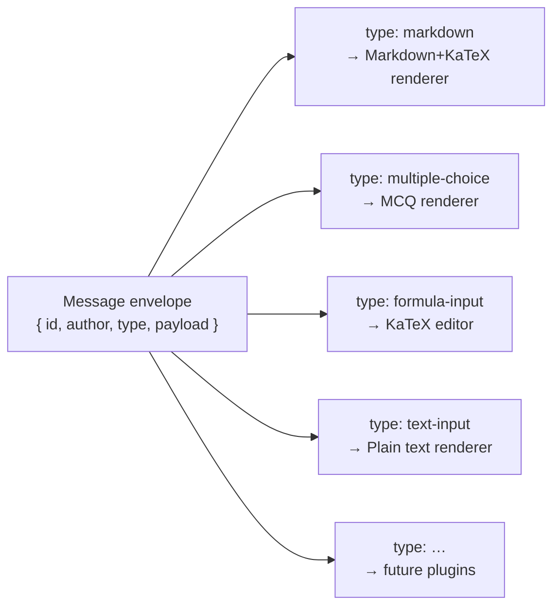
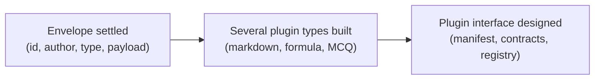
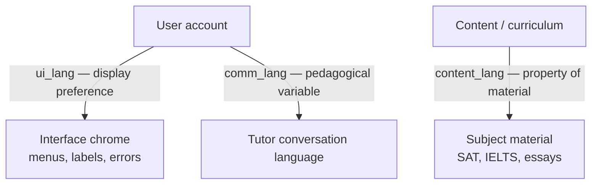

Mọi thông điệp trao đổi giữa học sinh và gia sư — từ một đoạn giải thích bằng văn xuôi, một công thức, một câu hỏi trắc nghiệm cho đến câu trả lời do học sinh gõ vào — đều đi qua cùng một cơ chế plugin (thành phần mở rộng) thống nhất. Đồng thời, ngôn ngữ gia sư sử dụng, ngôn ngữ của nội dung học liệu và ngôn ngữ của phần giao diện là ba thiết lập riêng biệt, tuyệt đối không được nhập làm một. Trang này giải thích cả hai phần đó: kiến trúc plugin và ba trục ngôn ngữ.

---

## Hội thoại như một cơ chế plugin mở

Tầng hội thoại không có một tập kiểu thông điệp cố định. Thay vào đó, mỗi thông điệp đều là một **typed plugin instance** (thực thể plugin có kiểu) — phía frontend (giao diện người dùng) đọc trường `type` rồi chuyển `payload` sang đúng renderer (bộ hiển thị) tương ứng. Cách này áp dụng như nhau cho đầu ra của gia sư (văn bản Markdown, thẻ câu hỏi) lẫn đầu vào của học sinh (văn bản thường, một công thức LaTeX đã nộp). Không có kiểu thông điệp nào được ưu tiên riêng, cũng không có tác giả nào giữ vị trí đặc biệt.

Lợi ích thực tế rất rõ: muốn thêm một kiểu tương tác mới (bài tập kéo-thả, bài rà soát đoạn văn), ta chỉ cần viết thêm một `type` mới cùng renderer tương ứng. Không cần thay đổi gì trong tutor engine hay logic cốt lõi của hội thoại.

Đây là **message envelope** (khung thông điệp) — hình dạng bên ngoài cố định mà mọi thông điệp cùng chia sẻ:

```ts
{
  id:            string,   // unique message id
  author:        string,   // "tutor" | "student" | ...
  type:          string,   // open string — never a closed union
  payload:       unknown,  // validated by the plugin's own schema
  schemaVersion: number
}
```

Mỗi plugin tự sở hữu schema (lược đồ) để kiểm tra `payload` của chính nó.

### Vì sao `type` phải luôn là một open string

Một phản xạ rất tự nhiên trong TypeScript là viết `type` thành một closed union — `"markdown" | "mcq" | "text-input"`. Cách đó có thể ổn trong một sprint, rồi sau đó âm thầm biến thành điểm bắt buộc phải sửa mỗi khi có plugin mới. Trường `type` được chủ đích giữ ở dạng open string. Nhờ vậy, gói shared contracts (hợp đồng dùng chung) không cần đụng tới khi plugin mới xuất hiện.

:::caution
Đừng bao giờ thay `type: string` dạng mở bằng một closed union trong gói contracts. Làm vậy sẽ phá hỏng cơ chế plugin mở và buộc phải có một chỉnh sửa trung tâm cho mỗi kiểu tương tác mới.
:::



---

## Message envelope đi trước

Cơ chế plugin có hai phần có thể tách bạch:

1. **Message envelope** — wire format (định dạng truyền dữ liệu) cho mọi thông điệp.
2. **Plugin interface** (giao diện plugin) — manifest (bản khai báo), hợp đồng config/kết quả, mô tả năng lực, backend registry (bộ đăng ký phía backend), versioning (quản lý phiên bản).

Hai phần này được xây theo đúng thứ tự đó, và lý do rất quan trọng. Hiện giờ envelope rất dễ đổi: chưa có transcript nào được lưu bền vững, nên nó mới chỉ là wire format giữa hai thành phần trong cùng một monorepo (kho mã đơn). Chỉ cần một commit là có thể đổi lại hình dạng của nó. Plugin interface thì ngược hẳn: chỉ một kiểu plugin không thể cho thấy điều gì thực sự thay đổi giữa các loại. Nếu thiết kế nó chỉ dựa trên một ví dụ duy nhất (chẳng hạn plugin markdown), ta sẽ chốt nhầm lớp trừu tượng. Phần này nên đợi đến khi đã có vài kiểu thực tế — markdown, nhập công thức, multiple-choice — để dẫn đường cho thiết kế.



---

## Plugin render chính: Markdown + KaTeX

Plugin cụ thể đầu tiên là **markdown plugin**. Đây là renderer chính của gia sư và thay thế cho cách làm bằng văn bản thuần trước đó, vốn không khả thi cho một buổi học Toán kiểu Socratic.

| Capability | Detail |
|---|---|
| Markdown | Văn xuôi chuẩn, tiêu đề, danh sách |
| LaTeX math | Được render qua **KaTeX** — cả công thức nội dòng lẫn công thức dạng khối |
| HTML decoration | Chỉ theo allowlist (danh sách cho phép): `span`, `mark`, `sup`, `sub`, các thuộc tính an toàn — không có `script`, event handler hay `iframe` |

### Render an toàn cho cả hai phía tác giả

Bộ allowlist HTML được chạy qua một sanitizer (bộ làm sạch) kiểu DOMPurify, và nó áp dụng cho **cả** đầu ra của gia sư lẫn nội dung học sinh gửi lên. Tutor LLM là nguồn bán tin cậy; đầu vào của học sinh là nguồn không tin cậy. Các thẻ như `script`, event handler (`onerror`, `onclick`) và `iframe` luôn bị loại bỏ. Các bài kiểm thử TDD cố định hành vi này, và một fitness function (hàm kiểm chuẩn) `G-15` canh giữ nó ở ranh giới mở rộng plugin.

:::note
Bộ plugin khởi đầu cho MVP là: **markdown** (đầu ra của gia sư), **text-input** (đầu vào nền tảng của học sinh), **formula-input** (học sinh → KaTeX qua trình soạn thảo bảng ký hiệu), **multiple-choice** (tương tác). Các plugin passage và essay-review được dời sang phần nội dung Language.
:::

---

## Ba trục ngôn ngữ độc lập

Stemolly tách ngôn ngữ thành ba thiết lập độc lập. Chỉ cần trộn lẫn bất kỳ hai thiết lập nào với nhau là hoặc trải nghiệm người dùng sẽ hỏng, hoặc tín hiệu nghiên cứu sẽ bị méo.



### Ngôn ngữ giao tiếp và ngôn ngữ nội dung

Một học sinh Việt Nam có thể nhận giải thích từ gia sư bằng tiếng Việt (`comm_lang = vi`) trong khi toàn bộ học liệu SAT/IELTS và cả phần bài viết do học sinh tự tạo vẫn ở tiếng Anh (`content_lang = en`). Hãy hình dung một giáo viên Việt giải thích một văn bản tiếng Anh bằng tiếng Việt: ngôn ngữ hướng dẫn và ngôn ngữ của môn học là hai thứ khác nhau. `comm_lang` là thiết lập theo từng học sinh hoặc từng phiên; `content_lang` là thuộc tính của nội dung, không phải của học sinh.

### Ngôn ngữ giao diện (`ui_lang`) không phải `comm_lang`

Ngôn ngữ dùng cho nút bấm, menu và thông báo hệ thống là `ui_lang` — một tùy chọn lưu riêng. Bộ chuyển ngôn ngữ giao diện tuyệt đối **không** được ghi vào `comm_lang`.

Lý do nằm ở tính toàn vẹn của thực nghiệm. `comm_lang` là biến sư phạm mà MVP-1 được dựng lên để kiểm chứng — phần Language dựa trên giả thuyết rằng hướng dẫn bằng tiếng Việt trên nội dung tiếng Anh sẽ cải thiện kết quả học. Nếu học sinh chỉ cần đổi một nút hiển thị mà vô tình đổi luôn ngôn ngữ gia sư, thì treatment của thí nghiệm sẽ thay đổi ngay giữa chừng và dữ liệu xác thực sẽ bị nhiễu.

Còn có sự khác biệt về nhóm người dùng: người dùng Console và Admin có `ui_lang` nhưng hoàn toàn không có `comm_lang`, vì họ không bao giờ học với gia sư.

| Setting | Who sets it | Default | What it governs |
|---|---|---|---|
| `comm_lang` | Chương trình học / ghi danh | Được khóa theo khóa học | Ngôn ngữ gia sư dùng để hướng dẫn |
| `content_lang` | Tác giả nội dung | Được xác định theo từng bài học | Ngôn ngữ của học liệu môn học |
| `ui_lang` | Người dùng (phát hiện từ trình duyệt) | Tiếng Anh | Ngôn ngữ của phần giao diện |

:::caution
`ui_lang` và `comm_lang` phải được lưu ở hai trường riêng. Một trường "language" dùng chung là phản xạ ban đầu rất tự nhiên — nhưng ở đây lại là lựa chọn sai.
:::
