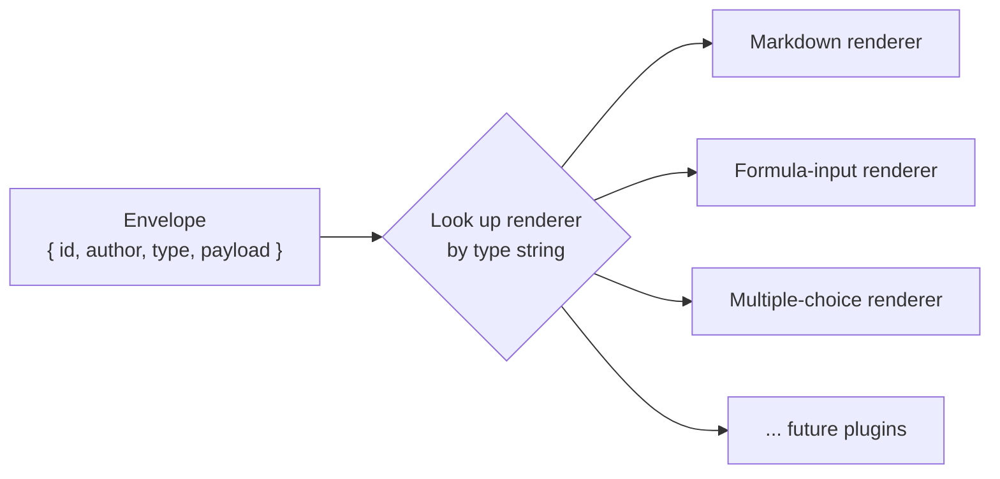
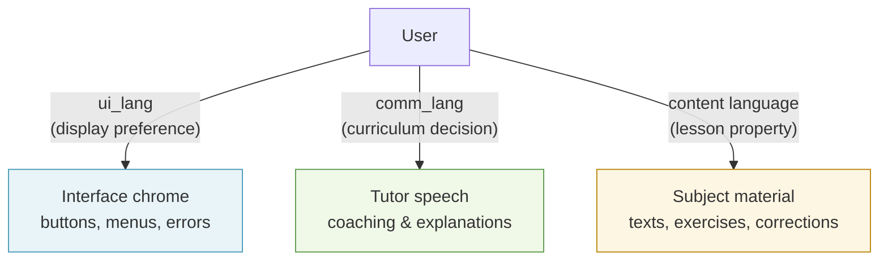
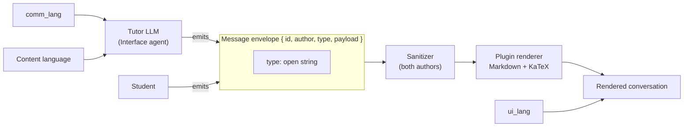

Mỗi lượt trao đổi giữa học sinh và gia sư đều đi qua ba hệ thống đan cài với nhau: một cơ chế plugin giúp các kiểu thông điệp luôn mở rộng được, một pipeline render (chuỗi xử lý hiển thị) định dạng an toàn cho Markdown và công thức toán, và một mô hình ngôn ngữ cho phép gia sư hướng dẫn bằng chính ngôn ngữ của học sinh trong khi nội dung môn học vẫn giữ ở ngôn ngữ đích. Trang này giải thích ba hệ thống đó vận hành ra sao — và quan trọng hơn, vì sao chúng được thiết kế theo cách này.

---

## Mọi thông điệp đều là một thực thể plugin có kiểu

Cuộc hội thoại không có một danh sách cố định các kiểu thông điệp. Dù đó là phần văn bản Markdown của gia sư, một câu hỏi trắc nghiệm, một đoạn văn để đọc, hay chính câu trả lời mà học sinh nộp lên — kể cả công thức LaTeX được gõ bằng bảng ký hiệu — thì mọi thông điệp đều là một **typed plugin instance** (thực thể plugin có kiểu), và phía frontend (giao diện người dùng) sẽ render (hiển thị) bằng cách tra đúng renderer (bộ hiển thị) tương ứng với trường `type` của nó.

Điều này có nghĩa là:
- Không có kiểu thông điệp nào được ưu tiên đặc biệt, cũng không có tác giả nào được ưu tiên đặc biệt.
- Việc thêm một dạng tương tác mới (bài kéo-thả, trò chơi từ vựng) hoàn toàn chỉ là bổ sung thêm: viết một kiểu mới và một renderer mới. Không cần thay đổi gì trong tutor engine (bộ máy gia sư) hay các contract (giao kèo dữ liệu) lõi.
- Nội dung có thể chấm điểm — bài quiz, bài tập có đáp án đúng — luôn phải bám vào lesson brief đã được biên soạn hoặc Expert agent, tuyệt đối không do Interface agent nhẹ hơn tự ứng biến. Cơ chế plugin không thay đổi nguyên tắc này; nó chỉ là cách chuyển nội dung đến nơi hiển thị.

Toàn bộ giao diện plugin — cách một plugin khai báo manifest (bản khai báo), mô tả năng lực của nó cho các AI agent, và đăng ký renderer — hiện được cố ý chưa thiết kế xong. Nó sẽ được định hình khi đã có trong tay vài loại plugin thực tế, để lớp trừu tượng phản ánh đúng những gì thực sự khác nhau giữa các loại, thay vì phản ánh điều mà chỉ một ví dụ đơn lẻ gợi ra.

---

## Message envelope: chốt trước, và vì sao thứ tự đó quan trọng

Trước khi giao diện plugin được thiết kế, có một thứ *đã* được khóa lại: **message envelope** (phần vỏ thông điệp).

```
{
  id:            string,   // unique message id
  author:        string,   // "tutor" | "student" | ...
  type:          string,   // open string — not a closed union
  payload:       unknown,  // validated by the plugin's own schema
  schemaVersion: number
}
```

Mọi thông điệp đi qua đường truyền đều dùng hình dạng này. Mỗi plugin tự kiểm tra `payload` của riêng mình; còn bản thân envelope được kiểm tra ở ranh giới giữa các hệ thống.

### Vì sao chốt envelope trước giao diện plugin?

Hai phần này có tính đảo ngược hoàn toàn trái ngược nhau.

**Envelope** chỉ là một wire format (định dạng truyền dữ liệu) giữa hai bên tiêu thụ trong cùng một monorepo (kho mã đơn) — engine tạo ra thông điệp và frontend render chúng. Chừng nào transcript (bản ghi hội thoại) vẫn chưa được lưu vào cơ sở dữ liệu, việc đổi hình dạng của envelope chỉ tốn một commit (lần cập nhật mã). Đây là quyết định rủi ro thấp, có thể chốt sớm.

**Plugin interface** (manifest, contract cho config/kết quả, mô tả năng lực cho agent, registry phía backend) thì ngược lại: chỉ một loại plugin không thể cho thấy thực sự có những điểm nào thay đổi giữa các loại. Nếu thiết kế giao diện dựa trên một ví dụ duy nhất, ta sẽ vô tình đóng cứng sai lớp trừu tượng. Nó cần vài loại plugin thực tế — ít nhất Markdown, nhập công thức và trắc nghiệm — để định hình cho đúng.

### Trường `type` dạng open string

Chi tiết quan trọng nhất trong envelope là `type` là một **open string** (chuỗi mở), chứ không phải một closed union (hợp kiểu đóng) của TypeScript như `"markdown" | "text-input"`.

Khi mới chỉ có một loại, closed union là phản xạ rất tự nhiên. Nhưng nó sẽ biến gói contract dùng chung thành nơi bắt buộc phải sửa mỗi khi thêm bất kỳ plugin nào — đúng kiểu kết dính mà cơ chế plugin mở được tạo ra để tránh. Open string giữ cho tập kiểu luôn mở. Bất kỳ plugin nào cũng có thể đưa vào một type mới mà không phải chạm tới gói dùng chung.



---

## Pipeline render: Markdown + KaTeX + allowlist đã được làm sạch

Renderer mặc định của gia sư hỗ trợ ba lớp định dạng:

| Lớp | Vai trò |
|---|---|
| **Markdown** | Tiêu đề, danh sách, chữ đậm, mã nội dòng, khối mã |
| **KaTeX** | Công thức LaTeX được render trong trình duyệt — nếu không có lớp này thì một buổi học toán kiểu Socratic sẽ gần như không dùng được |
| **HTML decoration allowlist** | Một tập thẻ hẹp (`span`, `mark`, `sup`, `sub`) chỉ với các thuộc tính an toàn |

HTML thô không được render tự do. Mọi thông điệp — từ tutor LLM bán tin cậy và từ học sinh hoàn toàn không tin cậy — đều đi qua một bộ làm sạch kiểu DOMPurify để loại bỏ thẻ `<script>`, các event handler (trình xử lý sự kiện, như `onerror`, `onclick`, v.v.) và iframe. Allowlist (danh sách cho phép) và bộ làm sạch này áp dụng như nhau cho cả hai phía tác giả; không có đường tắt nào dành cho "nguồn đáng tin".

Đây chính là plugin render cụ thể mà plugin ví dụ chỉ có văn bản thuần trước đó vốn luôn được dự định sẽ thay thế bằng nó. Văn bản thuần chỉ là ví dụ tham chiếu để minh họa mẫu thiết kế; Markdown+KaTeX mới là plugin đầu tiên thực sự.

### Bộ khởi đầu cho MVP

Khi cơ chế plugin đầy đủ được xây xong — điều này xảy ra khi đã có đủ loại plugin để soi sáng cho thiết kế giao diện, chứ không theo một lịch cố định — thì các thành phần đầu tiên sẽ là:

- **Markdown** — văn bản và lời giải thích của gia sư
- **Text-input** — câu trả lời văn bản tự do cơ bản của học sinh
- **Formula-input** — câu trả lời của học sinh ở dạng LaTeX, thông qua bảng ký hiệu dựa trên KaTeX
- **Multiple-choice** — các tương tác trắc nghiệm có cấu trúc

Các plugin cho passage và essay-review đã được dự tính cho phần môn Ngôn ngữ và sẽ được để sang giai đoạn đó.

Hành vi của bộ làm sạch được khóa bằng các bài kiểm thử TDD và được một fitness function (hàm kiểm chuẩn) là `G-15` bảo vệ song song với bộ kiểm thử mở rộng plugin, để một plugin trong tương lai không vô tình mở ra lỗ hổng XSS.

---

## Hai ngôn ngữ trong một cuộc hội thoại

Học sinh có thể trò chuyện với gia sư bằng chính ngôn ngữ của mình trong khi nội dung môn học vẫn hoàn toàn ở ngôn ngữ đích. Hãy hình dung một giáo viên Việt Nam đang giải thích một bài ngữ pháp tiếng Anh bằng tiếng Việt — phần học sinh viết ra và phần được sửa vẫn là tiếng Anh, nhưng quá trình hướng dẫn diễn ra bằng tiếng Việt.

Stemolly mô hình hóa điều này thành hai thiết lập độc lập:

| Thiết lập | Nó điều khiển gì | Ai quyết định |
|---|---|---|
| **`comm_lang`** | Ngôn ngữ mà gia sư dùng để nói | Thiết kế chương trình học / phiên học |
| **Content language** | Ngôn ngữ của học liệu môn học | Lesson brief đã được biên soạn |

Hai thiết lập này độc lập với nhau. Một học sinh Việt Nam học IELTS sẽ có `comm_lang = vi` và content language = `en`. Gia sư hướng dẫn bằng tiếng Việt; mọi bản nháp bài viết và mọi phần sửa lỗi đều ở tiếng Anh.

### Trục thứ ba: ngôn ngữ giao diện (`ui_lang`)

Trong hệ thống còn có một ngôn ngữ thứ ba — ngôn ngữ của chính giao diện: nhãn nút bấm, menu, thông báo lỗi. Đó là `ui_lang`, và nó là **một tùy chọn riêng của người dùng**, tách biệt với `comm_lang`.

Hai thứ này rất dễ bị nhập làm một, nhưng bắt buộc phải tách vì hai lý do:

1. **`comm_lang` là một biến sư phạm đang được kiểm chứng.** MVP-1 kiểm tra xem việc hướng dẫn bằng tiếng mẹ đẻ của học sinh có cải thiện kết quả hay không. Nếu công tắc đổi ngôn ngữ giao diện lại ghi đè vào `comm_lang`, thì chỉ cần học sinh đổi tùy chọn hiển thị là ngôn ngữ gia sư sẽ âm thầm đổi giữa chừng trong phiên học — làm hỏng dữ liệu thí nghiệm.

2. **Có những nhóm người dùng cần `ui_lang` nhưng không cần `comm_lang`.** Người dùng Console và Admin cần giao diện bằng ngôn ngữ họ chọn, nhưng họ không bao giờ được gia sư hướng dẫn. Họ có `ui_lang` và hoàn toàn không có `comm_lang`.



`ui_lang` do người dùng kiểm soát: ngôn ngữ trình duyệt được phát hiện tự động, tiếng Anh là phương án dự phòng, và có công tắc thủ công để người dùng sửa lại nếu hệ thống nhận diện sai. Lựa chọn này được lưu vào phần tùy chọn của họ và sẽ được áp dụng về sau. `comm_lang` không phải là công tắc cho người dùng — đó là quyết định được đưa ra khi biên soạn chương trình học.

---

## Cách các mảnh ghép nối với nhau

Ba hệ thống mô tả ở trên không phải là ba lớp độc lập. Chúng được thiết kế để cùng vận hành như một khối:



Kiểu plugin quyết định renderer nào sẽ chạy. Bộ làm sạch luôn chạy trước mọi renderer, bất kể thông điệp đến từ đâu. Các thiết lập ngôn ngữ đi cùng phiên học nhưng không xuất hiện trong chính envelope — chúng định hình điều gia sư *nói*, chứ không định hình cấu trúc của thông điệp mà gia sư dùng để nói.
