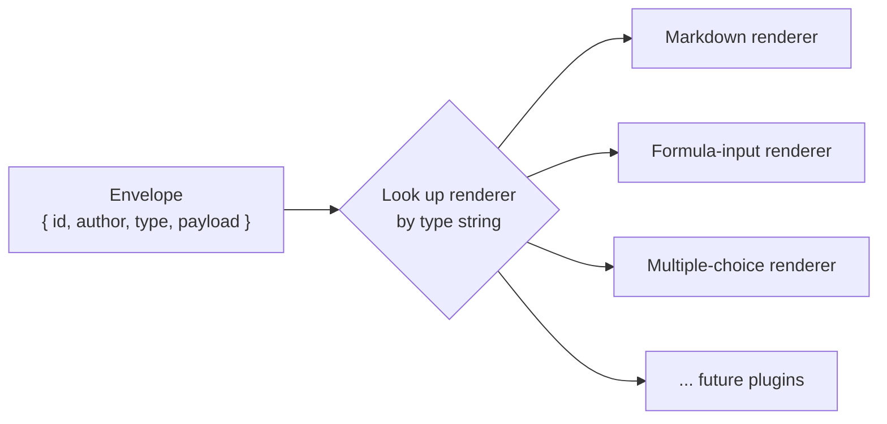
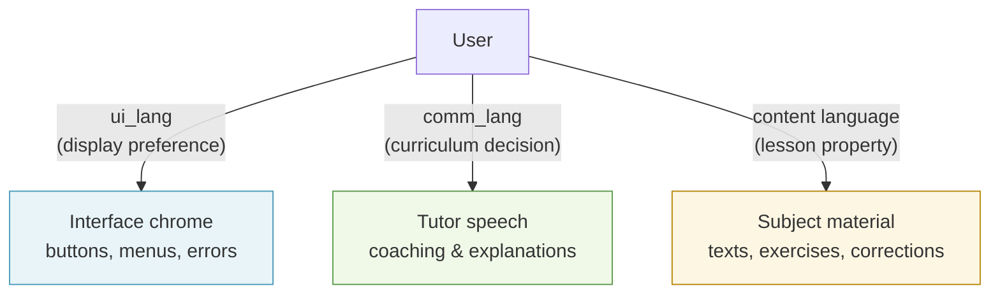
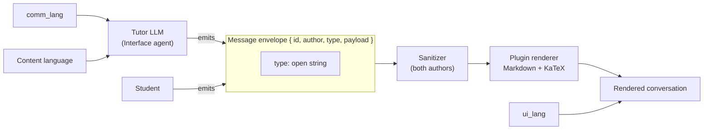

Mỗi lượt trao đổi giữa học viên và gia sư đều đi qua ba hệ thống gắn chặt với nhau: một plugin mechanism (cơ chế phần mở rộng) giúp các message type (kiểu thông điệp) luôn mở, một render pipeline (quy trình kết xuất) định dạng Markdown và toán học theo cách an toàn, và một dual-language model (mô hình hai ngôn ngữ) cho phép gia sư hướng dẫn bằng chính ngôn ngữ của học viên trong khi nội dung môn học vẫn giữ ở ngôn ngữ đích. Trang này giải thích ba hệ thống đó vận hành ra sao — và quan trọng hơn, vì sao chúng được thiết kế như vậy.

---

## Mỗi thông điệp đều là một typed plugin instance

Cuộc hội thoại không có danh sách message type cố định. Dù đó là phần diễn giải bằng Markdown của gia sư, một câu hỏi trắc nghiệm, một đoạn đọc hiểu, hay chính câu trả lời học viên gửi lên — kể cả công thức LaTeX gõ bằng bảng ký hiệu — thì mọi thông điệp đều là một **typed plugin instance** mà frontend (giao diện người dùng) sẽ kết xuất bằng cách tra cứu renderer (bộ kết xuất) phù hợp theo trường `type`.

Điều này có nghĩa là:
- Không có message type nào được ưu tiên đặc biệt, và cũng không có author nào được ưu tiên đặc biệt.
- Việc thêm một interaction (kiểu tương tác) mới — như bài kéo-thả hay trò chơi từ vựng — chỉ là bổ sung thêm: viết một type mới và một renderer mới. Không cần sửa gì trong tutor engine hay các core contract dùng chung.
- Gradeable content (nội dung có thể chấm điểm) — như quiz, bài tập có đáp án đúng — luôn phải bám theo lesson brief (bản mô tả bài học) đã biên soạn hoặc Expert agent, chứ không bao giờ được Interface agent nhẹ hơn ứng tác ra. Cơ chế plugin không thay đổi nguyên tắc này; nó chỉ chuyển nội dung tới nơi cần hiển thị.

Toàn bộ plugin interface (giao diện plugin) — cách một plugin khai báo manifest (bản khai báo), mô tả capability (khả năng) của nó cho các AI agent, và đăng ký renderer — được cố ý để ngỏ ở thời điểm này. Nó chỉ nên được định hình khi đã có trong tay vài loại plugin thực tế, để abstraction (mức trừu tượng) phản ánh đúng những gì thật sự khác nhau giữa các loại, thay vì bị một ví dụ đơn lẻ dẫn dắt.

---

## Message envelope: chốt trước, và vì sao thứ tự đó quan trọng

Trước khi thiết kế plugin interface, có một thứ *đã* được khóa lại: **message envelope**.

```
{
  id:            string,   // unique message id
  author:        string,   // "tutor" | "student" | ...
  type:          string,   // open string — not a closed union
  payload:       unknown,  // validated by the plugin's own schema
  schemaVersion: number
}
```

Mọi thông điệp đi qua đường truyền đều dùng cấu trúc này. Mỗi plugin tự kiểm tra `payload` của riêng mình; còn bản thân envelope được kiểm tra tại ranh giới giữa các hệ thống.

### Vì sao phải chốt envelope trước plugin interface?

Hai phần này có tính dễ thay đổi hoàn toàn trái ngược nhau.

**Envelope** chỉ là wire format (định dạng truyền dữ liệu) giữa hai bên tiêu thụ trong cùng một monorepo (kho mã đơn): engine tạo ra thông điệp và frontend hiển thị chúng. Chừng nào transcript (bản ghi hội thoại) chưa được lưu vào database (cơ sở dữ liệu), việc đổi hình dạng của envelope chỉ tốn một commit. Đây là quyết định rủi ro thấp, phù hợp để chốt sớm.

Ngược lại, **plugin interface** (manifest, contract cấu hình/kết quả, mô tả capability cho agent, backend registry) lại có đặc tính trái ngược: một loại plugin đơn lẻ không thể cho thấy điều gì thực sự thay đổi giữa các loại. Nếu thiết kế interface dựa trên đúng một ví dụ, ta sẽ vô tình đóng băng abstraction sai. Nó cần vài loại plugin thật — ít nhất là Markdown, formula input và multiple-choice — để dẫn dắt thiết kế một cách đúng đắn.

### Trường `type` kiểu open string

Chi tiết quan trọng nhất trong envelope là `type` là một **open string** (chuỗi mở), chứ không phải TypeScript closed union (hợp kiểu đóng) như `"markdown" | "text-input"`.

Closed union là phản xạ rất dễ hiểu khi hệ thống mới chỉ có một loại. Nhưng nếu làm vậy, shared contracts package (gói contract dùng chung) sẽ trở thành nơi bắt buộc phải sửa mỗi khi thêm bất kỳ plugin nào về sau — đúng kiểu coupling (liên kết phụ thuộc) mà cơ chế plugin mở được tạo ra để tránh. Open string giữ tập giá trị luôn mở. Bất kỳ plugin nào cũng có thể đưa vào một type mới mà không cần chạm tới gói dùng chung.



---

## Render pipeline: Markdown + KaTeX + một sanitized allowlist

Bộ kết xuất mặc định của gia sư hỗ trợ ba lớp định dạng:

| Layer | Tác dụng |
|---|---|
| **Markdown** | Tiêu đề, danh sách, chữ đậm, mã nội dòng, khối mã có fence |
| **KaTeX** | Toán học LaTeX, được kết xuất ngay trong trình duyệt — thiếu nó thì một buổi học toán kiểu Socratic sẽ gần như không dùng được |
| **HTML decoration allowlist** | Một tập thẻ hẹp (`span`, `mark`, `sup`, `sub`) chỉ đi kèm các thuộc tính an toàn |

Raw HTML không được kết xuất tự do. Mọi thông điệp — từ tutor LLM bán tin cậy và từ học viên không đáng tin cậy — đều đi qua một DOMPurify-style sanitizer (bộ làm sạch kiểu DOMPurify) để loại bỏ thẻ `<script>`, các event handler (`onerror`, `onclick`, v.v.) và iframe. Allowlist và sanitizer được áp dụng như nhau cho cả hai phía; không có đường tắt "trusted" nào cả.

Đây mới là render plugin cụ thể mà plugin ví dụ dạng văn bản thuần ở giai đoạn trước vốn luôn được dự định sẽ nhường chỗ. Plain text chỉ là ví dụ tham chiếu để minh họa mô hình; Markdown+KaTeX mới là plugin đầu tiên thực sự.

### Bộ khởi đầu cho MVP

Khi cơ chế plugin đầy đủ được xây xong — tức là khi đã có đủ loại plugin để định hình thiết kế interface, chứ không theo một mốc lịch cố định — đây sẽ là nhóm đầu tiên:

- **Markdown** — phần diễn giải và giải thích của gia sư
- **Text-input** — câu trả lời tự do cơ bản của học viên
- **Formula-input** — câu trả lời của học viên dưới dạng LaTeX, thông qua bảng ký hiệu dựa trên KaTeX
- **Multiple-choice** — các tương tác quiz có cấu trúc

Các plugin cho passage và essay review đã được lên kế hoạch cho nhánh môn Language và sẽ được dời tới giai đoạn đó.

Hành vi của sanitizer được khóa bằng TDD tests (kiểm thử phát triển theo kiểm thử) và được bảo vệ bởi một fitness function (hàm kiểm chuẩn) là `G-15`, chạy cùng các bài kiểm thử mở rộng plugin, để một plugin về sau không vô tình mở ra lỗ hổng XSS.

---

## Hai ngôn ngữ trong cùng một cuộc hội thoại

Học viên có thể trò chuyện với gia sư bằng ngôn ngữ của mình, trong khi nội dung môn học vẫn giữ hoàn toàn ở ngôn ngữ đích. Hãy hình dung một giáo viên Việt Nam giải thích bài ngữ pháp tiếng Anh bằng tiếng Việt — phần học viên phải viết ra và phần văn bản được sửa vẫn là tiếng Anh, nhưng việc hướng dẫn lại diễn ra bằng tiếng Việt.

Stemolly mô hình hóa điều này bằng hai thiết lập độc lập:

| Thiết lập | Điều nó kiểm soát | Ai đặt |
|---|---|---|
| **`comm_lang`** | Ngôn ngữ mà gia sư dùng để nói | Thiết kế chương trình học / phiên học |
| **Ngôn ngữ nội dung** | Ngôn ngữ của học liệu môn học | Lesson brief đã biên soạn |

Hai thiết lập này độc lập với nhau. Một học viên Việt Nam ôn IELTS sẽ có `comm_lang = vi` và ngôn ngữ nội dung = `en`. Gia sư hướng dẫn bằng tiếng Việt; mọi bản nháp bài luận và mọi bản sửa đều ở tiếng Anh.

### Trục thứ ba: ngôn ngữ UI chrome (`ui_lang`)

Trong hệ thống còn có một ngôn ngữ thứ ba — ngôn ngữ của chính giao diện: nhãn nút bấm, menu, thông báo lỗi. Đó là `ui_lang`, và nó là một user preference (tùy chọn người dùng) **tách biệt** với `comm_lang`.

Hai khái niệm này rất dễ bị nhập làm một, nhưng bắt buộc phải tách ra vì hai lý do:

1. **`comm_lang` là một biến sư phạm đang được kiểm chứng.** MVP-1 cần xác nhận liệu việc hướng dẫn bằng tiếng mẹ đẻ của học viên có cải thiện kết quả hay không. Nếu công tắc đổi ngôn ngữ giao diện ghi vào `comm_lang`, thì chỉ một lần đổi cách hiển thị cũng có thể âm thầm đổi luôn ngôn ngữ gia sư giữa chừng — làm sai lệch dữ liệu thí nghiệm.

2. **Nhiều nhóm người dùng cần `ui_lang` nhưng không cần `comm_lang`.** Người dùng Console và Admin cần giao diện theo ngôn ngữ họ chọn, nhưng họ không bao giờ được gia sư hướng dẫn. Họ có `ui_lang`, còn `comm_lang` thì hoàn toàn không có.



`ui_lang` do người dùng kiểm soát: hệ thống tự nhận diện ngôn ngữ trình duyệt, dùng tiếng Anh làm phương án dự phòng, và cung cấp bộ chuyển thủ công để người dùng sửa các lần nhận diện sai. Lựa chọn đó được lưu vào phần thiết lập của họ và áp dụng về sau. `comm_lang` không phải công tắc để người dùng bật/tắt — đó là quyết định được đưa ra khi biên soạn chương trình học.

---

## Cách các mảnh ghép nối với nhau

Ba hệ thống vừa mô tả không phải ba lớp độc lập. Chúng được thiết kế để phối hợp với nhau:



Loại plugin quyết định renderer nào sẽ chạy. Sanitizer luôn chạy trước mọi renderer, bất kể nguồn đến từ đâu. Các thiết lập ngôn ngữ đi cùng phiên học nhưng không hiện diện trong chính envelope — chúng định hình *nội dung* mà gia sư nói ra, chứ không thay đổi cấu trúc của thông điệp dùng để nói.
