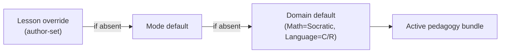
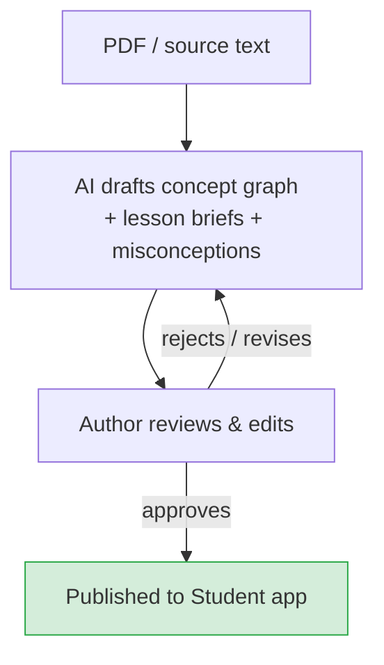

# Dạy học & Phiên học

Stemolly không truyền nội dung một chiều cho học sinh — nó dẫn dắt để các em tự kiến tạo hiểu biết. AI tutor duy trì một cuộc trò chuyện trực tiếp, đặt câu hỏi và thích ứng theo thời gian thực. Nhưng cách tiếp cận này không phải một khuôn mẫu duy nhất: phương pháp dạy học (gọi là một *pedagogy*) thay đổi theo từng môn và được xác định lại ở đầu mỗi phiên học. Trang này giải thích cơ chế đó hoạt động ra sao — lesson là gì, probing vận hành thế nào trong các môn theo Socratic, học sinh bị mắc kẹt sẽ nhận hỗ trợ ra sao, và curriculum được xây dựng như thế nào.

---

## Hai pedagogy, một hệ thống có thể cắm ghép

Stemolly hiện có hai phương pháp dạy học.

- **Socratic** — dùng cho Toán, Vật lý và Hóa học. Tutor đặt câu hỏi để dẫn học sinh tự hình thành ý tưởng. Nó không bao giờ chỉ đơn giản nêu ra đáp án.
- **Correct / Reinforce** — dùng cho Ngôn ngữ. Tutor chẩn đoán lỗi, sửa lỗi một cách tường minh và củng cố mẫu đúng.

Chúng không bị hardcode theo từng môn. Pedagogy là một **declarative bundle** (gói khai báo) — một gói gồm chỉ dẫn prompt, guardrails (rào chắn hành vi), checkpoint policy (chính sách điểm kiểm), và scaffolding ladder. Một bộ phân giải nhỏ sẽ chọn đúng bundle ở đầu mỗi phiên học bằng một chuỗi ưu tiên ba tầng:

```
lesson override  →  mode default  →  domain default
```

Nếu tác giả bài học đã chỉ định pedagogy, lựa chọn đó sẽ được ưu tiên. Nếu không, hệ thống dùng mode default, rồi đến domain default. Ở MVP hiện tại chỉ có domain default được cấu hình (Toán → Socratic, Ngôn ngữ → Correct/Reinforce), nhưng cơ chế này hoạt động ở cấp lesson — tác giả có thể ghi đè pedagogy cho bất kỳ lesson riêng lẻ nào mà không cần đụng đến phần còn lại.



**Vì sao dùng declarative bundle thay vì code hook?** Phương án còn lại là để các strategy của pedagogy trở thành những callback mã tùy ý được chèn vào vòng lặp từng lượt của tutor. Cách đó bị loại bỏ vì strategy dạng mã khó đọc, khó so sánh hơn, và quan trọng hơn là các giả định của Socratic sẽ âm thầm rò rỉ vào những luồng cốt lõi của engine. Declarative bundle thì có thể được xem xét rõ ràng. Muốn thêm một pedagogy mới chỉ cần viết một bundle mới và đăng ký nó; không cần sửa dù chỉ một dòng trong engine hay phần lõi của tutor.

---

## Ba chế độ học

Mỗi phiên học vận hành trong một trong ba chế độ. Active pedagogy bundle áp dụng cho cả ba.

| Chế độ | Điều diễn ra |
|---|---|
| **Lesson** | Học sinh đi qua nội dung có cấu trúc. Tutor đồng hành và áp dụng pedagogy của môn để làm lộ ra rồi xử lý các ngộ nhận ngay trong thời gian thực. |
| **Assessment / Diagnostic** | Tutor đưa ra các bài toán/vấn đề để lập bản đồ hiểu biết của học sinh. Mục tiêu không phải là cho điểm — mà là nhìn ra mô hình tư duy của các em. |
| **Assignment Help** | Học sinh tải bài tập lên. Tutor hướng dẫn các em giải quyết bằng pedagogy của môn — và không bao giờ đưa đáp án trực tiếp trong các môn Socratic. |

Cả ba chế độ đều đưa dữ liệu trở lại mô hình tư duy bền vững của học sinh (xem [../engine/mental-model.md](../engine/mental-model.md)).

---

## Lesson thực chất là gì

Trong Stemolly, lesson không phải là một mẩu nội dung cố định được hiển thị cho học sinh. Nó là một **authored teaching brief** (đề cương giảng dạy do tác giả biên soạn) được giao cho **tutor agent** (tác tử gia sư), rồi từ đó agent này dẫn dắt một cuộc trò chuyện trực tiếp.

Tác giả chịu trách nhiệm cho:
- Một **goal** (mục tiêu) — khái niệm hoặc kỹ năng mà phiên học cần giúp học sinh thật sự nắm được.
- Một **ordered set of steps** (chuỗi bước theo thứ tự) — ví dụ: nêu bài toán mở đầu, dẫn học sinh hiểu bài toán, giúp các em tự xây dựng lý thuyết, mở rộng, luyện tập, giao bài.
- Một **per-step intention** (ý đồ cho từng bước) — tutor nên làm gì ở mỗi giai đoạn.
- **Vetted materials** (tài liệu đã được thẩm định) — bài đọc, ví dụ và các hạt giống probe mà tutor buộc phải dựa vào, không được tự bịa ra.

Tutor agent chịu trách nhiệm cho chính cuộc đối thoại. Nó đọc brief, nhận active pedagogy, rồi ứng biến — đặt câu hỏi theo ngữ cảnh trong một lesson Socratic, hoặc chẩn đoán và sửa lỗi trong một lesson Ngôn ngữ — nhưng vẫn bám sát ý đồ và cấu trúc bước mà tác giả đã nêu. Vetted materials đóng vai trò điểm tựa để bám đất: tutor không thể bịa nội dung, điều này đặc biệt quan trọng với một sản phẩm giáo dục, nơi chỉ một công thức hay dữ kiện sai cũng có thể gây hại thật sự.

Thiết kế này cho phép cùng một brief tạo ra những cuộc trò chuyện khác nhau cho từng học sinh. Cấu trúc thì lặp lại được; đối thoại thì không.

---

## Probing: cách tutor Socratic làm lộ ra sự mong manh

*Phần này chỉ áp dụng riêng cho pedagogy Socratic (Toán, Vật lý, Hóa học).*

### Probe không phải một chế độ riêng

Trong dạy học Socratic, câu hỏi **chính là** việc dạy học. Vì vậy, một **probe** (câu hỏi thăm dò) đơn giản chỉ là một kiểu câu hỏi Socratic — tutor không chuyển sang một chế độ kiểm tra đặc biệt nào cả. Nó tự nhiên trộn hai loại câu hỏi trong mọi lesson:

- **Constructive questions** (câu hỏi kiến tạo) — dựng giàn để đưa học sinh tiến dần tới một ý tưởng. *"Tính chất phân phối cho ta biết gì về (a+b)²?"*
- **Testing (elenctic) questions** (câu hỏi kiểm tra/phản biện) — gây sức ép lên một ý tưởng mà học sinh có vẻ đang nắm giữ. *"Vì sao cách đó đúng?", "Nếu đổi dấu này thì sao?", một bài chuyển giao ở một dạng biểu hiện mới.*

Độ mong manh được đọc ra từ cách học sinh xử lý các testing questions. Một câu trả lời nhanh và máy móc cho constructive questions là tín hiệu để chuyển mạnh hơn sang kiểm tra. Mỗi lượt trả lời của học sinh trong cuộc đối thoại đều là một **evidence event** (sự kiện bằng chứng): các ngộ nhận lộ ra, được gỡ bỏ, rồi lại bộc lộ tính mong manh — tất cả diễn ra ngay trong mạch hỏi đáp thông thường, không cần một chế độ quiz riêng.

### Chính sách probing: đan xen, nghiêng về kiểm tra, áp ngưỡng tối thiểu

Tutor không thăm dò mọi khái niệm đến mức kiệt cùng (làm vậy sẽ phá hỏng trải nghiệm), nhưng cũng không thăm dò theo một lịch cố định (quá thô). Thay vào đó, nó:

1. **Liên tục đan xen** giữa câu hỏi kiến tạo và câu hỏi kiểm tra.
2. **Nghiêng về kiểm tra** khi câu trả lời đến quá nhanh hoặc nghe có vẻ máy móc — một tín hiệu nhận dạng theo mẫu.
3. **Áp một ngưỡng tối thiểu cứng**: một khái niệm không bao giờ được đánh dấu là *robust* (vững chắc) cho đến khi học sinh vượt qua ít nhất một phép kiểm tra thực sự — một bài chuyển giao hoặc một câu hỏi "vì sao".

Ngưỡng tối thiểu này là lựa chọn thiết kế then chốt. Nó ngăn việc "học sinh đã trả lời hết các bước" bị hiểu thành "học sinh đã hiểu". Một khái niệm chưa từng bị gây sức ép thì không thể được coi là vững.

### Probe được tạo ra từ đâu?

Probe hiệu quả nhất là probe được may đo theo đúng điều học sinh vừa nói. Ví dụ: *"Em viết 4m² + 25 — điều đó giống và khác gì so với kết quả ta tìm được cho (a+b)²?"* Chỉ tutor, ngay trong cuộc đối thoại trực tiếp, mới có thể viết ra câu hỏi như vậy. Vì thế, probe chủ yếu là **AI-generated** (do AI tạo ra) và theo ngữ cảnh.

Tác giả cũng có thể cung cấp một số ít *seed transfer problems* (bài chuyển giao dùng làm mốc) cho mỗi **concept node** (nút khái niệm). Những seed này tạo ra sự nhất quán trong đo lường: khi hai học sinh cùng trả lời một seed problem, kết quả của các em có thể được so sánh trực tiếp. Seed problems nằm trong vetted materials của lesson brief. Đây là một mô hình lai: phần tạo sinh giữ vai trò chính, còn các seed do tác giả soạn hỗ trợ việc đo lường.

---

## Scaffolding ladder: hỗ trợ mà không làm hỏng bài học

### Ngưỡng Socratic

Quy tắc không trả lời trực tiếp của Socratic có một ranh giới rất rõ: **tutor không bao giờ tiết lộ ý niệm đích mà lesson được tạo ra để khiến học sinh phải tự xây dựng.** Nó có thể cung cấp những dữ kiện phụ trợ — nhớ lại một công thức, một bước số học — miễn đó không phải chính điều đang được dạy. Ranh giới nằm ở ý niệm cốt lõi của lesson, không phải ở mọi mẩu thông tin.

### Khi học sinh bị mắc kẹt, việc hỗ trợ diễn ra ra sao

Khi học sinh không thể tiến tiếp, tutor sẽ leo lên một **graduated scaffolding ladder** (thang hỗ trợ tăng dần) thay vì lặp đi lặp lại cùng một câu hỏi. Các nấc hiện tại là:

```
Reframe  →  Hint  →  Analogous worked example
```

*(Lùi xuống một khái niệm tiên quyết là một nấc trong tương lai — điều đó đòi hỏi một belief graph đủ trưởng thành để xác định đáng tin cậy khái niệm tiên quyết còn thiếu mà không làm gián đoạn mạch lesson.)*

Ở phiên bản hiện tại, hỗ trợ là kiểu **student-pulled** (do học sinh chủ động kéo ra). Học sinh kích hoạt nó — bằng cách gõ "Em bị bí", bấm nút gợi ý hoặc cách tương tự — rồi hệ thống chọn nấc hỗ trợ phù hợp để đưa ra. Tutor không ép hỗ trợ vào mọi khoảng lặng; một lưới an toàn tối thiểu sẽ đề nghị hỗ trợ khi tình trạng bế tắc kéo dài, nhưng không bao giờ áp đặt. Cách này mặc định giữ lại sự vật lộn có ích và tránh phải dựa vào một bộ phát hiện bực bội dễ sai.

### Vì sao thành công có scaffolding không được tính là robust

Mỗi phản hồi có scaffolding đều được đóng dấu vào evidence event. Một thành công đạt được nhờ hint không phải là bằng chứng cho thấy học sinh làm được khi không có trợ giúp. Điều này phản chiếu ngưỡng probing: cũng như "chưa được probe" không thể đồng nghĩa với "robust", thì "có scaffolding" cũng không thể đồng nghĩa với "robust". Cả hai quy tắc đều bảo vệ tính toàn vẹn của phép đo độ mong manh trong mô hình tư duy.

Scaffolding cũng bị tắt hoàn toàn trong các **predictive-validity checkpoints** (điểm kiểm về độ giá trị dự báo) bị khóa, để trợ giúp không thể rò rỉ vào một kết quả được tính như đánh giá.

---

## Curriculum: đội ngũ xây trước, AI bổ sung khi cần

Curriculum cốt lõi của sản phẩm là **nội dung có cấu trúc do đội ngũ Stemolly tạo ra** (và về sau là do giáo viên tạo). Đây không phải một sản phẩm đặt tạo sinh lên trước: AI không viết cả khóa học. Trong một phiên học trực tiếp, AI có thể tạo tài liệu bổ sung theo nhu cầu — một ví dụ mới, một bài luyện tập thêm — để củng cố một khái niệm cụ thể, nhưng chỉ như phần bổ sung có mục tiêu cho lesson có cấu trúc, chứ không thay thế nó.

Mô hình lai này giúp trải nghiệm học tập giữ được sự mạch lạc. Cấu trúc được tác giả biên soạn và thẩm định; sự linh hoạt đến từ việc AI lấp khoảng trống ngay tại thời điểm cần.

### Tác giả curriculum xây lesson như thế nào

Trong khu vực Author của Console, AI hỗ trợ tác giả ở thời điểm biên soạn (không phải lúc đang diễn ra phiên học). Với một sách giáo khoa PDF nguồn hoặc đoạn văn bản được dán vào, nó sẽ:

- Soạn nháp **concept graph** (đồ thị khái niệm) — một **prerequisite DAG** (đồ thị có hướng không chu trình về các quan hệ tiên quyết) cho Toán, hoặc một **error/skill taxonomy** (phân loại lỗi/kỹ năng) cho Ngôn ngữ.
- Đề xuất cách các mục curriculum khớp với các **canonical concept nodes** (nút khái niệm chuẩn) hiện có.
- Soạn nháp **lesson briefs** — goal, ordered steps, per-step intent, vetted materials, và một pedagogy mặc định lấy từ domain.
- Gợi ý các ngộ nhận cho từng concept node.

Mọi bước đều theo cơ chế **human-in-the-loop** (con người phê duyệt trong vòng lặp). Tác giả xem lại, chỉnh sửa và phê duyệt từng bản nháp. Không có gì được đưa tới ứng dụng Student nếu chưa có sự phê duyệt tường minh từ tác giả — AI chỉ soạn nháp, không bao giờ tự động xuất bản.

Phần AI hỗ trợ lúc biên soạn này tách biệt với việc tạo tài liệu bổ sung trong phiên học đã mô tả ở trên. Cùng một nguyên tắc lai được áp dụng ở cả hai lớp: AI tạo ra, con người xác minh.


