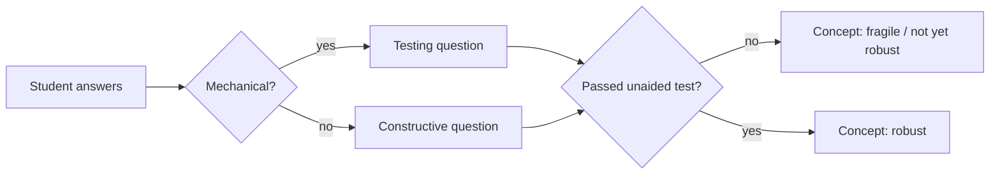
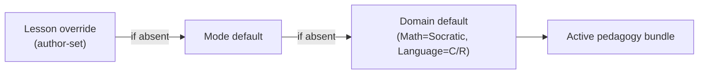
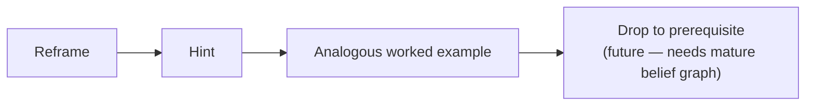
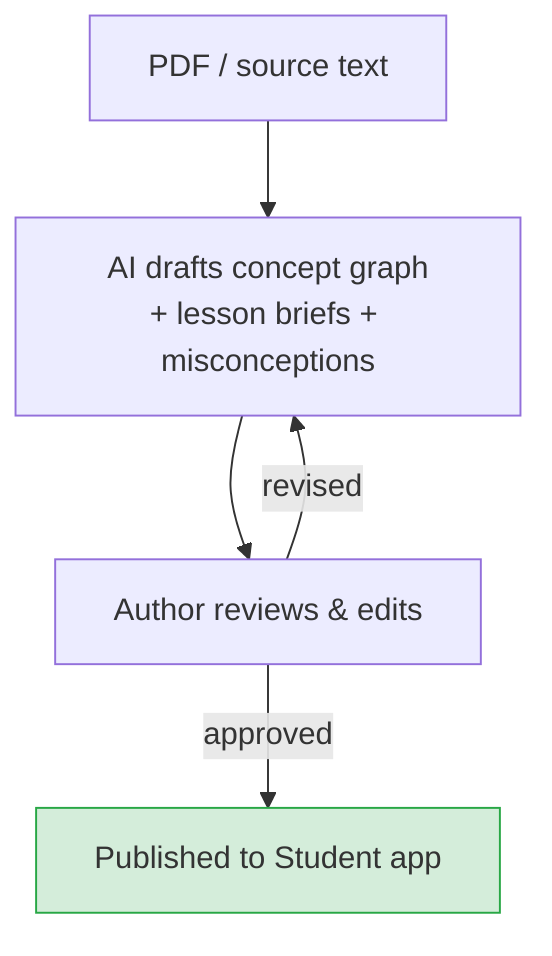

Stemolly tổ chức việc học qua ba study mode (chế độ học) — **Lesson**, **Assessment/Diagnostic**, và **Assignment Help** — mỗi chế độ đều được dẫn dắt bởi một authored brief (bản chỉ dẫn do tác giả biên soạn) mà gia sư AI diễn giải theo thời gian thực. Cách hệ thống dạy không phải là hành vi hard-coded, mà là pedagogy (phương pháp sư phạm) có thể cắm thay, được chọn cho từng phiên. Trang này giải thích toàn bộ teaching stack (ngăn xếp giảng dạy): bài học là gì, pedagogy được gắn vào ra sao, gia sư đặt câu hỏi và hỗ trợ như thế nào, và tác giả tạo nội dung bằng cách nào.

## Ba Chế độ học

Mỗi mode có một mục tiêu riêng cho gia sư, nhưng cả ba đều dựa trên cùng một cơ chế pedagogy:

| Mode | Diễn ra điều gì |
|---|---|
| **Lesson** | Học sinh đi qua nội dung có cấu trúc; gia sư dẫn dắt bằng pedagogy của phiên và làm lộ ra các misconception (ngộ nhận) theo thời gian thực. |
| **Assessment / Diagnostic** | Gia sư đưa ra bài toán để lập bản đồ mental model (mô hình nhận thức) của học sinh — mục tiêu là hiểu, không phải chấm điểm. |
| **Assignment Help** | Học sinh tải bài tập lên; gia sư kèm các em đi qua bài làm mà không cho sẵn đáp án (ở các domain kiểu Socratic) hoặc dùng correct/reinforce (trong Language). |

Cả ba mode đều đưa evidence (bằng chứng) vào mental model bền vững của học sinh.

## Pedagogy Có thể Cắm thay

Cách dạy của Stemolly **không bị cố định vào một phong cách duy nhất**. Pedagogy là một chiến lược có thể cắm thay, được phân giải theo từng phiên bằng một cơ chế xếp tầng đơn giản:

```
lesson override → mode default → domain default
```

Trong MVP-1, mới chỉ có các giá trị mặc định theo domain được điền:

- **Math, Physics, Chemistry** → Socratic (không bao giờ tiết lộ insight đích; dẫn dắt bằng câu hỏi)
- **Language** → Correct / Reinforce (chẩn đoán lỗi, sửa lại, rồi củng cố mẫu đúng)

Cơ chế này được thiết kế đến độ hạt nhỏ nhất là từng lesson, nhưng hiện tại hệ thống đang chạy bằng các mặc định thô ở cấp domain. Nhờ vậy, thêm một study mode mới có chi phí rất thấp — một mode chỉ là một brief với pedagogy khác và một ít UI đầu vào. Không có logic chuyển đổi nào nằm trong lõi engine.

### Pedagogy Strategy là gì

Một strategy là một **declarative bundle (gói cấu hình khai báo)**, không phải mã. Nó gồm có:

- Các mảnh prompt dành cho gia sư
- Các guardrail (ràng buộc an toàn) đã khai báo (ví dụ *không bao giờ tiết lộ insight đích*)
- Một checkpoint policy (chính sách checkpoint)
- Một scaffolding ladder (thang hỗ trợ theo nấc)

Một resolver (bộ phân giải) theo từng phiên sẽ lấy bundle từ registry (sổ đăng ký). Engine và lõi gia sư không bao giờ biết pedagogy nào đang hoạt động — chúng chỉ thấy bundle đã được phân giải. Muốn thêm một pedagogy mới chỉ cần thêm một bundle và một mục trong registry; không cần sửa dù chỉ một dòng trong engine.

:::note[Vì sao dùng dạng khai báo thay vì code hook?]
Strategy-as-code (các callback hook vào vòng lặp lượt thoại) đã bị loại bỏ vì những giả định Socratic sớm muộn cũng sẽ rò rỉ vào các luồng lõi, và vì strategy viết bằng mã khó kiểm tra, đối chiếu hơn. Về sau có thể sẽ thêm một lối thoát bằng hook nếu có pedagogy nào đó thật sự không thể biểu đạt theo kiểu khai báo.
:::

## Lesson Brief

Một lesson không phải là tài liệu cố định để học sinh đọc. Nó là một **teaching brief** được trao cho tutor agent (tác tử gia sư), rồi từ đó tác tử này tiến hành bài học trực tiếp.

Tác giả sở hữu:
- **Goal** — điều học sinh cần xây dựng được sau buổi học
- **Ordered steps** — ví dụ: mở đầu bằng một bài toán, dẫn học sinh hiểu nó, giúp các em tự dựng lý thuyết, mở rộng, luyện tập, giao bài
- **Per-step intent** — ở mỗi bước, gia sư đang cố đạt được điều gì
- **Trusted materials (tài liệu đã thẩm định)** — các nguồn mà tác tử buộc phải dựa vào (không được bịa)
- **Pedagogy** — mặc định lấy từ domain; có thể ghi đè theo từng lesson

Gia sư sở hữu cuộc hội thoại trực tiếp. Nó diễn giải brief, ứng biến câu hỏi theo phong cách của domain (câu hỏi Socratic cho Math; diagnose/correct/reinforce cho Language), thích nghi với học sinh, và vẫn ở trong các bước cùng ý đồ mà tác giả đã đặt ra.

Trusted materials là phần tối quan trọng với một sản phẩm giáo dục: chúng ngăn tác tử bịa ra nội dung sai trong lúc dạy trực tiếp.

```
┌───────────────────────────┐
│       Lesson Brief        │
│  goal · steps · intent    │
│  trusted materials        │
│  pedagogy (domain default)│
└──────────────┬────────────┘
               │ interpreted by
               ▼
        Tutor Agent
    (live conversation)
```

## Socratic Probing

Trong pedagogy Socratic (Math, Physics, Chemistry), **đặt câu hỏi chính là hoạt động dạy học**. Không có một "pha kiểm tra" tách riêng — một probe (câu hỏi thăm dò) chỉ đơn giản là một kiểu câu hỏi Socratic được dệt vào cuộc đối thoại bình thường.

Gia sư tự nhiên đan xen hai loại câu hỏi:

- **Constructive questions (câu hỏi kiến tạo)** — dựng giàn để học sinh tiến dần tới một ý tưởng ("ta biết gì về (a+b)²?")
- **Testing/elenctic questions (câu hỏi kiểm thử/phản biện)** — thử độ chắc của ý tưởng sau khi nó đã hình thành ("vì sao cách này đúng?", "nếu đổi hạng tử này thì sao?", một dạng biểu hiện mới, một phản ví dụ)

Độ mong manh được đọc ra từ cách học sinh xử lý các testing question. Mỗi lượt học sinh trả lời trong một cuộc đối thoại Socratic đều là một evidence event (sự kiện bằng chứng), nên chính cuộc trò chuyện là dòng evidence nuôi mental model của học sinh.

### Chính sách Probing

Tutor agent tuân theo một chính sách cụ thể:

1. **Đan xen** constructive question và testing question xuyên suốt — không có pha probe riêng.
2. **Nghiêng về kiểm thử** khi câu trả lời của học sinh đến quá nhanh hoặc nghe máy móc (dấu hiệu của pattern-matching chứ không phải hiểu thật).
3. **Mức sàn cứng**: một khái niệm không thể được đánh dấu là *robust* cho tới khi đã vượt qua ít nhất một phép thử thật sự — một transfer problem (bài chuyển dạng) hoặc một câu hỏi "vì sao" — mà không cần trợ giúp.



Mức sàn này được chọn thay vì phải probe mọi khái niệm (quá mệt) hoặc theo một lịch cố định (quá cứng). Mục đích của nó rất đơn giản: **"trông như đã xong" không bao giờ đồng nghĩa với "đã được xác nhận là chắc"** nếu chưa qua ít nhất một phép thử sức.

### Hạt giống Probe do Tác giả viết

Phần lớn probe là các câu hỏi nối tiếp theo ngữ cảnh do AI tạo ra — một câu hỏi được may đo đúng theo điều học sinh vừa nói sẽ mạnh hơn nhiều so với câu hỏi viết sẵn. Tuy vậy, tác giả có thể tùy chọn gài vào một vài *seed transfer problem* cho mỗi concept node để việc đo lường còn giữ được khả năng so sánh giữa các học sinh. Những seed này nằm trong trusted materials của lesson brief.

## Graduated Scaffolding

Quy tắc Socratic — không cho luôn đáp án — không phải là tuyệt đối. Ràng buộc thực sự chính xác hơn: **gia sư không bao giờ tiết lộ insight đích** mà bài học tồn tại để học sinh tự xây dựng. Tuy nhiên, nó vẫn có thể cung cấp các dữ kiện phụ trợ (nhắc lại một công thức, một bước tính số) nếu đó không phải chính là điều đang được dạy.

Khi học sinh bị mắc lại, gia sư sẽ leo lên một **graduated scaffolding ladder** thay vì lặp đi lặp lại cùng một cách:

> **Reframe → Hint → Analogous worked example**

(Việc tụt xuống prerequisite hiện được hoãn trong MVP vì để xác định đáng tin cậy prerequisite nào đang thiếu, rồi chen vào luồng bài học, cần một belief graph (đồ thị niềm tin) đủ trưởng thành.)

Trợ giúp là **student-pulled**. Học sinh là người kích hoạt ("I'm stuck" hoặc một nút gợi ý); hệ thống chỉ chọn bậc hỗ trợ. Một lưới an toàn tối thiểu sẽ đề nghị — chứ không áp đặt — trợ giúp khi tình trạng im lặng kéo dài, để mặc định vẫn giữ được productive struggle (sự vật lộn hiệu quả).

:::caution[Những thành công có scaffolding sẽ được đánh dấu]
Mỗi bước có scaffolding đều được đóng dấu vào evidence event. Một thành công đạt được nhờ scaffolding *không* phải là bằng chứng của sự hiểu vững — nó phản chiếu cùng một mức sàn như quy tắc "chưa được probe thì chưa robust". Điều này bảo vệ phép đo độ mong manh. Scaffolding cũng bị tắt trong một checkpoint khóa dùng để kiểm tra predictive validity, để hỗ trợ không thể rò rỉ vào kết quả được chấm.
:::

## Nội dung: Biên soạn Kết hợp

Chương trình học cốt lõi là nội dung có cấu trúc do đội ngũ tạo ra (và sau này là do giáo viên tạo). Trong một phiên học, AI cũng có thể sinh thêm tài liệu bổ sung theo nhu cầu để củng cố một khái niệm cụ thể — nhưng điều đó không thay thế chương trình học có cấu trúc. Phần bổ sung do AI tạo chỉ nhắm vào các chủ đề cần gia cố, chứ không tạo ra nguyên cả một lộ trình lesson.

Mô hình lai này giữ cho trải nghiệm học tập mạch lạc, đồng thời cho phép AI lấp khoảng trống một cách linh hoạt.

## Tạo Nội dung trong Console

Tác giả tạo lesson brief trong khu vực **Author** của Console. AI hỗ trợ quá trình này, nhưng con người phải phê duyệt mọi bước — không có gì được xuất bản nếu chưa có tác giả ký duyệt.

Khi được cung cấp một sách giáo khoa PDF hoặc đoạn văn bản được dán vào, AI sẽ:

1. Soạn nháp concept graph (đồ thị khái niệm; prerequisite DAG cho Math; error/skill taxonomy cho Language)
2. Đề xuất cách ghép với các canonical concept node (nút khái niệm chuẩn) hiện có
3. Soạn nháp lesson brief — goal, ordered steps, per-step intent, trusted materials, và một pedagogy mặc định theo domain
4. Gieo sẵn misconception cho từng concept node

Sau đó, tác giả xem lại, chỉnh sửa, và phê duyệt trước khi bất kỳ thứ gì đến được với học sinh.

:::note[AI ở khâu biên soạn ≠ AI trong phiên học]
AI dùng để soạn lesson brief ở thời điểm biên soạn là một bước khác với AI sinh tài liệu bổ sung theo nhu cầu trong phiên học trực tiếp. Cái trước xây dựng curriculum; cái sau lấp chỗ trống ngay giữa phiên, nhưng vẫn ở trong curriculum đó.
:::

### Assignment Brief cần có gì

Trong mode Assignment Help, brief làm nền cho gia sư phải tuân theo một quy tắc: **cung cấp các dữ kiện mà tác tử không thể tự suy ra từ tài liệu thô — tuyệt đối không cung cấp quy trình chẩn đoán**.

Brief nên nêu rõ:
- Cái **crux** của bài toán (insight duy nhất mà nó muốn kiểm tra)
- Những **concept** nào được vận dụng
- Những **solution method** nào nằm trong phạm vi đang dạy
- Chỗ nào mà chỉ có đáp án đúng thôi vẫn chưa đủ thông tin

Brief không được chỉ cách đánh giá câu trả lời, không liệt kê các failure mode được mong đợi, cũng không dự đoán lỗi học sinh sẽ mắc. Kiểu thông tin đó chỉ dùng được cho một pedagogy duy nhất — nó sẽ phá vỡ plugin architecture (kiến trúc plugin) và cướp mất vai trò của đối thoại Socratic trong việc khám phá học sinh *thật sự đang tin điều gì*.

Stemolly tách biệt **ý đồ giảng dạy** khỏi **cách triển khai trực tiếp**. Tác giả là con người viết một teaching brief — mục tiêu, các bước, trusted materials — rồi tutor agent AI tiến hành cuộc hội thoại trực tiếp dựa trên brief đó. Pedagogy mà tác tử áp dụng phụ thuộc vào domain môn học và có thể được ghi đè ở cấp lesson. Nhờ vậy, hệ thống vẫn linh hoạt mà không phải sửa bất kỳ mã lõi nào của engine.

## Hai Pedagogy, Một Hệ thống Có thể Cắm thay

Stemolly hiện đi kèm hai cách tiếp cận trong giảng dạy.

- **Socratic** — dùng cho Math, Physics, và Chemistry. Gia sư đặt câu hỏi để dẫn học sinh tự xây dựng ý tưởng. Nó không bao giờ nói thẳng đáp án.
- **Correct / Reinforce** — dùng cho Language. Gia sư chẩn đoán lỗi, sửa lỗi một cách tường minh, rồi củng cố mẫu đúng.

Đây không phải hành vi hardcoded. Mỗi pedagogy là một **declarative bundle** — một gói gồm chỉ dẫn prompt, guardrail (ví dụ quy tắc Socratic là không bao giờ tiết lộ insight đích), checkpoint policy, và scaffolding ladder. Một resolver nhỏ sẽ chọn đúng bundle khi bắt đầu mỗi phiên bằng cơ chế xếp tầng ba cấp:



Nếu tác giả lesson đã chỉ định một pedagogy thì lựa chọn đó sẽ thắng. Nếu không, hệ thống áp dụng mặc định của mode, rồi đến mặc định của domain. Trong MVP hiện tại, mới chỉ có mặc định theo domain được điền sẵn, nhưng cơ chế này hoạt động ở độ hạt lesson — tác giả có thể ghi đè pedagogy cho bất kỳ lesson đơn lẻ nào mà không phải đụng vào phần nào khác.

**Vì sao dùng declarative bundle thay vì code hook?** Strategy-as-code đã bị loại bỏ vì callback trong mã khó đọc và khó so sánh hơn, và — quan trọng hơn — các giả định Socratic sẽ âm thầm rò rỉ vào những luồng lõi của engine. Declarative bundle thì có thể được kiểm tra trực tiếp. Muốn thêm một pedagogy mới chỉ cần viết bundle mới và thêm một mục vào registry; không cần sửa dù chỉ một dòng trong engine, tutor core, hay API.

## Ba Chế độ học

Mỗi phiên chạy trong một trong ba mode. Active pedagogy bundle được áp dụng cho cả ba.

| Mode | Diễn ra điều gì |
|---|---|
| **Lesson** | Học sinh đi qua nội dung có cấu trúc. Gia sư đồng hành, áp dụng pedagogy của domain để làm lộ ra và xử lý các misconception theo thời gian thực. |
| **Assessment / Diagnostic** | Gia sư đưa ra bài toán để lập bản đồ mức độ hiểu của học sinh. Mục tiêu không phải là điểm số — mà là một bức tranh về mental model của học sinh. |
| **Assignment Help** | Học sinh tải bài tập lên. Gia sư kèm các em đi qua bài đó bằng pedagogy của domain — và không bao giờ cho đáp án trực tiếp ở các môn theo kiểu Socratic. |

Cả ba mode đều đưa evidence trở lại mental model bền vững của học sinh.

## Một Lesson Thực sự là gì

Trong Stemolly, một lesson không phải là một mẩu nội dung cố định được đưa cho học sinh xem. Nó là một **authored teaching brief** được trao cho tutor agent, và từ đó tác tử dẫn dắt một cuộc hội thoại trực tiếp.

Tác giả sở hữu:
- Một **goal** — khái niệm hoặc kỹ năng mà phiên học cần giúp học sinh thật sự nắm được.
- Một **ordered set of steps** — ví dụ: nêu bài toán mở đầu, dẫn học sinh hiểu bài toán, giúp các em tự dựng lý thuyết, mở rộng, luyện tập, giao bài.
- Một **per-step intention** — ở mỗi giai đoạn, gia sư nên làm gì.
- **Vetted materials** — bài đọc, ví dụ, và seed probe mà gia sư buộc phải dựa vào, chứ không được tự bịa ra.

Tutor agent sở hữu cuộc hội thoại trực tiếp. Nó đọc brief, nhận pedagogy đang hoạt động, rồi ứng biến — đặt câu hỏi Socratic cho Math/Physics/Chemistry, hoặc vận hành một vòng lặp diagnose/correct/reinforce/re-check cho Language — trong khi vẫn bám vào các bước và ý đồ của tác giả. Vetted materials (tài liệu đã thẩm định) đóng vai trò như mỏ neo làm nền: gia sư không được bịa nội dung, điều này cực kỳ quan trọng trong một sản phẩm giáo dục, nơi chỉ cần một công thức hay dữ kiện sai cũng có thể gây hại thật sự.

Cùng một brief có thể tạo ra những cuộc hội thoại khác nhau cho từng học sinh. Cấu trúc thì có thể lặp lại; đối thoại thì không. Toàn bộ schema của lesson brief vẫn đang được đặc tả; đây là hướng thiết kế đã được chốt.

## Assignment Brief: Dữ kiện, không phải Quy trình

Khi học sinh làm bài tập đã tải lên trong mode **Assignment Help**, tutor agent cần một ngữ cảnh mà chính tài liệu bài tập không cung cấp. Ngữ cảnh đó đến từ một **assignment brief** — tài liệu đồng hành do tác giả hoặc người vận hành viết cho từng bài tập.

Có một quy tắc chi phối những gì được phép nằm trong assignment brief: **nó cung cấp các dữ kiện mà tác tử không thể tự suy ra từ tài liệu thô — tuyệt đối không phải một quy trình chẩn đoán.**

Từ quy tắc duy nhất này suy ra hai hệ quả.

**Content vs. pedagogy** — nếu brief nói cho tác tử biết *cách đánh giá một câu trả lời sai*, thì logic đó chỉ đúng với một pedagogy. Vì pedagogy là thứ có thể cắm thay, brief phải giữ trung tính và để strategy đang hoạt động tự quyết định nên phản hồi thế nào.

**Problem vs. student** — brief mô tả *bài toán*, không phải *học sinh*. "Distractor này được thiết kế để bắt lỗi những em quên kiểm tra nghiệm âm" là một dữ kiện về thiết kế của bài toán. "Học sinh thường bỏ lỡ bước 3" là một dự đoán về con người — nó không thuộc về brief.

Một bản nháp brief ban đầu đã vi phạm quy tắc này khi liệt kê các nhãn failure mode cho từng bước (ví dụ `fails: misses-negative-root`) để tác tử có thể ghép một câu trả lời sai với một nhóm được đặt tên sẵn. Cách đó đã bị loại bỏ: nó cướp mất vai trò của đối thoại Socratic trong việc khám phá học sinh *thật sự đang tin điều gì*, và nó cũng chỉ có ý nghĩa dưới một pedagogy duy nhất.

Brief được chấp nhận sẽ nêu:
- **Crux** — insight duy nhất mà bài toán muốn kiểm tra.
- Những **concept** mà nó vận dụng.
- Những **solution method** nào nằm trong phạm vi đang dạy.
- Chỗ nào mà chỉ có một đáp án đúng thôi vẫn chưa đủ thông tin.

Đây là những dữ kiện để tác tử **lý luận từ đó**, chứ không phải các phán quyết để nó tra cứu sẵn.

:::caution[Brief ≠ đáp án mẫu]
Một assignment brief liệt kê các failure mode được đặt tên hoặc những lỗi học sinh được dự kiến sẵn sẽ lấn sang phạm vi quy trình chẩn đoán. Brief mô tả bài toán; chẩn đoán là việc của tutor agent.
:::

## Probing: Cách Gia sư Socratic Làm lộ ra Độ Mong manh

*Phần này áp dụng cho pedagogy Socratic — Math, Physics, và Chemistry.*

### Probe Không phải là một Chế độ Riêng

Trong dạy học Socratic, câu hỏi **chính là** hoạt động giảng dạy. Một "probe" chỉ đơn giản là một kiểu câu hỏi Socratic — gia sư không chuyển sang một mode kiểm tra đặc biệt nào. Thay vào đó, nó liên tục pha trộn hai loại câu hỏi:

- **Constructive questions** — từng bước chống đỡ để học sinh tiến tới một ý tưởng. *"Tính chất phân phối cho ta biết gì về (a+b)²?"*
- **Testing (elenctic) questions** — thử độ chắc của một ý tưởng mà học sinh có vẻ đang nắm. *"Vì sao cách đó đúng?", "Nếu đổi dấu này thì sao?", hoặc một transfer problem với hình thức bề mặt mới.*

Độ mong manh được đọc ra từ cách học sinh xử lý các testing question. Mỗi lượt học sinh trả lời trong đối thoại đều là một evidence event: misconception có thể lộ ra, được xử lý, rồi cho thấy sự mong manh — tất cả đều diễn ra ngay trong quá trình hỏi đáp bình thường, không cần một mode quiz riêng.

### Chính sách Probing: Đan xen, Nghiêng về Kiểm thử, Áp Mức Sàn

Gia sư không probe mọi khái niệm đến mức triệt để (làm vậy sẽ hại trải nghiệm), nhưng cũng không probe theo một lịch cố định (quá thô). Thay vào đó, nó:

1. **Liên tục đan xen** constructive question và testing question xuyên suốt bài học.
2. **Nghiêng về kiểm thử** khi câu trả lời đến nhanh hoặc nghe máy móc — một tín hiệu pattern-matching.
3. **Áp một mức sàn cứng**: một khái niệm không bao giờ có thể được đánh dấu là *robust* cho tới khi đã vượt qua ít nhất một phép thử thật sự — một transfer problem hoặc một câu hỏi "vì sao" — mà không cần trợ giúp.

Mức sàn này là lớp bảo vệ quan trọng nhất. "Trông như đã xong" không bao giờ có nghĩa là "đã được xác nhận là chắc" nếu chưa vượt qua một phép thử sức thật sự.

### Điều gì Tạo ra các Probe?

Probe hiệu quả nhất là probe được may đo đúng theo điều học sinh vừa nói. Ví dụ: *"Em viết 4m² + 25 — vậy điều đó giống và khác gì so với điều ta đã tìm ra cho (a+b)²?"* Chỉ có tutor, ngay trong cuộc đối thoại trực tiếp, mới có thể viết ra câu như vậy. Vì thế, probe chủ yếu là **AI-generated và mang tính ngữ cảnh**.

Tác giả cũng có thể cung cấp một số ít *seed transfer problem* cho mỗi concept node. Những seed này giúp phép đo có tính nhất quán: khi hai học sinh cùng trả lời một seed problem, kết quả của các em có thể được so sánh trực tiếp. Seed problem nằm trong vetted materials của lesson brief. Việc tạo sinh là chính; seed do tác giả viết chỉ hỗ trợ cho đo lường.

## Scaffolding Ladder: Hỗ trợ mà không Làm hỏng Bài học

### Ngưỡng Socratic

Quy tắc không cho đáp án trực tiếp có một ranh giới chính xác: **gia sư không bao giờ tiết lộ insight đích mà bài học tồn tại để học sinh tự xây dựng.** Nó vẫn có thể cung cấp các dữ kiện phụ trợ — nhắc lại công thức, một bước tính toán — miễn đó không phải là điều đang được dạy. Ranh giới nằm ở insight trung tâm của lesson.

### Các Nấc Tăng dần khi Học sinh Bị kẹt

Khi học sinh không thể tiến lên, gia sư sẽ leo dần một **graduated scaffolding ladder** thay vì lặp lại cùng một câu hỏi:



Trong phiên bản hiện tại, trợ giúp là **student-pulled**. Học sinh kích hoạt nó — bằng cách gõ "I'm stuck" hoặc bấm nút gợi ý — và hệ thống sẽ chọn nên đưa ra bậc nào. Gia sư không ép hỗ trợ ở mọi khoảng lặng; một lưới an toàn tối thiểu sẽ đề nghị (nhưng không áp đặt) trợ giúp khi tình trạng bế tắc kéo dài. Cách này mặc định giữ lại productive struggle và tránh phải dựng một bộ phát hiện thất vọng vốn rất dễ gãy.

### Vì sao Thành công có Scaffolding Không được tính là Robust

Mỗi bước scaffolding đều được đóng dấu vào evidence event. Một thành công đạt được nhờ hint không phải là bằng chứng cho thấy học sinh làm được khi không có trợ giúp — điều này phản chiếu chính xác mức sàn của probing: cũng như "chưa được probe" không thể đồng nghĩa với "robust", thì "có scaffolding" cũng không thể đồng nghĩa với "robust". Cả hai quy tắc đều bảo vệ tính toàn vẹn của phép đo độ mong manh.

Scaffolding cũng bị tắt hoàn toàn trong các checkpoint khóa dùng để kiểm tra predictive validity, để hỗ trợ không thể rò rỉ vào một kết quả được chấm.

## Curriculum: Tác giả viết trước, AI Bổ sung theo Nhu cầu

Curriculum cốt lõi là **nội dung có cấu trúc do tác giả tạo ra** — một tập hợp lesson brief. Trong một phiên học trực tiếp, AI có thể sinh thêm tài liệu bổ sung theo nhu cầu — một ví dụ mới, một bài luyện tập mới — để củng cố một khái niệm cụ thể. Đây là phần bổ sung có mục tiêu cho lesson có cấu trúc, chứ không phải thứ thay thế nó. Cấu trúc giữ cho lộ trình học tập mạch lạc; AI lấp các khoảng trống một cách linh hoạt.

### Biên soạn có AI Hỗ trợ trong Console

Trong khu vực Author của Console, AI hỗ trợ việc tạo curriculum ở thời điểm biên soạn (không phải lúc phiên học đang diễn ra). Khi được cung cấp một sách giáo khoa PDF hoặc đoạn văn bản được dán vào, nó sẽ:

- Soạn nháp **concept graph** — một prerequisite DAG cho Math, hoặc một error/skill taxonomy cho Language.
- Đề xuất cách các mục curriculum khớp với những canonical concept node hiện có.
- Soạn nháp **lesson brief** — goal, ordered steps, per-step intent, vetted materials, và một pedagogy mặc định theo domain.
- Gieo sẵn misconception cho từng concept node.

Mọi bước đều là **human-in-the-loop**. Tác giả sẽ xem xét, chỉnh sửa, và phê duyệt từng bản nháp. Không có gì tới được Student app nếu chưa được tác giả phê duyệt tường minh.

:::note[AI soạn nháp, con người xuất bản]
AI là trợ lý soạn nháp ở giai đoạn biên soạn — nó giúp công việc nhanh hơn nhưng không bao giờ tự động xuất bản. Mọi lesson brief đến được với học sinh đều đã được một tác giả con người xem xét và phê duyệt.
:::



Phần hỗ trợ ở thời điểm biên soạn này tách biệt với việc sinh nội dung bổ sung trong phiên học. Toàn bộ schema của lesson brief được dời sang một build sprint.
