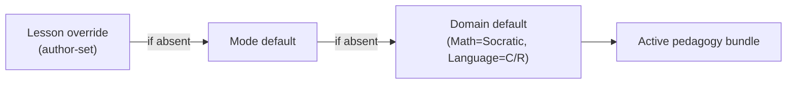
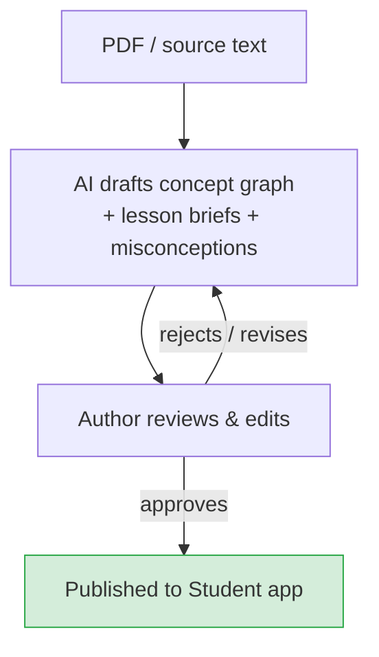

Stemolly không truyền nội dung một chiều cho học sinh — hệ thống dẫn dắt để các em tự xây dựng sự hiểu biết. Gia sư AI trò chuyện trực tiếp, đặt câu hỏi và thích ứng theo thời gian thực. Tuy nhiên, cách dạy không áp dụng đồng loạt cho mọi trường hợp: phương pháp giảng dạy (gọi là *pedagogy* (phương pháp sư phạm)) thay đổi theo môn học và được xác định lại ở đầu mỗi phiên. Trang này giải thích cơ chế đó hoạt động ra sao — lesson (bài học) là gì, probing (thăm dò) vận hành thế nào trong các môn theo hướng Socratic, học sinh bị bí sẽ được hỗ trợ ra sao, và chương trình học được xây dựng như thế nào.

---

## Hai pedagogy, một hệ thống có thể cắm ghép

Stemolly hiện đi kèm hai phương pháp giảng dạy.

- **Socratic** — dùng cho Toán, Vật lý và Hóa học. Gia sư đặt câu hỏi để dẫn học sinh tự hình thành ý tưởng. Hệ thống không đơn thuần nói luôn đáp án.
- **Correct / Reinforce** — dùng cho Ngôn ngữ. Gia sư chẩn đoán lỗi, sửa trực tiếp và củng cố mẫu đúng.

Đây không phải là thứ bị mã hóa cứng theo từng môn. Pedagogy là một *declarative bundle* (gói khai báo) — một gói gồm chỉ dẫn prompt, guardrails (rào chắn), checkpoint policy (chính sách checkpoint) và scaffolding ladder (thang hỗ trợ từng bước). Một resolver (bộ phân giải) nhỏ sẽ chọn đúng gói ở đầu mỗi phiên theo cơ chế phân tầng ba mức:

```
lesson override  →  mode default  →  domain default
```

Nếu tác giả của lesson đã chỉ định một pedagogy, lựa chọn đó sẽ được ưu tiên. Nếu không, hệ thống dùng mode default, rồi mới đến domain default. Trong MVP hiện tại chỉ mới thiết lập các giá trị mặc định theo domain (Math → Socratic, Language → Correct/Reinforce), nhưng cơ chế này hoạt động tới cấp độ từng lesson — tác giả có thể ghi đè pedagogy cho bất kỳ lesson riêng lẻ nào mà không cần đụng vào phần còn lại.



**Vì sao dùng declarative bundle thay vì code hook?** Phương án còn lại là cho phép các chiến lược pedagogy tồn tại dưới dạng callback mã tùy ý, được chèn vào vòng lặp lượt hội thoại của gia sư. Cách đó bị loại bỏ vì chiến lược viết bằng mã khó đọc, khó so sánh hơn, và quan trọng hơn là các giả định của Socratic sẽ âm thầm rò rỉ vào những luồng cốt lõi của engine. Declarative bundle có thể được kiểm tra trực tiếp. Muốn thêm một pedagogy mới chỉ cần viết một bundle mới và đăng ký nó; không cần sửa dù chỉ một dòng trong engine hay lõi tutor.

---

## Ba chế độ học

Mỗi phiên đều chạy trong một trong ba chế độ. Active pedagogy bundle áp dụng cho cả ba.

| Mode | Điều gì diễn ra |
|---|---|
| **Lesson** | Học sinh học theo nội dung có cấu trúc. Gia sư đồng hành và áp dụng pedagogy của domain để làm lộ ra và xử lý các ngộ nhận ngay trong thời gian thực. |
| **Assessment / Diagnostic** | Gia sư đưa ra bài toán để lập bản đồ mức độ hiểu của học sinh. Mục tiêu không phải là cho điểm — mà là phác họa mô hình tư duy của học sinh. |
| **Assignment Help** | Học sinh tải bài tập lên. Gia sư hướng dẫn các em xử lý bài bằng pedagogy của domain — và trong các môn Socratic thì tuyệt đối không đưa đáp án trực tiếp. |

Cả ba chế độ đều đưa dữ liệu trở lại mental model (mô hình tư duy) bền vững của học sinh (xem [../engine/mental-model.md](../engine/mental-model.md)).

---

## Lesson thực sự là gì

Trong Stemolly, lesson không phải là một mẩu nội dung cố định được hiển thị cho học sinh. Đó là một **teaching brief** (bản chỉ dẫn giảng dạy do tác giả biên soạn) được chuyển cho tutor agent (tác tử gia sư), rồi từ đó agent sẽ dẫn dắt một cuộc trò chuyện trực tiếp.

Tác giả phụ trách:
- Một **mục tiêu** — khái niệm hoặc kỹ năng mà sau phiên học, học sinh cần thực sự nắm được.
- Một **tập bước có thứ tự** — ví dụ: nêu bài toán mở đầu, dẫn học sinh hiểu đề, giúp các em tự xây dựng lý thuyết, mở rộng, luyện tập, giao bài.
- Một **ý đồ cho từng bước** — ở mỗi giai đoạn, gia sư nên làm gì.
- **Tài liệu đã được thẩm định** — bài đọc, ví dụ và probe seed mà gia sư buộc phải dựa vào, chứ không được tự bịa ra.

Tutor agent phụ trách chính cuộc đối thoại. Agent đọc brief, nắm active pedagogy rồi ứng biến — đặt câu hỏi theo ngữ cảnh trong một lesson Socratic, hoặc chẩn đoán và sửa lỗi trong một lesson Ngôn ngữ — đồng thời vẫn bám sát ý đồ và cấu trúc bước mà tác giả đã nêu. Các tài liệu đã thẩm định đóng vai trò mỏ neo nền tảng: gia sư không thể bịa nội dung, điều này đặc biệt quan trọng trong một sản phẩm giáo dục, nơi chỉ một công thức hay một dữ kiện sai cũng có thể gây hại thực sự.

Thiết kế này cho phép cùng một brief nhưng có thể tạo ra cuộc trò chuyện khác nhau cho từng học sinh. Cấu trúc thì lặp lại được; hội thoại thì không.

---

## Probing: cách gia sư Socratic làm lộ ra điểm yếu

*Phần này áp dụng riêng cho pedagogy Socratic (Toán, Vật lý, Hóa học).*

### Probe không phải là một chế độ riêng

Trong cách dạy Socratic, câu hỏi **chính là** việc dạy. Vì vậy, một "probe" đơn giản chỉ là một kiểu câu hỏi Socratic — gia sư không chuyển sang một chế độ kiểm tra đặc biệt nào cả. Thay vào đó, hệ thống tự nhiên đan xen hai loại câu hỏi trong mọi lesson:

- **Constructive questions** — dựng giàn để dẫn học sinh tới một ý tưởng. *"Tính chất phân phối cho ta biết gì về (a+b)²?"*
- **Testing (elenctic) questions** — thử độ bền của một ý mà học sinh có vẻ đang nắm giữ. *"Vì sao cách đó đúng?", "Nếu đổi dấu này thì sao?", hoặc một bài chuyển dạng trong một cách biểu hiện mới.*

Mức độ mong manh được đọc ra từ cách học sinh xử lý các testing questions. Khi học sinh trả lời nhanh, máy móc các constructive questions, đó là tín hiệu để chuyển dần sang kiểm tra. Mỗi lượt trả lời của học sinh trong hội thoại đều là một evidence event: ngộ nhận lộ ra, được tháo gỡ và chứng minh là còn mong manh — tất cả diễn ra ngay trong dòng hỏi đáp bình thường, không cần một chế độ quiz riêng.

### Chính sách probing: đan xen, nghiêng về kiểm tra, áp dụng ngưỡng sàn bắt buộc

Gia sư không probe mọi khái niệm đến mức cạn kiệt (làm vậy sẽ phá hỏng trải nghiệm), nhưng cũng không probe theo một lịch cố định (quá thô). Thay vào đó, hệ thống:

1. **Liên tục đan xen** constructive questions và testing questions.
2. **Nghiêng về kiểm tra** khi câu trả lời đến quá nhanh hoặc nghe máy móc — dấu hiệu của việc khớp mẫu.
3. **Áp dụng một ngưỡng sàn cứng**: một khái niệm không bao giờ được đánh dấu là *robust* nếu chưa vượt qua ít nhất một phép thử thực sự — một bài chuyển dạng hoặc một câu hỏi "vì sao".

Ngưỡng sàn này là lựa chọn thiết kế then chốt. Nó ngăn việc "học sinh đã trả lời hết các bước" bị hiểu thành "học sinh đã hiểu". Một khái niệm chưa từng bị thử sức thì chưa thể gọi là vững.

### Điều gì tạo ra các probe?

Probe hiệu quả nhất là probe được may đo theo đúng điều học sinh vừa nói. Ví dụ: *"Em viết 4m² + 25 — điều đó so với kết quả ta tìm được cho (a+b)² thì thế nào?"* Chỉ có tutor, ngay trong lúc đối thoại, mới có thể đặt ra câu hỏi đó. Vì thế, probe chủ yếu là **do AI tạo ra và có tính ngữ cảnh**.

Tác giả cũng có thể cung cấp một số ít *seed transfer problems* cho mỗi concept node. Những seed này giúp việc đo lường nhất quán hơn: khi hai học sinh cùng trả lời một seed problem, kết quả của các em có thể được so sánh trực tiếp. Seed problem nằm trong vetted materials của lesson brief. Đây là một mô hình lai: việc tạo sinh giữ vai trò chính, còn seed do tác giả cung cấp giúp hỗ trợ đo lường.

---

## Scaffolding ladder: hỗ trợ mà không làm hỏng bài học

### Ngưỡng của Socratic

Quy tắc không đưa đáp án trực tiếp của Socratic có một ranh giới rất rõ: **gia sư không bao giờ tiết lộ insight mục tiêu mà lesson được tạo ra để học sinh tự xây dựng.** Hệ thống có thể cung cấp các dữ kiện phụ trợ — nhớ lại một công thức, một bước tính toán — nếu đó không phải chính điều đang được dạy. Ranh giới được đặt ở insight cốt lõi của lesson, chứ không phải ở mọi mẩu thông tin.

### Cách hỗ trợ khi học sinh bị mắc kẹt

Khi học sinh không thể tiến lên, gia sư sẽ leo dần trên một **scaffolding ladder theo cấp độ** thay vì lặp lại cùng một câu hỏi. Các nấc hiện tại là:

```
Reframe  →  Hint  →  Analogous worked example
```

*(Việc lùi xuống một khái niệm tiên quyết là một nấc trong tương lai — nó cần một belief graph đủ trưởng thành để xác định đáng tin cậy phần tiên quyết còn thiếu mà không làm đứt mạch bài học.)*

Trong phiên bản hiện tại, hỗ trợ là kiểu **do học sinh chủ động kéo ra**. Học sinh là người kích hoạt — bằng cách gõ "Em bị bí", bấm nút gợi ý hoặc cách tương tự — và hệ thống sẽ chọn nấc hỗ trợ phù hợp. Gia sư không ép hỗ trợ vào mọi khoảng lặng; một lưới an toàn tối thiểu chỉ đưa ra đề nghị hỗ trợ khi tình trạng bế tắc kéo dài (nhưng không bao giờ áp đặt). Cách này mặc định giữ lại sự vật lộn có ích và tránh phải dựa vào một bộ phát hiện thất vọng dễ vỡ.

### Vì sao thành công nhờ scaffold không được tính là robust

Mọi phản hồi có scaffold đều được đóng dấu lên evidence event. Một lần làm đúng nhờ gợi ý không phải là bằng chứng cho thấy học sinh làm được khi không có trợ giúp. Điều này phản chiếu đúng ngưỡng sàn của probing: cũng như "chưa được probe" không thể đồng nghĩa với "robust", thì "có scaffold" cũng không thể đồng nghĩa với "robust". Cả hai quy tắc đều nhằm bảo vệ tính toàn vẹn của phép đo độ mong manh trong mental model.

Scaffolding cũng bị tắt hoàn toàn trong các checkpoint khóa dùng để đánh giá predictive-validity, để hỗ trợ không thể rò rỉ vào một kết quả được tính điểm.

---

## Chương trình học: đội ngũ xây trước, AI bổ sung khi cần

Chương trình học chính là **nội dung có cấu trúc do đội ngũ Stemolly tạo ra** (và về sau có thể do giáo viên tạo). Đây không phải là sản phẩm lấy tạo sinh làm trung tâm: AI không viết cả khóa học. Trong một phiên học trực tiếp, AI có thể tạo thêm tài liệu bổ sung theo nhu cầu — một ví dụ mới, một bài luyện thêm — để củng cố một khái niệm cụ thể, nhưng chỉ như phần bổ trợ có mục tiêu cho lesson có cấu trúc, chứ không thay thế lesson đó.

Mô hình lai này giúp trải nghiệm học tập giữ được tính mạch lạc. Cấu trúc được tác giả biên soạn và rà soát; sự linh hoạt đến từ việc AI lấp những khoảng trống ngay tại thời điểm cần.

### Tác giả chương trình học xây lesson như thế nào

Trong khu vực Author của Console, AI hỗ trợ tác giả ở thời điểm biên soạn (không phải lúc diễn ra phiên học). Khi được cung cấp sách giáo khoa PDF nguồn hoặc văn bản dán vào, hệ thống sẽ:

- Phác thảo **concept graph** — một DAG tiên quyết cho Toán, hoặc một taxonomy lỗi/kỹ năng cho Ngôn ngữ.
- Đề xuất cách các mục nội dung trong chương trình khớp với những concept node chuẩn sẵn có.
- Phác thảo **lesson brief** — mục tiêu, các bước theo thứ tự, ý đồ cho từng bước, vetted materials và một pedagogy mặc định lấy từ domain.
- Gieo sẵn các ngộ nhận cho từng concept node.

Mọi bước đều có **con người trong vòng lặp**. Tác giả xem lại, chỉnh sửa và phê duyệt từng bản nháp. Không có gì được đưa tới ứng dụng Student nếu chưa có phê duyệt rõ ràng từ tác giả — AI chỉ soạn nháp, không bao giờ tự động xuất bản.

Phần hỗ trợ biên soạn bằng AI này tách biệt với việc tạo nội dung bổ sung trong phiên học đã nói ở trên. Cùng một nguyên tắc lai được áp dụng ở cả hai tầng: AI tạo ra, con người xác minh.


