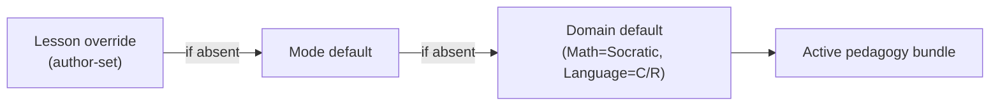
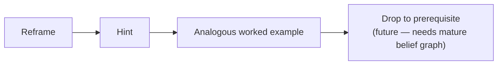
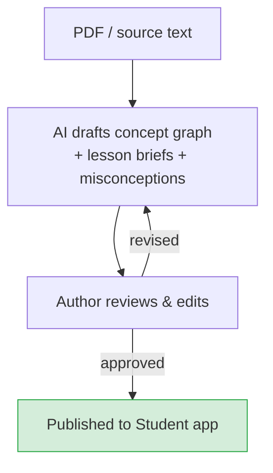

Stemolly tách biệt **ý đồ giảng dạy** khỏi **cách triển khai trực tiếp**. Một tác giả là con người sẽ viết một teaching brief (bản chỉ dẫn giảng dạy) — gồm mục tiêu, các bước, và tài liệu đã được thẩm định — còn AI tutor agent (tác tử gia sư AI) sẽ dẫn dắt cuộc hội thoại trực tiếp dựa trên bản chỉ dẫn đó. Pedagogy (phương pháp sư phạm) mà tác tử áp dụng phụ thuộc vào từng miền môn học và có thể được ghi đè ở cấp bài học. Nhờ vậy, hệ thống vẫn linh hoạt mà không cần thay đổi bất kỳ mã lõi nào của engine.

## Hai Pedagogy, Một Hệ thống Có thể Hoán đổi

Stemolly hiện có hai cách tiếp cận trong giảng dạy.

- **Socratic** — dùng cho Math, Physics, và Chemistry. Gia sư đặt câu hỏi để dẫn học sinh tự hình thành ý tưởng. Nó không bao giờ nói thẳng đáp án.
- **Correct / Reinforce** — dùng cho Language. Gia sư chẩn đoán lỗi, sửa lỗi một cách tường minh, rồi củng cố lại mẫu đúng.

Đây không phải là các hành vi hardcoded (mã hóa cứng). Mỗi pedagogy là một **declarative bundle (gói khai báo)** — một gói gồm chỉ dẫn prompt, guardrails (hàng rào kiểm soát; ví dụ quy tắc Socratic là không bao giờ tiết lộ insight đích), checkpoint policy (chính sách điểm kiểm), và scaffolding ladder (thang hỗ trợ từng mức). Một bộ phân giải nhỏ sẽ chọn đúng bundle khi bắt đầu mỗi phiên dựa trên cơ chế phân tầng ba cấp:

Nếu tác giả bài học đã chỉ định một pedagogy thì lựa chọn đó sẽ được ưu tiên. Nếu không, hệ thống dùng mặc định của mode, rồi mới đến mặc định của domain. Trong MVP hiện tại, mới chỉ có các mặc định theo domain được điền sẵn, nhưng cơ chế này hoạt động ở độ hạt bài học — tác giả có thể ghi đè pedagogy cho bất kỳ bài học riêng lẻ nào mà không phải đụng vào phần khác.

**Vì sao dùng declarative bundle thay vì code hook?** Cách strategy-as-code (chiến lược viết bằng mã) đã bị loại bỏ vì các callback trong mã khó đọc, khó so sánh hơn, và quan trọng hơn là các giả định kiểu Socratic sẽ âm thầm rò rỉ vào các luồng lõi của engine. Declarative bundle thì có thể xem xét trực tiếp được. Muốn thêm một pedagogy mới chỉ cần viết một bundle mới và thêm một mục vào registry (sổ đăng ký); không cần sửa dù chỉ một dòng trong engine, tutor core hay API.

## Ba Chế độ học

Mỗi phiên học đều chạy trong một trong ba mode. Active pedagogy bundle sẽ áp dụng trong cả ba.

| Mode | Diễn ra điều gì |
|---|---|
| **Lesson** | Học sinh đi qua nội dung có cấu trúc. Gia sư đồng hành và áp dụng pedagogy của domain để làm lộ ra rồi xử lý các misconception theo thời gian thực. |
| **Assessment / Diagnostic** | Gia sư đưa ra bài toán để lập bản đồ mức độ hiểu của học sinh. Mục tiêu không phải là cho điểm — mà là tạo ra một bức tranh về mô hình nhận thức của học sinh. |
| **Assignment Help** | Học sinh tải bài tập lên. Gia sư sẽ hướng dẫn các em đi qua bài đó bằng pedagogy của domain — và không bao giờ cho đáp án trực tiếp ở các môn dùng Socratic. |

Cả ba mode đều đưa evidence (bằng chứng quan sát) trở lại mô hình nhận thức bền vững của học sinh.

## Một Bài học Thực sự là gì

Trong Stemolly, một bài học không phải là một mẩu nội dung cố định được đưa thẳng cho học sinh xem. Nó là một **authored teaching brief (bản chỉ dẫn giảng dạy do tác giả biên soạn)** được chuyển cho tutor agent, rồi từ đó tác tử này dẫn dắt một cuộc hội thoại trực tiếp.

Tác giả chịu trách nhiệm về:
- Một **goal (mục tiêu)** — khái niệm hoặc kỹ năng mà phiên học cần giúp học sinh thực sự nắm được.
- Một **tập bước có thứ tự** — ví dụ: nêu bài toán mở đầu, dẫn học sinh hiểu bài toán, giúp các em tự xây dựng lý thuyết, mở rộng, luyện tập, giao bài.
- Một **ý đồ cho từng bước** — ở mỗi giai đoạn, gia sư cần làm gì.
- **Tài liệu đã được thẩm định** — bài đọc, ví dụ và probe seed mà gia sư buộc phải dựa vào, chứ không được tự bịa ra.

Tutor agent chịu trách nhiệm về cuộc hội thoại trực tiếp. Nó đọc brief, nhận pedagogy đang được kích hoạt, rồi ứng biến — đặt câu hỏi kiểu Socratic cho Math/Physics/Chemistry, hoặc chạy vòng lặp chẩn đoán/sửa/củng cố/kiểm tra lại cho Language — trong khi vẫn bám chặt các bước và ý đồ mà tác giả đã đặt ra. Các tài liệu đã thẩm định đóng vai trò như một neo bám để giữ nội dung đúng thực tế: gia sư không được bịa thông tin, điều này đặc biệt quan trọng trong một sản phẩm giáo dục, nơi một công thức hay dữ kiện sai có thể gây hại thật sự.

Cùng một brief có thể tạo ra các cuộc hội thoại khác nhau cho từng học sinh. Cấu trúc thì lặp lại được; đối thoại thì không. Toàn bộ schema (lược đồ) của lesson brief vẫn đang được đặc tả; đây là hướng thiết kế đã được chốt.

## Probing: Cách Gia sư Socratic Làm lộ ra Sự Mong manh

*Phần này áp dụng cho pedagogy Socratic — Math, Physics, và Chemistry.*

### Probe Không phải là một Chế độ Riêng

Trong dạy học kiểu Socratic, các câu hỏi **chính là** hoạt động giảng dạy. Một "probe" chỉ đơn giản là một dạng câu hỏi Socratic — gia sư không chuyển sang một chế độ kiểm tra đặc biệt nào cả. Thay vào đó, nó liên tục đan xen hai loại câu hỏi:

- **Constructive questions (câu hỏi kiến tạo)** — từng bước đỡ để học sinh tiến tới một ý tưởng. *"Tính chất phân phối cho ta biết gì về (a+b)²?"*
- **Testing (elenctic) questions (câu hỏi kiểm thử/phản biện)** — gây áp lực lên một ý tưởng mà học sinh có vẻ đang tin là đúng. *"Vì sao cách đó đúng?", "Nếu đổi dấu này thì sao?", hoặc một bài chuyển dạng với bề mặt mới.*

Độ mong manh được đọc ra từ cách học sinh xử lý các câu hỏi kiểm thử. Mỗi lượt phản hồi của học sinh trong đối thoại đều là một evidence event (sự kiện bằng chứng): misconception có thể lộ ra, được giải quyết, rồi lại cho thấy tính mong manh — tất cả đều diễn ra ngay trong chuỗi đặt câu hỏi thông thường, không cần chế độ quiz riêng.

### Chính sách Probing: Đan xen, Nghiêng về Kiểm thử, Áp một Mức Sàn

Gia sư không probe mọi khái niệm đến mức kiệt quệ (làm vậy sẽ làm giảm trải nghiệm), nhưng cũng không probe theo một lịch cố định (quá thô). Thay vào đó, nó:

1. **Liên tục đan xen** các câu hỏi kiến tạo và câu hỏi kiểm thử trong suốt bài học.
2. **Nghiêng về kiểm thử** khi câu trả lời đến quá nhanh hoặc nghe có vẻ máy móc — một tín hiệu của việc khớp mẫu.
3. **Áp một mức sàn cứng**: một khái niệm không bao giờ được đánh dấu là *robust* (vững) cho tới khi học sinh tự mình vượt qua ít nhất một phép thử thực sự — một bài chuyển dạng hoặc một câu hỏi "vì sao".

Mức sàn này là lớp bảo vệ then chốt. "Trông như đã xong" không bao giờ đồng nghĩa với "đã được xác nhận là vững" nếu chưa vượt qua một phép thử sức thật sự.

### Điều gì Tạo ra các Probe?

Probe hiệu quả nhất là probe được may đo theo đúng điều học sinh vừa nói. Ví dụ: *"Em viết 4m² + 25 — vậy nó giống và khác gì so với điều ta đã tìm ra cho (a+b)²?"* Chỉ tutor, ngay trong lúc đối thoại đang diễn ra, mới có thể viết ra câu như vậy. Vì thế, probe chủ yếu là **AI-generated and contextual (được AI tạo ra và phụ thuộc ngữ cảnh)**.

Tác giả cũng có thể cung cấp một số ít *seed transfer problems* cho mỗi concept node. Các seed này tạo ra sự nhất quán trong đo lường: khi hai học sinh cùng trả lời một seed problem, kết quả của các em có thể được so sánh trực tiếp. Seed problem nằm trong phần tài liệu đã thẩm định của lesson brief. Việc tạo sinh là chính; các seed do tác giả viết đóng vai trò hỗ trợ cho đo lường.

## Thang Scaffolding: Hỗ trợ mà không Làm hỏng Bài học

### Ngưỡng Socratic

Quy tắc không cho đáp án trực tiếp có một ranh giới rất rõ: **gia sư không bao giờ tiết lộ insight đích mà bài học được tạo ra để học sinh tự xây dựng.** Nó có thể cung cấp các dữ kiện phụ trợ — nhớ lại công thức, một bước tính toán — nếu đó không phải là điều cốt lõi đang được dạy. Ranh giới được vẽ đúng tại insight trung tâm của bài học.

### Các Nấc Tăng dần khi Học sinh Bị kẹt

Khi học sinh không thể tiến lên, gia sư sẽ leo dần một **graduated scaffolding ladder (thang hỗ trợ tăng dần)** thay vì cứ lặp lại cùng một câu hỏi:

Trong phiên bản hiện tại, trợ giúp là **student-pulled (do học sinh chủ động kéo ra)**. Học sinh kích hoạt nó — bằng cách gõ "I'm stuck" hoặc bấm vào một nút gợi ý — và hệ thống sẽ chọn xem nên đưa ra nấc nào. Gia sư không ép hỗ trợ ở mọi khoảng lặng; chỉ có một lưới an toàn tối thiểu là đề nghị hỗ trợ khi tình trạng bế tắc kéo dài quá lâu, chứ không bao giờ áp đặt. Cách này mặc định giữ lại "productive struggle" (sự vật lộn có ích) và tránh phải dựng một bộ phát hiện thất vọng vốn rất dễ mong manh.

### Vì sao Thành công nhờ Scaffolding Không được tính là Robust

Mỗi bước scaffolding đều được đóng dấu vào evidence event. Một thành công đạt được sau khi có hint không phải là bằng chứng cho thấy học sinh có thể làm được khi không có trợ giúp — quy tắc này phản chiếu chính xác mức sàn của probing: cũng như "chưa được probe" không thể đồng nghĩa với "robust", thì "có dùng scaffolding" cũng không thể đồng nghĩa với "robust". Cả hai quy tắc đều bảo vệ tính toàn vẹn của việc đo độ mong manh.

Scaffolding cũng bị tắt hoàn toàn trong các checkpoint khóa dùng để kiểm tra predictive validity (độ giá trị dự báo), để bảo đảm hỗ trợ không rò rỉ vào một kết quả mang tính chấm đo.

## Curriculum: Tác giả là Chính, AI Bổ sung Khi Cần

Curriculum (chương trình học) cốt lõi là **nội dung có cấu trúc do tác giả tạo ra** — một tập hợp các lesson brief. Trong một phiên học trực tiếp, AI có thể sinh thêm tài liệu bổ sung theo nhu cầu — một ví dụ mới, một bài luyện thêm — để củng cố một khái niệm cụ thể. Đây là phần bổ sung có mục tiêu cho bài học có cấu trúc, không phải thứ thay thế nó. Cấu trúc giữ cho lộ trình học tập mạch lạc; AI lấp đầy khoảng trống một cách linh hoạt.

### Biên soạn có AI hỗ trợ trong Console

Trong khu vực Author của Console, AI hỗ trợ việc tạo curriculum ở thời điểm biên soạn (không phải lúc phiên học đang diễn ra). Khi được cung cấp một sách giáo khoa PDF hoặc đoạn văn bản được dán vào, nó sẽ:

- Phác thảo **concept graph (đồ thị khái niệm)** — một prerequisite DAG cho Math, hoặc một taxonomy (phân loại) lỗi/kỹ năng cho Language.
- Đề xuất cách các mục curriculum khớp với các canonical concept node hiện có.
- Soạn nháp **lesson brief** — gồm goal, các bước theo thứ tự, ý đồ cho từng bước, tài liệu đã thẩm định, và một pedagogy mặc định lấy từ domain.
- Gieo sẵn các misconception cho từng concept node.

Mọi bước đều là **human-in-the-loop (có con người phê duyệt trong vòng lặp)**. Tác giả sẽ xem xét, chỉnh sửa và phê duyệt từng bản nháp. Không có gì đi tới Student app nếu chưa được tác giả phê duyệt tường minh.

:::note[AI drafts, humans publish]
AI là trợ lý soạn nháp ở giai đoạn biên soạn — nó giúp công việc nhanh hơn nhưng không bao giờ tự động xuất bản. Mọi lesson brief đến được với học sinh đều đã được một tác giả con người xem xét và phê duyệt.
:::

Sự hỗ trợ ở thời điểm biên soạn này tách biệt với việc sinh nội dung bổ sung trong phiên học. Toàn bộ schema của lesson brief được dời sang một build sprint (đợt xây dựng) sau.
