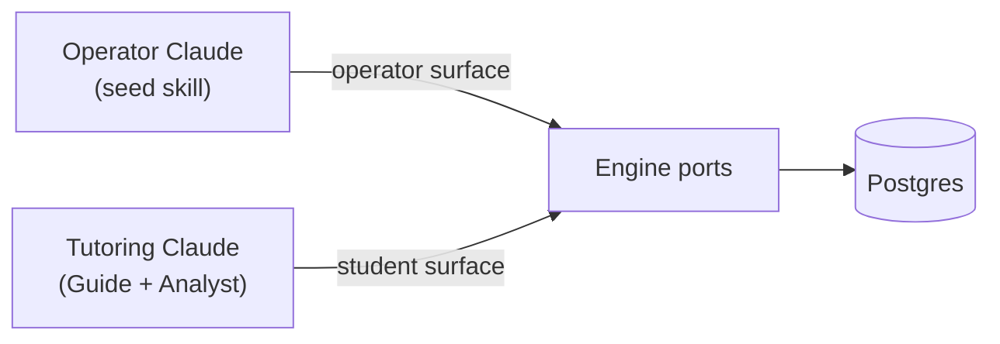
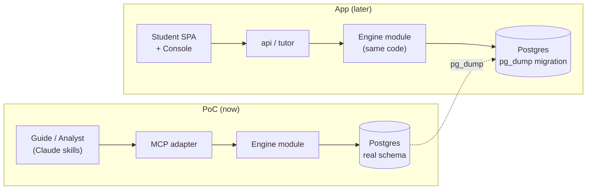

MVP-1 của Stemolly được xây quanh một giả định cốt lõi duy nhất: một belief-graph engine (bộ máy đồ thị niềm tin) có thể theo dõi mô hình tư duy của học sinh ở những môn học rất khác nhau. Mọi thứ trong MVP — phần nào được phát hành, phần nào được hoãn, PoC được tổ chức ra sao — đều xuất phát từ giả định đó.

## MVP-1 phát hành gì

### Hai ứng dụng: Student + Console

MVP-1 phát hành hai ứng dụng:

- **Student app** — bề mặt học tập nơi học sinh học bài.
- **Console** — công cụ dành cho nhà giáo dục/người vận hành, với khu vực **Author** để xây dựng chương trình học và khu vực **Observe** để xem các chỉ số của engine và tiến độ của học sinh.

Giáo viên và nhà trường với vai trò người dùng được quản lý sẽ được dời sang giai đoạn sau. Trong MVP-1, chính đội Stemolly là người dùng Console đang hoạt động — xây chương trình học trong Author, theo dõi engine trong Observe, và kiểm chứng xem các tín hiệu về mô hình tư duy có thực sự đáng tin hay không.

### Một chế độ học: Lesson

Stemolly có ba chế độ học (Lesson, Assessment/Diagnostic, Assignment Help). MVP-1 chỉ phát hành **Lesson**. Các chế độ còn lại được hoãn lại.

Lý do là có chủ đích. Một phiên Lesson bắt đầu bằng một **structured curriculum path picker** (bộ chọn lộ trình chương trình học có cấu trúc) — học sinh chọn môn học, lộ trình và bài học từ chương trình do đội ngũ biên soạn. Lộ trình đã chọn này được nối trực tiếp với các lesson brief do đội ngũ soạn để tutor dẫn dắt theo lối Socratic. Một lộ trình có cấu trúc cũng ánh xạ gọn gàng vào concept graph (đồ thị khái niệm): mỗi bài học tương ứng với các node đã biết và các prerequisite edge (cạnh tiên quyết), nhờ đó engine có các điểm neo ổn định để gắn evidence ngay từ lượt trao đổi đầu tiên.

**Vì sao không cho nhập chủ đề tự do?** Nếu học sinh có thể gõ bất kỳ chủ đề nào mình thích, AI sẽ phải tự bịa ra cấu trúc tại chỗ. Khi đó sẽ không có các concept node ổn định để neo evidence vào, và điều này làm suy yếu chính điều mà MVP-1 cần kiểm chứng — rằng engine tạo ra được một belief graph thực sự và có nền tảng. Tính năng nhập chủ đề tự do có thể bổ sung sau khi engine đã được chứng minh trên các lộ trình có cấu trúc.

### Hai môn học: sâu ở Math, mỏng ở Language

MVP-1 khởi động với hai nhóm môn:

| Môn học | Nội dung | Lý do |
|---|---|---|
| **Math — Vietnam K11** | Độ sâu đầy đủ, prerequisite DAG (đồ thị có hướng không chu trình theo quan hệ tiên quyết) thật | Các ngộ nhận hiện ra rõ ràng và dễ quy chiếu; tạo ra bản demo kiểm chứng engine mạnh nhất |
| **Language — IELTS Writing + Reading** | Phát hành mỏng | Chứng minh engine có thể khái quát sang một miền và phương pháp sư phạm rất khác |

Mệnh đề mạnh mà MVP-1 theo đuổi là: **một engine duy nhất có thể tạo ra một mental graph hữu ích trên hai miền rất khác nhau** — dạy toán theo lối Socratic và huấn luyện ngôn ngữ kiểu Correct/Reinforce. Đây là một tuyên bố lớn hơn nhiều so với việc chỉ nói “nó hoạt động với đại số”. Reading là phần khớp với chế độ Lesson rõ ràng nhất; Writing mang tín hiệu mô hình tư duy phong phú nhất (các mẫu ngữ pháp và cách viết có tính dự đoán cao đối với người học có tiếng Việt là ngôn ngữ thứ nhất). SAT Math đã được tính đến trong thiết kế node dùng chung nhưng chưa chắc sẽ được xây trong MVP-1.

---

## PoC kiểm chứng Engine

### Vì sao PoC chạy trước

Canh cược duy nhất mang tính quyết định trong MVP-1 là belief-graph engine. Nếu xây trọn Student SPA (ứng dụng SPA cho học sinh), auth (xác thực) và Console trước khi biết engine có tạo ra tín hiệu hợp lệ hay không thì sẽ rất tốn kém và rủi ro. Vì vậy MVP-1 chạy PoC trước: **một học sinh thật dùng sản phẩm để xin hỗ trợ bài tập** (Math trước, rồi đến Physics), được triển khai qua **Claude skills** trao đổi với engine qua một MCP, còn engine được triển khai lên VPS. Không có Student SPA. Không có auth. Không có Console.

PoC được cố ý gọi là PoC — chứ không phải “MVP-0” — để nhấn mạnh một điều: **lớp vỏ bên ngoài có thể bỏ đi, còn dữ liệu của engine thì không.** Nhánh UI ứng dụng được dời xuống sau PoC, chứ không bị hủy.

### PoC vận hành thế nào: Claude làm Guide và Analyst

Trong PoC, Claude đảm nhiệm cả hai vai trò tutor:

```
Student message
      │
      ▼
 ┌──────────┐    MCP (student surface)       ┌────────────┐
 │  Guide   │ ─────────────────────────────> │   Engine   │
 │  (skill) │ <────────── Report ──────────  │  (Postgres)│
 └────┬─────┘                                └────────────┘
      │  invokes subagent at checkpoint
      ▼
 ┌──────────┐    MCP (student surface)
 │ Analyst  │ ──── append_evidence ──────────>  Engine
 │ (skill)  │ ──── propose_catalog_candidate >  Engine
 └──────────┘
```

- **Guide** điều hành buổi học theo từng lượt — trò chuyện với học sinh, trực tiếp đọc tài liệu học sinh nộp (Claude vốn đọc được PDF và hình ảnh; việc chép lại theo kiểu mất mát chỉ làm giảm chất lượng hiểu).
- **Analyst** được kích hoạt tại các checkpoint (mốc kiểm tra) như một subagent (tác tử con). Nó suy luận dựa trên tương tác, rồi ghi evidence vào engine qua MCP.

Vì chỉ có một học sinh, Analyst chạy **đồng bộ**: học sinh nộp bài → Guide gọi Analyst → Analyst bổ sung evidence, engine tính lại belief state, trả về một Report → Guide tiếp tục. Async job runner, degraded-path fallback và cơ chế xử lý Report-lag mà ứng dụng đầy đủ cần tới đều bị lược bỏ trong PoC. Chúng chỉ được đưa trở lại khi có tải đồng thời thực sự.

Thiết kế này giữ nguyên kiến trúc hai tác tử thực sự (Guide đối thoại, Analyst chẩn đoán và ghi beliefs), chỉ là Claude tạm thời đảm nhiệm vị trí model. Kế hoạch tổng thể vốn đã coi model là một swappable slot, nên PoC là một lần chạy thử orchestration hợp lệ chứ không phải mẹo vá víu.

### MCP: append-only theo thiết kế

MCP mà PoC mở ra cho Claude được cố ý thiết kế **append-only (chỉ cho phép nối thêm) ở phía ghi**.

| Hướng công cụ | Công cụ |
|---|---|
| **Read** | `get_belief_state`, `match_catalog`, prior beliefs |
| **Write** | `append_evidence`, `propose_catalog_candidate` |
| **Forbidden** | Bất kỳ công cụ nào cho phép đặt trực tiếp một belief projection |

Không có công cụ nào cho Claude ghi trực tiếp kiểu “fragility = fragile”. Misconception, tín hiệu fragility và các mẫu lập luận luôn được engine code tính từ evidence log. Nếu MCP lộ ra một công cụ ghi kiểu “set belief”, trạng thái suy ra sẽ không còn dựa trên evidence có thể phát lại — và toàn bộ bài kiểm chứng engine sẽ bị phá hỏng. Việc giữ cho các lượt ghi là append-only chính là điều khiến dữ liệu PoC còn đáng tin và có thể di chuyển sang giai đoạn sau.

### Evidence theo checkpoint, không theo từng sự kiện

`append_evidence` nhận các sự kiện của một checkpoint dưới dạng **batch** và chỉ append — nó chỉ trả về xác nhận, không hơn. Sau đó `get_belief_state` sẽ fold log tại thời điểm đọc. Trong PoC không có lời gọi “close checkpoint” riêng, cũng không có materialized projection table; ở quy mô một học sinh, việc fold log ở mỗi lần đọc gần như miễn phí.

Vì sao gom theo checkpoint thay vì theo từng sự kiện? Fragility fold cần tính gộp *toàn bộ* một checkpoint. Một lần tự sửa là `misconception_evidence(for)` và `probe_outcome(correct)` trong cùng checkpoint, nên chúng triệt tiêu nhau. Nếu tính lại sau từng sự kiện riêng lẻ thì sẽ tạo ra tín hiệu trung gian sai vì mới chỉ nhìn thấy nửa checkpoint.

Projection chỉ được materialize nếu log đủ lớn để việc fold lúc đọc trở nên chậm — mà với một học sinh thì sẽ không bao giờ tới mức đó.

### Tuần tự hóa kết quả công cụ: canh đầu ra, không phải đầu vào

Mọi kết quả công cụ trong MCP adapter đều đi qua một lớp bao chung trước khi được gửi đi. Lớp bao này phải canh phần đầu ra đã tuần tự hóa — không phải giá trị mà handler trả về — và lý do thì khá tinh vi.

`JSON.stringify` trả về giá trị `undefined` (không phải chuỗi) khi nhận `undefined`, một function hoặc một `Symbol`. Nó **không bao giờ throw** với các trường hợp đó, nên một `try/catch` bọc quanh lời gọi sẽ không thấy gì bất thường. Bất kỳ đoạn mã nào sau đó mặc định rằng mình đã nhận về một chuỗi đều sẽ phát ra phản hồi lỗi định dạng, và lỗi sẽ trông như xuất phát từ chỗ khác.

Cách sửa tưởng như hiển nhiên — `JSON.stringify(result ?? null)` — chỉ chặn trường hợp handler không trả gì, vốn là lỗi được báo cáo nhiều nhất. Nhưng nó vẫn bỏ ngỏ cả nhóm lỗi còn lại: một function hoặc `Symbol` đi qua kiểm tra `??` mà không bị đụng tới và vẫn tuần tự hóa thành `undefined`. Cách phòng vệ đúng là canh **thứ được trả ra**:

```js
// ✗ guards only the "nothing returned" case
const body = JSON.stringify(result ?? null);

// ✓ covers every value JSON.stringify turns into undefined
const body = JSON.stringify(result) ?? 'null';
```

Giá trị dự phòng là literal JSON `"null"` — phía client vẫn parse được và nó cũng trung thực: nghĩa là “không có giá trị”, thay vì bịa ra một giá trị khác.

Trong PoC, quy tắc này nằm trong lớp bao duy nhất mà kết quả của mọi công cụ đã đăng ký đều đi qua, nên bất kỳ công cụ nào được thêm về sau cũng tự động được bảo vệ, chứ không chỉ riêng `append_evidence` ở hiện tại. Bài học rộng hơn cũng áp dụng ngoài adapter này: **một serializer báo lỗi bằng cách trả về một giá trị thay vì throw sẽ vô hiệu hóa kiểu xử lý lỗi dựa trên exception.** Kiểm tra phải nằm ở đầu ra, vì phía đầu vào không hề phát tín hiệu rằng có vấn đề.

### Hai bề mặt MCP: student và operator

Phiên học của học sinh không được cầm các công cụ seed hay approve. Không phải vì lý do bảo mật — PoC chạy trong môi trường tin cậy và không có auth — mà để bảo vệ cánh cổng **“AI soạn nháp, con người phê duyệt”**. Nếu Claude dạy học có trong tay công cụ `approve_candidate` thì sớm muộn gì nó cũng sẽ gọi công cụ đó, từ đó đẩy một node nháp thành node đáng tin mà không qua người duyệt. Không có cách phát lại nào sửa được chuyện này, vì việc promote là một trạng thái tin cậy chứ không phải một sự kiện được append.

Giải pháp nằm ở **thời điểm cấu hình, không phải auth**: hai bề mặt MCP trên *cùng* một tập engine port.

Tiến trình MCP đọc biến môi trường `MCP_ROLE` **một lần duy nhất lúc khởi động** và chỉ đăng ký đúng bản đồ công cụ của một bề mặt lên MCP server. Các công cụ thuộc bề mặt không được chọn hoàn toàn không được đăng ký — chúng vắng mặt ngay từ khâu khám phá công cụ, chứ không chỉ bị từ chối khi gọi.

| Bề mặt | Công cụ được lộ ra |
|---|---|
| **student** | `append_evidence`, `propose_catalog_candidate`, `get_belief_state`, `match_catalog` |
| **operator** | `approve_candidate`, `seed_node`, `seed_edge`, `seed_catalog`, `get_belief_state`, `match_catalog` |

Nếu `MCP_ROLE` thiếu hoặc không hợp lệ, tiến trình sẽ **từ chối khởi động** — fail-closed ngay từ cấu trúc. Không tồn tại nhánh mã nào tạo ra một server đang chạy với bản đồ công cụ ngoài ý muốn.

Việc triển khai là hai tiến trình từ cùng một image, chỉ khác nhau ở biến môi trường, và cả hai đều nối tới cùng một cơ sở dữ liệu.



:::note[Ranh giới tin cậy]
Vai trò được áp bằng cấu hình và tầng truyền là stdio — nên ranh giới tin cậy ở đây là **ai là người khởi chạy tiến trình**. Điều này đúng với PoC, nơi tutoring skill tự khởi chạy tiến trình student-surface của chính nó. Nó sẽ không còn đúng nếu dùng một tầng mạng chia sẻ phục vụ nhiều client từ một server, khi đó bắt buộc phải có xác thực thật sự. Ứng dụng cũng áp cùng sự tách biệt Console-vs-Student bằng auth thật — thiết kế PoC này không cản trở điều đó.
:::

Việc seeding diễn ra trước khi học sinh bắt đầu một chủ đề; việc duyệt candidate diễn ra giữa các buổi học — vì vậy các công cụ approve không bao giờ cần xuất hiện trên bề mặt student.

### Seeding nội dung: operator seed, AI soạn nháp, con người phê duyệt

Trước khi học sinh học một chủ đề, concept graph (node + các cạnh tiên quyết) và catalog (các ngộ nhận đã biết, các mẫu lập luận) sẽ được operator seed (khởi tạo sẵn). Operator có thể làm việc này thủ công hoặc dùng một **seed skill** chuyên biệt: Claude đọc tài liệu học, soạn node/edge/catalog entry dưới dạng **candidate**, và chỉ ghi bền vững sau khi operator phê duyệt. Không có gì do AI soạn nháp được tự động xem là đáng tin.

Đồ thị đã seed nằm trong Postgres của engine. Trong một buổi học, Guide ánh xạ từng bài toán sang các node ID đã seed. Khi một bài toán đụng tới khái niệm chưa được seed, Analyst sẽ đề xuất một candidate node — operator phê duyệt nó trước buổi học tiếp theo. Phiên học của học sinh không bao giờ tự tạo hoặc phê duyệt node.

### Engine nhận gì: một anchor mỏng, không phải nội dung tài liệu

Engine không bao giờ nhìn thấy phương trình, bảng biểu hay sơ đồ trong tài liệu của học sinh. Thứ nó cần chỉ là **định danh node ổn định** để treo evidence lên. Claude đọc trực tiếp tài liệu gốc (PDF, hình ảnh) và hướng dẫn từ đó; rồi nó chuyển cho engine một **problem anchor** mỏng:

```json
{ "id": "prob_001", "label": "Quadratic roots — discriminant", "nodeRefs": ["node_alg_quad_discriminant"] }
```

Cùng các node ID đó chạy xuyên suốt qua anchor, từng evidence event và các belief suy ra — đó là sợi dây duy nhất engine cần. Một định dạng nội dung có cấu trúc phong phú hơn (cho sơ đồ, bảng, phương trình) là ý tưởng tốt, nhưng nó thuộc về cổng thiết kế nội dung của ứng dụng, nơi về sau sẽ có renderer tiêu thụ nó. PoC không xây dựng hợp đồng nội dung có cấu trúc nào cả.

Hình dạng của anchor được định nghĩa bằng JSON Schema trong `packages/contracts` (gói shared-types), theo đúng quy ước đang áp dụng cho mọi hợp đồng xuyên mô-đun khác. Trong PoC nó **không mang trường `schemaVersion`**: một trường phiên bản chỉ đáng có khi hai chương trình triển khai độc lập có thể bất đồng về định dạng. Ở đây bên tạo và bên nhận chạy trong cùng một tiến trình, nên không có lệch phiên bản nào cần phòng vệ. Có thể thêm trường phiên bản nếu anchor sau này thật sự đi qua một ranh giới triển khai — điều mà kiến trúc monolith không hề tạo ra.

### GitHub remote và đường đi tới triển khai VPS

Đến hết Sprint 10, `engine-poc` vẫn chỉ chạy cục bộ — việc tạo GitHub remote và nối dây triển khai VPS được lên lịch cho Sprint 11. Điều này có nghĩa là các tiêu chí chấp nhận của CI (một lỗi lint làm workflow đỏ; `main` sạch làm workflow xanh) chỉ có thể được kiểm chứng bằng cách chạy tuần tự từng lệnh ở máy cục bộ, chứ không thể quan sát một lần chạy GitHub Actions thật, vì không có nơi nào để push.

Tại buổi review Sprint 10, `stemolly/engine-poc` (private) đã được tạo và `main` được push lên thành `origin`. Sau đó cả hai job CI đều được quan sát chuyển xanh trên một lần push thật; đồng thời một PR tạm với lỗi lint được cố ý tạo ra để xác nhận workflow chuyển đỏ ở bước `Lint` — nhờ đó khoảng trống kiểm chứng được khép lại trực tiếp, chứ không phải gián tiếp. Công việc triển khai VPS của Sprint 11 được xây tiếp trên remote đã có sẵn này; không cần tạo lại repository.

---

## Phần nào bền vững, phần nào có thể bỏ đi

Khung nhìn chi phối mọi quyết định về sau:

| Lớp PoC | Độ bền vững |
|---|---|
| Claude skills (Guide / Analyst) | Có thể bỏ đi — sẽ được thay bằng bộ khung nội bộ khi ứng dụng phát hành |
| MCP adapter | Có thể bỏ đi — adapter điều khiển mỏng, sau này được thay bằng `api`/`tutor` của ứng dụng |
| Engine module (`packages/engine`) | **Bền vững** — được xây nghiêm túc để dùng thật, tái sử dụng nguyên trạng khi ứng dụng phát hành |
| Postgres schema (`nodes`, `edges`, `evidence_events`) | **Bền vững** — được đưa vào ứng dụng bằng `pg_dump`, không phải viết lại |
| Evidence log | **Bền vững** — lịch sử belief của học sinh không được phép mất đi khi chuyển sang ứng dụng |

Việc lịch sử belief của học sinh sống sót qua quá trình chuyển từ PoC sang ứng dụng là một **yêu cầu cứng**. Chính yêu cầu đó buộc engine phải được xây ngay bây giờ trên schema thật, chứ không phải một kho lưu trữ dùng rồi bỏ. Nó cũng buộc MCP phải chỉ là một adapter mỏng phủ lên các port của engine — cũng chính vị trí port mà về sau lớp API của ứng dụng sẽ đảm nhiệm. Khi ứng dụng xuất hiện, chỉ adapter điều khiển được thay; mã engine và dữ liệu của nó vẫn giữ nguyên.



MCP và Claude skills là cái miệng có thể thay thế. Engine — mã nguồn, schema và evidence log append-only của nó — mới là sản phẩm thật, chỉ đang mang một cái miệng khác trong lúc ứng dụng được xây.

---

## Các trang liên quan

- [Mô hình tư duy và kiến trúc của Engine](../engine/mental-model.md)
- [Tác tử tutor: Guide và Analyst](../engine/tutor-agent.md)
- [Đồ thị niềm tin và evidence](../engine/belief-graph.md)
