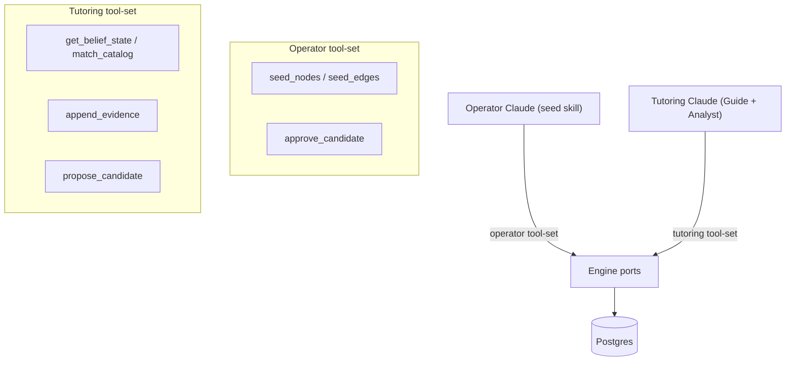
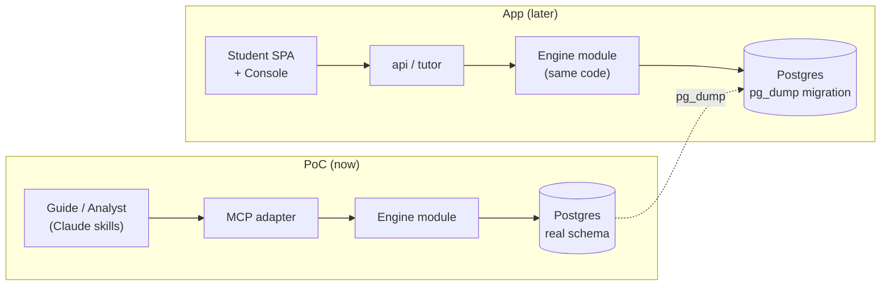

# Phạm vi MVP & PoC

MVP-1 có hai phần chạy nối tiếp nhau. Trước hết, một **Engine-Validation PoC (PoC kiểm chứng engine)** dùng Claude trực tiếp — không có app UI (giao diện ứng dụng), chỉ một học sinh thật — để chứng minh **belief-graph engine (engine đồ thị niềm tin)** hoạt động trước khi đầu tư đáng kể vào UI. Sau đó, **ứng dụng MVP-1** (Student app (ứng dụng học sinh) + Console (bảng điều khiển)) sẽ phát hành Lesson mode (chế độ Bài học) cho Toán K11 Việt Nam và IELTS Language. Trang này giải thích cả hai phần: phạm vi gồm những gì, vì sao lại chọn như vậy, và PoC được xây thế nào để không tạo ra phần việc thừa phải bỏ đi.

---

## Phạm vi ứng dụng MVP-1

### Hai ứng dụng, một đội ngũ làm người dùng đầu tiên

MVP-1 phát hành hai ứng dụng:

- **Student app (ứng dụng học sinh)** — bề mặt học tập nơi học sinh tham gia các bài học.
- **Console (bảng điều khiển)** — công cụ cho giáo viên/người vận hành, gồm khu vực **Author** để xây dựng curriculum và khu vực **Observe** để xem lại các chỉ số của engine cùng tiến độ học sinh.

Giáo viên và nhà trường với tư cách một tầng người dùng được quản lý sẽ được dời sang giai đoạn sau. Ở MVP-1, chính đội Stemolly là người dùng Console đang hoạt động — xây curriculum trong Author, theo dõi engine trong Observe, và kiểm chứng xem các tín hiệu mental-model có thực sự đáng tin hay không.

### Một chế độ học: Lesson

Stemolly có ba study mode (Lesson, Assessment/Diagnostic, Assignment Help). MVP-1 chỉ phát hành **Lesson**. Các mode còn lại được để sang sau.

Đây là một lựa chọn có chủ đích. Một buổi Lesson bắt đầu bằng **structured curriculum path picker (bộ chọn lộ trình chương trình học có cấu trúc)** — học sinh chọn môn học, lộ trình và bài học từ curriculum do đội ngũ biên soạn. Lộ trình đã chọn này liên kết trực tiếp tới các lesson brief được soạn sẵn để tutor dẫn dắt theo kiểu Socratic. Một lộ trình có cấu trúc cũng ánh xạ gọn vào concept graph (đồ thị khái niệm): mỗi bài học tương ứng với các node đã biết và các prerequisite edge, cho engine những điểm neo ổn định để gắn evidence ngay từ lượt tương tác đầu tiên.

**Vì sao không cho nhập chủ đề bằng free-text (văn bản tự do)?** Nếu học sinh có thể gõ bất kỳ chủ đề nào mình muốn, AI sẽ phải tự phát minh cấu trúc ngay tại chỗ. Khi đó sẽ không có concept node ổn định để neo evidence vào, và điều này làm suy yếu đúng điều quan trọng nhất mà MVP-1 cần kiểm chứng — rằng engine tạo ra được một belief graph thực sự có cơ sở. Nhập chủ đề tự do có thể bổ sung sau, khi engine đã được chứng minh trên các structured path.

### Hai môn học: sâu ở Math, mỏng ở Language

MVP-1 ra mắt với hai nhóm môn:

| Môn học | Nội dung | Lý do |
|---|---|---|
| **Math — Vietnam K11** | Độ sâu đầy đủ, prerequisite DAG thực | Các ngộ nhận bộc lộ rõ và có thể neo vững; tạo ra màn trình diễn kiểm chứng engine mạnh nhất |
| **Language — IELTS Writing + Reading** | Phạm vi khởi đầu mỏng | Chứng minh engine có thể khái quát sang một miền kiến thức và phương pháp sư phạm rất khác |

Luận điểm mạnh mà MVP-1 theo đuổi là **một engine có thể tạo ra mental graph hữu ích trên hai miền rất khác nhau** — dạy Math theo kiểu Socratic và huấn luyện Language theo kiểu Correct/Reinforce. Đây là khẳng định lớn hơn nhiều so với việc chỉ nói "nó hoạt động cho đại số". Reading phù hợp nhất với Lesson mode; còn Writing mang lại tín hiệu mental-model phong phú nhất (ngữ pháp và các mẫu viết rất dễ dự đoán ở người học có tiếng Việt là ngôn ngữ thứ nhất). SAT Math đã được dự liệu trong thiết kế shared-node, nhưng chưa chắc sẽ được xây ngay trong MVP-1.

---

## Engine-Validation PoC

### Vì sao PoC chạy trước

Canh bạc thực sự chịu tải trong MVP-1 là belief-graph engine. Nếu xây trọn Student SPA, auth và Console trước khi biết engine có tạo ra tín hiệu hợp lệ hay không thì sẽ vừa tốn kém vừa rủi ro. Vì vậy MVP-1 chạy PoC trước: **một học sinh thật, Claude đóng toàn bộ conversational front-end, engine được triển khai lên một VPS**. Không có Student SPA. Không có auth. Không có Console.

Việc cố ý gọi đây là PoC — chứ không phải "MVP-0" — nhằm nhấn mạnh một điều: **lớp vỏ bên ngoài có thể bỏ đi, nhưng dữ liệu của engine thì không.** Hướng đi UI của ứng dụng chỉ được hoãn lại cho tới sau PoC, chứ không bị hủy bỏ.

### PoC vận hành thế nào: Claude làm cả Guide lẫn Analyst

Trong PoC, Claude đảm nhiệm cả hai vai trò tutor:

```
Student message
      │
      ▼
 ┌──────────┐    MCP (tutoring tool-set)    ┌────────────┐
 │  Guide   │ ─────────────────────────────▶ │   Engine   │
 │  (skill) │ ◀─────────────── Report ────── │  (Postgres)│
 └────┬─────┘                                └────────────┘
      │  invokes subagent at checkpoint
      ▼
 ┌──────────┐    MCP (tutoring tool-set)
 │ Analyst  │ ──── append_evidence ──────────▶  Engine
 │ (skill)  │ ──── propose_candidate ─────────▶  Engine
 └──────────┘
```

- **Guide** điều phối buổi học theo từng lượt — trò chuyện với học sinh, đọc trực tiếp các tài liệu học sinh nộp lên (Claude đọc PDF và ảnh theo năng lực gốc; chuyển biên lại theo cách làm mất mát chỉ làm giảm khả năng hiểu).
- **Analyst** được kích hoạt tại các checkpoint như một subagent. Nó suy luận trên toàn bộ tương tác rồi ghi evidence vào engine qua MCP.

Vì chỉ có một học sinh, Analyst chạy **đồng bộ**: học sinh nộp bài → Guide gọi Analyst → Analyst thêm evidence, engine tính lại belief state, trả về một Report → Guide tiếp tục. Những phần mà ứng dụng hoàn chỉnh cần như async job runner, degraded-path fallback và xử lý Report-lag đều được lược bỏ khỏi PoC. Chúng chỉ được đưa trở lại khi xuất hiện concurrency thực sự.

Thiết kế này vẫn giữ nguyên kiến trúc hai tác tử thật (Guide trò chuyện, Analyst chẩn đoán và ghi belief), chỉ là Claude tạm thời lấp vào model slot. Master plan vốn đã xem model là một slot có thể thay thế, nên PoC này là một đợt chạy thử hợp lệ của phần orchestration — không phải một mẹo vá víu.

### MCP: thiết kế append-only có chủ đích

MCP mà PoC mở ra cho Claude được cố ý làm theo hướng **append-only ở phía ghi**.

| Hướng công cụ | Công cụ |
|---|---|
| **Read** | `get_belief_state`, `match_catalog`, prior beliefs |
| **Write** | `append_evidence`, `propose_catalog_candidate` |
| **Forbidden** | Bất kỳ công cụ nào cho phép đặt trực tiếp belief projection |

Không có công cụ nào cho phép Claude ghi trực tiếp kiểu "fragility = fragile". Misconception, tín hiệu fragility và reasoning pattern luôn do mã của engine tính ra từ evidence log. Nếu MCP lộ ra một công cụ ghi kiểu "set belief", thì trạng thái suy ra sẽ không còn bám trên evidence có thể phát lại — và toàn bộ bài kiểm chứng engine sẽ mất ý nghĩa. Giữ cho phía ghi là append-only chính là điều khiến dữ liệu của PoC đáng tin cậy và có thể di chuyển sang giai đoạn sau.

### Evidence theo checkpoint, không theo từng event

`append_evidence` nhận các event của một checkpoint theo dạng **batch** và chỉ thêm vào — nó trả về xác nhận, không trả gì hơn. Sau đó `get_belief_state` sẽ fold log ở thời điểm đọc. Trong PoC không có lời gọi "close checkpoint" riêng, cũng không có materialized projection table; ở quy mô một học sinh, việc fold log ở mỗi lần đọc gần như miễn phí.

Vì sao gom theo checkpoint thay vì theo từng event? Phép fold của fragility cần tính gộp *cả* checkpoint. Một self-correction là `misconception_evidence(for)` và `probe_outcome(correct)` cùng nằm trong một checkpoint, và hai phần đó triệt tiêu nhau. Nếu tính lại sau từng event đơn lẻ thì hệ thống sẽ chỉ thấy nửa checkpoint và cho ra tín hiệu trung gian sai.

Projection chỉ được materialize nếu log lớn đến mức việc fold lúc đọc trở nên chậm — điều sẽ không bao giờ xảy ra với chỉ một học sinh.

### Hai tool-set, không phải hai deployment

Buổi học của học sinh không được cầm các công cụ seed hoặc approve. Lý do không phải bảo mật — PoC chạy trong môi trường tin cậy và không có auth — mà là để bảo vệ cổng kiểm duyệt **"AI drafts, human approves"**. Nếu Claude làm tutor có trong tay công cụ `approve_candidate`, sớm muộn nó cũng sẽ gọi công cụ đó và đẩy một draft node thành trusted mà không qua người duyệt. Không có cơ chế replay nào cứu được việc này, vì promotion là trạng thái trust chứ không phải một event được append thêm.

Lời giải nằm ở **configuration, không phải auth**: hai MCP tool-set trên *cùng* các engine port.



Claude kết nối vào bề mặt nào thì sẽ quyết định nó gọi được bộ công cụ nào. Việc seeding diễn ra trước khi học sinh bắt đầu một chủ đề; còn candidate approval diễn ra giữa các buổi học — nên các công cụ approve không bao giờ cần xuất hiện trên bề mặt tutoring.

### Seeding nội dung: operator seed, AI draft, con người phê duyệt

Trước khi học sinh dùng một chủ đề, concept graph (node + prerequisite edge) và các catalog (misconception đã biết, reasoning pattern) được operator seed vào hệ thống. Operator có thể làm thủ công hoặc dùng một **seed skill** chuyên biệt: Claude đọc tài liệu học, dựng nháp node/edge/catalog entry dưới dạng **candidate**, và chỉ ghi hẳn vào hệ thống sau khi operator phê duyệt. Không có gì do AI soạn nháp mà tự động được tin cậy.

Đồ thị đã seed được lưu trong Postgres của engine. Trong một buổi tutoring, Guide ánh xạ từng bài toán vào các node ID đã seed. Khi bài toán đụng tới một khái niệm chưa được seed, Analyst sẽ đề xuất một candidate node — và operator phê duyệt nó trước buổi học kế tiếp. Buổi học của học sinh không tự tạo hay phê duyệt node.

### Engine nhận gì: một thin anchor, không phải nội dung tài liệu

Engine không bao giờ nhìn thấy phương trình, bảng biểu hay sơ đồ trong tài liệu của học sinh. Thứ nó cần chỉ là **stable node identity** để treo evidence lên. Claude đọc tài liệu gốc (PDF, ảnh) và hướng dẫn học từ đó; sau đó nó chuyển cho engine một **problem anchor** mỏng:

```json
{ "id": "prob_001", "label": "Quadratic roots — discriminant", "nodeRefs": ["node_alg_quad_discriminant"] }
```

Cùng một bộ node ID đi xuyên suốt qua anchor, từng evidence event và các belief suy ra — đó là sợi chỉ duy nhất mà engine cần. Một định dạng nội dung có cấu trúc phong phú hơn (cho sơ đồ, bảng, phương trình) là ý tưởng tốt, nhưng nó thuộc về cổng thiết kế nội dung của ứng dụng, nơi sau này mới có renderer thực sự sử dụng. PoC không xây dựng hợp đồng structured content nào cả.

Hình dạng của anchor được định nghĩa bằng JSON Schema trong `packages/contracts` (shared-types package), theo đúng quy ước của mọi cross-module contract khác. Trong PoC, nó **không có trường `schemaVersion`**: trường phiên bản chỉ thực sự đáng tồn tại khi hai chương trình được triển khai độc lập có thể bất đồng về định dạng. Ở đây, bên tạo và bên nhận chạy trong cùng một process, nên không có độ lệch nào cần phòng ngừa. Trường phiên bản có thể được thêm vào nếu anchor sau này thật sự đi qua một deployment boundary — điều mà monolith architecture không hề tạo ra.

---

## Phần nào bền vững, phần nào có thể bỏ

Đây là cách đóng khung chi phối mọi quyết định phía sau:

| Tầng của PoC | Độ bền |
|---|---|
| Claude skills (Guide / Analyst) | Có thể bỏ — sẽ được thay bằng harness nội bộ khi ứng dụng phát hành |
| MCP adapter | Có thể bỏ — chỉ là lớp adapter điều khiển mỏng, sau này được thay bằng `api`/`tutor` của ứng dụng |
| Engine module (`packages/engine`) | **Bền vững** — được xây như phần thật và tái sử dụng nguyên trạng khi ứng dụng phát hành |
| Postgres schema (`nodes`, `edges`, `evidence_events`) | **Bền vững** — được chuyển vào ứng dụng qua `pg_dump`, không phải viết lại |
| Evidence log | **Bền vững** — lịch sử belief của học sinh không được phép mất khi em chuyển sang ứng dụng |

Việc lịch sử belief của học sinh còn nguyên khi chuyển từ PoC sang ứng dụng là một **yêu cầu bắt buộc**. Chính yêu cầu đó buộc engine phải được xây ngay từ bây giờ trên schema thật, chứ không phải một kho dữ liệu tạm bợ. Nó cũng buộc MCP chỉ là một adapter mỏng trên các port của engine — cũng chính slot port mà lớp API của ứng dụng sẽ dùng về sau. Khi ứng dụng xuất hiện, chỉ adapter điều khiển được thay; mã của engine và dữ liệu của nó vẫn giữ nguyên.



MCP và Claude skills là phần miệng nói có thể thay thế. Engine — mã nguồn của nó, schema của nó, append-only evidence log của nó — mới là sản phẩm thật, chỉ đang mang một "cái miệng" khác trong lúc ứng dụng được xây.

---

## Các trang liên quan

- [Mô hình tinh thần của engine và kiến trúc](../engine/mental-model.md)
- [Tutor agent: Guide và Analyst](../engine/tutor-agent.md)
- [Belief graph và evidence](../engine/belief-graph.md)
