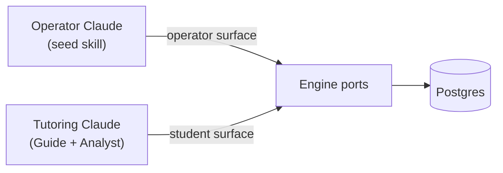
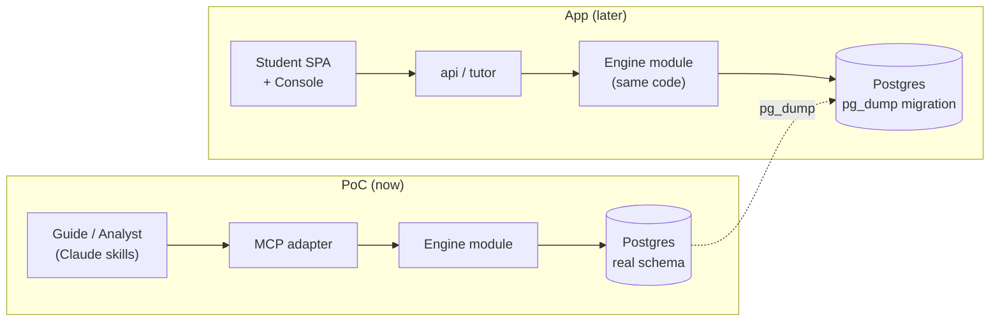

MVP-1 là sản phẩm đầu tiên Stemolly đưa ra — nhưng trước khi xây ứng dụng hoàn chỉnh, đội ngũ sẽ chạy một **Engine-Validation PoC (PoC kiểm chứng engine)** với một học sinh thật. PoC này nhằm chứng minh belief-graph engine đáng để đầu tư; chỉ sau đó ứng dụng mới được xây. Trang này trình bày cả hai phần: MVP-1 sẽ phát hành những gì, và PoC đi trước để mở đường ra sao.

---

## Phạm vi ứng dụng MVP-1

### Hai ứng dụng, với chính đội ngũ là người dùng đầu tiên

MVP-1 phát hành hai ứng dụng:

- **Student app (ứng dụng học sinh)** — bề mặt học tập nơi học sinh tham gia các bài học.
- **Console (bảng điều hành)** — công cụ cho nhà giáo dục/người vận hành, gồm khu vực **Author** để xây dựng curriculum (chương trình học) và khu vực **Observe** để xem lại các chỉ số của engine cùng tiến độ của học sinh.

Giáo viên và nhà trường với tư cách một tầng người dùng được quản lý sẽ được dời sang giai đoạn sau. Trong MVP-1, chính đội Stemolly là người dùng Console đang hoạt động — xây curriculum trong Author, theo dõi engine trong Observe, và kiểm chứng xem các tín hiệu mental-model (mô hình nhận thức) có thực sự đáng tin hay không.

### Một chế độ học: Lesson

Stemolly có ba study mode (chế độ học) là Lesson, Assessment/Diagnostic và Assignment Help. MVP-1 chỉ phát hành **Lesson**. Các chế độ còn lại sẽ để sau.

Đây là một lựa chọn có chủ đích. Một buổi Lesson bắt đầu bằng **structured curriculum path picker (bộ chọn lộ trình chương trình học có cấu trúc)** — học sinh chọn môn học, lộ trình và bài học từ curriculum do đội ngũ biên soạn. Lộ trình được chọn sẽ nối thẳng tới các lesson brief (bản tóm tắt bài học) đã được soạn sẵn để tutor dẫn dắt theo lối Socratic. Một lộ trình có cấu trúc cũng khớp gọn với concept graph (đồ thị khái niệm): mỗi bài học tương ứng với những node đã biết và các prerequisite edge (cạnh tiên quyết), nhờ đó engine có những điểm neo ổn định để gắn evidence (bằng chứng) ngay từ lượt đầu tiên.

**Vì sao không cho nhập chủ đề bằng free-text topic entry (văn bản tự do)?** Nếu học sinh có thể gõ bất kỳ chủ đề nào mình muốn, AI sẽ phải tự bày ra cấu trúc ngay trong lúc chạy. Khi đó sẽ không có concept node ổn định để neo evidence vào, và như vậy sẽ làm suy yếu đúng điều cốt lõi mà MVP-1 cần kiểm chứng — rằng engine tạo ra được một belief graph có thật và có cơ sở. Có thể bổ sung nhập tự do sau, khi engine đã được chứng minh trên các lộ trình có cấu trúc.

### Hai môn học: sâu với Math, mỏng với Language

MVP-1 ra mắt với hai nhóm môn:

| Môn học | Nội dung | Lý do |
|---|---|---|
| **Math — Vietnam K11** | Độ sâu đầy đủ, prerequisite DAG thực | Những ngộ nhận bộc lộ rõ và có thể bám chắc vào dữ liệu; đây là màn kiểm chứng engine mạnh nhất |
| **Language — IELTS Writing + Reading** | Phạm vi khởi đầu mỏng | Chứng minh engine có thể khái quát sang một lĩnh vực và phương pháp sư phạm rất khác |

Luận điểm lớn mà MVP-1 theo đuổi là **một engine có thể tạo ra một mental graph hữu ích trên hai lĩnh vực rất khác nhau** — dạy Math theo lối Socratic và huấn luyện Language theo kiểu Correct/Reinforce. Đây là một khẳng định lớn hơn nhiều so với việc chỉ nói “nó hoạt động cho đại số”. Reading là phần hợp nhất với Lesson mode; còn Writing mang lại tín hiệu mental-model phong phú nhất (ngữ pháp và các kiểu viết có tính dự đoán rất cao ở người học có tiếng Việt là ngôn ngữ thứ nhất). SAT Math đã được tính đến trong thiết kế shared-node (nút dùng chung), nhưng chưa chắc sẽ được xây trong MVP-1.

---

## Engine-Validation PoC

### Vì sao PoC được chạy trước

Canh bạc thực sự chịu tải trong MVP-1 là belief-graph engine. Nếu xây xong toàn bộ Student SPA, auth (xác thực) và Console trước khi biết liệu engine có tạo ra tín hiệu hợp lệ hay không, chi phí và rủi ro sẽ rất lớn. Vì vậy MVP-1 chạy một PoC trước: **một học sinh thật dùng sản phẩm để làm assignment help (hỗ trợ bài tập)** (ban đầu là Math, sau đó là Physics), được triển khai qua **Claude skills (các kỹ năng Claude)** nói chuyện với engine qua một MCP, còn engine được triển khai lên một VPS. Không có Student SPA. Không có auth. Không có Console.

Việc cố ý gọi đây là PoC — chứ không phải “MVP-0” — là để giữ cho một điều luôn rõ ràng: **lớp vỏ bên ngoài có thể bỏ đi, còn dữ liệu của engine thì không.** Hướng làm UI của ứng dụng chỉ được dời lại cho tới sau PoC, chứ không bị hủy.

### PoC vận hành ra sao: Claude làm Guide và Analyst

Trong PoC, Claude đảm nhiệm cả hai vai trò tutor:

```
Student message
      │
      ▼
 ┌──────────┐    MCP (student surface)       ┌────────────┐
 │  Guide   │ ─────────────────────────────> │   Engine   │
 │  (skill) │ <────────── Report ──────────  │  (Postgres)│
 └────┬─────┘                                └────────────┘
      │  invokes subagent at checkpoint
      ▼
 ┌──────────┐    MCP (student surface)
 │ Analyst  │ ──── append_evidence ──────────>  Engine
 │ (skill)  │ ──── propose_catalog_candidate >  Engine
 └──────────┘
```

- **Guide** điều hành buổi học theo từng lượt — trò chuyện với học sinh, đọc trực tiếp các tài liệu học sinh nộp lên (Claude đọc PDF và ảnh theo năng lực sẵn có; một bản chép lại mất mát chỉ làm giảm khả năng hiểu).
- **Analyst** được kích hoạt tại các checkpoint (mốc kiểm tra) như một subagent (tác tử phụ). Nó suy luận trên tương tác rồi ghi evidence vào engine qua MCP.

Vì chỉ có một học sinh, Analyst chạy **đồng bộ**: học sinh gửi bài → Guide gọi Analyst → Analyst thêm evidence, engine tính lại belief state, trả về một Report → Guide tiếp tục. Async job runner (bộ chạy tác vụ bất đồng bộ), degraded-path fallback (đường lui khi hệ thống giảm cấp) và cơ chế xử lý Report-lag (độ trễ báo cáo) mà ứng dụng đầy đủ cần đến đều được bỏ khỏi PoC. Chúng chỉ được đưa trở lại khi xuất hiện concurrency (đồng thời) thực sự.

Cách làm này vẫn giữ nguyên kiến trúc hai tác tử thực sự (Guide trò chuyện, Analyst chẩn đoán và ghi belief), chỉ là Claude tạm thời lấp vào model slot. Master plan vốn đã xem model là một slot có thể thay thế, nên PoC này là một lần chạy thử hợp lệ cho orchestration (điều phối) — chứ không phải mẹo vá tạm.

### MCP: append-only ngay từ thiết kế

MCP mà PoC mở ra cho Claude được cố ý làm theo hướng **append-only ở phía ghi**.

| Hướng công cụ | Công cụ |
|---|---|
| **Read** | `get_belief_state`, `match_catalog`, prior beliefs (niềm tin trước đó) |
| **Write** | `append_evidence`, `propose_catalog_candidate` |
| **Forbidden** | Bất kỳ công cụ nào cho phép đặt trực tiếp belief projection |

Không có công cụ nào cho phép Claude ghi trực tiếp kiểu “fragility = fragile”. Misconception (ngộ nhận), tín hiệu fragility (độ mong manh) và reasoning pattern (mẫu suy luận) đều luôn do mã của engine tính ra từ evidence log. Nếu MCP lộ ra một công cụ ghi kiểu “set belief”, trạng thái suy ra sẽ không còn được neo vào evidence có thể phát lại nữa — và toàn bộ bài kiểm chứng engine sẽ mất ý nghĩa. Giữ cho phía ghi là append-only chính là cách giúp dữ liệu của PoC vẫn đáng tin và có thể chuyển tiếp.

### Evidence theo checkpoint, không theo từng event

`append_evidence` nhận các event của một checkpoint dưới dạng **batch** và chỉ thêm vào — nó trả về một xác nhận, không hơn. Sau đó `get_belief_state` sẽ fold log tại thời điểm đọc. Trong PoC không có lời gọi “close checkpoint” riêng và cũng không có materialized projection table (bảng chiếu vật hóa); ở quy mô một học sinh, việc fold log trong mỗi lần đọc là miễn phí.

Vì sao lại gom theo checkpoint thay vì theo từng event? Phép fold của fragility cần tính gộp *cả* checkpoint. Một self-correction là `misconception_evidence(for)` và `probe_outcome(correct)` cùng xuất hiện trong một checkpoint và triệt tiêu lẫn nhau. Nếu tính lại sau từng event riêng lẻ, hệ thống sẽ chỉ thấy nửa checkpoint và tạo ra một tín hiệu trung gian sai.

Projection chỉ được materialize nếu log đủ lớn để việc fold lúc đọc trở nên chậm — điều mà quy mô một học sinh sẽ không bao giờ gặp.

### Serialize kết quả công cụ: bảo vệ đầu ra, không phải đầu vào

Mọi kết quả công cụ trong MCP adapter đều đi qua một lớp bọc dùng chung trước khi được đưa ra ngoài. Lớp bọc đó phải bảo vệ phần đầu ra đã được serialize — chứ không phải giá trị trả về của handler — và lý do nằm ở một chi tiết khá tinh vi.

`JSON.stringify` trả về *giá trị* `undefined` (không phải chuỗi) khi nhận `undefined`, một function hoặc một `Symbol`. Nó **không bao giờ ném lỗi** với cả ba trường hợp này, nên `try/catch` bọc quanh lời gọi sẽ không thấy điều gì bất thường. Nếu đoạn mã phía sau cứ mặc định rằng đã nhận về một chuỗi, nó sẽ phát ra một phản hồi lỗi định dạng và lỗi sẽ có vẻ như xuất phát từ nơi khác.

Cách sửa dễ nghĩ ra nhất — `JSON.stringify(result ?? null)` — chỉ chặn được trường hợp handler không trả gì, vốn là lỗi thường gặp nhất. Nhưng nó vẫn bỏ ngỏ cả một lớp vấn đề: một function hoặc một `Symbol` sẽ đi qua phép kiểm `??` mà không bị đụng tới và vẫn serialize thành `undefined`. Cách phòng thủ đúng là kiểm tra **thứ thực sự đi ra**:

```js
// ✗ chỉ chặn trường hợp "không trả gì"
const body = JSON.stringify(result ?? null);

// ✓ bao phủ mọi giá trị khiến JSON.stringify cho ra undefined
const body = JSON.stringify(result) ?? 'null';
```

Phương án dự phòng ở đây là JSON literal `"null"` — client vẫn parse được, và ý nghĩa cũng trung thực: “không có giá trị”, chứ không phải bịa ra một giá trị nào đó.

Trong PoC, quy tắc này nằm trong một lớp bọc duy nhất mà kết quả của mọi công cụ đã đăng ký đều phải đi qua, nên bất kỳ công cụ nào được thêm vào sau này cũng tự động được hưởng cùng một cơ chế, chứ không chỉ riêng `append_evidence` hiện tại. Bài học rộng hơn cũng áp dụng vượt ra ngoài adapter này: **một serializer báo lỗi bằng cách trả về một giá trị thay vì ném exception sẽ làm vô hiệu kiểu xử lý lỗi dựa trên exception.** Điểm kiểm tra phải nằm ở đầu ra, vì phía đầu vào không hề tự báo trước vấn đề.

### Hai bề mặt MCP: student và operator

Phiên học của học sinh không được cầm các công cụ seed hay approve. Không phải vì lý do bảo mật — PoC chạy trong môi trường tin cậy và không có auth — mà để bảo vệ cổng **“AI drafts, human approves”**. Nếu Claude dạy học có trong tay công cụ `approve_candidate`, sớm muộn gì nó cũng sẽ gọi công cụ đó, đẩy một draft node thành trusted mà không qua người duyệt. Không có cơ chế replay nào cứu được chuyện này, vì việc promotion là một trạng thái trust chứ không phải một event được append thêm.

Lời giải nằm ở **configuration-time, không phải auth**: hai bề mặt MCP trên *cùng* các engine port.

MCP process đọc biến môi trường `MCP_ROLE` **một lần khi khởi động** và chỉ đăng ký đúng một sơ đồ công cụ của một bề mặt trên MCP server. Các công cụ của bề mặt không được chọn sẽ không được đăng ký ngay từ đầu — chúng vắng mặt hoàn toàn khỏi phần tool discovery, chứ không chỉ bị từ chối khi gọi.

| Bề mặt | Công cụ được mở ra |
|---|---|
| **student** | `append_evidence`, `propose_catalog_candidate`, `get_belief_state`, `match_catalog` |
| **operator** | `approve_candidate`, `seed_node`, `seed_edge`, `seed_catalog`, `get_belief_state`, `match_catalog` |

Nếu `MCP_ROLE` bị thiếu hoặc không hợp lệ, process sẽ **từ chối khởi động** — fail-closed ngay từ cấu trúc. Không có nhánh mã nào tạo ra một server đang chạy với một sơ đồ công cụ ngoài ý muốn.

Việc triển khai gồm hai process từ cùng một image, chỉ khác nhau ở biến môi trường, và cả hai cùng kết nối tới một cơ sở dữ liệu.



:::note[Trust boundary]
Ranh giới vai trò được áp đặt bằng cấu hình và đường truyền là stdio — nên trust boundary thực sự là **ai là người khởi chạy process**. Điều này đúng với PoC, nơi tutoring skill tự khởi chạy process thuộc student surface của chính nó. Điều đó sẽ không còn đúng nếu dùng một đường truyền mạng dùng chung để phục vụ nhiều client từ một server, khi đó sẽ cần xác thực thật sự. Ứng dụng vẫn áp đặt cùng một sự tách biệt Console-và-Student bằng auth thật; thiết kế PoC này không cản trở điều đó.
:::

Việc seeding diễn ra trước khi học sinh bắt đầu một chủ đề; còn việc phê duyệt candidate diễn ra giữa các phiên học — vì vậy các công cụ approve không bao giờ cần xuất hiện trên student surface.

### Seeding nội dung: operator seed, AI draft, con người phê duyệt

Trước khi học sinh dùng một chủ đề, concept graph (node + prerequisite edge) và các catalog (các misconception đã biết, các reasoning pattern) được operator seed vào hệ thống. Operator có thể làm việc này thủ công hoặc dùng một **seed skill** chuyên dụng: Claude đọc tài liệu học, dựng nháp node/edge/catalog entry dưới dạng **candidate**, rồi chỉ ghi hẳn sau khi operator phê duyệt. Không có gì do AI nháp ra mà tự động được tin cậy.

Đồ thị đã seed được lưu trong Postgres của engine. Trong một phiên dạy học, Guide ánh xạ từng bài toán sang các node ID đã seed. Khi một bài toán chạm tới một khái niệm chưa được seed, Analyst sẽ đề xuất một candidate node — và operator sẽ phê duyệt nó trước phiên sau. Phiên học của học sinh không bao giờ tự tạo hay tự phê duyệt node.

### Engine nhận gì: một thin anchor (neo mỏng), không phải nội dung tài liệu

Engine không bao giờ nhìn thấy các phương trình, bảng biểu hay sơ đồ trong tài liệu của học sinh. Thứ nó cần chỉ là **stable node identity** để treo evidence lên. Claude đọc tài liệu gốc (PDF, ảnh) và hướng dẫn học từ đó; sau đó nó chuyển cho engine một **problem anchor (neo bài toán)** mỏng:

```json
{ "id": "prob_001", "label": "Quadratic roots — discriminant", "nodeRefs": ["node_alg_quad_discriminant"] }
```

Cùng một bộ node ID đi xuyên suốt qua anchor, từng event evidence và các belief suy ra — đó là sợi chỉ duy nhất mà engine cần. Một định dạng nội dung có cấu trúc phong phú hơn (cho sơ đồ, bảng, phương trình) là một ý tưởng tốt, nhưng nó thuộc về cổng thiết kế nội dung của ứng dụng, nơi sau này sẽ có một renderer thực sự sử dụng nó. PoC không xây bất kỳ structured content contract nào.

Hình dạng của anchor được định nghĩa bằng một JSON Schema trong `packages/contracts` (gói shared-types), theo cùng quy ước như mọi cross-module contract khác. Trong PoC, nó **không có trường `schemaVersion`**: một trường phiên bản chỉ thực sự đáng tồn tại khi hai chương trình được triển khai độc lập có thể bất đồng về định dạng. Ở đây, bên tạo và bên nhận chạy trong cùng một process, nên không có độ lệch nào cần phòng ngừa. Có thể thêm trường phiên bản nếu anchor sau này thật sự đi qua một deployment boundary — điều mà kiến trúc monolith không tạo ra.

---

## Phần nào bền vững, phần nào có thể bỏ

Cách đóng khung này chi phối toàn bộ các quyết định về sau:

| Tầng PoC | Độ bền |
|---|---|
| Claude skills (Guide / Analyst) | Có thể bỏ — sẽ được thay bằng harness nội bộ khi ứng dụng phát hành |
| MCP adapter | Có thể bỏ — một adapter điều khiển mỏng, sẽ được thay bằng `api`/`tutor` của ứng dụng |
| Engine module (`packages/engine`) | **Bền vững** — được xây cho sản phẩm thật và tái sử dụng nguyên trạng khi ứng dụng phát hành |
| Postgres schema (`nodes`, `edges`, `evidence_events`) | **Bền vững** — được chuyển sang ứng dụng qua `pg_dump`, không phải viết lại |
| Evidence log | **Bền vững** — lịch sử belief của học sinh không được phép mất đi khi em chuyển sang ứng dụng |

Việc lịch sử belief của học sinh còn nguyên khi chuyển từ PoC sang ứng dụng là một **yêu cầu bắt buộc**. Chính yêu cầu đó buộc engine phải được xây ngay từ bây giờ trên schema thật, chứ không phải một nơi lưu trữ tạm. Nó cũng buộc MCP chỉ là một adapter mỏng bọc quanh các port của engine — chính là slot port mà lớp API của ứng dụng sau này sẽ chiếm vào. Khi ứng dụng xuất hiện, chỉ adapter điều khiển được thay; mã nguồn của engine và dữ liệu của nó vẫn giữ nguyên.



MCP và Claude skills là cái miệng tạm thời có thể thay. Engine — mã nguồn của nó, schema của nó, append-only evidence log của nó — mới là sản phẩm thật, chỉ đang mang một “cái miệng” khác trong lúc ứng dụng được xây.

---

## Các trang liên quan

- [Mô hình nhận thức và kiến trúc của engine](../engine/mental-model.md)
- [Tutor agent: Guide và Analyst](../engine/tutor-agent.md)
- [Belief graph và evidence](../engine/belief-graph.md)
