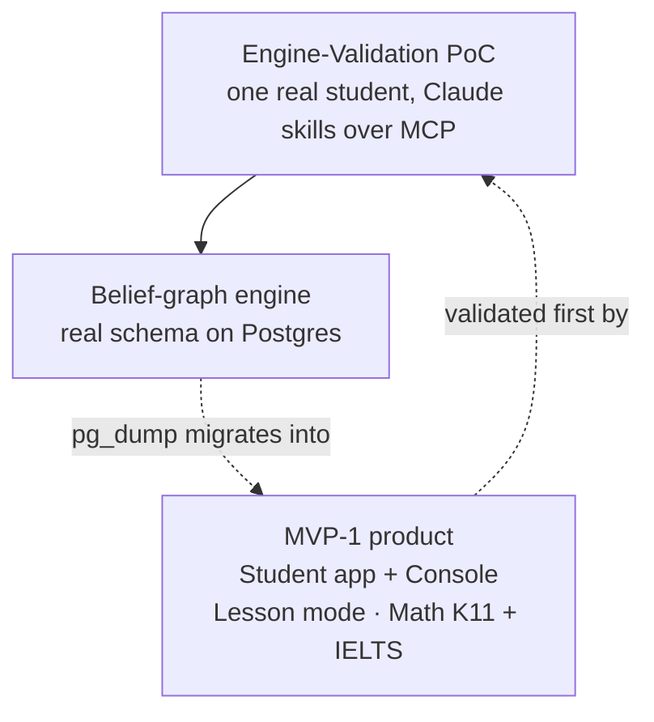

MVP-1 của Stemolly có hai phần. Một phần là chính sản phẩm: một Student app (ứng dụng cho học sinh) và một Console (bảng điều khiển), với một study mode (chế độ học) và hai môn học. Phần còn lại là lối đi tắt mà nhóm chọn để giảm rủi ro: trước khi xây dựng đầy đủ ứng dụng đó, một học sinh thật sẽ dùng một thiết lập nhỏ hơn rất nhiều — Claude nói chuyện trực tiếp với engine (bộ máy) — để kiểm chứng xem engine có thực sự hoạt động hay không. Trang này đưa ra bản đồ tổng thể; ba trang bên dưới sẽ đi sâu vào từng phần.

Toàn bộ kế hoạch đặt trên một canh bạc: một belief-graph engine (bộ máy đồ thị niềm tin) duy nhất có thể theo dõi mô hình nhận thức của học sinh qua những môn rất khác nhau. Những gì được phát hành, những gì được để lại sau, và cách PoC được dựng lên đều xuất phát từ việc phải kiểm chứng canh bạc đó với chi phí thấp trước khi đầu tư vào app shell (khung ứng dụng).

Engine là phần duy nhất của PoC có giá trị lâu dài. Mọi thứ xung quanh nó — Claude skills (các kỹ năng Claude), MCP glue (phần ghép nối MCP), thiết lập một người dùng — chỉ là giàn giáo tạm, được dựng lên để bỏ đi khi ứng dụng đã tồn tại. Claude skills không phải là hạng mục bàn giao theo kế hoạch; chúng được cải thiện liên tục qua các phiên làm việc thật, còn phần mà nhóm lên kế hoạch và phát hành là engine surface (bề mặt giao tiếp của engine) mà các kỹ năng đó gọi tới.

**Cột mốc Sprint 13:** sau khi PoC chứng minh được engine, kho `engine-poc` đã được cho nghỉ hưu. Engine module (mô-đun engine) và MCP driving adapter (bộ điều hợp điều khiển MCP) của nó được chuyển nguyên khối vào `app/` như những workspace members (thành phần trong workspace) chính thức, và phần VPS deployment (triển khai trên VPS) cũng được dựng lại ngay trong `app/`. Kho `engine-poc` đã lưu trữ vẫn còn tồn tại như một bản ghi chỉ đọc.

## Các trang trong chủ đề này

- **[Phạm vi sản phẩm MVP-1](./mvp-scope/)** — những gì thực sự được phát hành: Student app và Console, study mode chỉ có Lesson cùng curriculum picker (bộ chọn chương trình học) của nó, và vì sao Math (deep) và Language (thin) là hai môn ra mắt.
- **[PoC xác thực Engine: Thiết kế và ranh giới](./poc-design/)** — vì sao PoC được chạy trước ứng dụng, cách Claude đảm nhiệm cả hai vai trò gia sư, các quy tắc giúp dữ liệu của nó luôn đáng tin cậy và có thể di trú, quy trình assignment-brief (bản giao việc) gồm CAS key verification (xác minh khóa CAS), checkpoint split (tách checkpoint), slug validation (xác thực slug), cùng ranh giới đã biết nơi engine đang hấp thụ các mối quan tâm ở tầng ứng dụng của PoC.
- **[Vận hành và triển khai PoC](./poc-ops/)** — runbook (sổ tay vận hành) cục bộ cho MCP over HTTP, các wire bugs (lỗi ở tầng kết nối) mà nhóm đã sửa, VPS deployment với hostnames và SSH-tunnel migrations (di trú qua đường hầm SSH), cùng chu trình backup-and-restore-verification (sao lưu, khôi phục và xác minh). Trang này cũng bao quát việc di chuyển vào `app/` ở Sprint 13.
