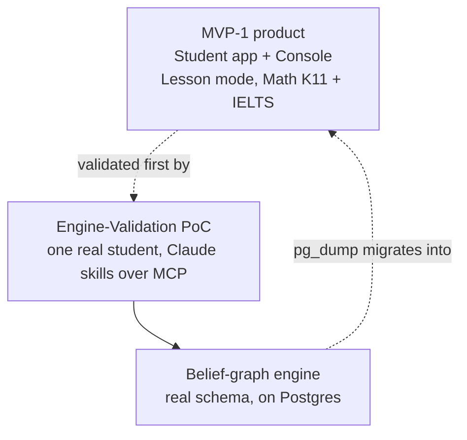

MVP-1 của Stemolly có hai lớp. Một lớp là sản phẩm thực tế: một Student app (ứng dụng cho học sinh) và một Console (bảng điều khiển), với một study mode (chế độ học) và hai môn học. Lớp còn lại là đường tắt mà nhóm dùng để giảm rủi ro: trước khi xây dựng ứng dụng hoàn chỉnh đó, một học sinh thật sẽ dùng một thiết lập nhỏ hơn nhiều — Claude trao đổi trực tiếp với engine (bộ máy) — để chứng minh rằng engine thực sự hoạt động. Trang này đưa ra bức tranh tổng thể; ba trang bên dưới sẽ đi sâu vào từng phần.

Toàn bộ kế hoạch dựa trên một cược lớn: một belief-graph engine (bộ máy đồ thị niềm tin) duy nhất có thể theo dõi mô hình nhận thức của học sinh trên những môn học rất khác nhau. Những gì được phát hành, những gì được hoãn lại, và cách PoC được dựng lên đều bắt nguồn từ việc phải kiểm chứng giả định đó với chi phí thấp trước khi đầu tư vào app shell (khung ứng dụng).

Engine là phần duy nhất của PoC có tính bền vững lâu dài. Mọi thứ xung quanh nó — Claude skills (các kỹ năng Claude), lớp kết nối MCP, thiết lập một người dùng — chỉ là phần giàn dựng tạm thời, được tạo ra để sẵn sàng bỏ đi khi ứng dụng đã tồn tại. Đặc biệt, Claude skills không nằm trong danh sách hạng mục bàn giao theo kế hoạch; chúng được cải thiện liên tục qua các phiên làm việc thực tế, còn phần công việc mà nhóm thực sự lên kế hoạch và phát hành là bề mặt engine mà các kỹ năng đó gọi tới.

## Các trang trong chủ đề này

- **[Phạm vi sản phẩm MVP-1](/vi/product/mvp-poc/mvp-scope/)** — những gì thực sự được phát hành: Student app và Console, study mode chỉ có Lesson cùng bộ chọn chương trình học của nó, và vì sao Math (sâu) và Language (mỏng) là hai môn được chọn khi ra mắt.
- **[PoC xác thực Engine: Thiết kế & Ranh giới](/vi/product/mvp-poc/poc-design/)** — vì sao PoC được chạy trước ứng dụng, cách Claude đảm nhiệm cả hai vai trò gia sư, các quy tắc giúp dữ liệu của nó luôn đáng tin cậy và có thể di trú, cùng ranh giới đã biết nơi engine đang âm thầm hấp thụ các mối quan tâm ở tầng ứng dụng của PoC.
- **[Vận hành & triển khai PoC](/vi/product/mvp-poc/poc-ops/)** — runbook cục bộ cho MCP over HTTP, các lỗi ở tầng wire mà nhóm đã sửa, và quy trình triển khai đầy đủ lên VPS: hostname, di trú qua SSH tunnel, cùng chu trình sao lưu và xác minh khôi phục.
