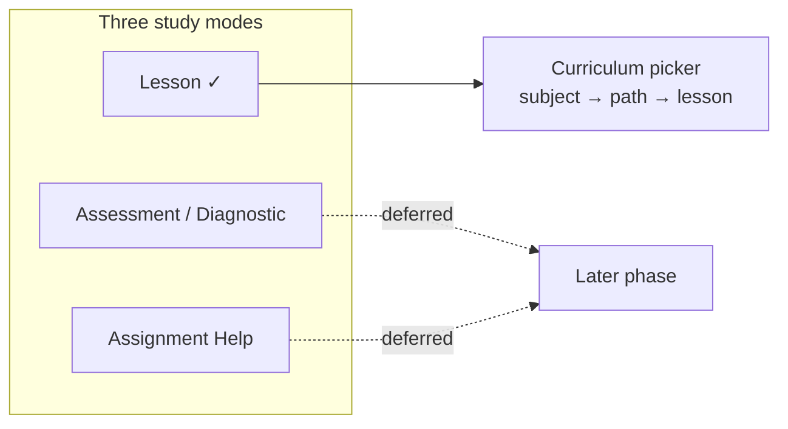

MVP-1 được cố ý giữ rất hẹp. Bản phát hành này gồm hai ứng dụng, một chế độ học và hai môn học — và mỗi lựa chọn đều nhằm tạo ra phép thử sạch nhất có thể cho belief-graph engine (bộ máy đồ thị niềm tin), chứ không phải dựng cả sản phẩm ngay trong một lần.

## Hai ứng dụng: Student app và Console

MVP-1 phát hành đồng thời **Student app** (ứng dụng dành cho học sinh, nơi các em học bài) và **Console** (ứng dụng cho nhà giáo dục/người vận hành, với khu vực **Author** (biên soạn) để xây curriculum và khu vực **Observe** (theo dõi) để xem lại các chỉ số của engine). Kế hoạch trước đây từng là chỉ phát hành Student app, nhưng chính đội Stemolly cũng là người dùng Console rất tích cực trong MVP-1 — họ biên soạn curriculum trong Author và kiểm tra trong Observe xem các tín hiệu của engine có thật sự phản ánh đúng hay không.

Nhóm người dùng là giáo viên và nhà trường theo mô hình managed self-serve (tự phục vụ có quản lý) được chủ ý dời sang một giai đoạn sau. Console được thiết kế có tính đến nhu cầu dùng trong tương lai của giáo viên, nhưng MVP-1 không đưa ra bất kỳ tính năng quản lý giáo viên hay trường học nào.

## Một chế độ học: Lesson, bắt đầu qua bộ chọn curriculum

Stemolly có ba study modes (chế độ học) — Lesson, Assessment/Diagnostic và Assignment Help. MVP-1 chỉ phát hành **Lesson**; hai chế độ còn lại được dời lại.

Một phiên Lesson bắt đầu bằng **structured curriculum path picker** (bộ chọn lộ trình curriculum có cấu trúc): học sinh chọn môn, rồi chọn path, rồi chọn lesson từ curriculum mà đội ngũ đã biên soạn sẵn — thay vì gõ một free-text topic (chủ đề nhập tự do) hoặc để AI tự quyết. Chỉ một quyết định này thôi đã chốt cùng lúc hai câu hỏi: chế độ nào được phát hành trước, và một phiên học sẽ bắt đầu như thế nào.

Một path đã chọn sẽ đi thẳng tới một lesson brief (bản tóm tắt bài học) đã được biên soạn sẵn, để tutor dẫn dắt theo lối Socratic — đưa học sinh đến đáp án thông qua câu hỏi. Vì curriculum được ánh xạ lên cấu trúc tiên quyết của concept graph (đồ thị khái niệm), bộ chọn này cũng cho engine một anchor (điểm neo) ổn định để gắn bằng chứng ngay từ lượt đầu tiên.

Việc nhập chủ đề tự do bị hoãn lại chính vì lý do ngược lại: nó sẽ buộc AI phải tự bịa ra cấu trúc ngay trong lúc chạy, khiến engine không có khái niệm ổn định nào để bám bằng chứng vào. Điều đó sẽ làm suy yếu chính điều mà MVP-1 tồn tại để chứng minh.

## Hai môn học, hai vai trò khác nhau

| Môn học | Độ sâu | Vai trò |
|---|---|---|
| Math — Vietnam K11 | Độ sâu đầy đủ, đồ thị tiên quyết thực | Phương tiện kiểm chứng chiều sâu |
| Language — IELTS Writing + Reading | Bản ra mắt mỏng | Minh chứng khả năng khái quát |

Math là phương tiện đi sâu vì các ngộ nhận trong môn này sắc nét, dễ neo vào bằng chứng; concept graph của nó là một cấu trúc tiên quyết đúng nghĩa; và đây cũng là màn trình diễn mạnh nhất cho việc engine vượt qua một naive baseline (mốc so sánh ngây thơ/đơn giản).

Language được phát hành ở phạm vi mỏng để chứng minh một điều khó hơn: chỉ *một* engine vẫn có thể tạo ra một mô hình tinh thần thực sự hữu ích trên hai lĩnh vực rất khác nhau và hai kiểu dạy khác nhau — hỏi đáp kiểu Socratic cho Math, còn Correct-and-Reinforce (sửa rồi củng cố) cho Language. Đây là một khẳng định lớn hơn nhiều so với việc chỉ nói rằng "nó hoạt động với đại số". Trong Language, Reading là phần hợp với chế độ Lesson nhất và cũng dễ neo nhất; còn Writing mang lại tín hiệu phong phú nhất, vì các mẫu ngữ pháp và cách viết của người học có tiếng mẹ đẻ là tiếng Việt có tính dự đoán rất cao.

SAT Math đã được tính đến trong thiết kế shared-node (nút dùng chung) của concept graph, nhưng không nhất thiết sẽ được xây như một phần của MVP-1.

## Cách học sinh nhập bài: dạng capture so với nội dung được gõ sẵn

Student app tiếp nhận ba cách để học sinh thể hiện bài làm của mình:

- **Freehand strokes** (nét viết/vẽ tay) trên bề mặt vẽ
- **Photographs** (ảnh chụp) bài làm trên giấy
- **Typed math** (biểu thức toán gõ bằng bàn phím)

Freehand và photograph là các dạng **capture** (thu nhận) — đầu vào thô mà ý nghĩa của nó phải được khôi phục qua một bước **transcription** (chuyển chép nội dung) trước khi engine có thể suy luận trên đó. Typed math thì khác về bản chất: học sinh đã tự thực hiện phần diễn giải, nên chính thứ được tạo ra *đã là* nội dung ngữ nghĩa. Không có bước transcription nào chạy ở đây.

Sự tách đôi này giải thích nhiều điều vốn nếu không sẽ trông khá mâu thuẫn. Typed math không cần transcription và cũng không tạo ra dòng thời gian của các lần dừng hay xóa — vì thế đây vừa là modality (phương thức nhập liệu) rẻ nhất để xây, vừa là phương thức ít giàu thông tin nhất khi dùng trong phiên học, bởi học sinh đã tự gõ ra ý nghĩa bằng tay. Freehand và photograph hội tụ ở ranh giới model (cả hai đều trở thành một rasterized image (ảnh raster hóa) để được transcription) và chỉ khác nhau ở chỗ strokes còn cung cấp thêm một timeline có đóng dấu thời gian.

Bề mặt làm bài mô hình hóa đầu vào như một danh sách có thứ tự gồm các typed blocks (khối nhập gõ), chứ không phải một polymorphic capture abstraction (lớp trừu tượng thu nhận đa hình). Mỗi lần thêm một modality chỉ tốn một block type và một renderer (bộ dựng hiển thị), cộng thêm một nhánh transcription nếu modality mới là dạng capture. Còn problem image mà operator cung cấp là một loại thứ tư, không thuộc hai nhóm kia: nội dung của nó đã được biết sẵn từ assignment brief, nên nó được dựng và ghép vào nhưng không bao giờ phải diễn giải.

## Cách nội dung bài tập đến được Student app

Trong Claude-skill PoC, operator đưa cho học sinh một thư mục tài liệu và tutoring agent đọc trực tiếp thư mục đó từ máy của cô ấy. Khi chuyển sang Student app chạy trên trình duyệt, con đường đó biến mất: "máy của học sinh" giờ là trình duyệt, còn tài liệu nằm trên laptop của operator thì không có cách nào tự đi tới đó.

Cơ chế được chọn là một **push** (đẩy dữ liệu) tường minh. Một operator skill (kỹ năng dành cho người vận hành) gửi assignment brief (bản giao bài), cùng chỉ những per-problem crops (ảnh cắt theo từng bài) mà brief đó tham chiếu, tới một authenticated admin route (đường dẫn quản trị có xác thực). Ứng dụng lưu chúng trong content module (mô-đun nội dung) riêng của mình, khóa theo `briefSnapshotId` — một brief được sửa sẽ trở thành bản ghi mới thay vì ghi đè lên bản cũ. Đây cũng là mảnh ghép cuối cùng cung cấp `evidence_events.brief_snapshot_id`, một cột vốn đã tồn tại xuyên suốt nhưng trước đó chưa có nơi nào sinh ra giá trị cho tới khi luồng push này được nối vào.

PDF nguồn thô không bao giờ được chuyển đi, vì quy trình ingestion (nạp đầu vào) đã mặc định coi các ảnh cắt theo từng bài mới là cách đọc đáng tin cậy duy nhất đối với phần trình bày toán học dày đặc.

Ba phương án khác bị loại:

- **Mounting the operator's workspace onto the server** rẻ hơn, nhưng sẽ đưa cả PDF thô, bản nháp và đáp án lên máy chủ phục vụ phía học sinh.
- **Putting material in the engine** sẽ biến engine thành nơi lưu trữ nội dung, điều mà chính ranh giới hệ thống của nó không cho phép.
- **Building the full content module** (curricula, cohorts, publishing) là quá rộng cho một proof of concept khi còn chưa có cohorts.

Engine không bị động tới bởi thay đổi này. Study anchor (điểm neo học tập) vẫn là mối nối: engine giữ các concept theo anchor ID, ứng dụng giữ các bài toán và brief theo cùng ID đó, và lúc bắt đầu phiên học hệ thống vẫn kiểm tra lại tên các concept trong brief bằng một lần đọc anchor đang còn hiệu lực.
