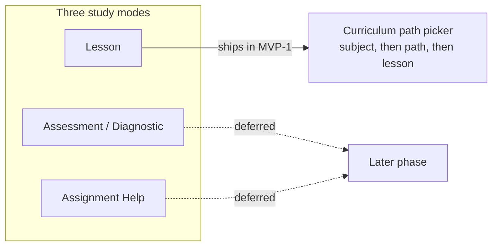

MVP-1 được cố ý giới hạn ở phạm vi hẹp. Bản phát hành này chỉ gồm hai ứng dụng, một chế độ học và hai môn học — mỗi lựa chọn đều nhằm tạo điều kiện tốt nhất để kiểm chứng belief-graph engine (bộ máy đồ thị niềm tin), chứ không phải xây toàn bộ sản phẩm ngay từ đầu.

## Phát hành hai ứng dụng: Student và Console

MVP-1 phát hành cả **Student app** (ứng dụng học dành cho học sinh, nơi các em học bài) và **Console** (ứng dụng cho giáo viên/người vận hành, với khu vực **Author** (soạn nội dung) để xây dựng chương trình học và khu vực **Observe** (theo dõi) để xem lại các chỉ số của engine). Đây là thay đổi so với kế hoạch trước đó, khi chỉ phát hành Student app — bởi chính đội Stemolly hiện cũng là người dùng tích cực của Console trong MVP-1: họ dùng Author để xây dựng chương trình học và Observe để kiểm tra xem các tín hiệu của engine có thực sự đáng tin hay không.

Nhóm người dùng là giáo viên và trường học theo mô hình tự quản trị, tự phục vụ sẽ được lùi sang giai đoạn sau. Console được thiết kế có tính đến nhu cầu sử dụng đó trong tương lai, nhưng ở MVP-1 sẽ chưa có tính năng quản lý giáo viên hay trường học nào được mở ra.

## Một chế độ học: Lesson, bắt đầu qua bộ chọn lộ trình chương trình học

Stemolly có ba chế độ học — Lesson (bài học), Assessment/Diagnostic (đánh giá/chẩn đoán) và Assignment Help (hỗ trợ làm bài tập). Trong MVP-1 chỉ có **Lesson**; hai chế độ còn lại được để cho giai đoạn sau.

Một phiên Lesson bắt đầu bằng **structured curriculum path picker** (bộ chọn lộ trình chương trình học có cấu trúc): học sinh chọn môn học, rồi chọn lộ trình, rồi chọn bài học trong chương trình mà đội ngũ đã biên soạn sẵn — thay vì nhập tự do một chủ đề hoặc để AI tự chạy chẩn đoán. Chỉ riêng quyết định này đã giải quyết đồng thời hai câu hỏi: chế độ nào sẽ được phát hành trước, và một phiên học sẽ bắt đầu như thế nào.

Lý do rất thực tế. Một lộ trình đã chọn sẽ ánh xạ trực tiếp tới một lesson brief đã được biên soạn sẵn để gia sư AI dẫn dắt theo kiểu Socratic (đưa học sinh đến câu trả lời bằng câu hỏi, thay vì giảng giải sẵn). Đồng thời, vì chương trình học được ánh xạ lên các nút và liên kết tiên quyết của concept graph (đồ thị khái niệm), bộ chọn này cho engine một điểm neo ổn định để gắn bằng chứng ngay từ lượt tương tác đầu tiên.

Tính năng nhập chủ đề tự do — nơi học sinh gõ bất cứ điều gì mình muốn học — bị hoãn lại vì lý do ngược lại: nó sẽ buộc AI phải tự dựng cấu trúc ngay trong lúc xử lý, khiến engine không có một khái niệm ổn định nào để gắn bằng chứng vào. Điều đó sẽ làm suy yếu chính điều mà MVP-1 được tạo ra để chứng minh. Cách nhập tự do hoặc kết hợp có thể được bổ sung sau, khi engine đã được kiểm chứng trên các lộ trình có cấu trúc.

## Hai môn học, hai vai trò khác nhau

MVP-1 ra mắt với hai môn học, và chúng không phục vụ cùng một mục đích:

| Môn học | Độ sâu | Vai trò |
|---|---|---|
| Toán — Vietnam K11 | Độ sâu đầy đủ, đồ thị tiên quyết thực | Phương tiện kiểm chứng chuyên sâu |
| Ngôn ngữ — IELTS Writing + Reading | Bản ra mắt mỏng | Minh chứng cho khả năng khái quát hóa |

Toán là phương tiện kiểm chứng chuyên sâu vì các ngộ nhận của môn này rõ ràng, dễ gắn với bằng chứng; đồ thị khái niệm của nó thực sự là một cấu trúc tiên quyết; và đây cũng là cách thuyết phục nhất để cho thấy engine vượt qua một đường cơ sở đơn giản.

Ngôn ngữ được phát hành ở phạm vi mỏng để chứng minh một điều khó hơn: chỉ với *một* engine vẫn có thể tạo ra một mô hình nhận thức thực sự hữu ích trên hai lĩnh vực rất khác nhau và hai phong cách giảng dạy khác nhau — đặt câu hỏi kiểu Socratic cho toán, và phong cách Correct-and-Reinforce cho ngôn ngữ. Đây là một tuyên bố tham vọng hơn nhiều so với việc chỉ nói rằng "nó hoạt động với đại số". Trong phạm vi Ngôn ngữ, Reading là phần phù hợp nhất với chế độ Lesson và cũng dễ neo vào bài học nhất; còn Writing mang lại tín hiệu phong phú nhất, vì các mẫu ngữ pháp và viết của người học có tiếng mẹ đẻ là tiếng Việt có tính dự đoán rất cao.

SAT Math đã được tính đến trong thiết kế nền tảng dùng các nút dùng chung của đồ thị khái niệm, nhưng chưa chắc sẽ được xây dựng như một phần của MVP-1.
