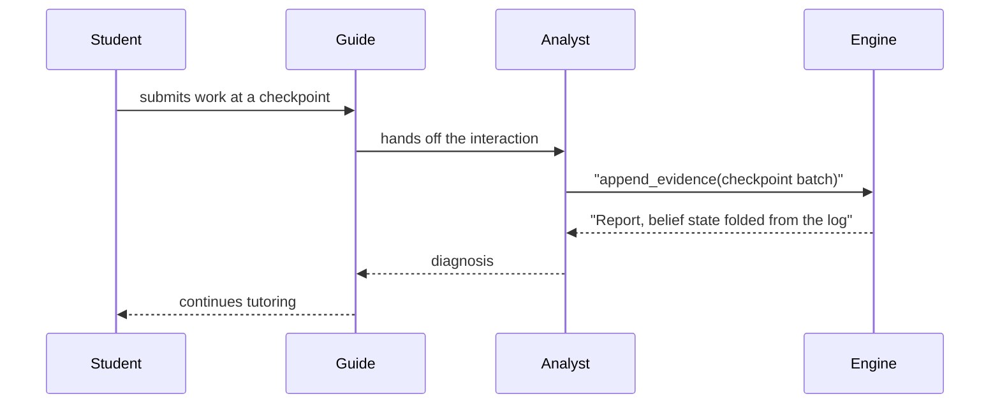
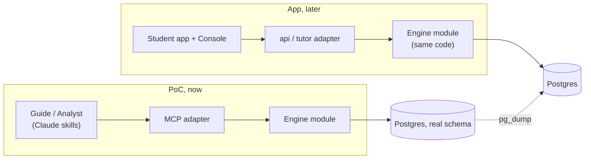
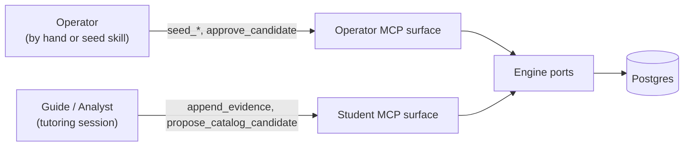

Trước khi xây dựng ứng dụng MVP-1, Stemolly đang chạy một **Engine-Validation PoC**: một học sinh thật sẽ được hỗ trợ làm bài tập (trước là toán, sau là vật lý), và toàn bộ phần hội thoại đều do Claude đảm nhận — không có Student app, không có đăng nhập, không có Console. Mọi lựa chọn thiết kế trong PoC này đều phục vụ cho một mục tiêu: chứng minh rằng **belief-graph engine** (engine đồ thị niềm tin) hoạt động, với chi phí thấp nhất có thể, mà không làm dữ liệu của học sinh gặp rủi ro.

## Vì sao PoC được làm trước ứng dụng

Phần duy nhất của MVP-1 thực sự cần chứng minh là engine — phần biến câu trả lời của học sinh thành một bức tranh về những gì các em hiểu và hiểu sai. Nếu xây trọn bộ Student app, hệ thống đăng nhập và Console trước khi biết engine có tạo ra được các tín hiệu đáng tin hay không, thì đó sẽ là một cách rất tốn kém chỉ để phát hiện ra rằng nó không làm được.

Vì vậy, PoC thay toàn bộ front end bằng Claude. Claude đọc trực tiếp tài liệu bài tập của học sinh, hướng dẫn các em đi qua bài, rồi trao đổi với engine qua một **MCP** (giao thức để AI gọi một tập công cụ đã được định nghĩa của một dịch vụ), tương tự cách con người gọi một tập hàm đã được định nghĩa trong một API. PoC được cố ý gọi là PoC, chứ không phải “MVP-0”, để luôn giữ rõ một sự thật: **lớp vỏ quanh engine có thể bỏ đi, nhưng dữ liệu của engine thì không.** Kế hoạch ban đầu là xây Student app và Console không bị hủy; chỉ là được dời lại sau PoC.

## Hai vai AI, một vòng lặp đồng bộ

Trong PoC, Claude đảm nhiệm cả hai vai trò gia sư mà thiết kế sản phẩm thật yêu cầu:

- **Guide** (vai trò dẫn dắt) vận hành cuộc trò chuyện theo từng lượt — nói chuyện với học sinh và đọc tài liệu của các em (Claude đọc trực tiếp PDF và hình ảnh; nếu chuyển chúng thành văn bản trước chỉ làm mất thông tin).
- **Analyst** (vai trò phân tích) được kích hoạt ở các checkpoint, như một Claude subagent riêng biệt. Nó suy luận dựa trên những gì vừa xảy ra và ghi bằng chứng trở lại engine.

Vì chỉ có một học sinh, Analyst không cần chạy nền — nó chạy **đồng bộ**, ngay giữa cuộc trò chuyện:



Ứng dụng hoàn chỉnh sau này sẽ cần một asynchronous job runner cho bước Analyst này, cùng với cơ chế dự phòng khi nó bị chậm — vì sẽ có nhiều học sinh làm việc cùng lúc. PoC loại bỏ toàn bộ phần đó; chúng chỉ được đưa trở lại khi concurrency thật sự (nhiều học sinh đồng thời) xuất hiện. Điều PoC vẫn giữ là đúng hình dạng của thiết kế hai tác tử: Guide trò chuyện, Analyst chẩn đoán — chỉ khác ở chỗ Claude tạm thời lấp vào vị trí của tutoring engine nội bộ mà sau này ứng dụng sẽ tự vận hành.

### Các skill được phát triển như thế nào

Guide session skill, Analyst checkpoint subagent, seed skill và assignment-ingestion skill đều được cải thiện bằng cách thử nghiệm qua các phiên học thật — chứ không phải xây một lần theo một định nghĩa “xong”. Chúng được lặp lại và điều chỉnh liên tục, làm thủ công, không bị chặn bởi cổng nào, và không thuộc về sprint nào đã được lên kế hoạch.

Nhóm đã bác bỏ cách coi chúng là sprint deliverable: một prompt dạy học chỉ có thể được đánh giá qua việc các phiên thực tế diễn ra thế nào, và bạn không thể đánh giá điều đó trước khi các phiên ấy tồn tại. Phần việc có kế hoạch *thực sự* nợ các skill là **engine surface** (bề mặt giao tiếp của engine) mà chúng gọi tới — `anchor store`, `concept-gap channel`, `identifier handoff` và `evidence trail`. Đó là những thứ skill cần gọi nhưng không thể tự cung cấp cho chính nó, và chính cách nhìn lại này đã biến phạm vi sprint xoay quanh skill thành phạm vi sprint xoay quanh engine surface.

Hệ quả thực tế là: chất lượng skill không bao giờ là điều kiện chặn việc ship phần engine, và phần engine cũng không bao giờ phải đứng chờ một prompt hoàn thiện.

## Các quy tắc engine áp lên AI

MCP mà Claude gọi là **append-only** (chỉ cho phép thêm vào): các công cụ ghi của nó chỉ có thể thêm bằng chứng mới hoặc đề xuất một mục catalog mới (một ngộ nhận đã biết hoặc một mẫu suy luận) — không có gì cho phép Claude trực tiếp đặt belief state của học sinh.

:::caution[Không có đường tắt để ghi trực tiếp]
Hoàn toàn không có công cụ nào cho phép Claude ghi thẳng kiểu như “học sinh này còn yếu về phương trình bậc hai” vào engine. Misconceptions, fragility và reasoning patterns luôn được **engine code** tính toán từ evidence log — không bao giờ do AI tự đặt. Nếu từng tồn tại một công cụ “set belief”, thì các belief sẽ không còn được neo vào bằng chứng có thể phát lại, và toàn bộ mục đích của PoC sẽ bị phá hỏng.
:::

Điều đó cũng định hình cách bằng chứng được tính thời điểm. `append_evidence` nhận toàn bộ các sự kiện của một checkpoint như một batch duy nhất rồi chỉ append vào — không có chuyện recompute theo từng sự kiện, cũng không có bước “close checkpoint” riêng. Việc đọc belief state (`get_belief_state`) chỉ đơn giản là fold toàn bộ evidence log tại đúng thời điểm bạn yêu cầu. Đây là một chủ ý thiết kế: một học sinh tự sửa bài sẽ tạo ra hai sự kiện trong cùng một checkpoint (một câu trả lời sai, rồi một câu đúng), và hai sự kiện đó cần được cộng gộp với nhau. Nếu recompute ngay sau sự kiện đầu tiên, hệ thống sẽ trả về một tín hiệu trung gian sai. Hệ thống cũng không lưu sẵn gì dưới dạng pre-computed — ở quy mô một học sinh, việc fold lại log từ đầu cho mỗi lần đọc đủ nhanh để không cần làm thêm gì khác.

Danh sách công cụ cũng được cố ý giữ ngắn: một thao tác của engine chỉ được cấp một MCP tool nếu thật sự có Claude skill nào trong PoC cần gọi nó. Những thao tác như gộp hai concept trùng nhau, hay duyệt toàn bộ prerequisite chain, thì không có tool — không skill nào trong hành trình PoC cần tự làm hai việc đó, và việc gộp concept vốn cũng được xem là một quyết định cần con người phán xét. Một tool bị thiếu là dấu hiệu cho thấy thao tác đó không thuộc về một AI actor, chứ không phải một chỗ trống cần lấp.

## Xây trên schema thật, nên chuyển đổi không tốn công

Việc làm mất lịch sử của học sinh khi các em đi từ PoC sang ứng dụng thật là điều không thể chấp nhận — đó là một yêu cầu cứng. Vì vậy, PoC không dùng một kho dữ liệu tạm. Nó xây **engine module** thật, trên database schema thật của nó (các concept node và edge, một evidence log append-only, và belief state được tính từ log đó), ngay trong cùng monorepo mà ứng dụng sau này sẽ dùng.

Nhờ vậy, việc chuyển đổi chỉ còn là sao chép dữ liệu đơn thuần (`pg_dump`) thay vì phải viết lại. Điều đó cũng có nghĩa là không chỉ dữ liệu mà cả code cũng được mang theo: MCP là một adapter mỏng nằm trên interface có sẵn của engine — chính là cùng một vị trí mà sau này lớp API của ứng dụng sẽ chiếm. Khi ứng dụng được xây xong, engine code không đổi; chỉ adapter ở phía trước nó được thay ra.



## Điều gì đi qua ranh giới: một anchor mỏng, không phải cả tài liệu

Engine không bao giờ nhìn thấy bài tập thật của học sinh — không thấy phương trình, bảng biểu hay sơ đồ. Điều duy nhất nó cần là một cách ổn định để nói rằng “bằng chứng này nói về concept kia”. Claude đọc trực tiếp tài liệu gốc và hướng dẫn dựa trên đó (chat của nó *chính là* giao diện trong PoC — không có renderer nào để nhận một định dạng có cấu trúc), rồi chỉ chuyển cho engine một đối tượng nhỏ tên là **`StudyAnchor`** (neo học tập):

```json
{
  "id": "anchor-quad-factoring",
  "label": "Factoring quadratics practice set",
  "nodeRefs": [
    { "slug": "quad-factor", "displayName": "Factoring quadratics" }
  ]
}
```

Một `StudyAnchor` bao trùm một đơn vị học tập đã được chuẩn bị sẵn — trong PoC là một bài tập, còn khi có Console sẽ là một lesson brief. Cùng các node identifier ấy sau đó đi xuyên suốt qua anchor, từng evidence event và các belief được suy ra — sợi chỉ chung đó là tất cả những gì engine cần. Một định dạng nội dung phong phú hơn cho sơ đồ và bảng biểu có thể sẽ đáng để xây vào một ngày nào đó, nhưng chỉ khi ứng dụng có renderer thật sự để tiêu thụ nó; điều đó nằm ngoài phạm vi của PoC.

Shape của `StudyAnchor` nằm dưới dạng **JSON Schema** (lược đồ JSON) trong gói shared contracts, cùng với các cross-boundary contract khác của engine, và nó không mang trường version. Trường version chỉ đáng tồn tại khi có hai chương trình được triển khai độc lập có thể bất đồng về định dạng — ở đây, code tạo ra anchor và code đọc anchor là cùng một tiến trình, nên không có gì để bất đồng cả.

## Giữ nguyên nguyên tắc “AI draft, human approves”: khởi tạo dữ liệu và tách biệt operator/student

Trước khi học sinh chạm vào một chủ đề, concept graph của chủ đề đó (node và liên kết prerequisite) cùng các catalog của nó (các ngộ nhận đã biết, các mẫu suy luận) phải được seed sẵn. Việc seeding là **chỉ dành cho operator**. Operator thực hiện thủ công hoặc thông qua một seed skill: Claude đọc tài liệu học tập, phác thảo node, edge và các mục catalog dưới dạng *candidate*, và không có gì trong đó được tin cậy cho tới khi operator phê duyệt — cùng một nguyên tắc “AI draft, human approves” đang được dùng ở mọi nơi khác nơi nội dung được biên soạn.

Lưu ý rằng cổng phê duyệt hoạt động khác nhau tùy theo loại thứ đang được duyệt. Catalog entry (misconception, pattern) được ghi vào cơ sở dữ liệu với trạng thái `candidate` rồi mới được duyệt sau. Concept node và edge thì không có cột trạng thái, nên với graph, cổng nằm **trước** thao tác ghi — operator xem lại danh sách đã được draft ngay trong transcript của seed skill trước, rồi skill mới gọi `seed_node`/`seed_edge`, và những gì được ghi xuống sẽ được tin cậy ngay lập tức.

Phiên làm việc của chính học sinh thì chỉ có một bộ công cụ hẹp hơn — có thể đọc node và append evidence, nhưng không bao giờ có thể seed hay phê duyệt bất cứ thứ gì. Điều này được cưỡng chế bằng **configuration** (cấu hình), chứ không phải login: tiến trình MCP đọc vai trò mà nó đang chạy (`MCP_ROLE`) một lần khi khởi động, rồi chỉ đăng ký các tool của vai trò đó. Các tool của vai trò còn lại không phải là bị từ chối khi được gọi — chúng đơn giản là không tồn tại trong tiến trình đó; một client kết nối vào student surface thậm chí còn không thể thấy rằng có một tool `seed_node`.

| Surface | Các tool mà nó phơi ra |
|---|---|
| student | `append_evidence`, `propose_catalog_candidate`, `get_belief_state`, `match_catalog` |
| operator | `seed_node`, `seed_edge`, `seed_catalog`, `approve_candidate`, `get_belief_state`, `match_catalog` |



Nếu một vai trò bị thiếu hoặc không được nhận diện được truyền vào, tiến trình sẽ từ chối khởi động thay vì tự đoán — vì thế không có cách nào để vô tình chạy sai bộ tool đang được phơi ra.

:::note[Niềm tin thực sự được đặt ở đâu]
Cả hai surface đều nói chuyện với cùng một cơ sở dữ liệu qua cùng một loại kết nối, nên sự tách biệt không đến từ quyền của database. Nó đến từ việc client có thể chạm tới binary nào. Vì vai trò chỉ là configuration và kết nối là một đường ống tiến trình trực tiếp (stdio), ranh giới thật sự là *ai có thể khởi động tiến trình đó* — đủ dùng cho PoC, nơi tutoring skill tự khởi động tiến trình student-surface của chính nó, nhưng sẽ không còn đứng vững nếu MCP này một ngày nào đó được mở cho nhiều client qua một kết nối mạng dùng chung. Khi đó sẽ cần login thật, và không có gì ở đây cản trở việc thêm nó sau này.
:::

Sự tách biệt này quan trọng dù PoC không có mối bận tâm bảo mật nào khác, bởi vì một phiên Claude mà *có thể* tự duyệt các bản nháp của chính nó thì sớm muộn gì *cũng sẽ* làm vậy — và một khi bản nháp đã được nâng thành dữ liệu đáng tin, không có cách nào hoàn tác điều đó chỉ bằng cách phát lại lịch sử, vì hành động phê duyệt là một quyết định chứ không phải một sự kiện được ghi log.

### Các tool surface thực sự được ghép lại như thế nào

Việc tách operator/student được cưỡng chế trong hàm `resolveToolSet` của `mcp/src/server.ts` — và chỉ đọc riêng các file tool `operator.ts` và `student.ts` thì **không** cho bạn biết mỗi surface đang phơi ra cái gì. Một file thứ ba, `shared-reads.ts`, chứa `get_belief_state` và `match_catalog` để chúng có thể xuất hiện trên cả hai surface. Hàm này sẽ spread `shared-reads.ts` vào cả map của student lẫn map của operator, nên bất cứ thứ gì được đặt vào đó cũng sẽ rơi vào cả hai surface.

Hệ quả là việc một tool thuộc surface nào là một quyết định dựa trên **nơi đặt file**:

- `operator.ts` → chỉ surface operator
- `student.ts` → chỉ surface student
- `shared-reads.ts` → **cả hai** surface, bất kể chủ ý là gì

Một tool bắt buộc phải chỉ thuộc operator hoặc chỉ thuộc student thì không thể đặt trong `shared-reads.ts`. Hệ thống kiểu không phát tín hiệu rằng đã có rò rỉ — tool vẫn chạy, test vẫn pass, và triệu chứng duy nhất là một capability xuất hiện ở nơi mà thiết kế nói rằng nó không nên có mặt. Cách kiểm tra rẻ nhất là một test khẳng định rằng một tên tool cụ thể vắng mặt khỏi student map; để bắt kiểu sai sót này chỉ cần đúng một assertion.

### Danh tính của học sinh là configuration, không phải đối số của tool

Trong tiến trình student MCP, `STUDENT_ID` và `DISPLAY_LANG` được đọc khi khởi động cùng với `MCP_ROLE`. Bản thân các tool sẽ bỏ hai trường này khỏi input — tiến trình tự chèn giá trị đã được cấu hình trước khi ủy quyền cho engine. Không còn trường nào cho model tự điền, dù đúng hay sai.

Lý do nằm ở kiểu lỗi có thể xảy ra: anchor ID sai sẽ ném lỗi, phiên làm việc dừng lại và lỗi đó hiện ra rõ ràng. Student ID sai thì lại thành công một cách âm thầm — bằng chứng bị tích lũy dưới một học sinh không tồn tại, mô hình belief của học sinh quay lại sẽ đọc ra trống rỗng, và vì log là append-only nên những bản ghi bị xếp nhầm đó không thể sửa lại. Loại hẳn model ra khỏi con đường này là cách duy nhất loại bỏ kiểu lỗi đó, thay vì chỉ phát hiện ra nó sau khi sự việc đã xảy ra.

### Thêm một trường hợp nữa: chuyện gì xảy ra khi một concept chưa được seed

Nếu một phiên học đụng phải một concept chưa từng được seed, hệ thống sẽ không ghi gì cho concept đó, sẽ viết một ghi chú có cấu trúc để operator xem lại giữa các phiên, rồi tiếp tục với những gì *có thể* ghi được. Nó không bao giờ tự bịa ra một concept node mới ngay tại chỗ.

Có hai lý do: tần suất việc này xảy ra tự nó đã là một phép đo cho biết seeding tốt đến mức nào — vá lỗ hổng ngay giữa phiên sẽ che mất tín hiệu đó. Và về mặt kỹ thuật cũng không thể ghi một node mới ở trạng thái “mới duyệt được một nửa”: chỉ catalog entry (misconception, pattern) mới có trạng thái phê duyệt trong schema; concept node thì không.

## Một ranh giới đã được biết trước: engine đang hấp thụ các mối quan tâm của ứng dụng PoC

Một buổi thiết kế duy nhất đã thêm vài bảng vào schema của engine — study anchors, anchor membership, concept gaps — cùng với các operator read trên chúng. Từng món một đều có lý do riêng theo các ràng buộc của PoC, và nếu xét riêng lẻ thì món nào cũng có thể biện hộ được.

Nhưng điều đáng nói hơn lại là tổng thể, chứ không phải từng món riêng lẻ. Trong ranh giới module của ứng dụng, các tạo tác này vốn dĩ sẽ không thuộc về engine. Một đơn vị học tập đã được chuẩn bị là mối quan tâm của content, còn hàng đợi việc cho operator thì thuộc về một thứ có hình dáng giống Console. Engine đang lặng lẽ trở thành cơ sở dữ liệu ứng dụng của PoC.

Cái giá chỉ đang được hoãn lại, chứ không biến mất. Nó sẽ đến hạn ở lần diễn tập migration, khi ai đó phải quyết định cho từng bảng xem mỗi dòng dữ liệu sẽ trở thành thực thể của app, được viết lại sang schema của một module khác, hay bị bỏ đi. Những quyết định vốn được rải ra trong nhiều buổi khác nhau sẽ dồn về cùng một lúc, và những thứ trông có vẻ vụn vặt lúc mới thêm vào lại chính là những thứ dễ bị xử lý sai nhất.

Yếu tố giúp giảm rủi ro là không bảng nào trong số này được evidence log tham chiếu tới — mỗi bảng vẫn có thể bị loại bỏ độc lập với cái giá chỉ là một migration. Tính có thể đảo ngược đó là lý do khiến sự tích lũy này vẫn chấp nhận được ở thời điểm hiện tại. Nó sẽ mất đi nếu bất kỳ quyết định nào trong tương lai cho phép một dòng evidence trỏ sang một trong các bảng đó.
