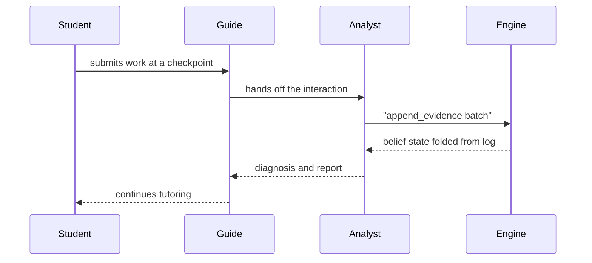
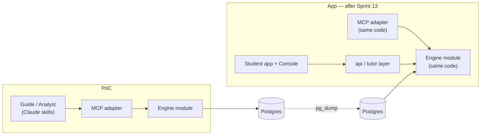
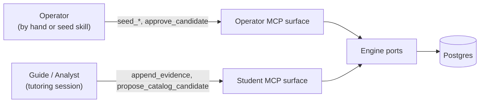

Trước khi xây dựng ứng dụng MVP-1, Stemolly chạy một **Engine-Validation PoC** (bản proof-of-concept để kiểm chứng engine): một học sinh thật sẽ được hỗ trợ làm bài tập (trước là toán, sau đó là vật lý), còn toàn bộ phần hội thoại do Claude đảm nhiệm — không có ứng dụng Student, không có đăng nhập, cũng không có Console. Mọi lựa chọn thiết kế trong PoC này đều phục vụ một mục tiêu: chứng minh rằng `belief-graph engine` hoạt động, với chi phí thấp nhất có thể, mà không đặt dữ liệu của học sinh vào rủi ro.

## Vì sao PoC được làm trước ứng dụng

Phần duy nhất của MVP-1 thật sự cần được chứng minh là engine — phần biến câu trả lời của học sinh thành một bức tranh về những gì em hiểu và hiểu sai. Nếu xây xong toàn bộ ứng dụng Student, hệ thống đăng nhập và Console rồi mới biết engine có tạo ra tín hiệu đáng tin hay không thì đó sẽ là một cách rất tốn kém để tìm câu trả lời.

Vì vậy, PoC thay toàn bộ `front end` (giao diện phía trước) bằng Claude. Claude đọc trực tiếp tài liệu bài tập của học sinh, hướng dẫn các em giải bài, rồi trao đổi với engine qua **MCP** — một giao thức cho phép AI gọi một tập tool xác định trên một service, khá giống `function API`. PoC được cố ý gọi là PoC, chứ không phải “MVP-0”, để giữ một sự thật luôn hiện rõ: **lớp vỏ quanh engine là thứ có thể bỏ đi, nhưng dữ liệu của engine thì không.** Kế hoạch ban đầu về việc xây ứng dụng Student và Console chỉ được dời xuống sau PoC, không hề bị hủy.

## Hai vai trò AI, một vòng lặp đồng bộ

Trong PoC, Claude đóng cả hai vai trò gia sư mà sản phẩm thật cần có:

- **Guide** (tác nhân dẫn học) điều khiển cuộc hội thoại theo từng lượt — trò chuyện với học sinh và đọc tài liệu của các em. Claude đọc được PDF và hình ảnh theo cách tự nhiên; nếu chuyển chúng sang văn bản trước thì chỉ làm mất thông tin.
- **Analyst** (tác nhân phân tích) được kích hoạt tại các checkpoint dưới dạng một Claude subagent riêng. Nó suy luận trên những gì vừa diễn ra và ghi bằng chứng trở lại engine.

Vì chỉ có một học sinh, Analyst chạy **synchronously**, ngay giữa cuộc hội thoại:



Ứng dụng hoàn chỉnh về sau sẽ cần một `asynchronous job runner` cho bước Analyst, kèm theo phương án dự phòng khi nó bị chậm — vì sẽ có nhiều học sinh làm việc này cùng lúc. PoC bỏ toàn bộ phần đó đi và chỉ đưa nó trở lại khi đã có concurrency (xử lý đồng thời) thật sự. Điều mà PoC giữ lại là hình dạng thật của thiết kế hai tác nhân: Guide thì trò chuyện, Analyst thì chẩn đoán.

### Các skill được phát triển như thế nào

Guide skill, Analyst checkpoint subagent, seed skill và assignment-ingestion skill được cải thiện bằng cách thử nghiệm qua các phiên làm việc thật — chứ không phải xây một lần rồi coi như xong theo một định nghĩa “done”.

Chúng được lặp lại và chỉnh sửa liên tục, làm thủ công, không bị chặn bởi điều kiện nào, và không thuộc về sprint dự kiến nào.

Ý tưởng coi chúng như deliverable của sprint đã bị bác bỏ: một prompt dạy học chỉ có thể được đánh giá qua cách các phiên học diễn ra, mà điều đó thì không thể đánh giá trước khi các phiên học thật sự tồn tại. Điều mà công việc có kế hoạch *thật sự* phải cung cấp cho các skill là **bề mặt engine mà chúng gọi tới** — anchor store, concept-gap channel, evidence trail. Đó là những thứ skill có thể gọi, nhưng không thể tự cung cấp cho chính nó.

**Hệ quả thực tế:** chất lượng skill không bao giờ là cổng chặn việc ship phần engine, và công việc về engine cũng không bao giờ phải đứng chờ một prompt được hoàn thiện.

## Những quy tắc engine áp lên AI

MCP mà Claude gọi là loại **append-only** (chỉ cho phép nối thêm): các tool ghi của nó chỉ có thể thêm bằng chứng mới hoặc đề xuất một mục mới trong catalog (một hiểu lầm phổ biến hoặc một mẫu suy luận) — không có gì cho phép Claude trực tiếp đặt belief state của học sinh.

:::caution[Không có đường tắt để ghi trực tiếp]
Hoàn toàn không có tool nào cho phép Claude ghi thẳng kiểu như “học sinh này yếu ở phương trình bậc hai” vào engine. Hiểu lầm, độ mong manh trong kiến thức và các mẫu suy luận luôn được mã nguồn của engine *tính ra* từ evidence log — AI không bao giờ được tự đặt chúng. Nếu từng tồn tại một tool kiểu “set belief”, belief sẽ không còn bám vào bằng chứng có thể phát lại được nữa, và toàn bộ mục đích của PoC sẽ bị phá vỡ.
:::

Điều đó cũng quyết định cách định thời cho bằng chứng. `append_evidence` nhận toàn bộ sự kiện của một checkpoint như một batch duy nhất rồi chỉ nối thêm nó vào — không có tái tính toán theo từng event, cũng không có bước riêng để “đóng checkpoint”. Việc đọc belief state (`get_belief_state`) chỉ đơn giản là fold toàn bộ evidence log tại đúng thời điểm bạn gọi. Đây là một chủ ý thiết kế: một học sinh tự sửa sai sẽ tạo ra hai event trong cùng checkpoint (một câu trả lời sai, rồi một câu đúng) và hai event đó cần được tính gộp với nhau. Nếu tái tính toán ngay sau event đầu tiên thì hệ thống sẽ báo ra một tín hiệu trung gian sai. Hệ thống cũng không lưu sẵn trạng thái đã tính trước — ở quy mô một học sinh, việc fold lại log từ đầu mỗi lần đọc vẫn đủ nhanh, nên không cần đến bước tối ưu đó.

Danh sách tool cũng được giữ ngắn một cách có chủ đích: một thao tác của engine chỉ có MCP tool nếu trong PoC thật sự có một Claude skill cần gọi nó. Những thao tác như gộp hai concept trùng nhau, hay đi toàn bộ một chuỗi prerequisite, đều không có tool — không skill nào trong hành trình PoC cần tự làm hai việc đó, và việc gộp concept vốn dĩ cũng được xem là một phán đoán của con người. Một tool bị thiếu ở đây là dấu hiệu cho thấy thao tác đó không thuộc về AI actor, chứ không phải một chỗ trống cần lấp.

## Xây trên schema thật nên chuyển đổi không tốn công

Việc làm mất lịch sử của học sinh khi em chuyển từ PoC sang ứng dụng thật là điều tuyệt đối không được phép xảy ra. Vì vậy, PoC xây **engine thật** trên đúng database schema thật của nó — các concept node và edge, một evidence log kiểu append-only, và belief state được tính từ log đó. Khi ấy, migration chỉ còn là sao chép dữ liệu bằng `pg_dump`, chứ không phải viết lại.

Code cũng chuyển được nguyên vẹn. MCP chỉ là một lớp adapter mỏng nằm trên interface của engine — đúng vào khe mà tầng API của ứng dụng sau này sẽ chiếm. Khi ứng dụng được xây, code của engine không cần thay đổi. **Sprint 13 đã hiện thực hóa điều đó:** module `engine` và adapter điều khiển `mcp` được chuyển nguyên khối từ `engine-poc` sang `app/` như các thành viên hạng nhất của workspace, mà không thay đổi code của engine hay bề mặt MCP của nó. Sau đó repository `engine-poc` được lưu trữ lại. Xem [Chạy và triển khai PoC](./poc-ops/) để biết câu chuyện chuyển đổi này.



## Điều gì băng qua ranh giới: một anchor mỏng, không phải cả tài liệu

Engine không bao giờ nhìn thấy bài tập thật của học sinh — không thấy phương trình, bảng hay sơ đồ. Điều duy nhất nó cần là một cách ổn định để nói rằng “bằng chứng này nói về concept kia”. Claude đọc tài liệu thô và hướng dẫn từ đó, rồi chỉ chuyển cho engine một object nhỏ tên là **`StudyAnchor`**:

```json
{
  "id": "anchor-quad-factoring",
  "label": "Factoring quadratics practice set",
  "nodeRefs": [
    { "slug": "quad-factor", "displayName": "Factoring quadratics" }
  ]
}
```

Một `StudyAnchor` bao phủ một đơn vị học tập đã được chuẩn bị sẵn — trong PoC là một bài tập. Cùng những định danh node đó sẽ chảy xuyên suốt từ anchor, qua mọi evidence event, tới các belief được suy ra.

Hình dạng của `StudyAnchor` được định nghĩa dưới dạng JSON Schema trong `packages/contracts`, đứng cạnh các contract băng qua ranh giới khác, và nó **không có trường version**. Một trường version chỉ đáng tồn tại khi hai chương trình được triển khai độc lập có thể bất đồng với nhau về định dạng. Ở đây, phần code tạo anchor và phần code đọc anchor nằm trong cùng một process, nên không có chỗ nào để bất đồng. Lưu ý rằng `packages/contracts` không được import bởi cả server của engine lẫn bề mặt MCP của nó — engine sở hữu anchor như một thực thể riêng của chính nó (`engine.study_anchors` cùng các bảng `study_anchor_nodes`, với một view type trong `core/driving.ts`). Gói contracts giữ hình dạng wire mà phía adapter tạo ra khi giao anchor cho engine, chứ không phải biểu diễn nội bộ của engine.

## Giữ nguyên nguyên tắc “AI nháp, con người duyệt”: seeding và tách vai operator/student

Trước khi học sinh chạm vào một chủ đề, đồ thị concept của chủ đề đó (node và liên kết prerequisite) cùng các catalog của nó (những hiểu lầm đã biết, các mẫu suy luận) phải được seed sẵn. Seeding là việc **chỉ dành cho operator**. Operator làm việc đó bằng tay hoặc qua một seed skill chuyên dụng: Claude đọc tài liệu học tập, soạn ra node, edge và catalog entry dưới dạng *candidate*, và không thứ gì trong đó được tin cậy cho tới khi operator phê duyệt — đúng theo quy tắc “AI nháp, con người duyệt” được dùng ở mọi nơi khác có nội dung do AI hỗ trợ soạn thảo.

Lưu ý rằng cổng phê duyệt hoạt động khác nhau tùy theo loại dữ liệu được duyệt. Các catalog entry (hiểu lầm, mẫu suy luận) được ghi vào cơ sở dữ liệu với trạng thái `candidate` rồi mới được duyệt sau. Còn concept node và edge thì không có cột trạng thái, nên với đồ thị, cổng chặn nằm **trước** bước ghi — operator xem lại danh sách bản nháp ngay trong transcript của seed skill trước, rồi skill mới gọi `seed_node`/`seed_edge`, và những gì được ghi xuống sẽ được tin cậy ngay lập tức.

Bản thân phiên làm việc của học sinh có một tập tool hẹp hơn — nó có thể đọc node và thêm bằng chứng, nhưng tuyệt đối không thể seed hay duyệt bất cứ thứ gì. Điều này được thực thi bằng **cấu hình, không phải đăng nhập**: process MCP đọc role mà nó đang chạy dưới đó (`MCP_ROLE`) đúng một lần khi khởi động, rồi chỉ đăng ký các tool của role đó. Tool của role còn lại không phải là “bị từ chối nếu có gọi” — đơn giản là chúng không tồn tại trong process đó; một client nối vào bề mặt dành cho student thậm chí còn không nhìn thấy rằng có một tool `seed_node`.

| Surface | Tools it exposes |
|---|---|
| student | `append_evidence`, `propose_catalog_candidate`, `get_belief_state`, `match_catalog` |
| operator | `seed_node`, `seed_edge`, `seed_catalog`, `approve_candidate`, `get_belief_state`, `match_catalog` |



Nếu một role bị thiếu hoặc không được nhận diện được truyền vào, process sẽ từ chối khởi động thay vì đoán bừa — vì vậy sẽ không có cách nào vô tình chạy lên với bộ tool bị lộ sai.

:::note[Nơi niềm tin thật sự nằm]
Cả hai bề mặt đều nói chuyện với cùng một cơ sở dữ liệu qua cùng một kiểu kết nối, nên sự tách biệt không đến từ quyền ở tầng database. Nó đến từ việc client có thể chạm tới binary nào. Vì role chỉ là cấu hình và kết nối là một ống tiến trình trực tiếp (stdio), ranh giới thật sự ở đây là *ai có thể khởi động process đó* — điều này đủ ổn cho PoC, nơi tutoring skill tự khởi động process bề mặt student của chính nó, nhưng sẽ không còn đứng vững nếu MCP này một ngày nào đó được mở cho nhiều client qua cùng một kết nối mạng dùng chung. Lúc đó sẽ cần đăng nhập thật, và không có gì ở đây ngăn việc thêm nó sau này.
:::

Sự tách biệt này vẫn quan trọng dù PoC không có mối lo bảo mật nào khác, bởi vì một phiên Claude mà *có thể* tự duyệt bản nháp của chính nó thì sớm muộn cũng *sẽ* làm vậy — và một khi bản nháp đã được nâng lên thành dữ liệu tin cậy, không còn cách nào hoàn tác điều đó bằng cách phát lại lịch sử, vì việc phê duyệt là một quyết định, không phải một event đã được ghi log.

### Các bề mặt tool thực sự được ghép lại như thế nào

Việc tách operator/student được thực thi trong hàm `resolveToolSet` của `mcp/src/server.ts` — và chỉ đọc các file tool riêng lẻ `operator.ts` và `student.ts` thì **không** thể biết mỗi bề mặt thật ra phơi ra những gì. Một file thứ ba, `shared-reads.ts`, chứa `get_belief_state` và `match_catalog` để chúng có thể dùng trên cả hai bề mặt. Hàm này bung `shared-reads.ts` vào cả map của student lẫn map của operator, nên bất cứ thứ gì đặt vào đó đều sẽ xuất hiện trên cả hai bề mặt.

Hệ quả là việc một tool thuộc về bề mặt nào là một quyết định dựa trên **vị trí đặt file**:

- `operator.ts` → chỉ bề mặt operator
- `student.ts` → chỉ bề mặt student
- `shared-reads.ts` → **cả hai** bề mặt, bất kể chủ ý ban đầu là gì

Một tool bắt buộc phải chỉ dành cho operator hoặc chỉ dành cho student thì không thể đặt trong `shared-reads.ts`. Hệ thống kiểu không hề phát tín hiệu rằng có rò rỉ — tool vẫn chạy, test vẫn qua, và triệu chứng duy nhất là một capability xuất hiện ở nơi thiết kế nói rằng nó không nên có mặt. Cách kiểm tra rẻ nhất là một test khẳng định rằng một tên tool cụ thể không xuất hiện trong map của student; để bắt loại sai sót này chỉ cần đúng một assertion.

### Danh tính của học sinh là cấu hình, không phải đối số của tool

Trong process MCP dành cho student, `STUDENT_ID` và `DISPLAY_LANG` được đọc lúc khởi động cùng với `MCP_ROLE`. Bản thân các tool loại bỏ hai trường này khỏi input — process sẽ tự chèn giá trị đã cấu hình trước khi ủy quyền cho engine. Không còn trường nào cho model tự điền vào, đúng hay sai.

Lý do nằm ở kiểu lỗi có thể xảy ra: sai anchor ID thì sẽ ném lỗi, phiên làm việc dừng lại và lỗi lộ rõ. Sai student ID thì lại thành công trong im lặng — bằng chứng bị tích lũy dưới tên một học sinh không tồn tại, belief model của học sinh quay lại sẽ đọc ra trống rỗng, và vì log là kiểu append-only nên các bản ghi bị xếp nhầm đó không thể sửa lại được. Loại bỏ hẳn model khỏi đường đi này là cách duy nhất xử lý tận gốc kiểu lỗi đó, thay vì chỉ phát hiện nó sau khi sự việc đã xảy ra.

### Thêm một trường hợp nữa: chuyện gì xảy ra khi một concept chưa được seed

Nếu một phiên học đụng vào một concept chưa từng được seed, hệ thống sẽ không ghi gì cho concept đó, thay vào đó viết một ghi chú có cấu trúc để operator xem lại giữa các phiên, rồi tiếp tục với những gì *vẫn có thể* ghi lại được. Nó không bao giờ tự bịa ra một concept node mới ngay tại chỗ.

Có hai lý do: tần suất việc này xảy ra bản thân nó đã là một phép đo về chất lượng của khâu seeding — vá lỗ hổng ngay giữa phiên học sẽ che mất tín hiệu đó. Và về mặt kỹ thuật cũng không thể ghi một node ở trạng thái “nửa được duyệt”: chỉ catalog entry (hiểu lầm, mẫu suy luận) mới có trạng thái phê duyệt trong schema; concept node thì không.

## Assignment brief: chuẩn bị, phân phối và checkpoint

Một assignment brief gói chung tài liệu học tập với một đáp án mẫu mà operator đã xác minh. Có ba quyết định chi phối cách brief được chuẩn bị và cách phiên học sử dụng nó.

### Xác minh đáp án bằng CAS

Quy trình ingestion phía operator để model tự giải từng bài trong brief, rồi kiểm tra lời giải đó bằng **computer algebra system (CAS)** thay vì cho cùng chính model ấy rà lại lần thứ hai. Hai lượt chạy của cùng một model chia sẻ cùng các điểm mù — một đáp án sai nhưng sai nhất quán có thể được lặp lại y hệt ở cả hai lượt, phép so sánh vẫn báo sạch, và đáp án sai cứ thế được phát hành như thể nó đúng.

CAS không có cùng các điểm mù đó. Chẳng hạn, khi giải `2x² = 4` thì kết quả đúng phải là `x = ±√2`, nhưng model có thể chỉ trả `x = √2` và làm rơi mất nghiệm âm. CAS trả về đầy đủ tập nghiệm; sự lệch nhau sẽ bị bắt lại trước khi operator phê duyệt đáp án.

Giới hạn đã biết là model vẫn là bên viết ra phương trình để CAS đem đi giải — CAS bắt được lỗi tính toán số học, chứ không bắt được lỗi đọc sai đề. Vì vậy, lượt duyệt thủ công của operator nên tập trung vào *bước thiết lập* của từng lời giải (bước đầu tiên, nơi bài toán được hình thức hóa), thay vì phần tính toán số học phía sau. Bản thân CAS hoàn toàn thuộc về quy trình ingestion phía operator, không nằm trong engine — việc quyết định điều gì được xem là một biểu thức có thể kiểm tra đòi hỏi phải biết miền bài toán là Toán, mà đó chính là loại tri thức theo miền mà schema của engine cố tình không lưu giữ.

### Cách giao brief: đáp án đi cùng tài liệu

Assignment brief — bao gồm cả đáp án — được đóng gói vào cùng một bundle với tài liệu học tập và được chuyển cho học sinh. Về nguyên tắc, học sinh hoàn toàn có thể tự đọc đáp án.

Điều này được chấp nhận là không đáng lo trong PoC: học sinh thật duy nhất là một người tự nguyện tham gia thí nghiệm, không phải khách hàng có động cơ để lách hệ thống. Các phương án khác — tách đáp án ra thành một phần bị giữ lại, chuyển nó qua một server-side verdict endpoint, hoặc dời Analyst checkpoint sang chạy ngoài thiết bị của em — đều đã được cân nhắc và bác bỏ ở giai đoạn này. Chúng chỉ trở nên đáng bàn khi hiện vật này được dùng với những học sinh không phải người tham gia nghiên cứu trên cơ sở đồng thuận.

### Hai checkpoint cho mỗi bài: nộp bài tập và buổi chữa bài

Một bài tập về nhà chạy qua hai Analyst checkpoint tách biệt. Học sinh tự làm bài offline, không có hỗ trợ, rồi nộp lại. Analyst chạy một lượt lạnh — chưa có đối thoại nào, chỉ có các câu trả lời — và tạo ra một báo cáo (gồm kế hoạch probe và hướng dẫn có điều kiện). Sau đó, ở một buổi chữa bài khác, Guide sẽ đi qua từng câu một cùng học sinh.

Hai lần chạy này được gán **`checkpoint_id` riêng biệt**, mỗi lần Analyst chạy là một ID, và điều này quan trọng với cách engine đọc một lần sửa sai:

| Scenario | Checkpoint IDs | How the fold reads it |
|---|---|---|
| Wrong homework → right only after the Guide's review instruction | Two different IDs | **Delayed recovery** — she was corrected by instruction |
| Wrong answer → right within the review session, from a `dependsOn` nudge alone | Same review-session ID | **Self-correction** — a stronger belief signal |

`scaffold_stamp` trên các bản ghi evidence của buổi chữa bài cho biết lần thử thứ hai có được hỗ trợ hay không, để bước fold phân biệt được hai trường hợp này ngay cả khi từ bên ngoài chúng trông giống hệt nhau.

### Slug của brief là snapshot, được kiểm tra lúc bắt đầu phiên học

Một assignment brief bắt buộc phải nêu các concept mà nó bao phủ — không thể tránh khỏi việc đó. Một slug đã lưu có thể trở nên lỗi thời nếu concept bị đổi tên. Cách xử lý là: brief mang theo một `anchorId` và một `briefSnapshotId`, và mọi concept slug nó chứa đều được xem là một **snapshot** chỉ đúng tại thời điểm nó được viết ra.

Lúc bắt đầu phiên học, mọi tên concept trong brief đều được kiểm tra lại bằng một lần đọc `get_study_anchor(anchorId)` trên dữ liệu sống. Nếu có một tên nào đó không còn ánh xạ tới một thành viên hiện tại của anchor, phiên học sẽ bị chặn trước khi bắt đầu, thay vì tiếp tục với một tham chiếu đã cũ. Khi sửa brief, hệ thống sẽ đúc ra một `briefSnapshotId` mới. `evidence_events.brief_snapshot_id` được luồn xuyên suốt đầu-cuối qua `AppendCheckpointBatchInput` (đã khép lại bởi issue #112), để evidence log ghi lại được rằng mỗi checkpoint đã dùng snapshot nào của brief.

## Một ranh giới đã biết: engine đang hấp thụ các mối quan tâm của ứng dụng PoC

Trong một buổi thiết kế duy nhất, một số bảng đã được thêm vào schema của engine — study anchor, thành viên của anchor, concept gap — cùng với các lượt đọc phía operator trên chúng. Từng mục một đều có lý do riêng từ các ràng buộc của PoC, và xét riêng lẻ thì mục nào cũng có thể biện hộ được.

Nhưng điều quan trọng hơn từng mục riêng là bức tranh cộng gộp. Trong ranh giới module của ứng dụng thật, các hiện vật này sẽ không thuộc về engine chút nào. Một đơn vị học tập đã được chuẩn bị sẵn là mối quan tâm của phần nội dung, còn hàng đợi công việc cho operator thuộc về một thứ mang hình dáng của Console. Engine đang lặng lẽ trở thành cơ sở dữ liệu ứng dụng của chính PoC.

Chi phí ở đây chỉ đang được dời lại, chứ không phải né được. Nó sẽ đến hạn ở buổi diễn tập migration, khi ai đó phải quyết định cho từng bảng xem mỗi hàng dữ liệu sẽ trở thành thực thể của ứng dụng, bị viết lại vào schema của module khác, hay bị loại bỏ. Những quyết định từng được rải ra qua nhiều buổi làm việc sẽ cùng dồn về một lúc, và chính những thứ trông có vẻ vụn vặt khi được thêm vào lại là những thứ dễ làm sai nhất.

Điểm giúp giảm rủi ro là không bảng nào trong số này được evidence log tham chiếu tới — mỗi bảng vẫn có thể bị bỏ đi một cách độc lập, với cái giá là một migration. Chính tính đảo ngược đó khiến sự tích lũy này còn chấp nhận được ở thời điểm hiện tại. Nó sẽ mất đi nếu bất kỳ quyết định nào sau này cho phép một hàng evidence trỏ vào một trong các bảng đó.
