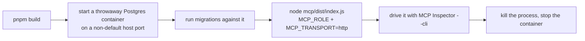

`engine` của PoC chỉ thực sự hữu ích khi Claude có thể kết nối tới nó. Trang này tập trung vào phần vận hành thực tế: cách tự chạy và thử `MCP server` (máy chủ MCP) của PoC, những lỗi nhóm đã phát hiện (và buộc phải sửa) khi làm vững phần `HTTP transport` (cơ chế truyền qua HTTP), cũng như cách toàn bộ hệ thống được host và deploy — bao gồm hostname công khai, chạy migration qua `SSH tunnel` (đường hầm SSH), và chứng minh rằng backup thực sự dùng được.

## Chạy MCP server qua HTTP từ đầu đến cuối

Gói `mcp` thường giao tiếp với Claude qua stdio (ống giao tiếp trực tiếp giữa các tiến trình), nhưng khi khởi động với `MCP_TRANSPORT=http`, nó cũng có thể phục vụ **Streamable HTTP** — tức một cơ chế truyền tải mạng thật. Để thử trên máy cục bộ:



Ở mọi bước trong quy trình này đều cần một cơ sở dữ liệu thật — không có chỗ nào có thể dựng giả hay `mock` (mô phỏng trong kiểm thử). Máy chủ luôn mở trên cổng nội bộ cố định `3000` (không cấu hình lại được). Khi server đã lên, chế độ CLI có thể chạy script của **MCP Inspector** (công cụ kiểm tra MCP) là cách phù hợp để thử mà không cần trình duyệt:

```
npx @modelcontextprotocol/inspector --cli \
  --server-url <url> --transport http \
  --method tools/list
```

Cờ `--transport http` bắt buộc phải khai báo rõ — chỉ đưa URL của server ở root path thì Inspector không có đủ thông tin để tự nhận ra transport. Khi gọi một tool với đối số có cấu trúc (ví dụ một tên hiển thị đã bản địa hóa), hãy dùng `--method tools/call --tool-name <name> --tool-args-json <json>`; dạng `--tool-arg key=value` phẳng hơn chỉ hỗ trợ các cặp đơn giản, không lồng nhau. Inspector cũng có các chế độ `--web` (giao diện trình duyệt, mặc định) và `--tui`, cùng cờ `--format json|text` để chọn dạng đầu ra — nhưng nếu cần scripting, lựa chọn nên dùng là `--cli` kèm `--tool-args-json`.

## Hai lỗi phải sửa thì HTTP transport mới dùng được

Việc biến runbook này thành thứ thực sự chạy được đã làm lộ ra hai lỗi riêng biệt trong quá trình nhóm gia cố cùng một phần dây nối của HTTP transport — cả hai đều vô hình cho tới khi transport thật được chạy trọn vẹn từ đầu đến cuối, thay vì chỉ `mock`.

**Entrypoint âm thầm không làm gì cả.** Trong Node, có một mẫu phổ biến cho phép một file vừa được import vừa có thể tự chạy trực tiếp, bằng cách bọc mã khởi động trong một điều kiện như `import.meta.url === file://${process.argv[1]}`. Điều kiện đó sẽ âm thầm không bao giờ đúng nếu file entrypoint thật chỉ *import* module có điều kiện này thay vì chính nó là module đó — ở đây, `index.ts` dùng `import './main.js'` như một side effect, nên `process.argv[1]` trỏ tới `index.js` còn `import.meta.url` bên trong `main.ts` thì luôn trỏ tới `main.js`. Hai đường dẫn đó không thể trùng nhau. Tiến trình thoát ra sạch sẽ, không in gì, tạo cảm giác như mọi thứ đã chạy dù server chưa từng khởi động. Cách sửa là bỏ guard tự gọi này đi, export hàm ra bình thường, rồi để entrypoint gọi nó một cách tường minh —

```ts
import { main } from './main.js';
await main();
```

Chính thay đổi này khiến bước "khởi động entrypoint" trong runbook thực sự khởi động được cái gì đó.

**Một instance server duy nhất không sống sót qua một handshake thật.** `stateless HTTP transport` của MCP SDK chỉ dùng được một lần: gọi lần thứ hai trên cùng một instance sẽ ném lỗi, trong khi một `handshake` (bắt tay khởi tạo) của client thật không bao giờ chỉ có một request — nó gửi lời gọi `initialize`, rồi tiếp theo là một lời gọi `notifications/initialized` riêng. Nếu dùng chung một transport cho toàn bộ HTTP listener, mọi session sẽ hỏng ở request thứ hai. Tệ hơn nữa, vì transport của SDK bàn giao cho thư viện HTTP nền mà không cấu hình error handler, lỗi này chỉ lộ ra dưới dạng HTTP 500 trần, không log, nên không có gì giải thích nguyên nhân. Cách sửa là tạo mới một cặp server và transport cho mỗi request HTTP đi vào; chi phí này rẻ, vì nó chỉ bọc một instance `engine` đã được dựng sẵn. Chính thay đổi này khiến chuỗi thao tác list-rồi-call trong runbook chạy thành công thay vì đổ vỡ ở lần gọi thứ hai.

## Một lỗi kín đáo hơn trong cùng khu vực: tuần tự hóa kết quả tool

Khi gia cố cùng ranh giới giao tiếp đó, nhóm cũng phát hiện một lỗi tinh vi hơn trong cách kết quả tool được serialize trước khi đi qua wire. `JSON.stringify` trả về *giá trị* `undefined` — chứ không phải chuỗi — khi đầu vào chính là `undefined`, một function trần, hoặc một `Symbol`, và với cả ba trường hợp đó nó không hề ném lỗi. Nếu mã nguồn mặc định rằng lúc nào cũng nhận về chuỗi, nó sẽ tạo ra một reply hỏng, còn lỗi thì trông như phát sinh từ chỗ khác.

Việc chặn ở *đầu vào* (`JSON.stringify(result ?? null)`) chỉ bắt được trường hợp "handler không trả gì" và vẫn để hở phần còn lại của vấn đề. Cách sửa đúng là chặn ở *đầu ra*: `JSON.stringify(result) ?? 'null'`, rơi về chuỗi literal `'null'` — một giá trị mà client thực sự parse được, đồng thời diễn đạt trung thực là "không có giá trị" thay vì bịa ra thứ gì khác. Hiện nay kiểm tra này nằm trong wrapper dùng chung mà mọi kết quả tool đều đi qua, nên nó bảo vệ cả những tool được thêm vào sau này, chứ không chỉ các tool đã làm lộ lỗi ban đầu. Bài học chung ở đây là: một serializer báo lỗi bằng cách âm thầm trả về một giá trị thay vì ném exception sẽ vô hiệu hóa mọi xử lý lỗi được xây quanh việc bắt exception — vì thế, kiểm tra phải đặt ở thứ *đi ra*, bởi ở đầu vào không có gì cảnh báo bạn.

## Hosting repository của PoC

`engine-poc` ban đầu không có remote trên GitHub — việc push nó lên và nối với quy trình deploy lên VPS đều được để sang một sprint sau. Vì vậy, workflow CI của nó chỉ có thể được kiểm tra gián tiếp bằng cách chạy cùng các lệnh đó trên máy cục bộ. Đến lúc review, nhóm đã tạo repository riêng tư `stemolly/engine-poc` và đẩy toàn bộ lịch sử cục bộ lên, cụ thể là để khép lại khoảng trống đó: cả hai job CI đều được theo dõi đến lúc xanh trên một lần push thật, và một PR dùng tạm với lỗi lint cố ý cũng được quan sát chuyển job `Lint` sang màu đỏ.

**Cập nhật Sprint 13:** sau khi PoC chứng minh được `engine`, repository `engine-poc` đã được khai tử. Xem [Sprint 13: di chuyển vào `app/`](#sprint-13-migration-into-app) ở bên dưới.

## Triển khai VPS: edge, Postgres và hostname công khai

Trên VPS đã triển khai, mọi dịch vụ đều nằm sau một **reverse-proxy edge** (biên reverse proxy) là Caddy và chỉ có thể truy cập qua địa chỉ loopback (`127.0.0.1`) — cổng duy nhất lộ ra bên ngoài là cổng TLS của edge. Hai bề mặt MCP theo từng vai trò mỗi cái có một hostname công khai riêng. Chúng được đặt dưới cùng tiền tố cha `poc.` trên `stemolly.com`, chủ đích để không chiếm mất những subdomain ngắn mà ứng dụng thật sẽ cần sau này:

| Môi trường | Hostname operator | Hostname student |
|---|---|---|
| PoC production | `operator.poc.stemolly.com` | `student.poc.stemolly.com` |
| Droplet rehearsal | `operator.rehearsal.poc.stemolly.com` | `student.rehearsal.poc.stemolly.com` |

Phương án dùng trực tiếp `operator.stemolly.com` / `student.stemolly.com` đã bị bác bỏ rõ ràng — những tên đó được dành cho các ứng dụng Student và Console thật sẽ phát hành sau này, và nếu tái sử dụng chúng cho PoC thì đúng lúc liên kết thật có thể đã được dùng lại phải đổi tên. Droplet rehearsal có bộ tên sâu hơn một cấp của riêng nó để bản ghi DNS, chứng chỉ TLS và trạng thái Caddy của môi trường rehearsal không bao giờ làm nhiễm sang hostname PoC production.

### Chạy migration qua SSH tunnel

Postgres tạo ra một ngoại lệ hẹp nhưng có chủ ý đối với quy tắc loopback: nó cũng công bố trên loopback (`127.0.0.1:5432`), dù không bao giờ được proxy. Lý do là một giới hạn của tooling — công cụ migration cần một `tsx` loader cài các hook ở mức toàn cục của tiến trình, mà việc này không an toàn khi chạy bên trong một container sống lâu. Vì thế, không container nào trong stack có thể tự chạy migration cho chính nó. Thay vào đó, migration được chạy một lần từ chính máy của operator, đi vào cơ sở dữ liệu trên VPS qua SSH tunnel:

```bash
# on the operator's machine, open the tunnel:
ssh -L 5432:127.0.0.1:5432 <vps-host>

# then, in a separate terminal, run migrations:
DATABASE_URL=postgres://...@127.0.0.1:5432/... pnpm migrate
```

:::caution[Một ngoại lệ có chủ ý và rất hẹp]
SSH là tiến trình duy nhất trên chính máy chủ VPS — không phải trong container — có thể chạm tới cổng loopback đó, nên cấu hình này chỉ phục vụ cho người đã có sẵn quyền SSH vào máy, chứ không bao giờ mở cho bên ngoài. Nếu quét cổng VPS từ bên ngoài, bạn vẫn chỉ thấy cổng công khai của edge; `5432` được xuất bản trên loopback là một ngoại lệ có tên và có chủ đích đối với quy tắc "mọi dịch vụ chỉ nghe trên loopback", chứ không phải phá vỡ quy tắc đó.
:::

### Hướng dẫn triển khai dành cho operator

Có hai hướng dẫn nằm trong `docs/deploy/`, bên cạnh các thư mục `docs/design/` và `docs/prd/` hiện có:

- **`01-verify-on-vps.md`** — **droplet rehearsal** có thể thay thế được: chứng minh quy trình deploy từng bước trước khi đụng tới bất cứ thứ gì quan trọng, đồng thời chạy trọn một vòng backup → restore → verify. Không có gì trên droplet rehearsal là không thể làm lại.
- **`02-production-deploy.md`** — **droplet bền vững** phục vụ student thật. Tài liệu này được viết như một diff so với hướng dẫn rehearsal (DNS thật, secret thật, snapshot DigitalOcean như một lớp khôi phục thứ hai song song với `pg_dump`, một crontab đã cài sẵn để chạy backup theo lịch, và bài diễn tập restore định kỳ). Nó không lặp lại các thao tác cơ học đã có trong hướng dẫn rehearsal.

Việc tách đôi này là có chủ ý: hai bước nhìn gần như giống nhau, nhưng mức độ rủi ro lại khác hẳn. Gộp chúng vào một tài liệu duy nhất rất dễ làm chìm mất khác biệt đó.

## Xác minh backup và restore

Việc có một file `pg_dump` trên đĩa chỉ chứng minh rằng thao tác dump đã chạy — chưa chứng minh được file đó có restore được hay không, cũng chưa chứng minh được nội dung của nó là đúng. Bộ tooling mà PoC đi kèm xem đây là những câu hỏi tách biệt, và mỗi câu hỏi cần một phép kiểm tra riêng.

`server/scripts/backup.ts` ghi file dump và xử lý vòng đời lưu giữ file dump (một hàm `pruneDumps` thuần được crontab gọi tới, chứ không được nhúng vào container nào). Một mục cron trên VPS sẽ chạy script này theo lịch.

`server/scripts/verify-restore.ts` mới là thứ thực sự chứng minh được việc restore. Nó kết nối đồng thời tới cơ sở dữ liệu nguồn và một cơ sở dữ liệu tạm vừa restore xong, rồi so sánh hai phía trên hai trục:

1. **Số lượng dòng trong `engine.evidence_events`** — nếu lệch nhau thì có nghĩa dữ liệu evidence đã bị mất trong chu trình dump-restore.
2. **`belief state` (trạng thái niềm tin) được phát lại** — script này gọi `getBeliefState()` thật cho mọi student có mặt trong một trong hai cơ sở dữ liệu rồi so sánh đầu ra. Cách này hiệu quả vì belief state là kết quả phát lại có tính quyết định từ evidence log: hai cơ sở dữ liệu có cùng log sẽ cho ra đúng cùng một belief state.

Nếu có bất kỳ chênh lệch nào, hàm sẽ trả về một `divergences[]` không rỗng, ghi rõ chính xác thứ gì lệch — chênh lệch số dòng, hoặc student nào có đầu ra belief khác. Nó không chỉ trả về pass/fail trần. Hàm cũng từ chối ngay nếu được đưa cùng một chuỗi kết nối cho cả nguồn lẫn cơ sở dữ liệu tạm, nhằm chặn lỗi thao tác khi operator vô tình so sánh một cơ sở dữ liệu với chính nó (trường hợp đó đương nhiên sẽ khớp và không chứng minh được gì).

Không script nào trong hai script này có application caller. Cả hai đều là công cụ chỉ dành cho operator — `backup.ts` chạy qua cron, còn `verify-restore.ts` được gọi thủ công (`tsx -e ...`). Đó là hình thức phù hợp cho loại tooling mà người gọi là con người đang chịu áp lực, chứ không phải một module khác.

:::tip[Vì sao phải chặt chẽ đến mức này?]
Evidence log được thiết kế là append-only — một khi đã ghi thì không thể sửa lại. Lịch sử belief của student chính là thứ PoC được tạo ra để sinh ra, và nó không thể thay thế được. Một bản backup chưa từng được xác minh là restore đúng chỉ là một giả thuyết, chưa phải bảo đảm.
:::

## Sprint 13: di chuyển vào `app/` {#sprint-13-migration-into-app}

Sprint 13 (các issue #117–#120) là một sprint chỉ để migration — phạm vi được chốt rõ là "không đổi hành vi, không thêm bề mặt sản phẩm mới". Mục tiêu của sprint này là chuyển toàn bộ phần bền vững từ `engine-poc` vào workspace chính `app/`.

Những gì đã được chuyển:

- Module `engine` → `app/` với tư cách một thành viên hạng nhất của workspace, mã nguồn giữ nguyên.
- Adapter điều khiển `mcp` → `app/` với tư cách một thành viên hạng nhất của workspace, mã nguồn giữ nguyên.
- Client plugin Claude `operator-plugin` → `app/`.

Sau khi chuyển xong, `engine-poc` được khai tử:

1. CI của nó bị gỡ bỏ.
2. README của nó được viết lại thành một thông báo khai tử.
3. Repository GitHub được **archive** (chuyển sang chỉ đọc) sau khi toàn bộ phần việc còn được theo dõi đã được commit và push xong.

Việc triển khai VPS (Postgres + mcp-operator + mcp-student + Caddy edge) cũng được dựng lại bên trong chính `docker-compose.yml` và thư mục `deploy/` của `app/`, mô phỏng lại cơ chế gốc của `engine-poc` với một điểm khác biệt có chủ ý: migration giờ chạy qua một service `migrator` trong compose stack, thay vì cách tiếp cận của `engine-poc` là SSH tunnel tới một cổng đã được publish. Quy ước đặt tên hostname dưới `poc.stemolly.com` (ở [phần triển khai VPS](#vps-deployment-the-edge-postgres-and-public-hostnames) phía trên) vẫn được giữ nguyên.

`docs/design/architecture/engine-core.md` và `docs/deploy/*.md` đã được cập nhật để mô tả `app/` là vị trí thực sự của `engine`.
