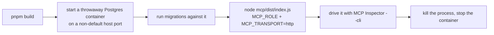

PoC chỉ thật sự hữu ích khi Claude có thể kết nối tới `engine` (bộ máy xử lý) của nó. Trang này tập trung vào phần thực hành: cách tự chạy và kiểm thử `MCP server` qua HTTP, những lỗi mà nhóm đã phát hiện (và buộc phải sửa) khi làm cho `HTTP transport` (cơ chế truyền tải qua HTTP) ổn định hơn, và cách toàn bộ hệ thống được lưu trữ cũng như triển khai — bao gồm hostname công khai, chạy migration qua `SSH tunnel` (đường hầm SSH), và xác minh rằng backup thực sự dùng để khôi phục được.

## Chạy MCP server qua HTTP từ đầu đến cuối

Gói `mcp` thường giao tiếp với Claude qua stdio (ống tiến trình trực tiếp), nhưng khi khởi động với `MCP_TRANSPORT=http` nó cũng có thể phục vụ **Streamable HTTP** — tức một cơ chế truyền tải mạng thực sự. Nếu muốn thử trên máy cục bộ:



Bạn cần một cơ sở dữ liệu thật ở mọi bước — đường chạy này không có phần nào có thể giả lập hay mock. Server luôn mở trên một cổng nội bộ cố định là `3000` (không cấu hình được). Khi server đã lên, chế độ CLI có thể chạy script của **MCP Inspector** là công cụ phù hợp nhất để tương tác mà không cần trình duyệt:

```
npx @modelcontextprotocol/inspector --cli \
  --server-url <url> --transport http \
  --method tools/list
```

Cờ `--transport http` bắt buộc phải khai báo rõ ràng — chỉ cung cấp URL của server ở root path thì Inspector không có đủ thông tin để tự nhận ra loại transport. Nếu cần gọi một tool với đối số có cấu trúc (ví dụ tên hiển thị đã bản địa hóa), dùng `--method tools/call --tool-name <name> --tool-args-json <json>`; dạng gọn hơn là `--tool-arg key=value` chỉ hỗ trợ các cặp khóa-giá trị phẳng, không có lồng nhau. Inspector cũng có các chế độ `--web` (giao diện trình duyệt, mặc định) và `--tui`, cùng cờ `--format json|text` để chọn dạng đầu ra — nhưng khi cần viết script thì `--cli` kết hợp với `--tool-args-json` mới là lựa chọn nên dùng.

## Hai lỗi buộc phải sửa trong HTTP transport

Khi biến runbook này thành thứ thực sự chạy được ngoài thực tế, nhóm đã lộ ra hai lỗi riêng biệt trong cùng phần kết nối `HTTP transport` — cả hai đều không thấy được nếu chỉ mock, mà chỉ lộ ra khi chạy cơ chế truyền tải thật từ đầu đến cuối.

**Entrypoint âm thầm không làm gì cả.** Trong Node, một mẫu khá phổ biến cho phép một file vừa có thể được import vừa có thể tự chạy trực tiếp, bằng cách bọc mã khởi động trong một điều kiện như `import.meta.url === file://${process.argv[1]}`. Nhưng điều kiện đó sẽ luôn trượt nếu file entrypoint thực tế chỉ *import* module có đoạn guard kia, chứ không phải chính module đó — ở đây, `index.ts` thực hiện `import './main.js'` như một side effect, nên `process.argv[1]` trỏ tới `index.js`, trong khi `import.meta.url` bên trong `main.ts` luôn trỏ tới `main.js`. Hai đường dẫn này không bao giờ trùng nhau. Tiến trình thoát ra sạch sẽ, không in gì, trông như đã chạy thành công nhưng thực ra server chưa từng khởi động. Cách sửa là bỏ hẳn self-invocation guard, export hàm một cách trực tiếp, rồi để entrypoint gọi nó một cách tường minh —

```ts
import { main } from './main.js';
await main();
```

Nhờ vậy, bước “khởi động entrypoint” trong runbook này mới thật sự khởi động được thứ gì đó.

**Một instance server không thể sống sót qua bắt tay thật.** `Stateless HTTP transport` của MCP SDK là loại chỉ dùng được một lần: nếu gọi lần thứ hai trên cùng một instance thì nó sẽ ném lỗi, trong khi một quy trình bắt tay của client thật không bao giờ chỉ có một request — nó gửi lệnh `initialize`, rồi tiếp theo là một lệnh riêng `notifications/initialized`. Nếu dùng chung một transport cho cả HTTP listener thì mọi phiên đều hỏng ở request thứ hai. Tệ hơn nữa, vì transport của SDK bàn giao xuống thư viện HTTP bên dưới mà không cấu hình error handler, lỗi đó chỉ nổi lên dưới dạng HTTP 500 trần trụi, không log gì, nên không có dấu hiệu nào giải thích được nguyên nhân. Cách sửa là tạo mới một cặp server + transport cho mỗi HTTP request đi vào; chi phí thấp vì chúng chỉ bọc quanh một instance `engine` đã được khởi tạo sẵn. Chính thay đổi này làm cho chuỗi list-rồi-call trong runbook chạy thành công thay vì đổ vỡ ở lệnh thứ hai.

## Một lỗi kín đáo hơn trong cùng khu vực: tuần tự hóa kết quả tool

Trong lúc gia cố cùng ranh giới wire đó, nhóm còn phát hiện một lỗi tinh vi hơn ở cách kết quả từ tool được tuần tự hóa trước khi đi qua đường truyền. `JSON.stringify` trả về *giá trị* `undefined` — chứ không phải chuỗi — khi đầu vào là chính `undefined`, một hàm trần, hoặc một `Symbol`, và với cả ba trường hợp này nó không hề ném lỗi. Nếu mã nguồn mặc định cho rằng lúc nào cũng nhận lại chuỗi, nó sẽ phát ra một phản hồi hỏng và lỗi trông như xuất phát từ nơi khác.

Việc canh ở *đầu vào* (`JSON.stringify(result ?? null)`) chỉ chặn được trường hợp “handler không trả gì” và vẫn để hở phần còn lại. Bản sửa đúng phải canh ở *đầu ra*: `JSON.stringify(result) ?? 'null'`, rồi rơi về chuỗi literal `'null'` — một giá trị mà client thực sự parse được, đồng thời diễn đạt trung thực ý “không có giá trị” thay vì bịa ra thứ khác. Hiện nay kiểm tra này nằm trong lớp bọc dùng chung mà mọi kết quả tool đều đi qua, nên nó bảo vệ luôn cả những tool được thêm về sau, không chỉ các tool đã làm lộ lỗi ban đầu. Bài học tổng quát ở đây là: nếu một serializer báo thất bại bằng cách lặng lẽ trả về một giá trị thay vì ném exception, thì mọi cơ chế xử lý lỗi dựa trên `catch` đều bị vô hiệu — điểm cần kiểm tra phải là thứ *đi ra*, vì ở đầu vào không có tín hiệu cảnh báo nào.

## Lưu trữ repository của PoC

Ban đầu `engine-poc` thậm chí chưa có remote trên GitHub — cả việc push nó lên lẫn việc nối vào luồng triển khai VPS đều được để dành cho một sprint sau. Vì vậy, cách duy nhất để kiểm tra workflow CI khi đó là chạy các lệnh tương tự ngay trên máy cục bộ, đúng theo thứ tự, như một bản thay thế cho pipeline thật — không có nơi nào để push, cũng không có cách nào để quan sát một lần chạy thực tế. Đến lúc review, nhóm đã tạo repository riêng tư `stemolly/engine-poc` và push toàn bộ lịch sử cục bộ đang có lên `origin`, đúng với mục đích lấp chỗ trống đó: sau đó cả hai job CI đều được theo dõi chuyển xanh trên một lần push thật, và một pull request dùng tạm với lỗi lint được cố ý cài vào cũng được theo dõi để chuyển job `Lint` sang đỏ — qua đó xác nhận workflow đang hoạt động trên môi trường thật chứ không phải qua kiểm chứng gián tiếp. Phần triển khai VPS được xây tiếp trên repository sẵn có này, chứ không tạo mới từ đầu.

## Triển khai VPS: lớp edge, Postgres và hostname công khai

Trên VPS đã triển khai, mọi dịch vụ đều nằm sau một **reverse-proxy edge** (biên reverse proxy) là Caddy, và chỉ truy cập được qua địa chỉ loopback (`127.0.0.1`) — cổng duy nhất lộ ra bên ngoài là cổng TLS của edge. Hai bề mặt MCP theo từng role đều có hostname công khai riêng. Chúng được đặt bên dưới một tiền tố chung `poc.` trên `stemolly.com`, cụ thể là để tránh chiếm trước các subdomain ngắn mà ứng dụng thật sẽ cần về sau:

| Môi trường | Hostname operator | Hostname student |
|---|---|---|
| PoC production | `operator.poc.stemolly.com` | `student.poc.stemolly.com` |
| Droplet rehearsal | `operator.rehearsal.poc.stemolly.com` | `student.rehearsal.poc.stemolly.com` |

Phương án dùng trực tiếp `operator.stemolly.com` / `student.stemolly.com` đã bị bác bỏ rõ ràng — các tên đó được dành cho ứng dụng Student và Console thật sẽ phát hành sau này, và nếu đem dùng cho PoC thì đến lúc các liên kết thật đã có người dùng, hệ thống lại phải đổi tên. Droplet rehearsal dùng các tên sâu hơn thêm một cấp riêng biệt để bản ghi DNS, chứng chỉ TLS và trạng thái Caddy của rehearsal không bao giờ có thể làm nhiễm sang các hostname PoC production.

### Chạy migration qua SSH tunnel

Postgres có một ngoại lệ hẹp nhưng có chủ đích đối với quy tắc “chỉ loopback”: nó cũng publish trên loopback (`127.0.0.1:5432`), dù không hề đi qua proxy nào. Lý do nằm ở giới hạn của công cụ — tool migration cần một `tsx` loader cài các hook ở phạm vi toàn tiến trình, và chạy thứ đó trong một container sống lâu là không an toàn. Vì vậy không container nào trong stack có thể tự chạy migration cho chính nó. Thay vào đó, migration được chạy một lần từ máy của operator, truy cập cơ sở dữ liệu trên VPS thông qua một `SSH tunnel`:

```bash
# on the operator's machine, open the tunnel:
ssh -L 5432:127.0.0.1:5432 <vps-host>

# then, in a separate terminal, run migrations:
DATABASE_URL=postgres://...@127.0.0.1:5432/... pnpm migrate
```

:::caution[Một ngoại lệ có chủ đích và giới hạn hẹp]
SSH là tiến trình duy nhất trên chính máy chủ VPS — không phải trong container — có thể chạm tới cổng loopback đó, nên cách thiết lập này chỉ phục vụ cho người đã có quyền SSH vào máy, chứ không bao giờ mở ra cho tác nhân bên ngoài. Nếu quét cổng VPS từ ngoài Internet, bạn vẫn chỉ thấy cổng công khai của edge; việc publish `5432` trên loopback là một ngoại lệ có chủ đích, được nêu rõ bằng tên, đối với quy tắc “mọi dịch vụ chỉ lắng nghe trên loopback”, chứ không phải phá vỡ quy tắc đó.
:::

### Hướng dẫn triển khai cho operator

Có hai tài liệu trong `docs/deploy/`, đặt cạnh các thư mục `docs/design/` và `docs/prd/` đã có:

- **`01-verify-on-vps.md`** — dành cho **rehearsal droplet** (droplet diễn tập) có thể bỏ đi: tài liệu này chứng minh quy trình triển khai từng bước trước khi bất kỳ thứ gì thật sự quan trọng bị đặt vào thế rủi ro, đồng thời chạy trọn một chu kỳ backup → restore → verify. Không có gì trên rehearsal droplet là không thể thay thế.
- **`02-production-deploy.md`** — dành cho **durable droplet** (droplet bền vững) phục vụ học sinh thật. Tài liệu này được viết như một bản diff so với hướng dẫn rehearsal (DNS thật, secret thật, snapshot của DigitalOcean như một lớp phục hồi thứ hai bên cạnh `pg_dump`, một crontab đã cài sẵn cho backup theo lịch, và một buổi diễn tập restore định kỳ). Nó không lặp lại các thao tác cơ học đã có trong hướng dẫn rehearsal.

Việc tách đôi này là có chủ đích: nhìn bề ngoài thì hai bước gần như giống nhau, nhưng mức độ rủi ro của chúng lại rất khác. Gộp chúng vào cùng một tài liệu sẽ dễ làm mờ đi khác biệt đó.

## Xác minh backup và restore

Việc có một file `pg_dump` nằm trên đĩa chỉ chứng minh rằng thao tác dump đã chạy — nó không chứng minh file đó khôi phục được, cũng không chứng minh nội dung bên trong là đúng. Bộ công cụ đi kèm PoC coi đây là những câu hỏi tách biệt, và mỗi câu hỏi cần một cách kiểm tra riêng.

`server/scripts/backup.ts` chịu trách nhiệm ghi file dump và xử lý việc giữ lại hay dọn bớt file dump (thông qua hàm thuần `pruneDumps` được crontab gọi tới, chứ không nhúng sẵn vào container nào). Trên VPS có một cron entry chạy script này theo lịch.

`server/scripts/verify-restore.ts` mới là thành phần thực sự chứng minh được khả năng restore. Nó kết nối đồng thời tới cơ sở dữ liệu nguồn và một cơ sở dữ liệu scratch vừa được khôi phục, rồi đối chiếu trên hai trục:

1. **Số hàng trong `engine.evidence_events`** — nếu lệch, nghĩa là bằng chứng đã bị mất trong chu kỳ dump-restore.
2. **Belief state được phát lại** — script gọi `getBeliefState()` thật cho mọi học sinh xuất hiện trong một trong hai cơ sở dữ liệu, rồi so sánh đầu ra. Cách làm này đúng vì belief state là kết quả replay tất định trên evidence log: hai cơ sở dữ liệu có cùng log sẽ cho ra chính xác cùng một belief state.

Nếu có bất kỳ sai khác nào, hàm sẽ trả về `divergences[]` không rỗng, nêu rõ chính xác điểm lệch là gì — chênh lệch số hàng, hay belief output của học sinh nào khác nhau. Nó không chỉ trả về pass/fail đơn thuần. Script cũng từ chối chạy ngay nếu được cung cấp cùng một connection string cho cả nguồn lẫn scratch, để chặn sai sót thao tác khi operator vô tình so sánh một cơ sở dữ liệu với chính nó (trường hợp đó đương nhiên sẽ khớp và không chứng minh được gì).

Không script nào trong hai script này có caller ở tầng ứng dụng. Cả hai đều là công cụ chỉ dành cho operator — `backup.ts` được cron gọi, còn `verify-restore.ts` được gọi thủ công (`tsx -e ...`). Đó là hình thức phù hợp cho loại công cụ mà người gọi là con người trong tình huống áp lực, chứ không phải một module khác.

:::tip[Vì sao cần mức độ chặt chẽ này?]
Evidence log được thiết kế theo kiểu chỉ nối thêm — một khi đã ghi vào thì không thể sửa lại. Lịch sử belief của học sinh chính là thứ PoC tồn tại để tạo ra, và nó không thể thay thế. Một bản backup chưa từng được xác minh là restore đúng chỉ là một giả thuyết, không phải bảo đảm.
:::
