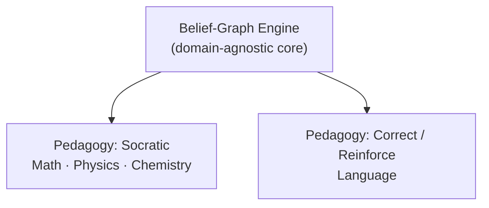
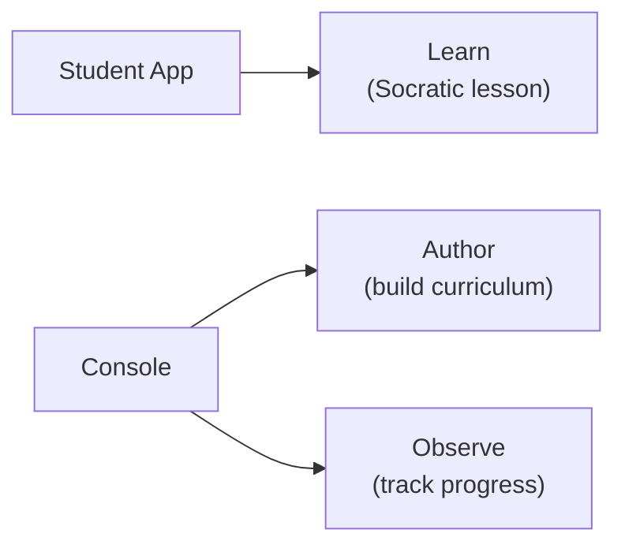

# Tổng quan về Stemolly

Stemolly là một ứng dụng web ưu tiên AI, đóng vai trò gia sư cho học sinh ở bất kỳ môn nào — từ toán và khoa học bậc phổ thông, ngôn ngữ, đến luyện thi như SAT và IELTS. Phạm vi "bất kỳ môn nào" là một lựa chọn có chủ đích: thiết kế của sản phẩm không đặt ra ranh giới cứng cho môn học. Điểm khiến Stemolly khác với các công cụ học tập khác không nằm ở bản thân AI, mà ở *cách sản phẩm mô hình hóa điều học sinh biết* — và cách nó sử dụng mô hình đó.

---

## Belief Graph (đồ thị niềm tin): Ý tưởng cốt lõi của Stemolly

Phần lớn nền tảng học tập theo dõi xem học sinh đã hoàn thành một chủ đề hay chưa. Stemolly theo dõi một thứ khác: học sinh *tin điều gì*, và niềm tin đó vững đến đâu.

Mỗi khái niệm là một **node (nút)** trong đồ thị. Mỗi node kết nối với các khái niệm mà nó phụ thuộc vào (các điều kiện tiên quyết). Một node không mang cờ đơn giản kiểu "đã xong / chưa xong". Thay vào đó, nó chứa:

- **Misconceptions (ngộ nhận)** — những niềm tin sai mà học sinh đang có về khái niệm này.
- **Fragility state (trạng thái độ vững)** — niềm tin này đang ở mức *unprobed* (chưa được thăm dò), *fragile* (mong manh), hay *robust* (vững chắc).
- **Reasoning pattern data (dữ liệu mẫu lập luận)** — cách học sinh đi đến kết luận, không chỉ là câu trả lời các em đưa ra.

Mọi dữ liệu trong đồ thị đều phải được hỗ trợ bằng interaction evidence (bằng chứng tương tác) cụ thể — không được suy ra từ điểm bài kiểm tra tổng hợp.

```
         [ Arithmetic ] ← unprobed
               │
               ▼
      [ Negative Numbers ] ← fragile  ←── misconception: "–3 > –1"
               │
               ▼
      [ Algebra Basics ]  ← fragile   ←── diagnosis: root is Negative Numbers
```

Cấu trúc đồ thị này là điều cho phép AI tìm ra **root causes (nguyên nhân gốc)**. Nếu một học sinh có niềm tin sai về số âm, ngộ nhận đó sẽ lan sang mọi khái niệm phía sau đang phụ thuộc vào nó — từ đại số, bất đẳng thức, cho đến nhiều phần khác. Một danh sách kiểm tra hoàn thành sẽ đánh dấu nhiều chủ đề là chưa hoàn tất; belief graph thì chỉ ra đúng một gốc cần sửa.

---

## Pedagogy (phương pháp sư phạm) là một lớp có thể cắm thêm

Belief-graph engine là lõi của sản phẩm, và nó **domain-agnostic (không phụ thuộc lĩnh vực)**. Nó không hề biết nên dùng phong cách giảng dạy nào. Việc đó được xử lý bởi một **pedagogy layer (lớp phương pháp sư phạm)** riêng, có thể thay thế và cắm thêm, nằm phía trên.

Trong một phiên bản thiết kế trước đây, phương pháp Socratic từng được xem là một ràng buộc nền tảng — mọi hoạt động gia sư, ở mọi môn, đều sẽ theo lối đặt câu hỏi kiểu Socratic. Quan điểm đó nay đã bị loại bỏ. Giờ đây, Socratic chỉ là *một* pedagogy trong số nhiều lựa chọn, được dùng khi nó phù hợp với môn học.



MVP-1 phát hành cùng hai pedagogy:

| Pedagogy | Môn học | Vai trò |
|---|---|---|
| **Socratic** | Toán, Vật lý, Hóa học | Dẫn dắt học sinh tự đi tới sự hiểu ra thông qua chuỗi câu hỏi |
| **Correct / Reinforce** | Ngôn ngữ | Chẩn đoán lỗi → sửa → củng cố → kiểm tra lại |

Từ thiết kế này kéo theo hai nguyên tắc. Thứ nhất, engine tuyệt đối không được hardcode hành vi Socratic. Thứ hai, engine không được giả định rằng môn nào cũng có thứ tự phụ thuộc nghiêm ngặt — Toán có cây điều kiện tiên quyết khá rõ, nhưng Ngôn ngữ có hệ phân loại lỗi-và-kỹ năng lỏng hơn. Cả hai đều phải hoạt động được.

Việc bổ sung một pedagogy mới trong tương lai không nên đòi hỏi phải chạm vào engine.

---

## Hai ứng dụng, ba nhiệm vụ

Sản phẩm được phát hành dưới dạng hai frontend applications (ứng dụng giao diện người dùng) tách biệt.



**Student app** — trải nghiệm gia sư dành cho học sinh. Học sinh tương tác với AI tutor tại đây; đây là nhiệm vụ "Learn".

**Console** — công cụ dành cho nhà giáo dục và người vận hành. Nó có hai khu vực:
- *Author*: xây dựng và chỉnh sửa curriculum, lesson, và content.
- *Observe*: theo dõi tiến độ của học sinh và xác minh xem belief-graph engine có đang chẩn đoán đúng hay không.

Ban đầu, Console được gọi là "Studio" khi nó chỉ phục vụ việc biên soạn nội dung. Tên gọi được đổi khi Observe được thêm vào, vì một công cụ có hai nhiệm vụ cần một cái tên không gợi cảm giác chỉ có một mục đích.

Một ứng dụng độc lập thứ ba chỉ để trực quan hóa tiến độ đã từng được cân nhắc rồi bị loại cho MVP. Chỉ khi tách Observe thành ứng dụng riêng phục vụ một nhóm người dùng khác hẳn — chẳng hạn phụ huynh hoặc quản trị viên trường học — thì việc đó mới đáng làm. Ở giai đoạn MVP, điều đó chưa đúng.

Backend (phần phụ trợ) vẫn giữ dữ liệu nội dung và dữ liệu trạng thái học sinh ở các service boundaries (ranh giới dịch vụ) tách biệt, bất kể có bao nhiêu frontend tồn tại.

---

## Evolvability (khả năng tiến hóa): Vì sao kiến trúc được xây theo cách này

MVP-1 tồn tại để **validate** belief-graph engine. Nhóm phát triển dự đoán rằng họ sẽ sai ở nhiều chi tiết — sai về pedagogy nào thực sự hiệu quả, môn học nào nên được ưu tiên, hay cấu trúc đồ thị nên vận hành ra sao. Kiến trúc được dựng lên để những lần điều chỉnh đó có chi phí thấp.

Cụ thể, điều này có nghĩa là:

- Việc thay đổi hoặc thêm một **pedagogy** không đụng đến lõi của engine.
- Khi thêm một **subject** mới, hệ thống có thể gắn vào mà không cần làm lại từ đầu, vì các lựa chọn về định danh node và cấu trúc đồ thị được thiết kế theo hướng mở.
- Nếu phải **pivot** hướng đi ngay giữa giai đoạn kiểm chứng, chi phí nên là một sprint, chứ không phải một cuộc viết lại toàn bộ.

Evolvability là non-functional requirement (yêu cầu phi chức năng) quan trọng nhất — không phải hiệu năng, cũng không phải triển khai zero-downtime. Những điều đó vẫn quan trọng, nhưng đứng sau mục tiêu giữ cho việc thay đổi luôn rẻ trong lúc cả nhóm còn đang học xem điều gì thực sự hiệu quả.

Nguyên tắc này cũng giải thích cho một số lựa chọn công nghệ: stack sử dụng Vite + React ở frontend và Fastify ở backend, không dựa vào "phép màu" của framework (không dùng Next.js hay Remix). Giữ cho kiến trúc minh bạch, tường minh đồng nghĩa với việc sẽ không có hệ thống ống nước ẩn nào cản trở khi nhóm cần đi dây lại một phần nào đó.

---

## Tóm tắt nhanh

| Khía cạnh | Stemolly làm gì |
|---|---|
| **Phạm vi môn học** | Bất kỳ — phổ thông, ngôn ngữ, chứng chỉ |
| **Mô hình tri thức** | Belief graph (node, misconceptions, fragility, evidence) |
| **Pedagogy** | Lớp có thể cắm thêm; Socratic và Correct/Reinforce có trong MVP-1 |
| **Ứng dụng** | Student app (Learn) + Console (Author + Observe) |
| **NFR chính** | Evolvability — dễ mở rộng và chuyển hướng với chi phí thấp |
| **Stack** | Vite + React / Fastify, không dùng meta-framework |
