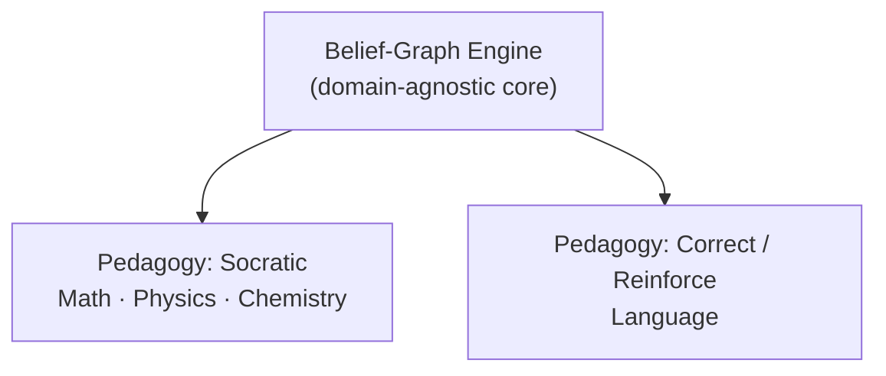
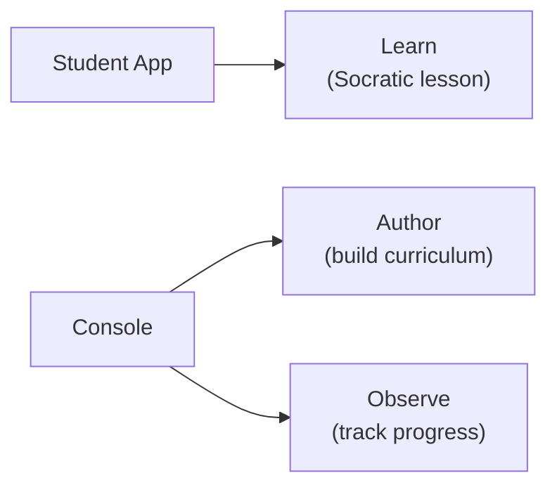

Stemolly là một ứng dụng web lấy AI làm trung tâm, đóng vai trò gia sư cho học sinh ở bất kỳ môn nào — từ toán và khoa học bậc phổ thông, ngôn ngữ, cho tới luyện thi như SAT và IELTS. Phạm vi "bất kỳ môn nào" là một chủ đích ngay từ đầu: thiết kế của hệ thống không đặt ra ranh giới cứng giữa các môn. Điều khiến Stemolly khác với các công cụ học tập khác không nằm ở bản thân AI, mà ở *cách nó mô hình hóa điều học sinh biết* — và cách nó sử dụng mô hình đó.

---

## Belief Graph: Ý tưởng cốt lõi của Stemolly

Phần lớn nền tảng học tập theo dõi xem học sinh đã hoàn thành một chủ đề hay chưa. Stemolly theo dõi một thứ khác: học sinh *đang tin điều gì*, và niềm tin đó vững đến mức nào.

Mỗi khái niệm là một **node (nút)** trong một **graph (đồ thị)**. Mỗi node nối với các khái niệm mà nó phụ thuộc vào, tức các điều kiện tiên quyết. Một node không chỉ mang cờ đơn giản kiểu "xong / chưa xong". Thay vào đó, nó chứa:

- **Misconceptions (ngộ nhận)** — những niềm tin sai mà học sinh đang có về khái niệm này.
- **Fragility state (trạng thái độ vững)** — niềm tin này đang ở mức *unprobed*, *fragile*, hay *robust*.
- **Reasoning pattern data (dữ liệu mô thức lập luận)** — cách học sinh đi tới kết luận, chứ không chỉ là đáp án các em đưa ra.

Mọi dữ liệu trong graph đều phải có **interaction evidence (bằng chứng tương tác)** cụ thể làm căn cứ — không được suy ra từ điểm bài kiểm tra tổng hợp.

```
         [ Arithmetic ] ← unprobed
               │
               ▼
      [ Negative Numbers ] ← fragile  ←── misconception: "–3 > –1"
               │
               ▼
      [ Algebra Basics ]  ← fragile   ←── diagnosis: root is Negative Numbers
```

Chính cấu trúc graph này cho phép AI tìm ra **root causes (nguyên nhân gốc)**. Nếu một học sinh có niềm tin sai về số âm, ngộ nhận đó sẽ lan sang mọi khái niệm đi sau có phụ thuộc vào nó — từ đại số, bất đẳng thức, cho tới các phần khác nữa. Một danh sách đánh dấu hoàn thành sẽ chỉ cho thấy nhiều chủ đề đang dở dang; còn belief graph cho thấy có đúng một gốc rễ cần sửa.

---

## Pedagogy (phương pháp sư phạm) là một lớp có thể hoán đổi

**Belief-graph engine (bộ máy đồ thị niềm tin)** là lõi của sản phẩm, và nó **domain-agnostic (không phụ thuộc lĩnh vực)**. Nó không tự quyết định nên dạy theo phong cách nào. Việc đó do một **pedagogy layer (lớp sư phạm)** riêng đảm nhiệm; lớp này nằm phía trên và có thể thay thế, cắm thêm.

Ở một phiên bản thiết kế trước đây, phương pháp Socratic từng được xem như một ràng buộc nền tảng — mọi hoạt động gia sư, ở mọi môn, đều sẽ đi theo lối đặt câu hỏi Socratic. Quan điểm đó nay đã được bỏ. Giờ đây, Socratic chỉ là *một* pedagogy trong số nhiều lựa chọn, được dùng khi nó phù hợp với môn học.



MVP-1 đi kèm hai pedagogy:

| Pedagogy | Môn học | Vai trò |
|---|---|---|
| **Socratic** | Toán, Vật lý, Hóa học | Dẫn dắt học sinh tự hình thành hiểu biết thông qua câu hỏi |
| **Correct / Reinforce** | Ngôn ngữ | Chẩn đoán lỗi → sửa → củng cố → kiểm tra lại |

Thiết kế này dẫn tới hai nguyên tắc. Thứ nhất, engine tuyệt đối không được **hardcode (mã hóa cứng)** hành vi Socratic. Thứ hai, engine không được mặc định rằng môn nào cũng có thứ tự phụ thuộc chặt chẽ — Toán có cây điều kiện tiên quyết rõ ràng, nhưng Ngôn ngữ có hệ phân loại lỗi và kỹ năng lỏng hơn. Cả hai đều phải vận hành được.

Về sau, nếu thêm một pedagogy mới thì cũng không nên phải đụng vào engine.

---

## Hai ứng dụng, ba nhiệm vụ

Sản phẩm được phát hành dưới dạng hai **frontend applications (ứng dụng giao diện)** tách biệt.



**Student app** — trải nghiệm học với gia sư. Học sinh tương tác với AI tutor tại đây; đây là nhiệm vụ "Learn".

**Console** — công cụ dành cho nhà giáo dục và người vận hành. Nó có hai khu vực:
- *Author*: xây dựng và chỉnh sửa chương trình học, bài học, và nội dung.
- *Observe*: theo dõi tiến độ của học sinh và kiểm tra xem belief-graph engine có đang chẩn đoán đúng hay không.

Ban đầu, Console được gọi là "Studio" khi nó chỉ phục vụ việc biên soạn nội dung. Tên này được đổi khi Observe được thêm vào, vì một công cụ làm hai việc cần một cái tên không gợi cảm giác chỉ có một mục đích.

Một ứng dụng độc lập thứ ba chỉ để trực quan hóa tiến độ từng được cân nhắc rồi loại khỏi MVP. Chỉ khi việc tách Observe thành ứng dụng riêng thật sự có ích cho một nhóm người dùng khác — chẳng hạn phụ huynh hoặc quản trị viên trường học — thì mới đáng làm. Ở giai đoạn MVP, điều đó chưa đúng.

Phía **backend (hậu trường hệ thống)** vẫn tách dữ liệu nội dung và dữ liệu trạng thái học sinh theo các **service boundaries (ranh giới dịch vụ)** riêng, bất kể có bao nhiêu frontend.

---

## Evolvability (khả năng thích nghi để tiếp tục phát triển): Vì sao kiến trúc được xây theo cách này

MVP-1 tồn tại để **validate (kiểm chứng)** belief-graph engine. Nhóm phát triển dự đoán rằng họ sẽ sai ở nhiều chi tiết — sai về pedagogy nào thực sự hiệu quả, môn học nào nên ưu tiên, hay graph nên vận hành theo cấu trúc nào. Kiến trúc này được dựng lên để những lần điều chỉnh đó luôn rẻ.

Cụ thể hơn, điều đó có nghĩa là:

- Việc thay đổi hoặc thêm một **pedagogy** không động vào lõi engine.
- Khi thêm một **subject (môn học)** mới, hệ thống có thể gắn vào mà không cần xây lại, vì các quyết định về định danh node và cấu trúc graph được thiết kế theo hướng mở.
- Nếu phải **pivot (chuyển hướng)** ngay trong giai đoạn kiểm chứng, chi phí nên chỉ là một sprint, chứ không phải viết lại toàn bộ.

**Evolvability** là **non-functional requirement (yêu cầu phi chức năng)** quan trọng nhất — không phải hiệu năng, cũng không phải triển khai **zero-downtime (không gián đoạn)**. Những điều đó vẫn quan trọng, nhưng đứng sau mục tiêu giữ cho việc thay đổi luôn rẻ trong lúc cả nhóm còn đang học xem điều gì thực sự hiệu quả.

Nguyên tắc này cũng giải thích cho một số lựa chọn công nghệ: **stack (ngăn xếp công nghệ)** dùng Vite + React ở frontend và Fastify ở backend, không dựa vào "phép màu" của framework — cụ thể là không dùng Next.js hay Remix. Giữ kiến trúc ở trạng thái tường minh đồng nghĩa với việc sẽ không có phần **plumbing (kết nối hạ tầng ẩn)** nào cản trở khi nhóm cần đi dây lại hệ thống.

---

## Tóm tắt nhanh

| Khía cạnh | Stemolly làm gì |
|---|---|
| **Phạm vi môn học** | Bất kỳ — K-12, ngôn ngữ, chứng chỉ |
| **Mô hình tri thức** | Belief graph (node, misconceptions, fragility, evidence) |
| **Pedagogy** | Lớp có thể hoán đổi; Socratic và Correct / Reinforce có trong MVP-1 |
| **Ứng dụng** | Student app (Learn) + Console (Author + Observe) |
| **NFR chính** | Evolvability — dễ mở rộng và chuyển hướng với chi phí thấp |
| **Stack** | Vite + React / Fastify, không dùng meta-framework |
