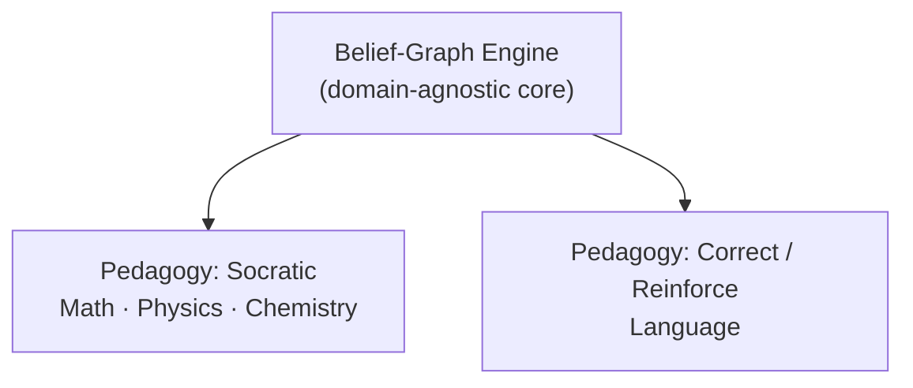
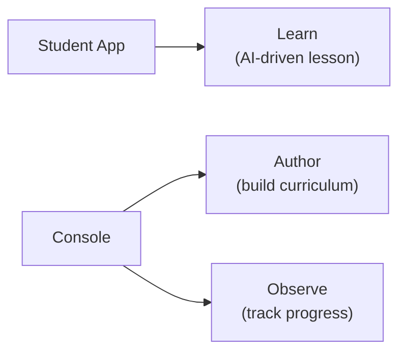

Stemolly là một web application (ứng dụng web) lấy AI làm trọng tâm, giúp học sinh học bất kỳ môn nào — từ toán và khoa học K-12, ngôn ngữ, luyện thi (SAT, IELTS) cho đến nhiều lĩnh vực khác. Sản phẩm được thiết kế ngay từ đầu để không bị giới hạn bởi môn học. Phần frontend (giao diện người dùng) được xây bằng Vite + React; backend (phần máy chủ) chạy trên Fastify. Chủ đích là không dùng meta-framework (khung ứng dụng cấp cao) — nhờ vậy kiến trúc vẫn tường minh và gọn nhẹ.

## Belief Graph (đồ thị niềm tin): Ý tưởng cốt lõi của Stemolly

Hầu hết các nền tảng học tập chỉ theo dõi xem học sinh đã *hoàn thành* một chủ đề hay chưa. Stemolly theo dõi học sinh đang *tin điều gì* — và những niềm tin đó là đúng, còn lung lay, hay chưa được kiểm chứng.

Kiến thức của học sinh được lưu dưới dạng **belief graph**: một đồ thị gồm các concept node (nút khái niệm) được nối với nhau bằng prerequisite edge (cạnh tiên quyết). Mỗi node chứa:

- **Misconceptions** — những hiểu sai mà học sinh đang có về khái niệm này.
- **Fragility state** — một trong ba giá trị: *unprobed*, *fragile* hoặc *robust* (không phải điểm số).
- **Reasoning pattern data** — dữ liệu về cách học sinh đi đến kết luận, chứ không chỉ là câu trả lời các em đưa ra.

Mọi belief state đều phải được chống lưng bởi evidence (bằng chứng) từ tương tác thực tế, chứ không bao giờ suy ra từ aggregate test scores (điểm kiểm tra tổng hợp).

```
  [Negative numbers]     ← wrong belief here …
        |
        ↓
  [Integer arithmetic]   ← … causes errors here …
        |
        ↓
  [Algebra basics]       ← … and here
```

Vì niềm tin lan truyền dọc theo các edge, chỉ một root misconception — chẳng hạn một hiểu sai về số âm — cũng có thể được lần ra là nguyên nhân gây lỗi ở mọi khái niệm phía sau. Nhờ đó, AI có thể xử lý tận gốc thay vì vá từng triệu chứng riêng lẻ. Đây là điểm khác biệt cốt lõi so với các nền tảng chỉ theo dõi việc hoàn thành chủ đề.

## Pedagogy là một lớp có thể thay thế linh hoạt

belief-graph engine mang tính domain-agnostic (không phụ thuộc lĩnh vực). Nó hiểu các concept, misconceptions, fragility và evidence — nhưng không biết phải *trò chuyện* với học sinh như thế nào. Việc đó thuộc về một pedagogy layer (tầng phương pháp sư phạm) riêng biệt, có thể hoán đổi.

Hãy hình dung như một navigation app (ứng dụng dẫn đường): bản đồ (belief graph) và giọng chỉ đường từng bước (pedagogy) là hai phần tách biệt. Bạn có thể đổi giọng mà không cần xây lại bản đồ.

Một phiên bản thiết kế trước đây xem Socratic method (phương pháp gợi mở bằng câu hỏi) như một ràng buộc nền tảng được cài sẵn vào mọi thứ. Điều đó đã được điều chỉnh: giờ đây Socratic chỉ là một pedagogy trong số nhiều pedagogy, và engine tuyệt đối không được hardcode (mã hóa cứng) nó.



MVP-1 có hai pedagogy:

| Pedagogy | Used for | Approach |
|---|---|---|
| **Socratic** (gợi mở bằng câu hỏi) | Toán, Vật lý, Hóa học | Dẫn dắt học sinh tự hình thành điều cần hiểu thông qua câu hỏi |
| **Correct / Reinforce** (sửa lỗi / củng cố) | Ngôn ngữ | Chẩn đoán lỗi → sửa → củng cố → kiểm tra lại |

Một hệ quả về cấu trúc là engine không được giả định rằng các concept luôn tạo thành một chuỗi tiên quyết cứng nhắc. Math là một DAG (directed acyclic graph — đồ thị có hướng không chu trình, trong đó mỗi khái niệm phụ thuộc theo thứ tự vào những khái niệm trước đó); Language thì gần với một taxonomy (hệ phân loại) lỏng hơn của lỗi và kỹ năng. Cả hai đều phải vận hành được.

## Hai ứng dụng, ba nhiệm vụ

MVP được phát hành dưới dạng hai frontend application tách biệt.



**Student App** — trải nghiệm học tập. Học sinh học các bài do AI dẫn dắt tại đây (vai trò "Learn").

**Console** — công cụ cho giáo viên và người vận hành. Nó có hai khu vực:
- **Author**: xây dựng curriculum (chương trình học), lesson (bài học) và concept graph (đồ thị khái niệm).
- **Observe**: theo dõi tiến độ của học sinh và kiểm chứng xem belief-graph engine có chẩn đoán đúng hay không.

Trước đây, Console có tên là "Studio" khi nó chỉ phục vụ authoring (biên soạn nội dung). Tên được đổi sau khi Observe được thêm vào, vì một công cụ có hai nhiệm vụ cần một cái tên không hàm ý chỉ có một mục đích.

Một app thứ ba tách riêng chỉ để trực quan hóa tiến độ đã từng được cân nhắc nhưng bị loại khỏi MVP. Việc tách Observe thành app riêng chỉ hợp lý nếu sau này nhóm người dùng của nó (phụ huynh, quản trị trường học không bao giờ làm Author) tách hẳn khỏi nhóm người dùng của Author. Dù hình dạng frontend ra sao, backend vẫn giữ ranh giới dịch vụ riêng giữa content (nội dung) và student-state (trạng thái học sinh).

## Khả năng tiến hóa được đặt lên hàng đầu

MVP-1 là một validation instrument (công cụ kiểm chứng) — nhiệm vụ của nó là kiểm tra xem belief-graph engine có thực sự hoạt động hay không. Nhóm phát triển nên giả định rằng mình sẽ sai ở nhiều chi tiết cụ thể và sẽ phải đổi hướng theo những gì dữ liệu cho thấy.

Đó là lý do evolvability là non-functional requirement (NFR) chính:

- Việc thêm một môn học hoặc curriculum mới không nên đòi hỏi phải đụng vào phần lõi của engine.
- Việc thay hoặc thêm một pedagogy là cấu hình theo từng session (phiên), không phải xây dựng lại hệ thống.
- Các quyết định về graph structure (cấu trúc đồ thị) và node identity (định danh nút) được đưa ra sao cho nội dung mới có thể cắm vào mà không cần nối lại mã hiện có.

technology stack (ngăn xếp công nghệ) được chủ ý để lại cho giai đoạn kiến trúc quyết định — nó không bị chốt ở cấp product requirements, vì cố định nó ở đó là đặt quyết định này ở sai tầng.

:::tip
Nếu bạn đang cân nhắc nên thay đổi ở đâu — môn học mới, pedagogy mới hay curriculum mới — mục tiêu luôn là chạm vào lớp có thể thay thế, chứ không phải phần lõi của engine.
:::

## Tham chiếu nhanh

| Dimension | Detail |
|---|---|
| **Phạm vi môn học** | Bất kỳ — K-12, ngôn ngữ, chứng chỉ |
| **Mô hình tri thức** | Belief graph — nodes, misconceptions, fragility state, evidence |
| **Pedagogy** | Lớp pluggable; Socratic và Correct/Reinforce có trong MVP-1 |
| **Ứng dụng** | Student App (Learn) + Console (Author + Observe) |
| **NFR chính** | Evolvability — dễ mở rộng và dễ đổi hướng |
| **Stack** | Vite + React / Fastify, không dùng meta-framework |
