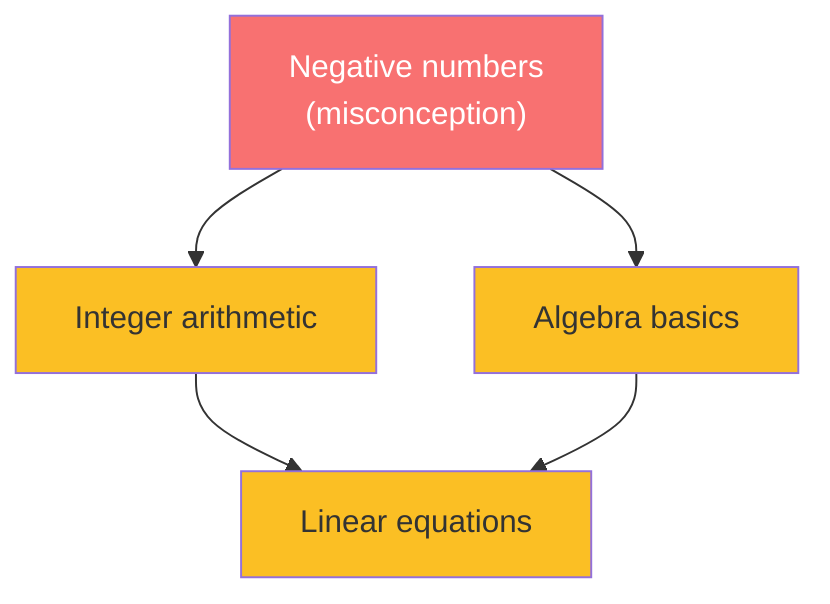
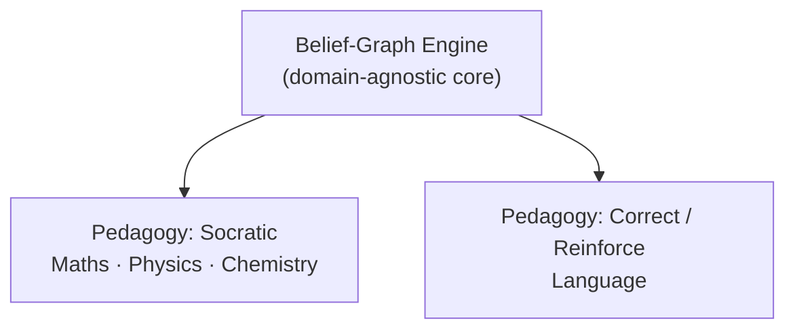
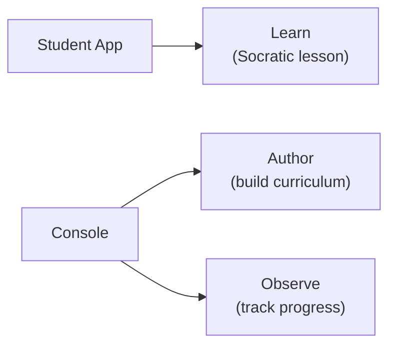

Stemolly là một ứng dụng web lấy AI làm trọng tâm, giúp học sinh học bất kỳ môn nào — từ toán và khoa học ở trường đến ngoại ngữ và các kỳ thi chuẩn hóa như SAT hoặc IELTS. Sản phẩm được thiết kế ngay từ đầu để không bị giới hạn bởi môn học. Phần frontend (giao diện) chạy trên Vite + React; backend (máy chủ) chạy trên Fastify. Dự án chủ động tránh các meta-frameworks (khung ứng dụng cấp cao) như Next.js hoặc Remix để kiến trúc luôn rõ ràng và dễ phân tích.

## USP cốt lõi: belief graph (đồ thị niềm tin), không phải checklist

Phần lớn các nền tảng học tập theo dõi xem học sinh đã *hoàn thành* một chủ đề hay chưa. Stemolly thì theo dõi học sinh đang *tin gì* về từng khái niệm — và những niềm tin đó có đúng hay không.

Kiến thức của học sinh được lưu dưới dạng **belief graph**: các khái niệm là node (nút), quan hệ tiên quyết là edge (cạnh), và mỗi node mang theo các hiểu lầm, trạng thái mong manh, cùng dữ liệu về kiểu lập luận. Với một cặp (học sinh, khái niệm), độ mong manh là thuộc tính gồm ba trạng thái — **unprobed**, **fragile**, hoặc **robust** — chứ không phải một tỷ lệ phần trăm.

Lợi thế then chốt nằm ở khả năng lan truyền. Một niềm tin sai tại một node sẽ ảnh hưởng đến mọi node phụ thuộc vào nó. AI có thể tìm ra nguyên nhân gốc thay vì xử lý riêng từng triệu chứng ở hạ nguồn. Mọi trạng thái niềm tin đều phải được hậu thuẫn bằng bằng chứng tương tác cụ thể; điểm số tổng hợp là không đủ.

*Một hiểu lầm ở một node sẽ lan sang toàn bộ node ở hạ nguồn — AI điều tra gốc rễ, không xử lý từng triệu chứng riêng lẻ.*

## Sư phạm là một lớp có thể hoán đổi

Belief-graph engine (lõi belief graph độc lập với miền kiến thức) là **phần cốt lõi không phụ thuộc môn học**. Nó theo dõi khái niệm, hiểu lầm, độ mong manh và bằng chứng — nhưng không quyết định *cách* gia sư nói chuyện với học sinh. Nhiệm vụ đó thuộc về một pedagogy layer (lớp sư phạm) riêng biệt, có thể thay thế.

Trong một thiết kế trước đây, phương pháp Socratic từng được xem như một ràng buộc nền tảng và được nhúng khắp hệ thống. Cách làm đó nay đã bị loại bỏ: Socratic giờ chỉ là một hướng sư phạm trong số nhiều hướng, và engine tuyệt đối không được hardcode (mã hóa cứng) nó.

MVP-1 có hai hướng sư phạm:

| Pedagogy | Dùng cho | Cách tiếp cận |
|---|---|---|
| **Socratic** | Toán, Vật lý, Hóa học | Dẫn dắt học sinh tự hình thành insight (điều cần ngộ ra) mục tiêu |
| **Correct / Reinforce** | Ngoại ngữ | Chẩn đoán → sửa → củng cố → kiểm tra lại |

Từ đó kéo theo hai ràng buộc cứng: engine không được hardcode hành vi Socratic, và cũng không được giả định rằng mọi môn học đều là một DAG (directed acyclic graph — đồ thị có hướng không chu trình) tiên quyết chặt chẽ. Toán là một DAG; ngoại ngữ là một hệ phân loại lỗi/kỹ năng lỏng hơn. Cả hai đều phải chạy được trên cùng một engine.

## Hai ứng dụng, ba nhiệm vụ

MVP có hai ứng dụng frontend tách biệt.

**Student App** đảm nhiệm nhiệm vụ *Learn* — trải nghiệm bài học do AI dẫn dắt dành cho học sinh.

**Console** phục vụ giáo viên và người vận hành ở hai mảng:

- **Author** — xây dựng chương trình học và bài học (đây từng là toàn bộ nhiệm vụ khi ứng dụng còn mang tên "Studio").
- **Observe** — theo dõi tiến độ học sinh và kiểm tra xem belief-graph engine có chẩn đoán đúng hay không.

Việc đổi tên từ Studio sang Console phản ánh sự xuất hiện của Observe: giờ đây ứng dụng bao quát hai nhiệm vụ, còn "Studio" gợi ý rằng nó chỉ phục vụ một nhiệm vụ.

Một ứng dụng thứ ba độc lập chỉ để trực quan hóa tiến độ đã từng được cân nhắc rồi bị loại khỏi MVP. Chỉ nên tách Observe thành một ứng dụng riêng nếu sau này nhóm người dùng của nó (phụ huynh, quản trị viên nhà trường không bao giờ làm Author) tách biệt rõ ràng với nhóm người dùng Author. Content (nội dung) và student-state (trạng thái học sinh) vẫn là hai ranh giới dịch vụ backend tách biệt, bất kể có bao nhiêu frontend.

## Khả năng tiến hóa là NFR quan trọng nhất

MVP-1 là một **công cụ kiểm chứng** — mục đích của nó là chứng minh belief-graph engine có thực sự hoạt động hay không. Nhóm phát triển nên mặc định rằng mình sẽ sai ở nhiều chi tiết cụ thể, và sẽ phải đổi hướng dựa trên những gì dữ liệu cho thấy.

Đó là lý do **evolvability (khả năng tiến hóa)** là yêu cầu phi chức năng (NFR — đặc tính chất lượng mà hệ thống bắt buộc phải có, độc lập với từng tính năng) quan trọng nhất:

- Có thể thêm môn học và chương trình học mới mà không phải đụng vào lõi engine.
- Hướng sư phạm mới là chiến lược theo từng phiên, không phải bản dựng lại của logic cốt lõi.
- Các lựa chọn về định danh node và cấu trúc đồ thị được đưa ra sao cho nội dung tương lai có thể khớp vào mà không phải đi lại dây hệ thống hiện có.

:::note
Ngăn xếp công nghệ không bị cố định ở cấp độ yêu cầu. Việc chọn stack thuộc về kiến trúc — chốt nó ngay trong product brief là đặt quyết định này ở sai cấp độ.
:::

Các trang về kiến trúc trình bày cách khả năng tiến hóa được hiện thực hóa trong thực tế.
